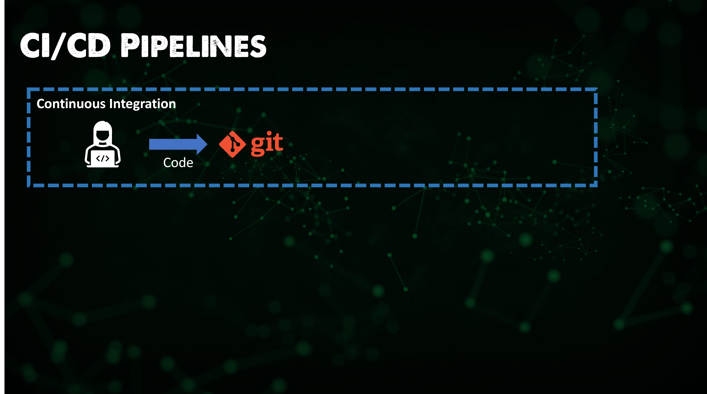
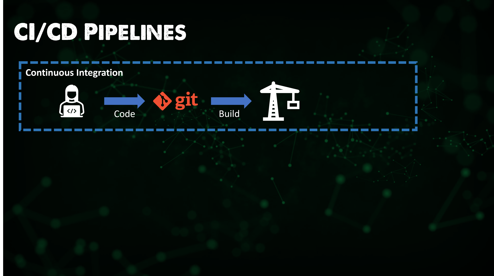
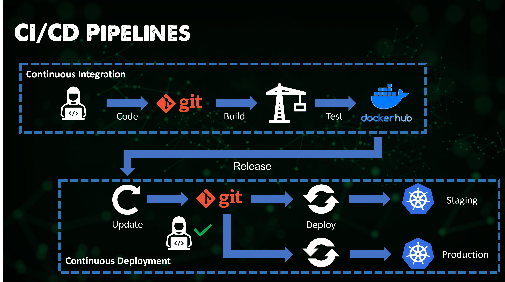

---
title: '#90DaysOfDevOps - Bức tranh toàn cảnh: CI/CD Pipelines - Ngày 70'
published: false
description: 90DaysOfDevOps - Bức tranh toàn cảnh':' CI/CD Pipelines...
tags: 'devops, 90daysofdevops, learning'
cover_image: null
canonical_url: null
id: 1048836
---  
## Bức tranh toàn cảnh: CI/CD Pipelines

Triển khai CI/CD Pipeline (Tích hợp liên tục/Triển khai liên tục) là xương sống của môi trường Devops hiện đại.

Nó rút ngắn khoảng cách giữa phát triển và vận hành bằng cách tự động hóa quá trình xây dựng, kiểm thử và triển khai ứng dụng.

Chúng ta đã đề cập khá nhiều về triết lý liên tục này trong phần mở đầu của chuỗi bài. Nhưng để nhấn mạnh lại:

Tích hợp Liên tục (CI) là một phương pháp phát triển phần mềm hiện đại, trong đó thay đổi mã nguồn được thực hiện thường xuyên và đáng tin cậy hơn. Các bước xây dựng và kiểm thử tự động được kích hoạt bởi Tích hợp Liên tục đảm bảo tính tin cậy của những thay đổi mã nguồn được gộp vào kho mã nguồn.

Mã nguồn/Ứng dụng sau đó được triển khai một cách nhanh chóng và liền mạch như một phần của quá trình Triển khai Liên tục.

### Tầm quan trọng của CI/CD?

* Tạo ra phần mềm nhanh chóng và hiệu quả.
* Tạo ra một quy trình hiệu quả để đưa ứng dụng ra thị trường nhanh nhất có thể.
* Triển khai các bản sửa lỗi và tính năng mới liên tục mà không cần phải chờ hàng tháng hoặc hàng năm để phát hành phiên bản mới.

Khả năng cho phép các nhà phát triển thực hiện những thay đổi nhỏ mang tính ảnh hưởng định kỳ nghĩa là chúng ta có thể nhận được các bản vá nhanh chóng hơn và nhiều tính năng hơn một cách nhanh chóng.

### Vậy điều này có ý nghĩa là gì? 

ở [Ngày 5](day05.md) chúng ta đã đề cập khá nhiều tới lý thuyết về DevOps và như đã được đề cập trong bài viết này, CI/CD Pipelines là nền móng của môi trường DevOps hiện đại.

Tôi muốn nhấn mạnh một số điểm mấu chốt ở hình trên, bây giờ chúng ta đã tiến xa hơn một chút trong hành trình học DevOps cơ bản.

Chúng ta đang đề cập đến vòng đời phát triển phần mềm (software development life cycle - SDLC).

Các bước thường được viết ra bên trong các vòng lặp vô tận vì nó là một chu kỳ lặp lại mãi mãi.

Các bước trong quy trình là việc các nhà phát triển viết mã nguồn sau đó được xây dựng hoặc biên dịch, sau đó được **kiểm thử** để tìm lỗi và **triển khai** vào môi trường sản phẩm nơi mà nó được sử dụng (**Operated - Vận hành** ) bởi người dùng cuối hoặc khách hàng sau đó chúng ta **theo dõi**, thu thập phản hồi và cuối cùng **lên kế hoạch** cải tiến xung quanh phản hồi đó, sau cùng là **lặp lại** toàn bộ quy trình.

### Tìm hiểu sâu hơn về CI/CD

### CI

CI là một thực hành trong quy trình phát triển yêu cầu nhà phát triển tích hợp mã nguồn vào kho mã nguồn nhiều lần trong một ngày.

Khi mã nguồn được viết và đẩy lên một kho lưu trữ như Github hoặc GitLab, đó là nơi bắt đầu phép màu.

Mã nguồn được xác minh bằng quá trình xây dựng tự động, cho phép các nhóm hoặc chủ dự án phát hiện sớm bất kỳ vấn đề nào.

Từ đó, mã nguồn được phân tích và chạy qua một loạt các bài kiểm tra tự động, với ba ví dụ sau đây:

* Kiểm thử đơn vị (Unit testing) kiểm tra từng đơn vị riêng biệt của mã nguồn.
* Kiểm thử xác thực (Validation testing) đảm bảo rằng phần mềm đáp ứng hoặc phù hợp với việc mục đích sử dụng.
* Kiểm thử định dạng (Format testing) kiểm tra lỗi cú pháp và định dạng khác.

Các bài kiểm tra này được tạo thành một quy trình làm việc và sau đó chúng được chạy mỗi khi bạn đẩy mã lên nhánh chính (master branch), vì vậy hầu như mọi đội phát triển lớn đều có một quy trình làm việc CI/CD và hãy nhớ rằng trong một đội phát triển, mã nguồn mới có thể đến từ các đội khắp nơi trên thế giới vào các thời điểm khác nhau trong ngày từ các nhà phát triển làm việc trên nhiều dự án khác nhau. Xây dựng một quy trình làm việc tự động kiểm tra đảm bảo mọi người đều hoạt động theo cùng một tiêu chuẩn trước khi mã được chấp nhận, điều này hiệu quả hơn so với việc con người thực hiện điều này mỗi lần.

Khi chúng ta đã hoàn thành các bài kiểm thử và thành công, chúng ta có thể biên dịch và gửi chúng đến kho mã nguồn. Ví dụ, tôi đang sử dụng Docker Hub hoặc có thể bất cứ kho lưu trữ nào khác và sau đó sẽ được tận dụng cho khía cạnh triển khai liên tục (CD) của pipeline.

Vì vậy, quá trình này chủ yếu liên quan đến quá trình phát triển phần mềm. Chúng ta đang tạo ứng dụng, thêm, sửa lỗi và sau đó cập nhật quản lý mã nguồn và phiên bản cùng với việc kiểm thử.

Chuyển sang giai đoạn tiếp theo là yếu tố triển khai liên tục (CD), mà ngày càng nhiều chúng ta thường thấy trong bất kỳ phần mềm nào có sẵn trên thị trường. Chúng ta sẽ thấy một xu hướng, nếu chúng ta nhận phần mềm từ một nhà cung cấp như Oracle hoặc Microsoft, chúng ta sẽ sử dụng chúng từ một kho lưu trữ kiểu Docker Hub, sau đó sẽ sử dụng đường ống (pipeline) triển khai liên tục của mình để triển khai các phầm mềm đó lên môi trường của chúng ta.
### CD

Bây giờ chúng ta đã có phiên bản mã nguồn đã được kiểm thử và sẵn sàng để được triển khai, nhà cung cấp phần mềm sẽ trải qua giai đoạn này, nhưng tôi rất tin rằng đây là cách chúng ta sẽ triển khai tất cả phần mềm có sẵn mà chúng ta cần trong tương lai.

Bây giờ là lúc phát hành mã nguồn vào môi trường. Điều này sẽ bao gồm Môi trường Sản phẩm (Production) nhưng cũng có thể bao gồm các môi trường khác như Môi trường Staging.

Trong bước tiếp theo, ít nhất là trong Ngày 1 của phiên bản 1 của việc triển khai phần mềm, chúng ta cần đảm bảo việc sử dụng đúng mã nguồn cho môi trường tương ứng. Điều này có thể bao gồm việc kéo từ kho lưu trữ phần mềm (DockerHub), nhưng có khả năng chúng ta cũng sẽ kéo (pull) cấu hình bổ sung từ một kho lưu trữ mã nguồn khác, chẳng hạn cấu hình cho ứng dụng. Trong biểu đồ dưới đây, chúng ta đang kéo phiên bản phần mềm mới nhất từ DockerHub, sau đó chúng ta triển khai nó vào môi trường của mình, có thể sẽ kèm theo việc lấy cấu hình từ một kho lưu trữ Git. Công cụ CD của chúng ta đang thực hiện việc này và đẩy mọi thứ vào môi trường của chúng ta.

Rất có thể việc này không được thực hiện cùng lúc. Ví dụ, chúng ta có thể đi vào một môi trường Staging và chạy kiểm tra với cấu hình của chúng ta để đảm bảo mọi thứ đúng đắn, và đây có thể là bước kiểm tra thủ công hoặc có thể lại được thực hiện tự động (hãy chọn việc tự động). Sau đó chúng ta cho phép mã nguồn này được triển khai vào môi trường Sản phẩm.

Sau đó, khi phiên bản 2 của ứng dụng ra mắt, chúng ta lặp lại các bước này. Lần này, chúng ta đảm bảo rằng ứng dụng cùng cấu hình của chúng ta được triển khai vào môi trường Staging, đảm bảo mọi thứ ổn định, sau đó chúng ta triển khai vào môi trường Sản phẩm.

### Tại sao sử dụng CI/CD?

Tôi nghĩ chúng ta có thể đã bàn về những điều này nhiều lần, đó là vì nó tự động hóa những thứ mà ban đầu phải được thực hiện thủ công. Nó tìm ra các vấn đề nhỏ trước khi chúng ảnh hưởng vào mã nguồn chính, bạn có thể tưởng tượng rằng nếu bạn sử dụng mã nguồn không tốt cho khách hàng của bạn, bạn sẽ có một khoảng thời gian khó khăn!

Nó cũng giúp ngăn chặn "nợ kỹ thuật" (technical debt), vì kho mã nguồn chính liên tục được xây dựng theo thời gian sau đó một chỉnh sửa lỗi tạm thời được thực hiện vào ngày đầu tiên sẽ trở thành một chỉnh sửa lỗi đắt đỏ hơn theo thời gian, vì bây giờ chỉnh sửa đó đã được gắn chặt chẽ và được tích hợp vào tất cả các mã nguồn và logic.

### Công cụ

Tương tự như các phần khác, chúng ta sẽ thực hành với một số công cụ để thực hiện quá trình CI/CD Pipeline.

Tôi nghĩ quan trọng là chúng ta cần lưu ý rằng không phải tất cả các công cụ đều phải thực hiện cả quá trình CI và CD. Chúng ta sẽ xem xét ArgoCD, như bạn có thể đoán được, nó tốt ở với CD trong việc triển khai phần mềm của chúng ta lên một cụm Kubernetes. Nhưng một công cụ như Jenkins có thể làm việc trên nhiều nền tảng khác nhau.

Tôi có kế hoạch xem xét các công cụ sau đây:

* Jenkins
* ArgoCD
* GitHub Actions

## Tài liệu tham khảo

- [Jenkins là một cách để xây dựng, kiểm thử, triển khai](https://www.youtube.com/watch?v=_MXtbjwsz3A)

- [Giới thiệu về Jenkins](https://www.edx.org/learn/computer-science/the-linux-foundation-introduction-to-jenkins)

- [Jenkins.io](https://www.jenkins.io)

- [ArgoCD](https://argo-cd.readthedocs.io/en/stable/)

- [Hướng dẫn ArgoCD cho người mới bắt đầu](https://www.youtube.com/watch?v=MeU5_k9ssrs)

- [Jenkins là gì](https://www.youtube.com/watch?v=LFDrDnKPOTg)

- [Hướng dẫn Jenkins đầy đủ](https://www.youtube.com/watch?v=nCKxl7Q_20I&t=3s)

- [GitHub Actions](https://www.youtube.com/watch?v=R8_veQiYBjI)

- [GitHub Actions CI/CD](https://www.youtube.com/watch?v=mFFXuXjVgkU)

Hẹn gặp lại vào [Ngày 71](day71.md)
