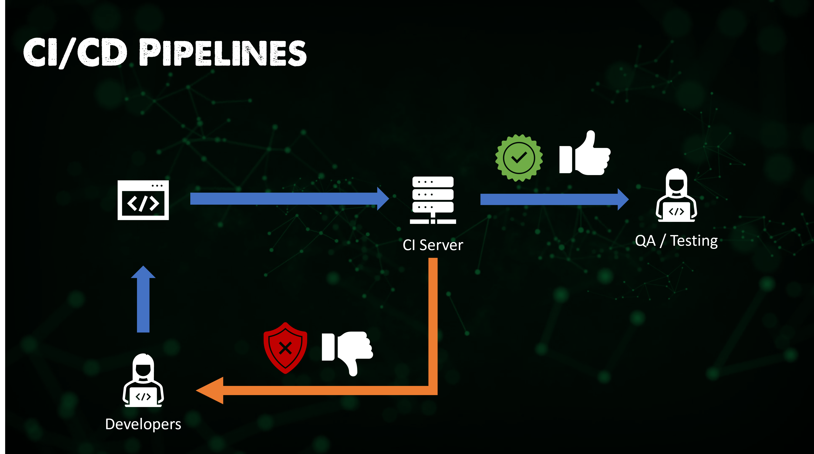

## Jenkins là gì?

Jenkins là một công cụ triển khai liên lục cho phép việc phát triển, kiểm thử và triển khai liên tục của mã nguồn mới được tạo ra.

Có hai cách chúng ta có thể đạt được điều này, thông qua việc xây dựng hàng đêm (Nightly builds) hoặc phát triển liên tục. Lựa chọn đầu tiên là các nhà phát triển phát triển mã nguồn cho các công việc vào ban ngày và đến cuối ngày làm việc, họ đẩy những thay đổi đó lên kho mã nguồn. Sau đó, vào ban đêm, chúng ta thực hiện các bài kiểm tra đơn vị và xây dựng phần mềm. Điều này được coi như cách cũ để tích hợp tất cả mã nguồn lại với nhau.

Lựa chọn còn lại và cũng là cách được ưa thích hơn đó là các nhà phát triển vẫn tiếp tục thực hiện việc commit mã nguồn tới kho mã nguồn, sau khi commit mã nguồn đó được thực hiện quá trình xây dựng mã nguồn được khởi động liên tục.  

Các phương pháp trên có nghĩa là với việc các kỹ sư phát triển ở các địa điểm khác nhau trên khắp thế giới, chúng ta không có một thời gian cố định hàng ngày để dừng lại quá trình commit và thay đổi mã nguồn. Đây chính là thời điểm Jenkins ra đời đóng vai trò như một máy chủ CI để kiểm soát các quá trình kiểm thử và xây dựng.

Tôi biết chúng ta đang nói về Jenkins ở bài này nhưng tôi cũng muốn thêm một vài công cụ khác phía dưới để có cái nhìn tại sao tôi thấy Jenkins là công cụ phổ biến nhất và tại sao các công cụ khác có thể làm gì tốt hơn Jenkins.

- TravisCI - Một dịch vụ tích hợp lưu trữ, phân phối liên tục được sử dụng để xây và kiểm thử các dự án phần mềm được lưu trữ trên Github.

- Bamboo - Có thể chạy nhiều tiến trình xây dựng song song để biên dịch nhanh hơn, chức năng kết nối với kho lưu trữ tích hợp và có các tác vụ xây dựng cho Ant và Maven.

- Buildbot - là một framework mã nguồn mở để tự động hóa quy trình xây dựng, kiểm thử và phát hành phần mềm. Nó được viết bằng Python và hỗ trợ việc thực hiện song song, phân tán các công việc trên nhiều nền tảng khác nhau.

- Apache Gump - Dành riêng cho các dự án Java, được thiết kế để xây dựng và kiểm thử các dự án Java mỗi đêm, đảm bảo tất cả các dự án đều tương thích ở cả cấp độ chức năng và API.

Vì chúng ta bây giờ sẽ tập trung vào Jenkins - Jenkins một lần nữa là công cụ mã nguồn mở như các công cụ trên và là một máy chủ tự động hóa được viết bằng Java. Nó được sử dụng để tự động hóa quá trình phát triển phần mềm thông qua tích hợp liên tục và hỗ trợ quá trình phân phối liên tục.

### Đặc điểm của Jenkins

Như bạn mong đợi, Jenkins có nhiều đặc điểm bảo phủ nhiều lĩnh vực.

**Cài đặt dễ dàng** - Jenkins là một chương trình độc lập (self-contained) viết bằng java và sẵn sàng trên mọi hệ điều hành như Windows, macOS và Linux.

**Cấu hình dễ dàng** - Cài đặt và cấu hình dễ dàng thông qua giao diện web bao gồm kiểm tra lỗi và hỗ trợ tích hợp sẵn.

**Plug-in** - Nhiều plugin có sẵn trong Trung tâm Cập nhật và tích hợp với nhiều công cụ khác trong chuỗi công cụ CI / CD.

**Có thể mở rộng**- Ngoài các plugin có sẵn, Jenkins có thể mở rộng được thông qua kiến trúc plugin, cung cấp gần như vô tận các tùy chọn cho những gì nó có thể được sử dụng.

**Phân tán** - Jenkins dễ dàng chạy trên hệ phân tán với nhiều máy chủ, giúp tăng tốc độ xây dựng, kiếm thử và triển khai qua nhiều nền tảng.

### Jenkins Pipeline

Bạn sẽ thấy pipeline này nhưng được sử dụng ở phạm vi rộng hơn và ở đây chúng ta đề cập tới các công cụ cụ thể.

Bạn commit mã nguồn tới Jenkins, nơi sau đó sẽ xây dựng ứng dụng của bạn, với tất cả bài kiểm thử tự động, nó sẽ phát hành và triển khai mã nguồn đó khi mỗi bước được hoàn thành. Jenkins sẽ tự động hoá quá trình này.

### Kiến trúc Jenkins

Đầu tiên, để không làm lại những thứ đã có sẵn, [Tài liệu chính thức của Jenkins](https://www.jenkins.io/doc/developer/architecture/) luôn là nơi để bắt đầu, dù vậy, tôi vẫn sẽ ghi lại các ghi chú và kiến thức của mình ở đây.

Jenkins có thể được cài đặt trên nhiều hệ điều hành khác nhau như Windows, Linux và macOS và cả khả năng triển khai như một Docker container và trong Kubernetes. [Cài đặt Jenkins](https://www.jenkins.io/doc/book/installing/)

Đi sâu hơn vào vấn đề này, chúng ta có thể xem xét việc cài đặt Jenkins trong một cụm minikube mô phỏng việc triển khai trên Kubernetes. Nhưng điều này sẽ phụ thuộc vào các kịch bản chúng ta tạo ra trong phần còn lại của bài học.

Chúng ta hãy phân tích hình ảnh dưới đây.

Bước 1 - Nhà phát triển commit các thay đổi tới kho lưu trữ mã nguồn.

Bước 2 - Jenkins kiểm tra kho mã nguồn theo các khoảng thời gian đều đặn và kéo mã nguồn mới.

Bước 3 - Máy chủ xây dựng sau đó xây các mã nguồn thành chương trình thực thi, trong ví dụ này chúng ta đang dùng maven - một máy chủ xây dựng phổ biến. Đây là một lĩnh vực khác cần đề cập.

Bước 4 - Nếu việc xây dựng thất bại thì phản hồi được gửi trả về các nhà phát triển.

Bước 5 - Jenkins sau đó chuyển giao ứng dụng đã xây dựng lên máy chủ kiểm thử, trong ví dụ này, chúng ta đang dùng selenium - một máy chủ kiểm thử phổ biến. Đây là cũng là một lĩnh vực khác cần bàn luận.

Bước 6  - Nếu việc kiểm thử thất bại thì phản hồi được gửi trả về các nhà phát triển.

Bước 7  - Nếu kiểm thử thành công thì chúng ta có thể phát hành tới môi trường sản phẩm.

Chu kỳ này diễn ra liên tục, điều này cho phép các ứng dụng được cập nhật trong vài phút thay vì hàng giờ, ngày, tháng, năm!

Có rất nhiều khía cạnh khác về kiến trúc của Jenkins, ví dụ như nó có khả năng hoạt động theo kiến trúc master-slave, cho phép một master phân tán tới các slave của Jenkins. 

Để tham khảo thêm, Jenkins là mã nguồn mở, sẽ có nhiều doanh nghiệp cần được hỗ trợ, Cloudbees là phiên bản doanh nghiệp của Jenkins cung cấp hỗ trợ và các chức năng trả phí khác cho các khách hàng doanh nghiệp.

Ví dụ như một trong số các khách hàng là Bosch, bạn có thể tìm hiểu về trường hợp của Bosch ở [đây](https://assets.ctfassets.net/vtn4rfaw6n2j/case-study-boschpdf/40a0b23c61992ed3ee414ae0a55b6777/case-study-bosch.pdf)

Tôi sẽ tìm kiếm một ví dụ về một ứng dụng mà chúng ta có thể dùng qua đó hiểu được việc sử dụng Jenkins và sử dụng nó với các công cụ khác.

## Tài liệu tham khảo

- [Jenkins là một cách để xây dựng, kiểm thử, triển khai](https://www.youtube.com/watch?v=_MXtbjwsz3A)
- [Jenkins.io](https://www.jenkins.io/)
- [ArgoCD](https://argo-cd.readthedocs.io/en/stable/)
- [Hướng dẫn ArgoCD cho người mới bắt đầu](https://www.youtube.com/watch?v=MeU5_k9ssrs)
- [Jenkins là gì](https://www.youtube.com/watch?v=LFDrDnKPOTg)
- [Hướng dẫn Jenkins đầy đủ](https://www.youtube.com/watch?v=nCKxl7Q_20I&t=3s)
- [GitHub Actions](https://www.youtube.com/watch?v=R8_veQiYBjI)
- [GitHub Actions CI/CD](https://www.youtube.com/watch?v=mFFXuXjVgkU)

Hẹn gặp lại vào [Ngày 72](day72.md)

