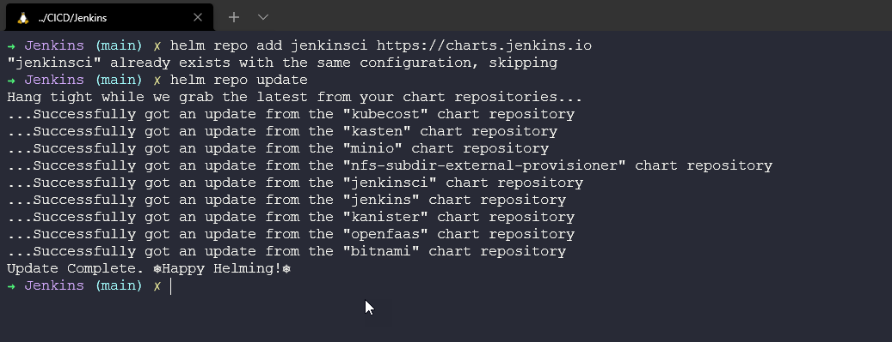
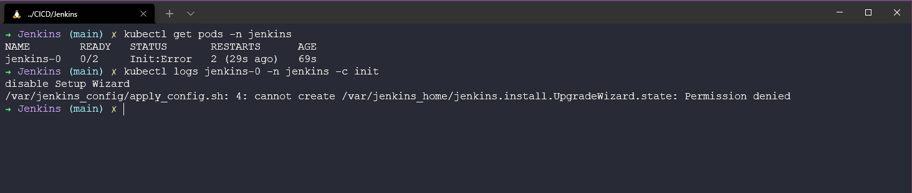
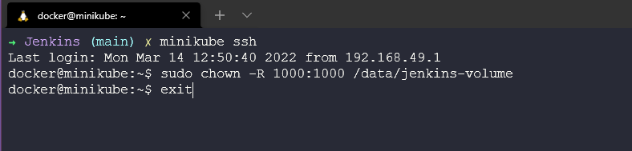
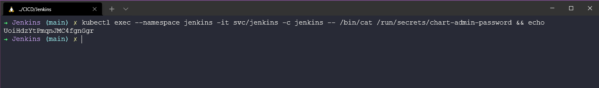
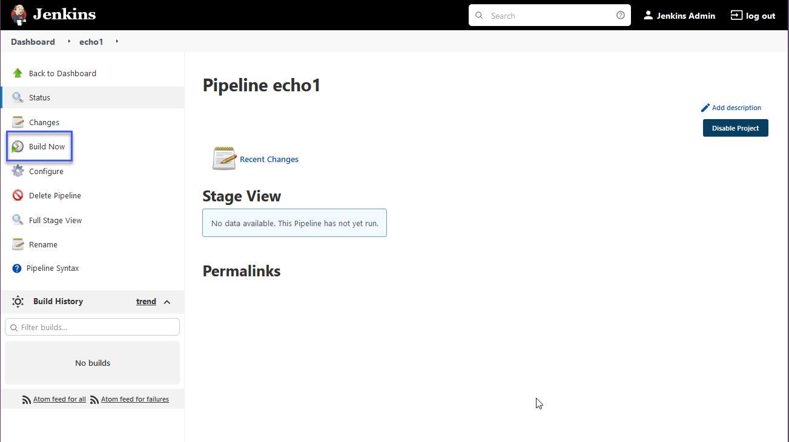
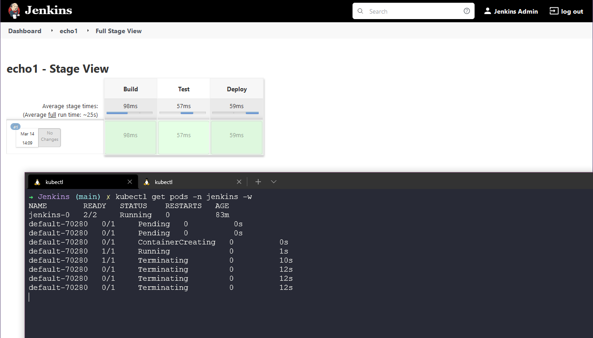

## Thực hành cùng Jenkins

Hôm nay chúng ta sẽ thực hành cùng Jenkins và thực hiện một số việc như một phần của CI pipeline, xem xét một số mã nguồn ví dụ mà chúng ta có thể sử dụng.

### Pipeline là gì?

Trước khi bắt đầu chúng ta cần biết một pipeline là gì khi đến với CI, và chúng ta đã đề cập điều này ở ngày trước đó với ảnh sau đây


Chúng ta muốn thực hiện quy trình hoặc các bước phía trên và tự động hóa chúng để có một kết quả cuối cùng, nghĩa là chúng ta đã triển khai ứng dụng mà chúng ta có thể đưa tới khách hàng, người dùng cuối, vân vân. 

Quy trình tự động này cho phép chúng ta duy trì kiểm soát phiên bản đến người dùng và khách hàng của chúng ta. Mọi thay đổi, nâng cao tính năng, sửa lỗi, vân vân đều thông qua quy trình tự động này xác nhận rằng mọi thứ đều ổn mà không tốn quá nhiều sự can thiệp thủ công để đảm bảo rằng mà nguồn của chúng ta là tốt.

Quy trình này bao gồm việc xây dựng phần mềm một cách đáng tin cậy và có thể lặp lại, cũng như đưa phần mềm đã được xây dựng (gọi là "build") qua nhiều giai đoạn kiểm thử và triển khai.

Jenkins pipeline được viết vào một tệp văn bản gọi là Jenkinsfile. Nó được commit tới một kho điều khiển mã nguồn. Điều này cũng được biết như là Pipeline dưới dạng mã nguồn, chúng ta cũng có thể thấy rất giống với Cơ sở hạ tầng dưới dạng mã nguồn mà ta đã đề cập ở vài tuần trước.

[Jenkins Pipeline Definition](https://www.jenkins.io/doc/book/pipeline/#ji-toolbar)

### Triển khai Jenkins

Tôi có chút thích thú khi triển khai Jenkins, bạn sẽ nhận ra từ [tài liệu](https://www.jenkins.io/doc/book/installing/) rằng có nhiều tùy chọn giúp bạn có thể cài đặt Jenkins.

Với việc tôi đã có sẵn minikube và chúng ta đã sử dụng nó một số lần, tôi cũng muốn sử dụng nó cho tác vụ này.(Nó cũng là miễn phí!) Mặc dù các bước đưa ra trong [Cài đặt Kubernetes](https://www.jenkins.io/doc/book/installing/kubernetes/) khiến tôi gặp khó khăn và không khởi chạy được Jenkins, bạn có thể so sánh với các bước tôi ghi lại ở đây.

Bước đầu tiên là khởi chạy cụm minikube của chúng ta, chúng ta có thể làm điều này với câu lệnh `miniube start`


Tôi đã thêm một thư mục với tất cả giá trị và cấu hình YAML có thể thấy ở [đây](../../Days/CICD/Jenkins). Bây giờ chúng ta đã có cụm riêng và có thể chạy lệnh sau đây để tạo không gian tên jenkins. `kubectl create -f`


Chúng ta sẽ sử dụng Helm để triển khai Jenkins tới cụm, chúng ta đã đề cập tới helm ở phần Kubernetes. Đầu tiên chúng ta cần thêm kho lưu trữ jenkinsci helm `helm repo add jenkinsci https://charts.jenkins.io` sau đó cập nhật các biểu đồ của helm `helm repo update` .



Ý tưởng đằng sau Jenkins là nó sẽ lưu trạng thái pipeline của nó, bạn có thể khởi chạy cài đặt helm như ở trên nhưng nếu các pod đó khởi động lại, bị thay đổi hoặc chỉnh sửa thì mọi pipeline hoặc cấu hình đã tạo sẽ bị mất. Chúng ta sẽ tạo một ổ đĩa để lưu trữ lâu dài bằng sử dụng tệp jenkins-volume.yml với câu lệnh `kubectl apply -f jenkins-volume.yml` .


Chúng ta cũng cần một service account (shoud i change to `tài khoản dịch vụ`) có thể tạo bằng câu lệnh và tệp YAML này. `kubectl apply -f jenkins-sa.yml`


Ở giai đoạn này, chúng ta đã sẵn sàng triển khai bằng cách sử dụng biểu đồ helm, chúng ta đầu tiên cần định nghĩa biểu đồ sử dụng `chart=jenkinsci/jenkins` và sau đó chúng ta sẽ triển khai sử dụng câu lệnh này, trong đó tệp jenkins-values.yml các service account mà chúng ta đã triển khai trước đó tới cụm. `helm install jenkins -n jenkins -f jenkins-values.yml $chart`


Tại giai đoạn này, các pod sẽ kéo hình ảnh nhưng pod sẽ không có quyền truy cập tới tài nguyên lưu trữ, vì vậy cấu hình không thể bắt đầu để khởi tạo Jenkins.

Đây chính là điều mà tài liệu không giúp tôi hiểu rõ điều gì cần phải xảy ra. Nhưng chúng ta có thể thấy rằng chúng ta không có quyền để bắt đầu việc cài đặt Jenkins.



Để khắc phục vấn đề trên hoặc giải quyết nó, chúng ta cần đảm bảo rằng chúng ta cung cấp quyền truy cập hoặc quyền hợp lệ cho các Jenkins pod có thể ghi dữ liệu vào vị trí chúng ta đề xuất. Chúng ta có thể thực hiện điều này bằng cách sử dụng `minikube ssh`, điều này sẽ đưa chúng ta vào bên trong container docker của minikube mà chúng ta đang chạy, sau đó sử dụng `sudo chown -R 1000:1000 /data/jenkins-volume` để đảm bảo rằng chúng ta đã đặt quyền hợp lệ trên volume lưu dữ liệu của chúng ta.



Quá trình trên có thể sửa được lỗi các pod, tuy nhiên, nếu không thành công bạn có thể làm mới các pod với câu lệnh `kubectl delete pod jenkins-0 -n jenkins`. Lúc này, bạn sẽ có 2/2 pod đang chạy gọi là jenkns-0.


Bây giờ chúng ta cần mật khẩu admin và có thể sử dụng câu lệnh sau để lấy thông tin. `kubectl exec --namespace jenkins -it svc/jenkins -c jenkins -- /bin/cat /run/secrets/chart-admin-password && echo`



Hãy mở một cửa sổ terminal mới vì chúng ta sẽ sử dụng câu lệnh `port-forward` cho phép chúng ta truy cập từ máy trạm. `kubectl --namespace jenkins port-forward svc/jenkins 8080:8080`


Chúng ta bây giờ có thể mở trình duyệt và truy cập `http://localhost:8080` xác thực với tài khoản: admin và mật khẩu đã lấy ở bước trước đó.


Sau khi xác thực thành công, trang chào mừng tới Jenkins sẽ có giao diện như hình: 


Từ đây, tôi đề xuất bạn đi đến mục "Manage Jenkins" và ban sẽ thấy mục "Manage Plugins" có một số bản cập nhật có sẵn. Chọn tất cả các plugin và chọn "Download now and install after restart"


Nếu bạn muốn đi sâu hơn và tự động triển khai Jenkins sử dụng tập lệnh shell hãy tham khảo kho lưu trữ này đã được chia sẻ với tôi trên Twitter [mehyedes/nodejs-k8s](https://github.com/mehyedes/nodejs-k8s/blob/main/docs/automated-setup.md)

### Jenkinsfile

Bây giờ chúng ta đã có Jenkins được triển khai trong cụm Kubernetes, chúng ta có thể quay lại và suy nghĩ về Jenkinsfile.

Mọi Jenkinsfile có thể bắt đầu như sau, đầu tiên là nơi bạn xác định các bước của pipeline, ở trường hợp này bạn có Xây dựng > Kiểm thử > Triển khai. Nhưng chúng ta sẽ không làm điều gì khác ngoài sử dụng lệnh `echo` để gọi ra các giai đoạn cụ thể.

```

Jenkinsfile (Declarative Pipeline)

pipeline {
    agent any

    stages {
        stage('Build') {
            steps {
                echo 'Building..'
            }
        }
        stage('Test') {
            steps {
                echo 'Testing..'
            }
        }
        stage('Deploy') {
            steps {
                echo 'Deploying....'
            }
        }
    }
}

```

Trong bảng điều khiển Jenkins, chọn "New Item" và đặt tên, tôi sẽ đặt là "echo1" và tôi đề xuất lựa chọn tiếp theo là Pipeline.


Bấm OK và bạn sẽ có các tab (General, Build Triggers, Advanced Project Options and Pipeline), cho một bài kiểm tra đơn giản chúng ta chỉ quan tâm đến Pipeline. Dưới Pipeline bạn có thể thêm tập lệnh, chúng ta có thể sao chép và dán tập lệnh ở trên vào ô trống.

Như đã đề cập ở trên, Pipeline này sẽ không làm gì nhiều nhưng nó sẽ cho chúng ta thấy các giai đoạn của Xây dựng > Kiểm thử > Triển khai.


Bấm Save, chúng ta bây giờ có thể khởi chạy xây dựng sử dụng lựa chọn build now như ảnh dưới.



Chúng ta cũng sẽ mở một cửa sổ terminal và chạy câu lệnh `kubectl get pods -n jenkins` để xem điều gì xảy ra.



Được rồi, rất đơn giản nhưng chúng ta có thể thấy rằng triển khai và cài đặt Jenkins của chúng ta đã hoạt động chính xác và có thể bắt đầu thấy các khối xây dựng của CI pipeline ở đây.

Ở phần tiếp theo, chúng ta sẽ xây dựng một Jenkins Pipeline.

## Tài liệu tham khảo

- [Jenkins là một cách để xây dựng, kiểm thử, triển khai](https://www.youtube.com/watch?v=_MXtbjwsz3A)
- [Jenkins.io](https://www.jenkins.io/)
- [ArgoCD](https://argo-cd.readthedocs.io/en/stable/)
- [Hướng dẫn ArgoCD cho người mới bắt đầu](https://www.youtube.com/watch?v=MeU5_k9ssrs)
- [Jenkins là gì](https://www.youtube.com/watch?v=LFDrDnKPOTg)
- [Hướng dẫn Jenkins đầy đủ](https://www.youtube.com/watch?v=nCKxl7Q_20I&t=3s)
- [GitHub Actions](https://www.youtube.com/watch?v=R8_veQiYBjI)
- [GitHub Actions CI/CD](https://www.youtube.com/watch?v=mFFXuXjVgkU)

Hẹn gặp lại vào [Ngày 73](day73.md)
