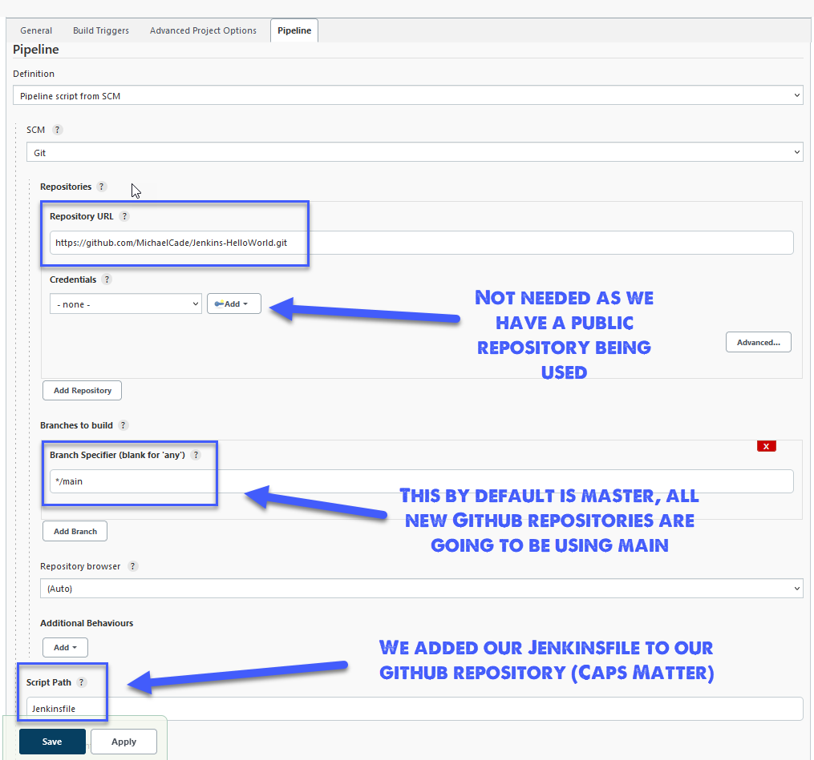
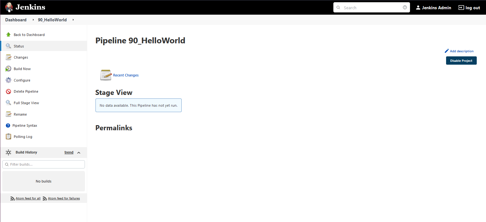

## Hello World - Jenkinsfile App Pipeline

Ở bài trước, chúng ta đã xây một Pipeline đơn giản trong Jenkins có thể đẩy Docker images từ dockerfile trong một kho lưu trữ Github công khai tới kho lưu trữ Dockerhub riêng tư.

Trong bài này, chúng ta muốn bước một bước xa hơn và đạt được các mục tiêu sau với ứng dụng đơn giản của chúng ta.
### Mục tiêu

- Dockerfile (Hello World)
- Jenkinsfile
- Jenkins Pipeline để kích hoạt khi Kho lưu trữ GitHub được cập nhật
- Sử dụng Kho lưu trữ GitHub làm nguồn.
- Chạy - Sao chép/Lấy Kho lưu trữ, Xây dựng, Kiểm tra, Triển khai Các giai đoạn
- Triển khai lên DockerHub với số phiên bản tăng dần
- Mục tiêu mở rộng để triển khai lên Cụm Kubernetes của chúng ta (Điều này sẽ liên quan đến công việc và kho manifest khác sử dụng thông tin xác thực GitHub)

### Bước một

Chúng ta có [GitHub repository](https://github.com/MichaelCade/Jenkins-HelloWorld) đang chứa Dockerfile và tệp index.html

Với nội dung trên, đây là những gì chúng ta đang sử dụng làm nguồn trong Pipeline của mình, giờ đây chúng ta cũng muốn thêm kịch bản Jenkins Pipeline đó vào kho GitHub của chúng ta.

Hãy quay trở lại bảng điều khiển Jenkins, chúng ta sẽ tạo một pipeline mới nhưng thay vì sử kịch bản của chúng ta, chúng ta sẽ sử dụng "Pipeline script from SCM" và các tùy chọn cấu hình dưới đây.

Để tham khảo, chúng ta sẽ sử dụng `https://github.com/MichaelCade/Jenkins-HelloWorld.git` làm URL của kho lưu trữ.

Ở bước này, chúng ta có thể nhấn "Lưu" và "Áp dụng", sau đó chúng ta sẽ có thể chạy thủ công Pipeline của mình để xây dựng Docker images mới và tải lên kho DockerHub của chúng ta.
Tuy nhiên, tôi cũng muốn đảm bảo rằng chúng ta đã đặt lịch mỗi khi kho lưu trữ hoặc mã nguồn thay đổi sẽ kích hoạt một tiến trình xây dựng. Chúng ta có thể sử dụng webhooks hoặc đồng bộ kéo định kỳ.

Điều này đáng để quan tâm vì nếu bạn đang sử dụng các tài nguyên đám mây mất phí để duy trì pipeline và bạn có nhiều thay đổi tới kho lưu trữ mã nguồn bạn sẽ chịu phát sinh nhiều chi phí. Chúng ta biết rằng đây chỉ là một môi trường chạy thử đó là lí do tôi đang sử dụng lựa chọn "poll scm". (Ngoài ra, tôi tin rằng khi sử dụng minikube tôi sẽ thiếu đi chức năng webhook)

Một thứ tôi đã thay đổi trong bài trước đó là tôi muốn tải ảnh tới một kho lưu trữ công cộng đó là michaelcade1\90DaysOfDevOps, Jenkinsfile của tôi đã có thay đổi này từ trước. Và từ bài trước, tôi đã gỡ toàn bộ các ảnh container demo.

Quay trở lại bước trước, chúng ta đã tạo Pipelie của chúng ta và như đã được trình bày trước đó chúng ta đã thêm cấu hình của mình.

Ở giai đoạn này, Pipeline của chúng ta chưa hề chạy và giao diện giai đoạn sẽ trông như sau.

Bây giờ hãy bấm nút "Build Now" và thẻ stage view của chúng ta sẽ hiển thị các giai đọan.

Nếu chúng ta sau đó đi đến kho DockerHub của mình, chúng ta sẽ thấy có 2 Docker images mới. Chúng ta nên có một Build ID là 1 và latest vì đối với mỗi lần xây dựng mà chúng ta tạo dựa trên "Upload to DockerHub" chúng ta gửi một phiên bản bằng biến môi trường Jenkins Build_ID và chúng ta cũng phát hành một phiên bản "latest".

Bây giờ hãy tạo và cập nhật tệp index.html ở trong kho lưu trữ Github như bên dưới, tôi sẽ để bạn tìm hiểu phiên bản 1 của tệp index.html có những gì

Nếu chúng ta quay lại Jenkins và chọn "Build Now" một lần nữa, chúng ta sẽ thấy build #2 có thành công hay không.

Chuyển sang DockerHub, chúng ta có thể thấy chúng ta đã có phiên bản đã đánh dấu 2 và nhãn "latest".

Đáng lưu ý ở đây là tôi đã thêm vào cụm Kubernetes của mình một secret cho phép tôi truy cập và xác thực để đẩy các bản xây Docker của mình vào DockerHub. Nếu bạn đang theo dõi, bạn nên lặp lại quy trình này cho tài khoản của bạn và cũng thực hiện một thay đổi trong Jenkinsfile liên quan đến kho lưu trữ và tài khoản của tôi.

## Tài liệu tham khảo

- [Jenkins là một cách để xây dựng, kiểm thử, triển khai](https://www.youtube.com/watch?v=_MXtbjwsz3A)
- [Jenkins.io](https://www.jenkins.io/)
- [ArgoCD](https://argo-cd.readthedocs.io/en/stable/)
- [Hướng dẫn ArgoCD cho người mới bắt đầu](https://www.youtube.com/watch?v=MeU5_k9ssrs)
- [Jenkins là gì](https://www.youtube.com/watch?v=LFDrDnKPOTg)
- [Hướng dẫn Jenkins đầy đủ](https://www.youtube.com/watch?v=nCKxl7Q_20I&t=3s)
- [GitHub Actions](https://www.youtube.com/watch?v=R8_veQiYBjI)
- [GitHub Actions CI/CD](https://www.youtube.com/watch?v=mFFXuXjVgkU)

Hẹn gặp lại vào [Ngày 75](day75.md)
