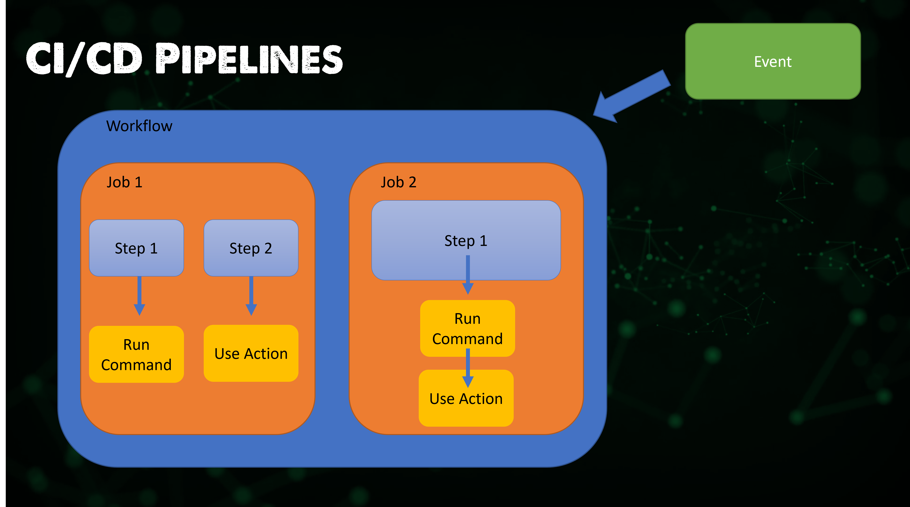
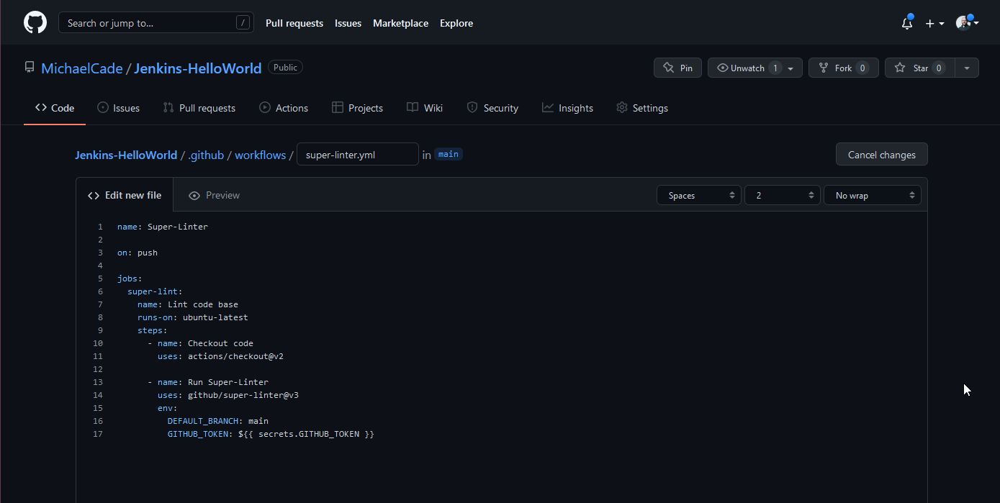
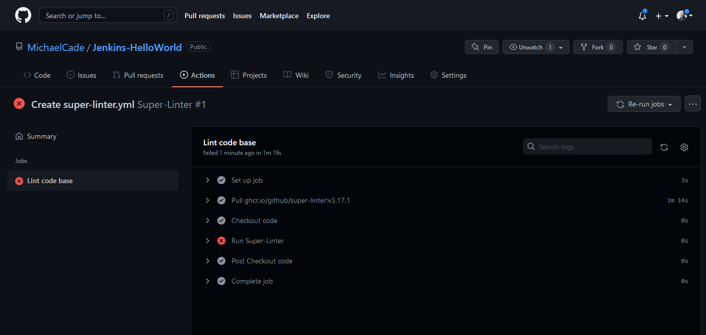
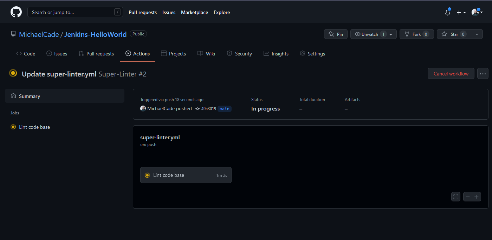
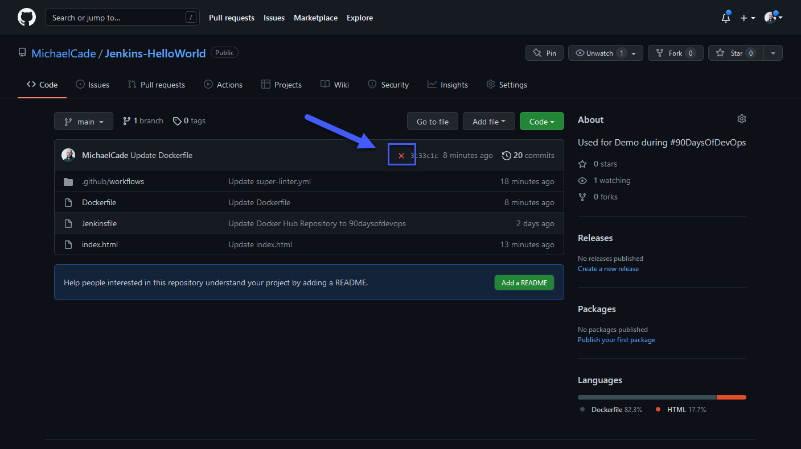
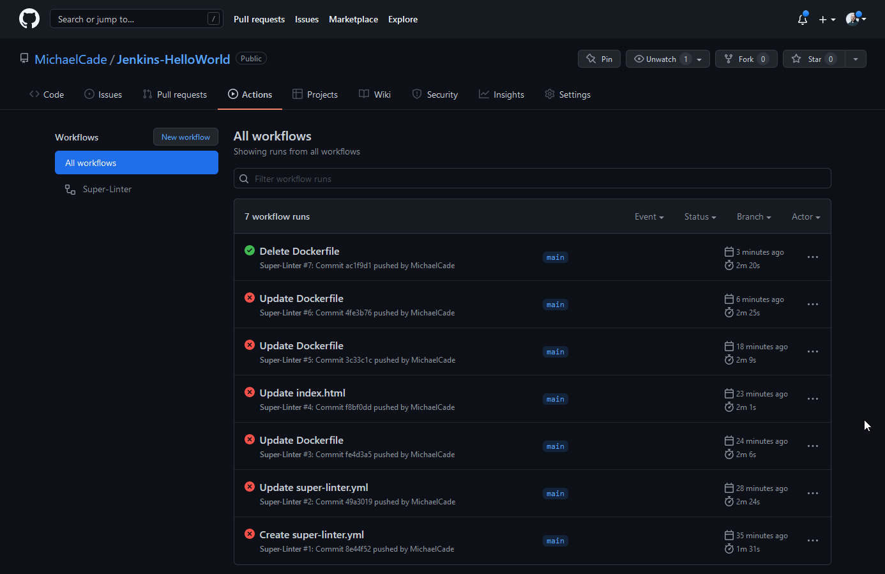
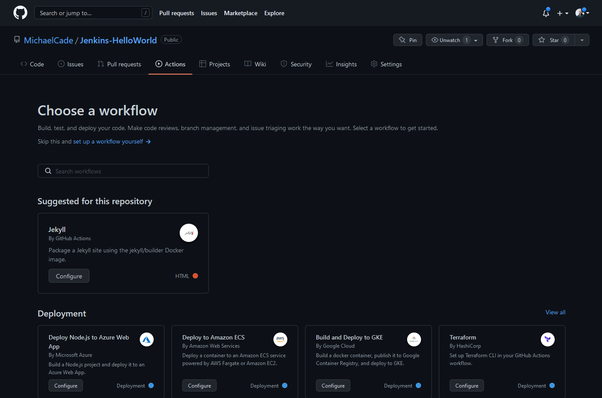

## Tổng quan về GitHub Actions

Ở bài này, tôi muốn tiếp tục và xem xét có thể là ở một cách tiếp cận khác so với những gì chúng ta đã học ở các bài trước. Github Actions là điều chúng ta sẽ tập trung ở bài này.

Github Actions là một nền tảng CI/CD cho phép chúng ta xây dựng, kiểm thử và triển khai giữa các tác vụ trong pipeline. Nó mang trong mình khái niệm về các workflow để xây dựng và kiểm thử trên một kho lưu trữ GitHub. Bạn cũng có thể sử dụng GitHub Actions để điều hướng các luồng công việc khác dựa trên các sự kiện diễn ra trong kho lưu trữ của bạn.

### Workflows

Nhìn chung, trong Github Actions, tác vụ được gọi là **Workflow**:

- Một **workflow** là tiến trình tự động có thể cấu hình được.
- Được định nghĩa dưới dạng tệp YAML.
- Chứa và chạy một hoặc nhiều **jobs**
- Được kích hoạt bởi một **event** trong kho lưu trữ hoặc có thể chạy thủ công
- Có thể có nhiều workflows trên một kho lưu trữ
- Một **workflow** sẽ chứa một **job** và sau đó là các **step** để hoàn thành **job**
- Trong **workflow** chúng ta cũng có một **runner** mà **workflow** chạy trên đó.

Ví dụ, bạn có thể có một **workflow** để xây dựng và kiểm thử các pull requests, một **workflow** khác để triển khai ứng dụng mỗi khi một bản release được tạo, và một **workflow** để đánh nhãn mỗi khi ai đó mở một issue mới.

### Events

Các Event là sự kiện cụ thể trong một kho lưu trữ qua đó kích hoạt workflow chạy.

### Jobs

Một job bao gồm các step trong một workflow được thực thi trên một runner

### Steps

Mỗi step trong job có thể là một đoạn mã shell được thực thi hoặc một hành động. Các step được thực thi theo trình tự và chúng phụ thuộc vào nhau.

### Actions

Là một ứng dụng tùy chỉnh có thể lặp lại được sử dụng cho các tác vụ thường xuyên lặp lại.

### Runners

Một runner là một máy chủ thực thi workflow, mỗi runner chạy một job duy nhất tại một thời điểm. GitHub Actions cung cấp khả năng chạy các runner trên hệ điều hành Ubuntu Linux, Microsoft Windows và macOS. Bạn cũng có thể tự lưu trữ runner của mình trên một hệ điều hành hoặc phần cứng cụ thể.

Dưới đây, bạn có thể thấy cách mọi thứ hoạt động, sự kiện kích hoạt workflow của chúng ta > workflow của chúng ta bao gồm hai job > trong job, chúng ta có các step và sau đó là các action.



### YAML

Trước khi chúng ta bắt đầu với một trường hợp sử dụng thực tế, hãy nhìn nhanh vào hình ảnh trên dưới dạng một tệp YAML minh họa.

Tôi đã thêm dấu # để ghi chú vị trí chúng ta có thể tìm thấy các thành phần của YAML workflow.

```Yaml
#Workflow
name: 90DaysOfDevOps
#Event
on: [push]
#Jobs
jobs:
  check-bats-version:
    #Runners
    runs-on: ubuntu-latest
    #Steps
    steps:
        #Actions
      - uses: actions/checkout@v2
      - uses: actions/setup-node@v2
        with:
          node-version: '14'
      - run: npm install -g bats
      - run: bats -v
```

### Thực hành với GitHub Actions

Tôi nghĩ rằng có rất nhiều tùy chọn khi nói đến GitHub Actions, nó sẽ đáp ứng nhu cầu CI/CD của bạn khi đến giai đoạn Xây dựng, Kiểm tra và Triển khai mã nguồn và các bước tiếp theo sau đó.

Tôi có thể thấy nhiều tùy chọn và các tác vụ tự động khác mà chúng ta có thể sử dụng GitHub Actions cho chúng.

### Sử dụng GitHub Actions để Kiểm tra mã nguồn của bạn

Một trong những tùy chọn là đảm bảo mã nguồn của bạn sạch sẽ và gọn gàng trong kho lưu trữ của bạn. Đây sẽ là ví dụ thực hiện đầu tiên của chúng ta.

Tôi sẽ sử dụng một đoạn mã mẫu được liên kết trong một trong những tài nguyên của bài này, chúng ta sẽ sử dụng `GitHub/super-linter` để kiểm tra mã nguồn của mình.

```Yaml
name: Super-Linter

on: push

jobs:
  super-lint:
    name: Lint code base
    runs-on: ubuntu-latest
    steps:
      - name: Checkout code
        uses: actions/checkout@v2

      - name: Run Super-Linter
        uses: github/super-linter@v3
        env:
          DEFAULT_BRANCH: main
          GITHUB_TOKEN: ${{ secrets.GITHUB_TOKEN }}
```

**github/super-linter**
Bạn có thể thấy phía trên rằng đối với một trong các bước của chúng tôi, chúng tôi có một action được gọi là `GitHub/super-linter` và điều này đang tham chiếu đến một step đã được cộng đồng viết trước đó. Bạn có thể tìm hiểu thêm về nó tại đây [Super-Linter](https://github.com/github/super-linter)

"Kho lưu trữ này dành cho GitHub Action để chạy Super-Linter. Đây là một sự kết hợp đơn giản của các trình kiểm tra mã nguồn khác nhau, được viết bằng bash, để giúp xác minh mã nguồn của bạn."

Cũng trong đoạn mã ở trên có đề cập đến GITHUB_TOKEN, nên tôi muốn tìm hiểu tại sao nó lại cần thiết và dùng để làm gì.

"GHI CHÚ: Nếu bạn truyền biến môi trường `GITHUB_TOKEN: ${{ secrets.GITHUB_TOKEN }}` trong workflow của bạn, thì GitHub Super-Linter sẽ đánh dấu trạng thái của mỗi lần chạy linter trong phần Kiểm tra của pull request. Nếu không, bạn chỉ sẽ thấy trạng thái tổng quan của toàn bộ quá trình chạy. **Không cần phải thiết lập GitHub Secret vì nó được cài đặt tự động bởi GitHub, chỉ cần truyền nó cho action.**"

Đoạn in đậm trên là điều quan trọng cần lưu ý ở giai đoạn này. Chúng ta đang sử dụng nó nhưng không cần phải thiết lập bất kỳ biến môi trường nào trong kho lưu trữ của chúng ta.

Chúng ta sẽ sử dụng kho lưu trữ mà chúng tôi đã sử dụng trong bài thực hành Jenkins để kiểm tra.[Jenkins-HelloWorld](https://github.com/MichaelCade/Jenkins-HelloWorld)

Dưới đây là kho lưu trữ của chúng ta sau khi chúng ta kết thúc trong các buổi thực hành về Jenkins.


Để tận dụng, chúng ta có thể sử dụng tab Actions phía trên để chọn từ thư viện, điều mà tôi sẽ giải thích kỹ sau, hoặc chúng ta có thể tạo tệp của riêng mình bằng cách sử dụng mã super-linter ở trên. Để tạo một tệp của riêng mình, bạn phải tạo một tệp mới trong kho lưu trữ của bạn tại vị trí chính xác này: `.github/workflows/workflow_name` đảm bảo workflow_name là một cái gì đó hữu ích để nhận diện, trong đây, chúng ta có thể có nhiều workflow khác nhau thực hiện các job và nhiệm vụ khác nhau đối với kho lưu trữ của chúng ta.

Chúng ta sẽ tạo `.github/workflows/super-linter.yml.`



Sau đó, chúng ta có thể dán mã nguồn của mình và commit mã vào kho lưu trữ của mình. Sau đó, nếu chúng ta chuyển đến tab Actions, bây giờ chúng ta sẽ thấy Super-Linter workflow của mình được liệt kê dưới đây,


Chúng ta đã xác định trong mã của mình rằng workflow này sẽ chạy khi chúng ta đẩy bất kỳ thay đổi nào lên kho lưu trữ của mình, vì vậy khi đẩy super-linter.yml lên kho lưu trữ của mình, chúng ta đã kích hoạt worflow.



Như bạn có thể thấy từ trên, chúng ta có một số lỗi, có thể là do khả năng "hack" của tôi so với khả năng viết mã của tôi.  

Dù đó không phải là mã của tôi, ít nhất là chưa phải, khi chạy điều này và nhận được một lỗi, tôi đã tìm thấy [issue](https://github.com/github/super-linter/issues/2255)

Lần thứ hai, tôi đã thay đổi phiên bản Super-Linter từ phiên bản 3 lên 4 và đã chạy lại tác vụ.




Như dự đoán, việc "hack" mã của tôi đã gây ra một số vấn đề và bạn có thể thấy chúng ở đây trong [workflow](https://github.com/MichaelCade/Jenkins-HelloWorld/runs/5600278515?check_suite_focus=true).

Tôi muốn kể từ bây giờ sẽ hiển trị trên kho lưu trữ của chúng ta khi có điều gì đó trong workflow đã thất bại hoặc báo lỗi lại.



Bây giờ nếu chúng ta giải quyết lỗi trong commit trên với mã của tôi và đẩy lại các thay đổi, workflow của chúng ta sẽ chạy lại (bạn có thể thấy từ hình ảnh rằng nó mất một thời gian để giải quyết các "lỗi" của chúng ta). Xóa một tệp có thể không được khuyến nghị nhưng đó là một cách rất nhanh chóng để thể hiện vấn đề được giải quyết.



Nếu bạn nhấp vào nút **new workflow** được đánh dấu ở trên, điều này sẽ mở ra cửa sổ cho một loạt lớn các action. Một điều bạn có thể đã nhận thấy trong suốt thử thách này là chúng tôi không muốn phải tạo lại mọi thứ, chúng tôi muốn đứng trên vai những người khổng lồ và chia sẻ mã nguồn, tự động hóa và kỹ năng của mình rộng rãi để làm cuộc sống dễ dàng hơn.



Oh, tôi quên không cho bạn thấy dấu tích màu xanh trên kho lưu trữ khi workflow của chúng ta thành công.


Tôi nghĩ rằng những điều này đã bao quát mọi thứ từ quan điểm cơ bản về GitHub Actions, nhưng nếu bạn giống như tôi, bạn có thể đang nhìn thấy cách GitHub Actions có thể được sử dụng để tự động hóa nhiều nhiệm vụ khác.

Tiếp theo, chúng ta sẽ nói về một lĩnh vực khác của Continuous Deployment, chúng ta sẽ tìm hiểu về ArgoCD để triển khai ứng dụng của chúng ta tới môi trường của mình.

## Tài liệu tham khảo

- [Jenkins là một cách để xây dựng, kiểm thử, triển khai](https://www.youtube.com/watch?v=_MXtbjwsz3A)
- [Jenkins.io](https://www.jenkins.io/)
- [ArgoCD](https://argo-cd.readthedocs.io/en/stable/)
- [Hướng dẫn ArgoCD cho người mới bắt đầu](https://www.youtube.com/watch?v=MeU5_k9ssrs)
- [Jenkins là gì](https://www.youtube.com/watch?v=LFDrDnKPOTg)
- [Hướng dẫn Jenkins đầy đủ](https://www.youtube.com/watch?v=nCKxl7Q_20I&t=3s)
- [GitHub Actions](https://www.youtube.com/watch?v=R8_veQiYBjI)
- [GitHub Actions CI/CD](https://www.youtube.com/watch?v=mFFXuXjVgkU)

Hẹn gặp lại vào [Ngày 76](day76.md)
