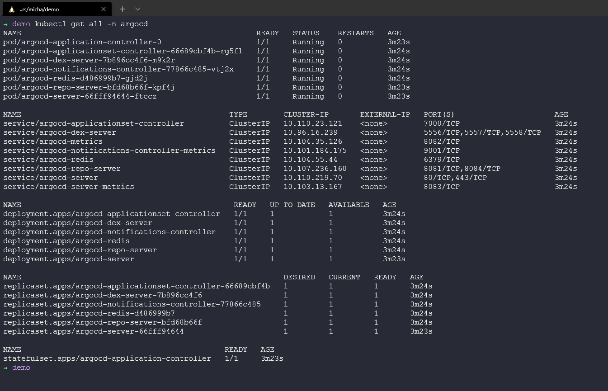
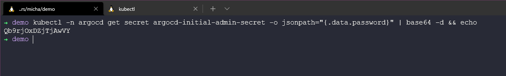

## Tổng quan về ArgoCD

“Argo CD is a declarative, GitOps continuous delivery tool for Kubernetes”

Việc kiểm soát phiên bản là điều quan trọng ở đây. Bạn có từng thay đổi môi trường của mình một cách nhanh chóng mà không nhớ được điều đó, và bởi vì mọi thứ vẫn hoạt động bình thường, bạn tiếp tục thực hiện như bình thường chứ? Bạn có từng thực hiện một thay đổi và làm hỏng mọi thứ hoặc một phần của mọi thứ không? Có thể bạn đã biết rằng bạn đã thực hiện thay đổi và bạn có thể nhanh chóng quay lại trạng thái trước, bao gồm cả các tệp lệnh không tốt hoặc việc gõ sai chính tả. Việc thực hiện những điều này trên quy mô lớn có thể là không phải do bạn hoặc có thể không tìm thấy nguyên nhân ngay lập tức và khi đó doanh nghiệp sẽ gặp khó khăn. Do đó, việc kiểm soát phiên bản là vô cùng quan trọng. Không chỉ vậy mà "Định nghĩa ứng dụng, cấu hình, và môi trường nên tuân theo nguyên tắc khai báo và kiểm soát phiên bản." Ngoài ra (điều này được đề cập từ ArgoCD), đề cập rằng "Triển khai ứng dụng và quản lý vòng đời của ứng dụng nên được tự động hóa, có thể kiểm tra và dễ hiểu."

Từ lĩnh vực Quản trị nhưng đã nghiên cứu rất nhiều về Cơ sở hạ tầng dưới dạng mã, đây là bước tiếp theo để đảm bảo rằng tất cả những điều tốt lành đó được chăm sóc thông qua các luồng công việc triển khai / phát hành liên tục.".


[ArgoCD là gì](https://argo-cd.readthedocs.io/en/stable/)

### Triển khai ArgoCD

Chúng ta sẽ sử dụng Kubernetes cluster với minikube cục bộ cho việc triển khai này. 

```Shell
kubectl create namespace argocd
kubectl apply -n argocd -f https://raw.githubusercontent.com/argoproj/argo-cd/stable/manifests/install.yaml
```


Đảm bảo tất cả pods của ArgoCD đang hoạt động với lệnh `kubectl get pods -n argocd`


Cùng với đó, hãy kiểm tra mọi thứ chúng ta đã triển khai trong namespace `kubectl get all -n argocd`



Khi mọi thử ở trên đều ổn, chúng ta có thể cân nhắc truy cập nó qua port foward. Sử dụng lệnh `kubectl port-forward svc/argocd-server -n argocd 8080:443`. Hãy thực hiện điều này ở một cửa sổ terminal mới.

Sau đó mở một trình duyệt và truy cập `https://localhost:8080`


Để đăng nhập bạn cần một username của admin và sau đó lấy secret đã được tạo để làm password, sử dụng câu lệnh `kubectl -n argocd get secret argocd-initial-admin-secret -o jsonpath="{.data.password}" | base64 -d && echo`



Khi đăng nhập thành công bạn sẽ thấy giao diện CD đang trống.


### Triển khai ứng dụng

Bây giờ chúng ta đã có ArgoCD hoạt động và có thể bắt đầu sử dụng nó để triển khai ứng dụng từ kho lưu trữ Git cũng như Helm.

Ứng dụng tôi muốn triển khai ở đây mà Pac-Man, một tựa game nổi tiếng và là thứ tôi sử dụng để chạy thử rất nhiều khi nói về quản lý dữ liệu, đây sẽ không phải là lần cuối chúng ta thấy Pac-Man.

Bạn có thể tìm thấy kho lưu trữ [Pac-Man](https://github.com/MichaelCade/pacman-tanzu.git) ở đây.

Thay vì đi qua từng bước sử dụng các screenshot, tôi nghĩ sẽ dễ dàng hơn bằng việc tạo một video hướng dẫn các bước cần thiết cho việc triển khai ứng dụng này.

[ArgoCD Demo - 90DaysOfDevOps](https://www.youtube.com/watch?v=w6J413_j0hA)

Ghi chú - Trong video, có một dịch vụ không bao giờ có một dịch vụ không bao giờ có status là healthy. Điều này xảy ra vì loại LoadBalancer được đặt cho dịch vụ Pacman đang có status là pending, trong Minikube chúng ta không có cấu hình load balancer. Nếu bạn muốn kiểm tra điều này, bạn có thể thay đổi YAML của dịch vụ thành ClusterIP và sử dụng port fowarding để chơi trò chơi.

Chúng ta kết thúc phần về Pipelines CI/CD tại đây. Tôi cảm thấy hiện tại khái niệm này đang được tập trung và bạn cũng sẽ nghe rất nhiều các thuật ngữ liên quan đến GitOps cũng như các phương pháp được sử dụng trong CICD trong công việc hàng ngày.

Phần tiếp theo chúng ta sẽ chuyển sang khía cạnh mới là Giám sát, một khái niệm hoặc lĩnh vực không mới nhưng ngày càng quan trọng hơn khi chúng ta muốn kiểm soát tốt hiệu suất của môi trường của mình.

## Tài liệu tham khảo

- [Jenkins là một cách để xây dựng, kiểm thử, triển khai](https://www.youtube.com/watch?v=_MXtbjwsz3A)
- [Jenkins.io](https://www.jenkins.io/)
- [ArgoCD](https://argo-cd.readthedocs.io/en/stable/)
- [Hướng dẫn ArgoCD cho người mới bắt đầu](https://www.youtube.com/watch?v=MeU5_k9ssrs)
- [Jenkins là gì](https://www.youtube.com/watch?v=LFDrDnKPOTg)
- [Hướng dẫn Jenkins đầy đủ](https://www.youtube.com/watch?v=nCKxl7Q_20I&t=3s)
- [GitHub Actions](https://www.youtube.com/watch?v=R8_veQiYBjI)
- [GitHub Actions CI/CD](https://www.youtube.com/watch?v=mFFXuXjVgkU)

Hẹn gặp lại vào [Ngày 77](day77.md)