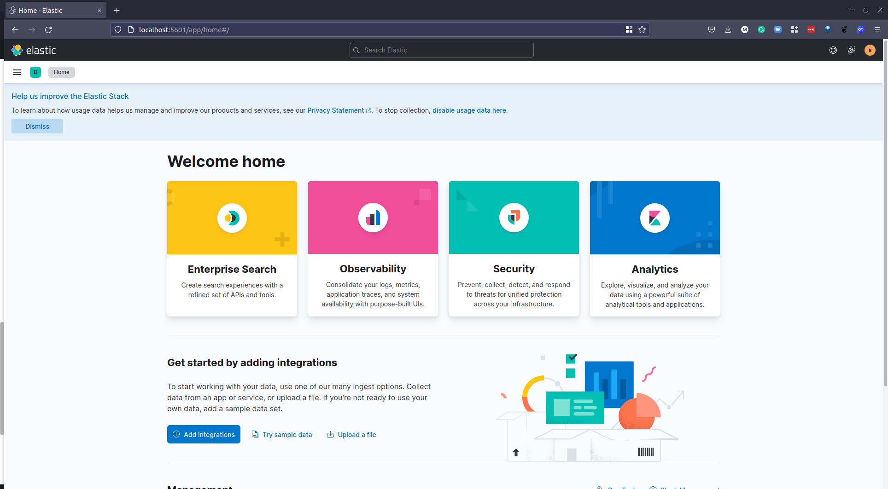
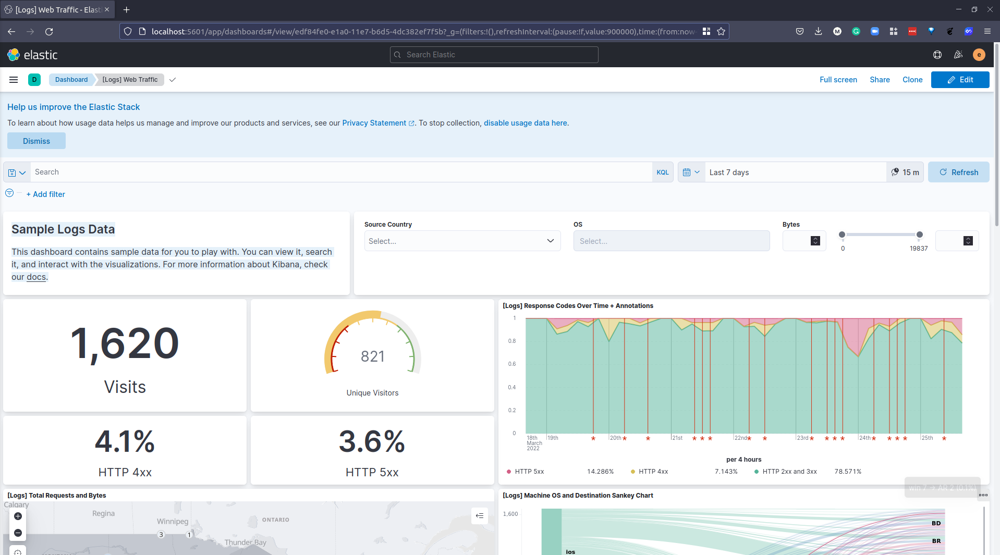

## ELK Stack

Trong buổi này, chúng ta sẽ thực hành với một số tùy chọn mà chúng ta đã đề cập.

ELK Stack là sự kết hợp của 3 công cụ riêng biệt:

- [Elasticsearch](https://www.elastic.co/what-is/elasticsearch) là một công cụ tìm kiếm và phân tích miễn phí và mở rộng cho mọi loại dữ liệu, bao gồm dữ liệu văn bản, số, địa lý, cấu trúc và phi cấu trúc.

- [Logstash](https://www.elastic.co/logstash/) là một đường dẫn xử lý dữ liệu phía máy chủ miễn phí mã nguồn mở, nhận dữ liệu từ nhiều nguồn, chuyển đổi dữ liệu, và sau đó gửi nó đến nơi lưu trữ phù hợp.

- [Kibana](https://www.elastic.co/kibana/) là một giao diện người dùng miễn phí mã nguồn mở cho phép bạn trực quan hóa dữ liệu từ Elasticsearch và điều hướng trong Elastic Stack. Bạn có thể làm mọi thứ từ theo dõi tải truy vấn đến hiểu cách các yêu cầu luân chuyển qua các ứng dụng của bạn.

ELK stack cho phép chúng ta thu thập dữ liệu từ bất kỳ nguồn nào, ở bất kỳ định dạng nào, sau đó tìm kiếm, phân tích và trực quan hóa nó trong thời gian thực.

Ngoài các thành phần đã đề cập, bạn cũng có thể thấy Beats, là những tác nhân nhẹ được cài đặt trên các máy chủ biên để thu thập các loại dữ liệu khác nhau và chuyển tiếp vào stack.

- Logs: Log máy chủ cần được phân tích được xác định.

- Logstash: Thu thập log và dữ liệu sự kiện. Nó thậm chí còn phân tích và chuyển đổi dữ liệu.

- Elasticsearch: Dữ liệu đã được chuyển đổi từ Logstash được lưu trữ, tìm kiếm và lập chỉ mục.

- Kibana sử dụng cơ sở dữ liệu Elasticsearch để khám phá, trực quan hóa và chia sẻ.

[Hình ảnh từ Guru99](https://www.guru99.com/elk-stack-tutorial.html)

Một tài nguyên tốt giải thích về [Hướng dẫn hoàn chỉnh về ELK Stack](https://logz.io/learn/complete-guide-elk-stack/)

Với sự bổ sung của Beats, ELK Stack cũng được gọi là Elastic Stack.

Trong kịch bản thực hành, có nhiều nơi bạn có thể triển khai Elastic Stack nhưng chúng ta sẽ sử dụng docker-compose để triển khai cục bộ trên hệ thống của mình.

[Bắt đầu Elastic Stack với Docker Compose](https://www.elastic.co/guide/en/elastic-stack-get-started/current/get-started-stack-docker.html#get-started-docker-tls)

Bạn sẽ tìm thấy các tệp gốc và hướng dẫn mà tôi đã sử dụng tại đây [deviantony/docker-elk](https://github.com/deviantony/docker-elk)

Bây giờ chúng ta có thể chạy `docker-compose up -d`, lần chạy đầu tiên sẽ yêu cầu tải các images.

Nếu bạn theo dõi repository này hoặc repository mà tôi đã sử dụng, bạn sẽ có mật khẩu là "changeme" hoặc trong repository của tôi là "90DaysOfDevOps". Tên người dùng là "elastic".

Sau vài phút, chúng ta có thể truy cập `http://localhost:5601/` là máy chủ Kibana / container Docker của chúng ta.

Màn hình chính ban đầu của bạn sẽ trông giống như thế này.

Dưới phần "Get started by adding integrations", có một phần "try sample data", nhấp vào đây và chúng ta có thể thêm một trong những dữ liệu mẫu bên dưới.

Tôi sẽ chọn "Sample weblogs" nhưng điều này thực sự chỉ để có cái nhìn và cảm nhận về các tập dữ liệu bạn có thể nhập vào ELK stack.

Khi bạn đã chọn "Add Data", việc này sẽ mất một thời gian để nhập một số dữ liệu đó và sau đó bạn sẽ có tùy chọn "View Data" và danh sách các cách xem dữ liệu có sẵn trong dropdown.

Như được ghi trên bảng điều khiển:

**Dữ liệu Log Mẫu**

> Bảng điều khiển này chứa dữ liệu mẫu để bạn khám phá. Bạn có thể xem, tìm kiếm và tương tác với các trực quan hóa. Để biết thêm thông tin về Kibana, hãy kiểm tra tài liệu của chúng tôi.

Đây là việc sử dụng Kibana để trực quan hóa dữ liệu đã được thêm vào Elasticsearch thông qua Logstash. Đây không phải là tùy chọn duy nhất nhưng tôi muốn triển khai và xem qua nó.

Chúng ta sẽ đề cập đến Grafana vào lúc nào đó và bạn sẽ thấy một số điểm tương đồng trong việc trực quan hóa dữ liệu giữa hai công cụ này, bạn cũng đã thấy Prometheus.

Điểm mấu chốt mà tôi nhận thấy giữa Elastic Stack và Prometheus + Grafana là Elastic Stack hoặc ELK Stack tập trung vào log, còn Prometheus tập trung vào metrics.

Tôi đã đọc bài viết này từ MetricFire [Prometheus vs. ELK](https://www.metricfire.com/blog/prometheus-vs-elk/) để hiểu rõ hơn về các dịch vụ khác nhau.

## Tài liệu tham khảo

- [Understanding Logging: Containers & Microservices](https://www.youtube.com/watch?v=MMVdkzeQ848)
- [The Importance of Monitoring in DevOps](https://www.devopsonline.co.uk/the-importance-of-monitoring-in-devops/)
- [Understanding Continuous Monitoring in DevOps?](https://medium.com/devopscurry/understanding-continuous-monitoring-in-devops-f6695b004e3b)
- [DevOps Monitoring Tools](https://www.youtube.com/watch?v=Zu53QQuYqJ0)
- [Top 5 - DevOps Monitoring Tools](https://www.youtube.com/watch?v=4t71iv_9t_4)
- [How Prometheus Monitoring works](https://www.youtube.com/watch?v=h4Sl21AKiDg)
- [Introduction to Prometheus monitoring](https://www.youtube.com/watch?v=5o37CGlNLr8)
- [Promql cheat sheet with examples](https://www.containiq.com/post/promql-cheat-sheet-with-examples)
- [Log Management for DevOps | Manage application, server, and cloud logs with Site24x7](https://www.youtube.com/watch?v=J0csO_Shsj0)
- [Log Management what DevOps need to know](https://devops.com/log-management-what-devops-teams-need-to-know/)
- [What is ELK Stack?](https://www.youtube.com/watch?v=4X0WLg05ASw)
- [Fluentd simply explained](https://www.youtube.com/watch?v=5ofsNyHZwWE&t=14s)

Hẹn gặp lại vào [ngày 81](day81.md).
