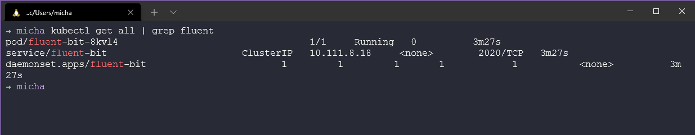

## Fluentd & FluentBit

Một công cụ thu thập dữ liệu khác mà tôi muốn khám phá trong phần quan sát này là [Fluentd](https://docs.fluentd.org/). Đây là một logging layer mã nguồn mở.

Fluentd có bốn tính năng chính làm cho nó phù hợp để xây dựng các đường dẫn log dễ dàng và đáng tin cậy:

- **Ghi log hợp nhất với JSON:** Fluentd cố gắng cấu trúc dữ liệu dưới dạng JSON càng nhiều càng tốt. Điều này cho phép Fluentd hợp nhất tất cả các khía cạnh của xử lý dữ liệu log: thu thập, lọc, buffer và xuất log tới nhiều nguồn và điểm đích. Quá trình xử lý dữ liệu đầu cuối dễ dàng hơn nhiều với JSON vì nó có đủ cấu trúc để truy cập mà không cần sử dụng các schema cứng nhắc.

- **Kiến trúc Pluggable:** Fluentd có hệ thống plugin linh hoạt cho phép cộng đồng mở rộng chức năng của nó. Hơn 300 plugin do cộng đồng đóng góp kết nối hàng chục nguồn dữ liệu với hàng chục đầu ra dữ liệu, xử lý dữ liệu theo nhu cầu. Bằng cách sử dụng plugin, bạn có thể tận dụng log của mình tốt hơn ngay lập tức.

- **Yêu cầu tài nguyên tối thiểu:** Một công cụ thu thập dữ liệu nên nhẹ để nó có thể chạy thoải mái trên một máy có tải cao. Fluentd được viết bằng kết hợp giữa C và Ruby và yêu cầu tài nguyên hệ thống tối thiểu. Phiên bản thông thường chỉ sử dụng 30-40MB bộ nhớ và có thể xử lý 13.000 sự kiện/giây trên mỗi core.

- **Độ tin cậy tích hợp:** Mất dữ liệu không bao giờ nên xảy ra. Fluentd hỗ trợ buffer dựa trên bộ nhớ và tệp để ngăn ngừa mất dữ liệu giữa các node. Fluentd cũng hỗ trợ failover và có thể được thiết lập để có tính khả dụng cao (HA).

[Cài đặt Fluentd](https://docs.fluentd.org/quickstart#step-1-installing-fluentd)

### Các ứng dụng ghi log dữ liệu như thế nào?

- Ghi vào tệp `.log` (khó phân tích nếu không có công cụ và ở quy mô lớn).
- Ghi trực tiếp vào cơ sở dữ liệu (mỗi ứng dụng phải được cấu hình đúng định dạng).
- Các ứng dụng của bên thứ ba (NodeJS, NGINX, PostgreSQL).

Đây là lý do tại sao chúng ta cần một lớp ghi log hợp nhất.

Fluentd cho phép chúng ta sử dụng ba loại dữ liệu log trên và cho phép thu thập, xử lý và gửi chúng đến một điểm đích, ví dụ như gửi log đến các cơ sở dữ liệu Elastic, MongoDB hoặc Kafka.

Bất kỳ dữ liệu nào, từ bất kỳ nguồn dữ liệu nào cũng có thể được gửi đến Fluentd và từ đó có thể gửi đến bất kỳ điểm đích nào. Fluentd không bị ràng buộc với bất kỳ nguồn hoặc điểm đích cụ thể nào.

Trong quá trình nghiên cứu Fluentd, tôi đã gặp Fluent Bit như một tùy chọn khác và có vẻ nếu bạn muốn triển khai công cụ ghi log vào môi trường Kubernetes thì Fluent Bit sẽ cung cấp cho bạn khả năng đó, mặc dù Fluentd cũng có thể được triển khai vào các container cũng như máy chủ.

[Fluentd & Fluent Bit](https://docs.fluentbit.io/manual/about/fluentd-and-fluent-bit)

Fluentd và Fluent Bit sẽ sử dụng các plugin đầu vào để chuyển đổi dữ liệu đó sang định dạng Fluent Bit, sau đó chúng ta có các plugin đầu ra cho bất kỳ điểm đích nào như Elasticsearch.

Chúng ta cũng có thể sử dụng thẻ để kết nối các cấu hình.

Tôi không thấy lý do nào để sử dụng Fluentd và dường như Fluent Bit là cách tốt nhất để bắt đầu. Mặc dù chúng có thể được sử dụng cùng nhau trong một số kiến trúc.

### Fluent Bit trong Kubernetes

Fluent Bit trong Kubernetes được triển khai dưới dạng DaemonSet, có nghĩa là nó sẽ chạy trên mỗi node trong cluster. Mỗi pod Fluent Bit trên mỗi node sẽ đọc từng container trên node đó và thu thập tất cả các log có sẵn. Nó cũng sẽ thu thập siêu dữ liệu từ Kubernetes API Server.

Các annotations của Kubernetes có thể được sử dụng trong tệp YAML cấu hình của các ứng dụng của chúng ta.

Trước tiên, chúng ta có thể triển khai từ helm repository của fluent. `helm repo add fluent https://fluent.github.io/helm-charts` và sau đó cài đặt bằng lệnh `helm install fluent-bit fluent/fluent-bit`.


Trong cluster của tôi, tôi cũng đang chạy Prometheus trong namespace mặc định (cho mục đích kiểm tra), chúng ta cần đảm bảo pod fluent-bit của mình đang hoạt động. Chúng ta có thể làm điều này bằng cách sử dụng `kubectl get all | grep fluent` để hiển thị pod, service và daemonset đang chạy mà chúng ta đã đề cập trước đó.



Để fluent-bit biết nơi lấy log, chúng ta có một tệp cấu hình, trong triển khai Kubernetes của fluent-bit, chúng ta có một configmap đại diện cho tệp cấu hình.


ConfigMap đó sẽ trông giống như sau:

```
Name:         fluent-bit
Namespace:    default
Labels:       app.kubernetes.io/instance=fluent-bit
              app.kubernetes.io/managed-by=Helm
              app.kubernetes.io/name=fluent-bit
              app.kubernetes.io/version=1.8.14
              helm.sh/chart=fluent-bit-0.19.21
Annotations:  meta.helm.sh/release-name: fluent-bit
              meta.helm.sh/release-namespace: default

Data
====
custom_parsers.conf:
----
[PARSER]
    Name docker_no_time
    Format json
    Time_Keep Off
    Time_Key time
    Time_Format %Y-%m-%dT%H:%M:%S.%L

fluent-bit.conf:
----
[SERVICE]
    Daemon Off
    Flush 1
    Log_Level info
    Parsers_File parsers.conf
    Parsers_File custom_parsers.conf
    HTTP_Server On
    HTTP_Listen 0.0.0.0
    HTTP_Port 2020
    Health_Check On

[INPUT]
    Name tail
    Path /var/log/containers/*.log
    multiline.parser docker, cri
    Tag kube.*
    Mem_Buf_Limit 5MB
    Skip_Long_Lines On

[INPUT]
    Name systemd
    Tag host.*
    Systemd_Filter _SYSTEMD_UNIT=kubelet.service
    Read_From_Tail On

[FILTER]
    Name Kubernetes
    Match kube.*
    Merge_Log On
    Keep_Log Off
    K8S-Logging.Parser On
    K8S-Logging.Exclude On

[OUTPUT]
    Name es
    Match kube.*
    Host elasticsearch-master
    Logstash_Format On
    Retry_Limit False

[OUTPUT]
    Name es
    Match host.*
    Host elasticsearch-master
    Logstash_Format On
    Logstash_Prefix node
    Retry_Limit False

Events:  <none>
```


Chúng ta bây giờ có thể chuyển tiếp cổng pod của mình tới localhost để đảm bảo rằng chúng ta có kết nối. Trước tiên lấy tên pod của bạn với `kubectl get pods | grep fluent` và sau đó sử dụng `kubectl port-forward fluent-bit-8kvl4 2020:2020` để mở trình duyệt web tới `http://localhost:2020/`.


Tôi cũng tìm thấy bài viết này trên medium giải thích thêm về [Fluent Bit](https://medium.com/kubernetes-tutorials/exporting-kubernetes-logs-to-elasticsearch-using-fluent-bit-758e8de606af).

## Tài liệu tham khảo

- [Understanding Logging: Containers & Microservices](https://www.youtube.com/watch?v=MMVdkzeQ848)
- [The Importance of Monitoring in DevOps](https://www.devopsonline.co.uk/the-importance-of-monitoring-in-devops/)
- [Understanding Continuous Monitoring in DevOps?](https://medium.com/devopscurry/understanding-continuous-monitoring-in-devops-f6695b004e3b)
- [DevOps Monitoring Tools](https://www.youtube.com/watch?v=Zu53QQuYqJ0)
- [Top 5 - DevOps Monitoring Tools](https://www.youtube.com/watch?v=4t71iv_9t_4)
- [How Prometheus Monitoring works](https://www.youtube.com/watch?v=h4Sl21AKiDg)
- [Introduction to Prometheus monitoring](https://www.youtube.com/watch?v=5o37CGlNLr8)
- [Promql cheat sheet with examples](https://www.containiq.com/post/promql-cheat-sheet-with-examples)
- [Log Management for DevOps | Manage application, server, and cloud logs with Site24x7](https://www.youtube.com/watch?v=J0csO_Shsj0)
- [Log Management what DevOps need to know](https://devops.com/log-management-what-devops-teams-need-to-know/)
- [What is ELK Stack?](https://www.youtube.com/watch?v=4X0WLg05ASw)
- [Fluentd simply explained](https://www.youtube.com/watch?v=5ofsNyHZwWE&t=14s)
- [Fluent Bit explained | Fluent Bit vs Fluentd](https://www.youtube.com/watch?v=B2IS-XS-cc0)

Hẹn gặp lại vào [ngày 82](day82.md)
