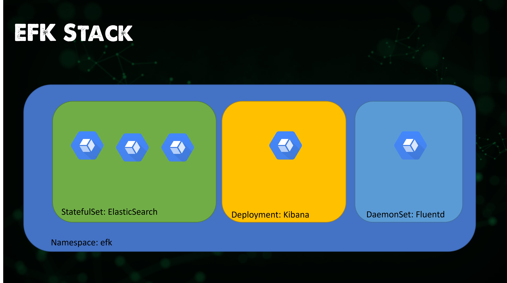
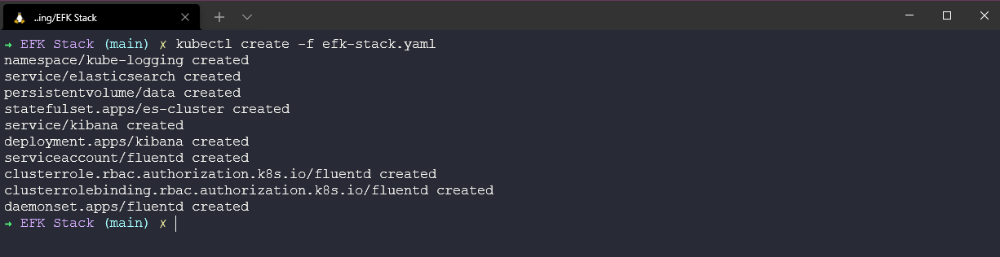
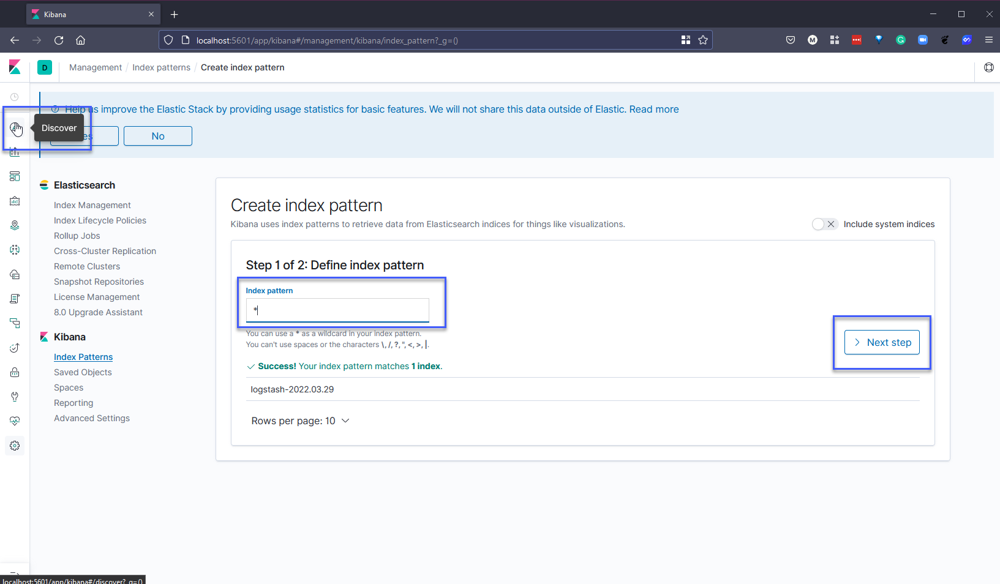

### EFK Stack

Trong phần trước, chúng ta đã nói về ELK Stack, sử dụng Logstash để thu thập log. Trong EFK Stack, chúng ta sử dụng FluentD hoặc FluentBit để thay thế.

Nhiệm vụ của chúng ta trong phần này là giám sát logs của Kubernetes với EFK.

### Tổng quan về EFK

Chúng ta sẽ triển khai những thứ sau vào cụm Kubernetes của mình.

EFK stack là tập hợp gồm 3 phần mềm đi kèm với nhau, bao gồm:

- **Elasticsearch:** Cơ sở dữ liệu NoSQL được sử dụng để lưu trữ dữ liệu và cung cấp giao diện để tìm kiếm và truy vấn log.
- **Fluentd:** Trình thu thập dữ liệu nguồn mở cho layer ghi log hợp nhất. Fluentd cho phép bạn thống nhất việc thu thập và tiêu thụ dữ liệu để sử dụng và hiểu dữ liệu tốt hơn.
- **Kibana:** Giao diện quản lý và thống kê log, chịu trách nhiệm đọc thông tin từ Elasticsearch.

### Triển khai EFK trên Minikube

Chúng ta sẽ sử dụng Minikube cluster của mình để triển khai EFK stack. Hãy bắt đầu một cluster bằng cách sử dụng `minikube start` trên hệ thống. Tôi đang sử dụng hệ điều hành Windows có WSL2 được bật.

Tôi đã tạo [efk-stack.yaml](../../Days/Monitoring/EFK%20Stack/efk-stack.yaml) chứa mọi thứ chúng ta cần để triển khai EFK stack vào cluster. Bằng cách sử dụng lệnh `kubectl create -f efk-stack.yaml`, chúng ta có thể thấy mọi thứ đang được triển khai.

Thời gian triển khai trên hệ thống của bạn sẽ tuỳ thuộc vào việc nếu bạn đã chạy hệ thống này hoặc đã pull images, bây giờ bạn nên kiểm tra xem các pods đã ở trạng thái sẵn sàng chưa trước khi chúng ta có thể tiếp tục. Bạn có thể kiểm tra bằng lệnh `kubectl get pod -n kube-logging -w`. Quá trình này có thể mất vài phút.

Lệnh trên cho phép chúng ta theo dõi mọi thứ, nhưng tôi muốn chắc chắn mọi thứ đều ổn bằng cách chạy lệnh `kubectl get pod -n kube-logging` để đảm bảo tất cả các pods hiện đã hoạt động.

Khi chúng ta đã thiết lập và chạy tất cả các pods, chúng ta sẽ thấy:

- 3 pods được liên kết với ElasticSearch
- 1 pod liên kết với Fluentd
- 1 pod liên kết với Kibana

Chúng ta cũng có thể sử dụng `kubectl get all -n kube-logging` để hiển thị tất cả các thành phần trong namespace của mình. Fluentd (như đã giải thích trước đây) được triển khai dưới dạng daemonset, Kibana dưới dạng deployment và Elasticsearch dưới dạng statefulset.

Bây giờ, khi tất cả các pods đã hoạt động, chúng ta có thể thực hiện lệnh chuyển tiếp cổng với một terminal mới để có thể truy cập bảng điều khiển Kibana. Lưu ý rằng tên pod của bạn sẽ khác với những gì trong lệnh được sử dụng ở đây. `kubectl port-forward kibana-84cf7f59c-v2l8v 5601:5601 -n kube-logging`

Bây giờ, chúng ta có thể mở trình duyệt và truy cập địa chỉ `http://localhost:5601`, bạn sẽ thấy màn hình như bên dưới hoặc bạn có thể thấy màn hình dữ liệu mẫu. Hãy tiếp tục và tự định cấu hình. Dù có như thế nào, hãy xem xét dữ liệu mẫu, đó là những gì chúng ta đã đề cập khi xem xét ELK stack trong bài viết trước.

Tiếp theo, chúng ta cần nhấn vào tab "Discover" trên menu bên trái và thêm "\*" vào mục index pattern. Tiếp tục sang bước tiếp theo bằng cách nhấn "Next step".

Ở bước 2/2, chúng ta sẽ sử dụng tùy chọn @timestamp từ dropdown vì tùy chọn này sẽ lọc dữ liệu của chúng ta theo thời gian. Khi bạn nhấn "Create pattern", có thể mất vài giây để hoàn thành.

Nếu bây giờ chúng ta quay lại tab "Discover" sau vài giây, bạn sẽ bắt đầu thấy dữ liệu đến từ Kubernetes cluster của mình.

Chúng ta đã thiết lập và chạy EFK, cũng như đang thu thập logs từ cụm Kubernetes thông qua Fluentd. Chúng ta cũng có thể xem các nguồn khác mà chúng ta có thể chọn bằng cách điều hướng đến màn hình chính bằng cách nhấn vào biểu tượng Kibana ở trên cùng bên trái, bạn sẽ thấy trang web mà chúng ta đã thấy khi đăng nhập lần đầu.

Chúng ta có thể thêm APM, log data, metric data và security events từ các plugin hoặc nguồn khác.

Nếu chọn "Add log data", chúng ta có thể thấy bên dưới có rất nhiều lựa chọn về nguồn mà chúng ta có thể lấy log. Bạn có thể thấy rằng Logstash được đề cập ở đó là một phần của ELK stack.

Trong "Metrics data", bạn sẽ thấy rằng bạn có thể thêm nguồn cho Prometheus và nhiều dịch vụ khác.

### APM (Giám sát hiệu suất ứng dụng)

Ngoài ra còn có tùy chọn thu thập APM (Giám sát hiệu suất ứng dụng), thu thấp các số liệu và lỗi từ bên trong ứng dụng của bạn. Nó cho phép bạn theo dõi hiệu suất của hàng ngàn ứng dụng theo thời gian thực.

Tôi sẽ không nói nhiều về APM trong bài viết này nhưng bạn có thể tìm hiểu thêm tại [Elastic site](https://www.elastic.co/observability/application-performance-monitoring).

## Tài liệu tham khảo

- [Understanding Logging: Containers & Microservices](https://www.youtube.com/watch?v=MMVdkzeQ848)
- [The Importance of Monitoring in DevOps](https://www.devopsonline.co.uk/the-importance-of-monitoring-in-devops/)
- [Understanding Continuous Monitoring in DevOps?](https://medium.com/devopscurry/understanding-continuous-monitoring-in-devops-f6695b004e3b)
- [DevOps Monitoring Tools](https://www.youtube.com/watch?v=Zu53QQuYqJ0)
- [Top 5 - DevOps Monitoring Tools](https://www.youtube.com/watch?v=4t71iv_9t_4)
- [How Prometheus Monitoring works](https://www.youtube.com/watch?v=h4Sl21AKiDg)
- [Introduction to Prometheus monitoring](https://www.youtube.com/watch?v=5o37CGlNLr8)
- [Promql cheat sheet with examples](https://www.containiq.com/post/promql-cheat-sheet-with-examples)
- [Log Management for DevOps | Manage application, server, and cloud logs with Site24x7](https://www.youtube.com/watch?v=J0csO_Shsj0)
- [Log Management what DevOps need to know](https://devops.com/log-management-what-devops-teams-need-to-know/)
- [What is ELK Stack?](https://www.youtube.com/watch?v=4X0WLg05ASw)
- [Fluentd simply explained](https://www.youtube.com/watch?v=5ofsNyHZwWE&t=14s)

Hẹn gặp lại vào [ngày 83](day83.md)
