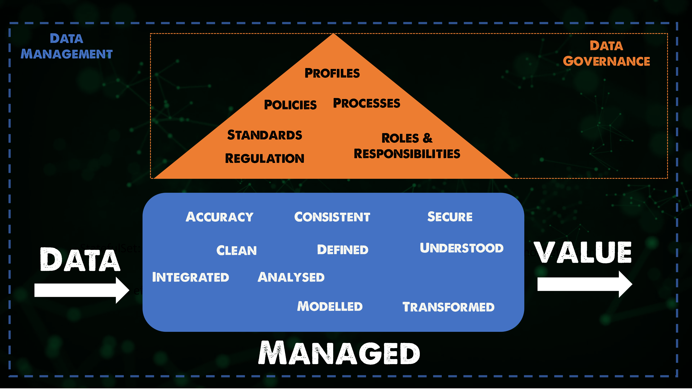

## Bức tranh toàn cảnh: Quản lý dữ liệu

Quản lý dữ liệu không phải là một vấn đề mới, mặc dù chúng ta biết rằng dữ liệu ngày nay quan trọng hơn rất nhiều so với vài năm trước. Dữ liệu có giá trị và luôn thay đổi, nhưng đồng thời cũng có thể gây phiền toái lớn khi nói đến tự động hóa và tích hợp, kiểm tra và triển khai các bản phát hành phần mềm thường xuyên. Dữ liệu lưu trữ và các dịch vụ dữ liệu cơ bản thường là nguyên nhân chính khi xảy ra sự cố.

Trước khi đi vào Quản lý Dữ liệu Trên Đám Mây, chúng ta cần đi cao hơn một chút. Chúng ta đã đề cập đến nhiều nền tảng khác nhau trong nhiều tuần nay. Cho dù là Vật lý, Ảo hoá, cloud hay cloud native, bao gồm cả Kubernetes, không có nền tảng nào không yêu cầu quản lý dữ liệu.

Dù là loại hình kinh doanh nào, rất có thể bạn sẽ tìm thấy một cơ sở dữ liệu ẩn nằm đâu đó trong môi trường, dù là cho hệ thống quan trọng nhất của doanh nghiệp hay ít nhất là một phần quan trọng lưu trữ dữ liệu liên tục tại một mức độ nào đó trong hệ thống.

### DevOps và Dữ Liệu

Giống như những bài đầu tiên của loạt bài này nói về nguyên lý DevOps, để có quy trình tốt hơn đối với dữ liệu, bạn cần có đúng những người phù hợp. Có thể là các DBA nhưng cũng có thể là những người quan tâm đến việc sao lưu các dịch vụ dữ liệu đó.

Thứ hai, chúng ta cũng cần xác định các loại dữ liệu khác nhau, các domain và ranh giới mà chúng ta liên kết với dữ liệu của mình. Điều này giúp chúng ta không chỉ xử lý dữ liệu một cách đơn lẻ trong các phạm vi của các DBA, kỹ sư lưu trữ hay kỹ sư tập trung vào sao lưu. Điều này giúp toàn bộ nhóm có thể quyết định con đường hành động tốt nhất khi phát triển và lưu trữ ứng dụng cho doanh nghiệp rộng hơn và tập trung vào kiến trúc dữ liệu thay vì đây là một điều bị bỏ qua.

Điều này có thể bao gồm nhiều domain khác nhau của vòng đời dữ liệu, từ quá trình nạp dữ liệu, nơi và cách thức dữ liệu được nạp vào dịch vụ hoặc ứng dụng của chúng ta? Làm thế nào để dịch vụ, ứng dụng hoặc người dùng truy cập dữ liệu này? Nhưng điều quan trọng là chúng ta cần hiểu là làm thế nào để bảo vệ dữ liệu và bảo vệ dữ liệu đó.

### Quản Lý Dữ Liệu 101

Quản lý dữ liệu theo [Data Management Body of Knowledge](https://www.dama.org/cpages/body-of-knowledge) là "sự phát triển, thực thi và giám sát các kế hoạch, chính sách, chương trình và thực tiễn để kiểm soát, bảo vệ, cung cấp và nâng cao giá trị của tài sản dữ liệu và thông tin."

- Dữ liệu là mặt hàng quan trọng nhất của doanh nghiệp của bạn - Dữ liệu chỉ là một phần của tổng thể doanh nghiệp của bạn. Tôi đã nghe câu "Dữ liệu là mạch máu của doanh nghiệp" và điều này có lẽ là đúng. Điều này khiến tôi nghĩ đến máu rất quan trọng đối với cơ thể nhưng một mình nó không có giá trị, chúng ta vẫn cần các thành phần khác của cơ thể để biến nó thành một thứ gì đó không chỉ là chất lỏng.

- Chất lượng dữ liệu quan trọng hơn bao giờ hết - Chúng ta phải xem xét dữ liệu như một tài sản kinh doanh, điều này đòi hỏi chúng ta phải cân nhắc những yếu tố mà dữ liệu cần và yêu cầu để làm việc với các nguyên tắc tự động hóa và DevOps của chúng ta.

- Truy cập dữ liệu đúng lúc - Không ai có thể kiên nhẫn không có truy cập vào dữ liệu phù hợp vào thời điểm phù hợp để đưa ra các quyết định hiệu quả. Dữ liệu phải có sẵn một cách trơn tru và kịp thời mà không phụ thuộc vào cách trình bày.

- Quản lý dữ liệu phải là một công cụ hỗ trợ cho DevOps - Tôi đã đề cập đến việc tinh giản trước đó, chúng ta phải bao gồm yêu cầu quản lý dữ liệu vào chu kỳ của chúng ta và đảm bảo không chỉ sự sẵn có của dữ liệu mà còn bao gồm các chính sách bảo vệ quan trọng của những điểm dữ liệu đó cùng với các mô hình phục hồi đã được kiểm tra đầy đủ.

### DataOps

Cả DataOps và DevOps áp dụng các thực tiễn tốt nhất của phát triển công nghệ và hoạt động để cải thiện chất lượng, tăng tốc độ, giảm thiểu mối đe dọa bảo mật, làm hài lòng khách hàng và cung cấp công việc ý nghĩa và thách thức cho các chuyên gia có kỹ năng. DevOps và DataOps chia sẻ mục tiêu gia tăng việc cung cấp sản phẩm bằng cách tự động hóa nhiều bước quy trình nhất có thể. Đối với DataOps, mục tiêu là một đường ống dữ liệu vững chắc và những thông tin đáng tin cậy từ phân tích dữ liệu.

Một số phần cao hơn và phổ biến nhất tập trung vào DataOps sẽ là Học máy, Dữ liệu lớn và Phân tích Dữ liệu bao gồm Trí tuệ nhân tạo.

### Quản Lý Dữ Liệu là Quản Lý Thông Tin

Bài viết này sẽ không nói về Học máy hoặc Trí tuệ nhân tạo nhưng tập trung vào việc bảo vệ dữ liệu, tiêu đề của phần này là "Quản lý dữ liệu là quản lý thông tin" và chúng ta có thể coi thông tin = dữ liệu.

Ba yếu tố chính chúng ta nên xem xét phần này với dữ liệu là:

- Chính xác - Đảm bảo dữ liệu sản xuất chính xác, bên cạnh đó chúng ta cần đảm bảo rằng dữ liệu của chúng ta dưới dạng sao lưu cũng hoạt động và đã được kiểm tra để khôi phục chắc chắn nếu xảy ra sự cố hoặc lý do gì đó, chúng ta cần phải có thể hoạt động trở lại một cách nhanh chóng.

- Nhất quán - Nếu dịch vụ dữ liệu của chúng ta bao gồm nhiều hệ thống thì chúng ta cần đảm bảo rằng chúng ta có sự nhất quán trên tất cả các vị trí dữ liệu để chúng ta có được dữ liệu chính xác, điều này cũng bao gồm bảo vệ dữ liệu, đặc biệt là các dịch vụ dữ liệu chúng ta cần đảm bảo sự nhất quán ở các mức khác nhau để đảm bảo rằng chúng ta có một bản sao dữ liệu sạch cho dữ liệu được sao lưu, bản sao replica vv.

- Bảo mật - Kiểm soát truy cập dữ liệu, nói chung, là một chủ đề nóng hiện nay trên toàn cầu. Đảm bảo rằng chỉ những người có quyền truy cập vào dữ liệu của bạn là rất quan trọng, một lần nữa chúng ta phải đảm bảo rằng chỉ những nhân viên cần thiết có quyền truy cập vào sao lưu và khả năng khôi phục từ chúng cũng như sao chép và cung cấp các phiên bản khác của dữ liệu doanh nghiệp.

Dữ liệu tốt = Quyết định tốt hơn

### Tuần về Quản Lý Dữ Liệu

Trong 6 bài viết tiếp theo, chúng ta sẽ xem xét kỹ hơn về Cơ sở dữ liệu, Sao lưu & Phục hồi, Khôi phục thảm họa, tất cả đều đi kèm với các yếu tố minh họa và thực hành.

## Tài liệu tham khảo

- [Kubernetes Backup and Restore made easy!](https://www.youtube.com/watch?v=01qcYSck1c4&t=217s)
- [Kubernetes Backups, Upgrades, Migrations - with Velero](https://www.youtube.com/watch?v=zybLTQER0yY)
- [7 Database Paradigms](https://www.youtube.com/watch?v=W2Z7fbCLSTw&t=520s)
- [Disaster Recovery vs. Backup: What's the difference?](https://www.youtube.com/watch?v=07EHsPuKXc0)
- [Veeam Portability & Cloud Mobility](https://www.youtube.com/watch?v=hDBlTdzE6Us&t=3s)

Hẹn gặp lại vào [ngày 85](day85.md)
