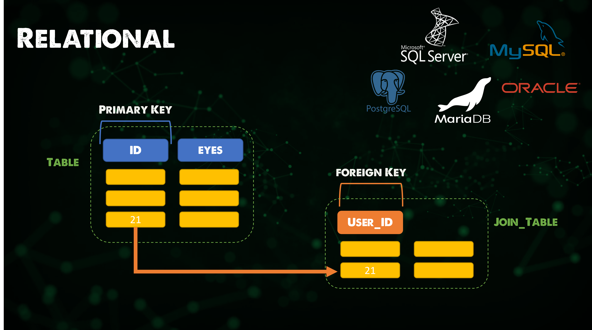

## Dịch vụ dữ liệu

Cơ sở dữ liệu là loại dịch vụ dữ liệu phổ biến nhất mà chúng ta gặp phải trong môi trường của chúng ta. Tôi muốn dành bài viết này để khám phá một số loại cơ sở dữ liệu khác nhau và một số trường hợp sử dụng của chúng. Một số trong số chúng đã được sử dụng trong các bài viết trước đây.

Từ quan điểm phát triển ứng dụng, việc chọn dịch vụ dữ liệu hoặc cơ sở dữ liệu phù hợp sẽ là một quyết định quan trọng đối với hiệu suất và khả năng mở rộng của ứng dụng của bạn.

https://www.youtube.com/watch?v=W2Z7fbCLSTw

### Cơ sở dữ liệu Key-Value

Cơ sở dữ liệu Key-Value là loại cơ sở dữ liệu phi quan hệ sử dụng phương pháp key-value đơn giản để lưu trữ dữ liệu. Cơ sở dữ liệu key-value lưu trữ dữ liệu dưới dạng một bộ các cặp key-value, trong đó key là một định danh duy nhất. Cả key và value có thể là bất cứ thứ gì, từ đối tượng đơn giản đến đối tượng phức tạp. Cơ sở dữ liệu key-value có khả năng phân tán cao và cho phép mở rộng ngang ở các quy mô mà các loại cơ sở dữ liệu khác không thể đạt được.

Một ví dụ về cơ sở dữ liệu Key-Value là Redis.

_Redis là một in-memory data structure store, được sử dụng như một cơ sở dữ liệu phân tán, cơ sở dữ liệu key-value trong bộ nhớ, bộ nhớ đệm và message broker. Redis hỗ trợ các cấu trúc dữ liệu trừu tượng khác nhau, như strings, lists, maps, sets, sorted sets, HyperLogLogs, bitmaps, streams và spatial indices._

Như bạn có thể thấy từ mô tả về Redis, điều này có nghĩa là cơ sở dữ liệu của chúng ta nhanh nhưng chúng ta có hạn chế về không gian như một sự đánh đổi. Ngoài ra, không có truy vấn hoặc liên kết nào, điều đó có nghĩa là các tùy chọn mô hình hóa dữ liệu rất hạn chế.

Thích hợp cho:

- Bộ nhớ đệm (Caching)
- Đăng ký tin nhắn (Pub/Sub)
- Bảng xếp hạng (Leaderboards)
- Giỏ hàng mua sắm (Shopping carts)

Thường được sử dụng như một bộ nhớ đệm trên một lớp dữ liệu cố định khác.

### Cột rộng (Wide Column)

Cơ sở dữ liệu cột rộng là một cơ sở dữ liệu NoSQL sắp xếp lưu trữ dữ liệu vào các cột linh hoạt có thể được phân tán trên nhiều máy chủ hoặc nút cơ sở dữ liệu, sử dụng ánh xạ đa chiều để tham chiếu dữ liệu theo cột, hàng và timestamp.

_Cassandra là một hệ thống quản lý cơ sở dữ liệu NoSQL cột rộng, phân tán, mã nguồn mở, miễn phí được thiết kế để xử lý lượng lớn dữ liệu trên nhiều máy chủ, cung cấp tính sẵn có cao mà không có single point of failure._

Không có schame đồng nghĩa là có thể xử lý dữ liệu không cấu trúc và điều này có thể được coi là một điểm mạnh đối với một số workload.

Thích hợp cho:

- Dữ liệu chuỗi thời gian (Time-Series)
- Hồ sơ lịch sử (Historical Records)
- Ghi cao, Đọc thấp (High-Write, Low-Read)

### Tài liệu (Document)

Cơ sở dữ liệu tài liệu (còn được gọi là cơ sở dữ liệu hướng tài liệu hoặc kho lưu trữ tài liệu) là một cơ sở dữ liệu lưu trữ thông tin dưới dạng tài liệu.

_MongoDB là một cơ sở dữ liệu hướng tài liệu cross-platform. Được phân loại là cơ sở dữ liệu NoSQL, MongoDB sử dụng các tài liệu giống JSON với các schema tùy chọn. MongoDB được phát triển bởi MongoDB Inc. và được cấp phép theo Server Side Public License._

Các cơ sở dữ liệu tài liệu NoSQL cho phép các doanh nghiệp lưu trữ dữ liệu đơn giản mà không cần sử dụng mã SQL phức tạp. Lưu trữ nhanh chóng mà không làm giảm độ tin cậy.

Thích hợp cho:

- Hầu hết các ứng dụng
- Trò chơi (Games)
- Internet of Things (IoT)

### Quan hệ (Relational)

Nếu bạn là người mới với cơ sở dữ liệu nhưng bạn đã biết về chúng, tôi đoán rằng bạn đã từng sử dụng một cơ sở dữ liệu quan hệ.

Cơ sở dữ liệu quan hệ là một cơ sở dữ liệu số dựa trên mô hình dữ liệu quan hệ, như đề xuất bởi E. F. Codd vào năm 1970. Một hệ thống được sử dụng để duy trì các cơ sở dữ liệu quan hệ là hệ thống quản lý cơ sở dữ liệu quan hệ. Nhiều hệ thống cơ sở dữ liệu quan hệ có tùy chọn sử dụng SQL để truy vấn và duy trì cơ sở dữ liệu.

_MySQL là một hệ thống quản lý cơ sở dữ liệu quan hệ mã nguồn mở. Tên của nó là sự kết hợp của "My", tên của cô con gái của người đồng sáng lập Michael Widenius, và "SQL", viết tắt của Structured Query Language._

MySQL là một ví dụ về cơ sở dữ liệu quan hệ, có nhiều lựa chọn khác.

Trong khi nghiên cứu về cơ sở dữ liệu quan hệ, thuật ngữ hay viết tắt **ACID** đã được đề cập nhiều lần, (atomicity, consistency, isolation, durability) là một bộ tính chất của transaction cơ sở dữ liệu nhằm đảm bảo tính hợp lệ của dữ liệu dù có lỗi, mất điện và sự cố khác. Trong ngữ cảnh của cơ sở dữ liệu, một chuỗi các thao tác cơ sở dữ liệu thỏa mãn các tính chất ACID (có thể được coi như một thao tác logic đơn trên dữ liệu) được gọi là một transaction. Ví dụ, việc chuyển tiền từ một tài khoản ngân hàng sang một tài khoản khác, thậm chí liên quan đến nhiều thay đổi như giảm số dư tài khoản này và tăng số dư tài khoản kia, là một transaction duy nhất.

Thích hợp cho:

- Hầu hết các ứng dụng (Nó đã tồn tại từ nhiều năm, nhưng không có nghĩa là nó là tốt nhất)

Nó không phù hợp cho dữ liệu không cấu trúc hoặc yêu cần khả năng mở rộng tốt, khi đó NoSQL cung cấp khả năng mở rộng tốt hơn cho một số workload.

### Đồ thị (Graph)

Cơ sở dữ liệu đồ thị lưu trữ các node và mối quan hệ thay vì các bảng hoặc tài liệu. Dữ liệu được lưu trữ giống như bạn có thể vẽ ý tưởng trên một bảng trắng. Dữ liệu của bạn được lưu trữ mà không bị giới hạn bởi một mô hình được xác định trước, cho phép một cách linh hoạt để sử dụng.

_Neo4j là một hệ thống quản lý cơ sở dữ liệu đồ thị được phát triển bởi Neo4j, Inc. Được mô tả bởi các nhà phát triển của nó là một cơ sở dữ liệu ACID tuân thủ với lưu trữ đồ thị và xử lý dữ liệu tự nhiên._

Thích hợp cho:

- Đồ thị (Graphs)
- Đồ thị tri thức (Knowledge Graphs)
- Công cụ đề xuất (Recommendation Engines)

### Công cụ tìm kiếm (Search Engine)

Ở phần cuối cùng, chúng ta đã sử dụng một cơ sở dữ liệu công cụ tìm kiếm dưới dạng Elasticsearch.

Cơ sở dữ liệu công cụ tìm kiếm là loại cơ sở dữ liệu phi quan hệ được dành riêng cho việc tìm kiếm nội dung dữ liệu. Các cơ sở dữ liệu công cụ tìm kiếm sử dụng các chỉ số để phân loại các đặc điểm tương tự nhau của dữ liệu và tạo điều kiện cho khả năng tìm kiếm.

_Elasticsearch là một công cụ tìm kiếm dựa trên thư viện Lucene. Nó cung cấp một công cụ tìm kiếm toàn văn bản phân tán, đa khách hàng với giao diện web HTTP và JSON documents không cần schema._

Thích hợp cho:

- Công cụ tìm kiếm (Search Engines)
- Tìm kiếm động (Typeahead)
- Tìm kiếm log (Log search)

### Đa mô hình (Multi-model)

Một cơ sở dữ liệu đa mô hình là một hệ thống quản lý cơ sở dữ liệu được thiết kế để hỗ trợ nhiều mô hình dữ liệu trên một backend tích hợp duy nhất. Ngược lại, hầu hết các hệ thống quản lý cơ sở dữ liệu được tổ chức xung quanh một mô hình dữ liệu duy nhất quy định cách dữ liệu có thể được tổ chức, lưu trữ và điều chỉnh. Mô hình tài liệu, đồ thị, quan hệ và key-value là các ví dụ về các mô hình dữ liệu có thể được hỗ trợ bởi một cơ sở dữ liệu đa mô hình.

_Fauna là một cơ sở dữ liệu linh hoạt, thân thiện với nhà phát triển, cơ sở dữ liệu transactional qua một cloud API an toàn và mở rộng với native GraphQL._

Thích hợp cho:

- Bạn không bị giới hạn bởi việc phải chọn một mô hình dữ liệu
- Tuân thủ ACID
- Nhanh
- Không khó khăn trong việc khởi tạo
- Bạn muốn sử dụng dữ liệu của bạn như thế nào và để cloud xử lý những tác vụ nặng

Chúng ta sẽ kết thúc bài viết giới thiệu cơ sở dữ liệu này, bất kể bạn đang hoạt động trong ngành nghề nào bạn cũng sẽ gặp phải cơ sở dữ liệu. Chúng ta sẽ xem xét một số ví dụ và tìm hiểu cách quản lý dữ liệu, đặc biệt là bảo vệ và lưu trữ các dịch vụ dữ liệu này sau này trong phần tiếp theo.

Dưới đây là các tài liệu tham khảo, bạn có thể dành 90 năm để tìm hiểu sâu về tất cả các loại cơ sở dữ liệu và mọi thứ đi kèm với nó.

## Tài liệu tham khảo

- [Redis Crash Course - the What, Why and How to use Redis as your primary database](https://www.youtube.com/watch?v=OqCK95AS-YE)
- [Redis: How to setup a cluster - for beginners](https://www.youtube.com/watch?v=GEg7s3i6Jak)
- [Redis on Kubernetes for beginners](https://www.youtube.com/watch?v=JmCn7k0PlV4)
- [Intro to Cassandra - Cassandra Fundamentals](https://www.youtube.com/watch?v=YjYWsN1vek8)
- [MongoDB Crash Course](https://www.youtube.com/watch?v=ofme2o29ngU)
- [MongoDB in 100 Seconds](https://www.youtube.com/watch?v=-bt_y4Loofg)
- [What is a Relational Database?](https://www.youtube.com/watch?v=OqjJjpjDRLc)
- [Learn PostgreSQL Tutorial - Full Course for Beginners](https://www.youtube.com/watch?v=qw--VYLpxG4)
- [MySQL Tutorial for Beginners [Full Course]](https://www.youtube.com/watch?v=7S_tz1z_5bA)
- [What is a graph database? (in 10 minutes)](https://www.youtube.com/watch?v=REVkXVxvMQE)
- [What is Elasticsearch?](https://www.youtube.com/watch?v=ZP0NmfyfsoM)
- [FaunaDB Basics - The Database of your Dreams](https://www.youtube.com/watch?v=2CipVwISumA)
- [Fauna Crash Course - Covering the Basics](https://www.youtube.com/watch?v=ihaB7CqJju0)

Hẹn gặp lại vào [ngày 86](day86.md)
