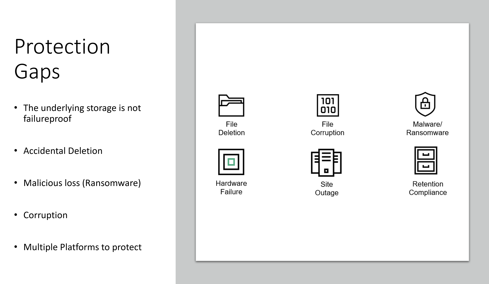
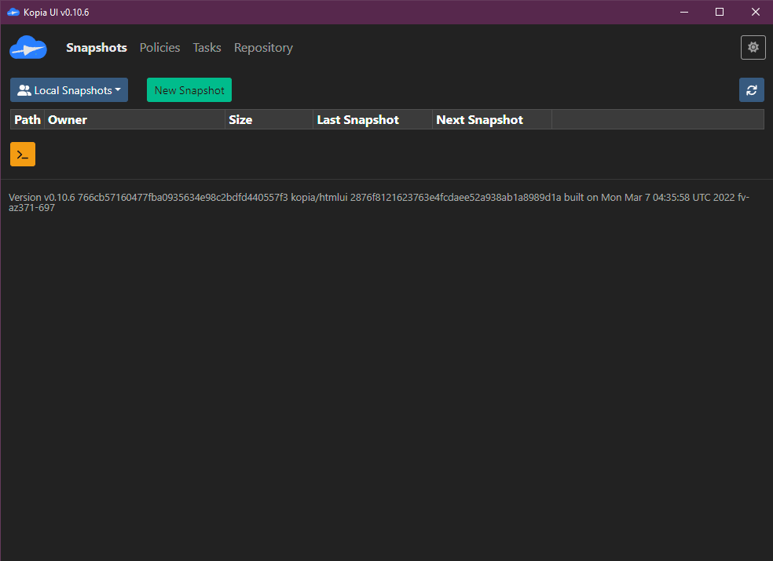
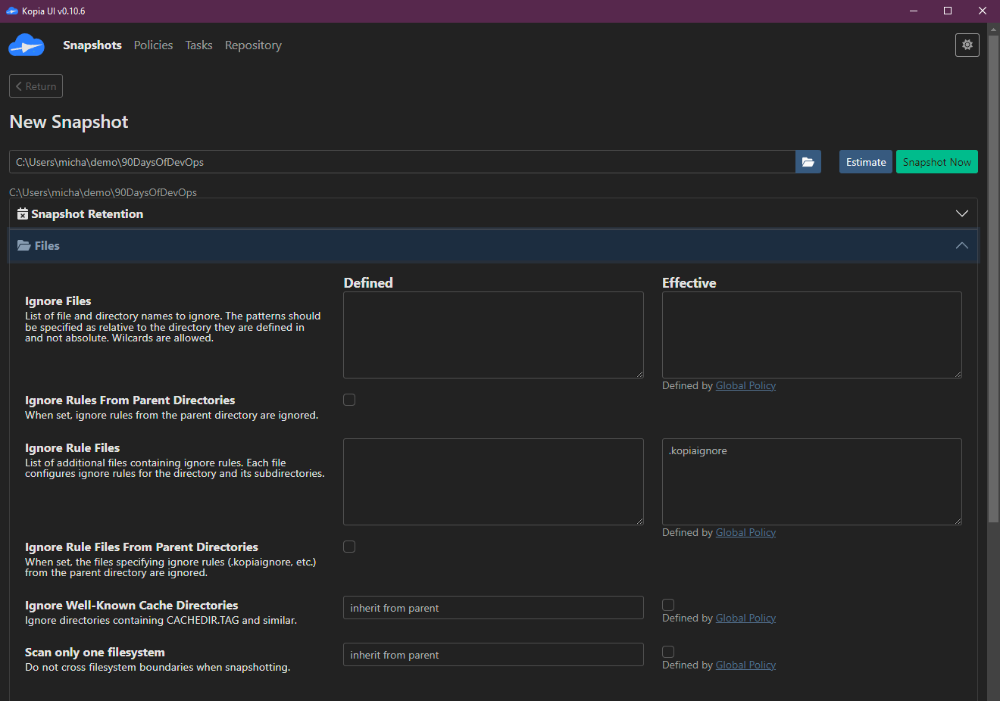
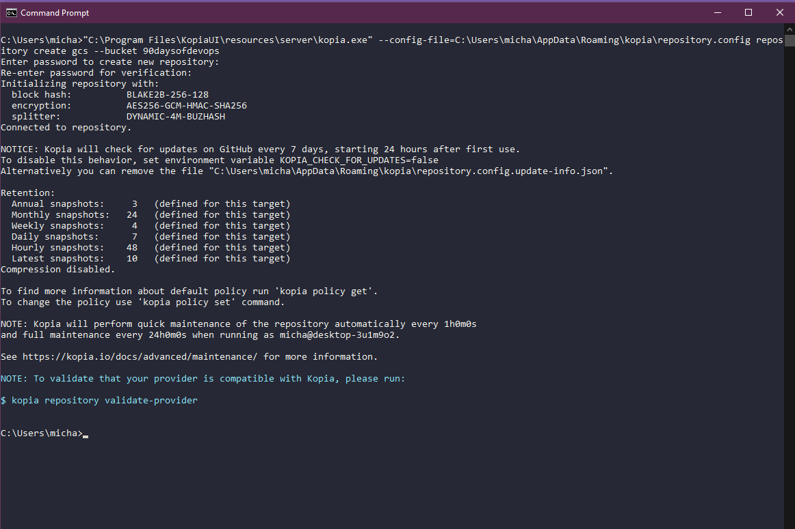
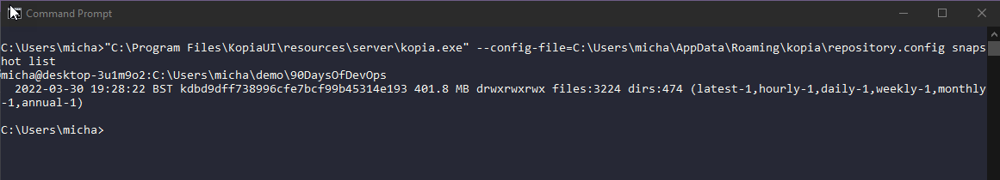

## Sao lưu tất cả các nền tảng

Trong suốt quá trình học, chúng ta đã thảo luận về nhiều nền tảng và môi trường khác nhau. Một điểm chung giữa chúng là tất cả đều cần một mức độ bảo vệ dữ liệu nào đó.

Bảo vệ dữ liệu đã tồn tại từ rất lâu, nhưng lượng dữ liệu khổng lồ mà chúng ta có ngày nay và giá trị của dữ liệu này khiến chúng ta phải đảm bảo rằng chúng ta không chỉ có khả năng chịu đựng sự cố hạ tầng bằng cách có nhiều nodes và khả năng sẵn sàng cao trên các ứng dụng, mà còn phải xem xét rằng chúng ta cần có một bản sao của dữ liệu đó, dữ liệu quan trọng, ở một vị trí an toàn và bảo mật nếu xảy ra sự cố.

Chúng ta nghe rất nhiều về tội phạm mạng và ransomware ngày nay, và đừng hiểu lầm, đây là một mối đe dọa lớn và tôi khẳng định rằng bạn sẽ bị tấn công bởi ransomware. Vấn đề không phải là nếu mà là khi nào. Vì vậy, càng có lý do để đảm bảo rằng bạn đã bảo vệ dữ liệu của mình cho khi điều đó xảy ra. Tuy nhiên, nguyên nhân phổ biến nhất gây mất dữ liệu không phải là ransomware hay tội phạm mạng mà đơn giản là xóa nhầm!

Chúng ta đều đã từng làm điều đó, xóa một thứ gì đó mà không nên xoá và ngay lập tức hối hận.

Với tất cả công nghệ và tự động hóa mà chúng ta đã thảo luận trong thử thách, yêu cầu bảo vệ bất kỳ dữ liệu trạng thái nào hoặc thậm chí cấu hình không trạng thái phức tạp vẫn tồn tại, bất kể nền tảng nào.

Nhưng chúng ta nên có khả năng thực hiện việc bảo vệ dữ liệu đó với tư duy tự động hóa và có thể tích hợp nó vào quy trình làm việc của chúng ta.

Nếu chúng ta nhìn vào sao lưu là gì:

_Trong công nghệ thông tin, sao lưu, hay sao lưu dữ liệu, là một bản sao của dữ liệu máy tính được lấy và lưu trữ ở nơi khác để có thể sử dụng để khôi phục bản gốc sau sự cố mất dữ liệu. Dạng động từ, chỉ quá trình thực hiện, là "back up", trong khi dạng danh từ và tính từ là "backup"._

Nếu chúng ta chia nhỏ điều này thành dạng đơn giản nhất, sao lưu là copy and paste dữ liệu vào một vị trí mới. Đơn giản tôi có thể sao lưu ngay bây giờ bằng cách sao chép một tệp từ ổ C: của tôi sang ổ D: và tôi sẽ có một bản sao trong trường hợp có sự cố xảy ra với ổ C: hoặc có gì đó bị chỉnh sửa sai trong các tệp. Tôi có thể khôi phục từ bản sao tôi có trên ổ D:. Bây giờ nếu máy tính của tôi chết nơi cả ổ C & D thì tôi không được bảo vệ, vì vậy tôi phải xem xét một giải pháp hoặc một bản sao dữ liệu ngoài hệ thống của tôi có thể vào một ổ NAS trong nhà tôi? Nhưng sau đó điều gì xảy ra nếu có gì đó xảy ra với nhà tôi, có lẽ tôi cần xem xét lưu trữ nó trên một hệ thống khác ở một vị trí khác, có thể cloud là một lựa chọn. Có lẽ tôi có thể lưu trữ một bản sao của các tệp quan trọng của mình ở nhiều vị trí để giảm thiểu rủi ro sự cố?

### Phương pháp sao lưu 3-2-1

Bây giờ có vẻ là thời điểm tốt để nói về quy tắc hoặc phương pháp sao lưu 3-2-1. Tôi đã có một [bài nói nhanh](https://www.youtube.com/watch?v=5wRt1bJfKBw) về chủ đề này.

Chúng ta đã đề cập trước đây một số lý do cực đoan về việc tại sao chúng ta cần bảo vệ dữ liệu của mình nhưng dưới đây là một vài lý do nữa:

Điều này cho phép tôi nói về phương pháp 3-2-1. Bản sao hoặc bản sao lưu đầu tiên của dữ liệu của tôi nên càng gần với môi trường sản xuất của tôi càng tốt, lý do cho điều này dựa trên tốc độ khôi phục và lại trở lại với điểm ban đầu về xóa nhầm, đây sẽ là lý do phổ biến nhất cho khôi phục. Nhưng tôi muốn lưu trữ nó trên một phương tiện thứ hai phù hợp bên ngoài môi trường sản xuất ban đầu.

Sau đó, chúng ta muốn đảm bảo rằng chúng ta cũng gửi một bản sao dữ liệu của mình ra ngoài hoặc ngoài site, đây là nơi mà vị trí thứ hai xuất hiện, có thể là một ngôi nhà khác, tòa nhà, trung tâm dữ liệu hoặc public cloud.

### Trách nhiệm sao lưu

Chúng ta có thể đã nghe tất cả các huyền thoại khi nói đến không cần sao lưu, những điều như "Mọi thứ đều là stateless". Nếu mọi thứ đều stateless thì công việc là gì? không có cơ sở dữ liệu? tài liệu word? Có một mức độ trách nhiệm đối với mỗi cá nhân trong doanh nghiệp để đảm bảo rằng họ được bảo vệ nhưng có lẽ đội ngũ vận hành sẽ phải đảm bảo quá trình sao lưu cho các ứng dụng và dữ liệu quan trọng.

Một câu chuyện khác nữa là "Đảm bảo khả năng sẵn sàng cao chính là phương án backup tốt nhất, chúng tôi đã tích hợp nhiều nodes vào cụm của mình, không có cách nào cụm này bị hỏng!" nhưng khi bạn mắc lỗi đối với cơ sở dữ liệu và lỗi được sao chép trên tất cả các nodes trong cụm, hoặc khi bị cháy, lũ lụt, có nghĩa là cụm không còn khả dụng và cùng với đó là dữ liệu quan trọng. Đó không phải là về việc cứng đầu mà là về việc nhận thức về dữ liệu và dịch vụ, mọi người có thể tính đến khả năng sẵn sàng cao và chịu lỗi trong kiến trúc của họ nhưng điều đó không thay thế yêu cầu sao lưu dữ liệu!

Sao chép dữ liệu cũng có thể khiến chúng ta cảm thấy an toàn khi có bản sao ngoài site của dữ liệu và có thể cụm được đề cập ở trên được đặt ở nhiều vị trí. Tuy nhiên, lỗi vận hành sẽ vẫn được sao chép nếu nó xảy ra. Nhưng một yêu cầu sao lưu nên đi kèm với với sao chép ứng dụng hoặc sao chép hệ thống trong cùng môi trường.

Bây giờ bạn có thể cực đoan và bắt đầu gửi bản sao dữ liệu đến quá nhiều vị trí sẽ không chỉ tốn kém mà còn tăng nguy cơ bị tấn công vì diện tích bề mặt của bạn bây giờ đã mở rộng đáng kể.

Dù sao, ai là người đảm nhận việc sao lưu? Nó sẽ khác nhau trong mỗi doanh nghiệp nhưng ai đó nên tự mình hiểu các yêu cầu sao lưu và cũng phải hiểu kế hoạch khôi phục!

### Không ai quan tâm cho đến khi mọi người đều quan tâm

Sao lưu là một ví dụ điển hình, không ai quan tâm đến sao lưu cho đến khi bạn cần khôi phục một cái gì đó. Cùng với yêu cầu sao lưu dữ liệu của chúng ta, chúng ta cũng cần xem xét cách chúng ta khôi phục!

Với ví dụ về tài liệu văn bản của chúng ta, chúng ta đang nói về các tệp rất nhỏ nên khả năng sao chép qua lại rất dễ dàng và nhanh chóng. Nhưng nếu chúng ta có các tệp trên 100GB thì điều này sẽ mất thời gian. Ngoài ra, chúng ta phải xem xét mức độ mà chúng ta cần khôi phục nếu chúng ta lấy một máy ảo làm ví dụ.

Chúng ta có toàn bộ Máy Ảo, chúng ta có Hệ Điều Hành, cài đặt Ứng Dụng và sau đó nếu đây là một máy chủ cơ sở dữ liệu chúng ta sẽ có một số tệp cơ sở dữ liệu. Nếu chúng ta mắc lỗi và chèn sai dòng mã vào cơ sở dữ liệu của mình, có lẽ tôi không cần khôi phục toàn bộ máy ảo, tôi muốn khôi phục lại một cách chi tiết những gì tôi cần.

### Kịch bản sao lưu

Tôi muốn bây giờ bắt đầu xây dựng một kịch bản để bảo vệ một số dữ liệu, cụ thể, tôi muốn bảo vệ một số tệp trên máy cục bộ của tôi (trong trường hợp này là Windows nhưng công cụ tôi sẽ sử dụng không chỉ miễn phí và mã nguồn mở mà còn đa nền tảng) Tôi muốn đảm bảo rằng chúng được bảo vệ đến một thiết bị NAS tôi có tại nhà nhưng cũng vào Object Storage bucket trên cloud.

Tôi muốn sao lưu dữ liệu quan trọng này, nó tình cờ là 90DaysOfDevOps repository, dù nó cũng đang được gửi lên GitHub - nơi mà bạn có lẽ đang đọc bài viết này ngay bây giờ nhưng điều gì sẽ xảy ra nếu máy của tôi bị chết và GitHub bị hỏng? Làm thế nào để ai đó có thể đọc nội dung nhưng cũng làm thế nào tôi có thể khôi phục dữ liệu đó sang dịch vụ khác?

Có rất nhiều công cụ có thể giúp chúng ta đạt được điều này nhưng tôi sẽ sử dụng một công cụ có tên [Kopia](https://kopia.io/) một công cụ sao lưu mã nguồn mở sẽ cho phép chúng ta mã hóa, dedupe và nén các bản sao lưu của mình trong khi vẫn có thể gửi chúng đến nhiều vị trí.

Bạn sẽ tìm thấy các bản phát hành để tải xuống [tại đây](https://github.com/kopia/kopia/releases) tại thời điểm viết tôi sẽ sử dụng v0.10.6.

### Cài đặt Kopia

Có một Kopia CLI và GUI, chúng ta sẽ sử dụng GUI nhưng biết rằng bạn cũng có thể có phiên bản CLI của điều này cho các máy chủ Linux không cung cấp GUI.

Tôi sẽ sử dụng `KopiaUI-Setup-0.10.6.exe`

Việc cài đặt tiếp theo sẽ rất nhanh chóng và sau đó khi bạn mở ứng dụng bạn sẽ được chào đón với lựa chọn loại lưu trữ bạn muốn sử dụng làm kho lưu trữ sao lưu của mình.

### Thiết lập kho lưu trữ

Trước tiên, chúng ta muốn thiết lập một kho lưu trữ sử dụng thiết bị NAS cục bộ và chúng ta sẽ làm điều này bằng cách sử dụng SMB, nhưng tôi tin là cũng có thể sử dụng NFS.

Trên màn hình tiếp theo, chúng ta sẽ xác định một mật khẩu, mật khẩu này được sử dụng để mã hóa nội dung kho lưu trữ.

Bây giờ chúng ta đã cấu hình kho lưu trữ, chúng ta có thể kích hoạt một snapshot tạm thời để bắt đầu ghi dữ liệu vào đó.

Đầu tiên chúng ta cần nhập một đường dẫn đến những gì chúng ta muốn snapshot và trong trường hợp này, chúng ta muốn sao chép thư mục `90DaysOfDevOps`. Chúng ta sẽ trở lại việc lập lịch sau.

Chúng ta có thể xác định giữ lại snapshot của mình.

Có lẽ có những tệp hoặc loại tệp mà chúng ta muốn loại trừ.

Nếu chúng ta muốn xác định một lịch trình, chúng ta có thể làm điều này trên màn hình tiếp theo, khi bạn lần đầu tiên tạo snapshot này đây là trang mở để xác định.

Và bạn sẽ thấy một số cài đặt khác có thể được xử lý tại đây.

Chọn snapshot ngay và dữ liệu sẽ được ghi vào kho lưu trữ của bạn.

### Sao lưu ngoài site đến S3

Với Kopia chúng ta có thể thông qua giao diện người dùng dường như chỉ có một kho lưu trữ được cấu hình tại một thời điểm. Nhưng thông qua giao diện người dùng, chúng ta có thể sáng tạo và có nhiều tệp cấu hình kho lưu trữ để lựa chọn để đạt được mục tiêu của chúng ta là có một bản sao cục bộ và ngoài site trong Object Storate.

Object Storate service tôi đang chọn để gửi dữ liệu của mình đến sẽ là Google Cloud Storage. Tôi đã đăng nhập vào tài khoản Google Cloud Platform của mình và tạo một storage bucket. Tôi đã cài đặt Google Cloud SDK trên hệ thống của mình và chạy lệnh `gcloud auth application-default login` đã xác thực tôi với tài khoản của tôi.

Sau đó, tôi đã sử dụng CLI của Kopia để hiển thị trạng thái hiện tại của kho lưu trữ sau khi chúng ta thêm kho lưu trữ SMB trong các bước trước. Tôi đã làm điều này bằng cách sử dụng lệnh `"C:\Program Files\KopiaUI\resources\server\kopia.exe" --config-file=C:\Users\micha\AppData\Roaming\kopia\repository.config repository status`.

Chúng ta bây giờ đã sẵn sàng để thay thế cho bản demo cấu hình của kho lưu trữ, những gì chúng ta có thể làm nếu chúng ta muốn một giải pháp lâu dài để đánh cả hai kho lưu trữ này là chúng ta sẽ tạo một tệp `smb.config` và một tệp `object.config` và có thể chạy cả hai lệnh này để gửi các bản sao dữ liệu của chúng ta đến mỗi vị trí. Để thêm kho lưu trữ của chúng ta chúng ta đã chạy lệnh `"C:\Program Files\KopiaUI\resources\server\kopia.exe" --config-file=C:\Users\micha\AppData\Roaming\kopia\repository.config repository create gcs --bucket 90daysofdevops`.

Lệnh trên xem xét rằng storage bucket trên Google Cloud mà chúng ta tạo là `90daysofdevops`.

Bây giờ chúng ta đã tạo kho lưu trữ mới của mình, chúng ta có thể chạy lại lệnh `"C:\Program Files\KopiaUI\resources\server\kopia.exe" --config-file=C:\Users\micha\AppData\Roaming\kopia\repository.config repository status` và bây giờ sẽ hiển thị cấu hình kho lưu trữ GCS.

Bước tiếp theo chúng ta cần làm là tạo một snapshot và gửi nó đến kho lưu trữ vừa tạo của chúng ta. Sử dụng lệnh `"C:\Program Files\KopiaUI\resources\server\kopia.exe" --config-file=C:\Users\micha\AppData\Roaming\kopia\repository.config kopia snapshot create "C:\Users\micha\demo\90DaysOfDevOps"` chúng ta có thể bắt đầu quá trình này. Bạn có thể thấy trong trình duyệt dưới đây rằng storage bucket trên Google Cloud của chúng ta bây giờ có các tệp kopia dựa trên bản sao lưu của chúng ta.

Với quy trình trên, chúng ta có thể hoàn thành yêu cầu của mình là gửi dữ liệu quan trọng của chúng ta đến 2 vị trí khác nhau, một trong số đó là ngoài site trong Google Cloud Storage và tất nhiên chúng ta vẫn có bản sao sản xuất của dữ liệu của mình trên một loại phương tiện khác.

### Khôi phục

Khôi phục là một cân nhắc khác và rất quan trọng, Kopia cho phép chúng ta không chỉ khôi phục về vị trí hiện tại mà còn cả vị trí mới.

Nếu chúng ta chạy lệnh `"C:\Program Files\KopiaUI\resources\server\kopia.exe" --config-file=C:\Users\micha\AppData\Roaming\kopia\repository.config snapshot list` điều này sẽ liệt kê các snapshot mà chúng ta hiện có trong kho lưu trữ được cấu hình (GCS).

Chúng ta sau đó có thể gắn các snapshot đó trực tiếp từ GCS bằng cách sử dụng lệnh `"C:\Program Files\KopiaUI\resources\server\kopia.exe" --config-file=C:\Users\micha\AppData\Roaming\kopia\repository.config mount all Z:`.

Chúng ta cũng có thể khôi phục nội dugn của snapshot bằng lệnh `kopia snapshot restore kdbd9dff738996cfe7bcf99b45314e193`

Các lệnh trên rất dài và điều này là do tôi đang sử dụng phiên bản KopiaUI của kopia.exe như được giải thích ở đầu hướng dẫn, bạn có thể tải xuống kopia.exe và đặt nó vào một thư mục path để bạn chỉ cần sử dụng lệnh `kopia `.

Trong bài viết tiếp theo, chúng ta sẽ tập trung vào việc bảo vệ các dữ liệu trong Kubernetes.
## Tài liệu tham khảo

- [Kubernetes Backup and Restore made easy!](https://www.youtube.com/watch?v=01qcYSck1c4&t=217s)
- [Kubernetes Backups, Upgrades, Migrations - with Velero](https://www.youtube.com/watch?v=zybLTQER0yY)
- [7 Database Paradigms](https://www.youtube.com/watch?v=W2Z7fbCLSTw&t=520s)
- [Disaster Recovery vs. Backup: What's the difference?](https://www.youtube.com/watch?v=07EHsPuKXc0)
- [Veeam Portability & Cloud Mobility](https://www.youtube.com/watch?v=hDBlTdzE6Us&t=3s)

Hẹn gặp lại vào [ngày 87](day87.md)
