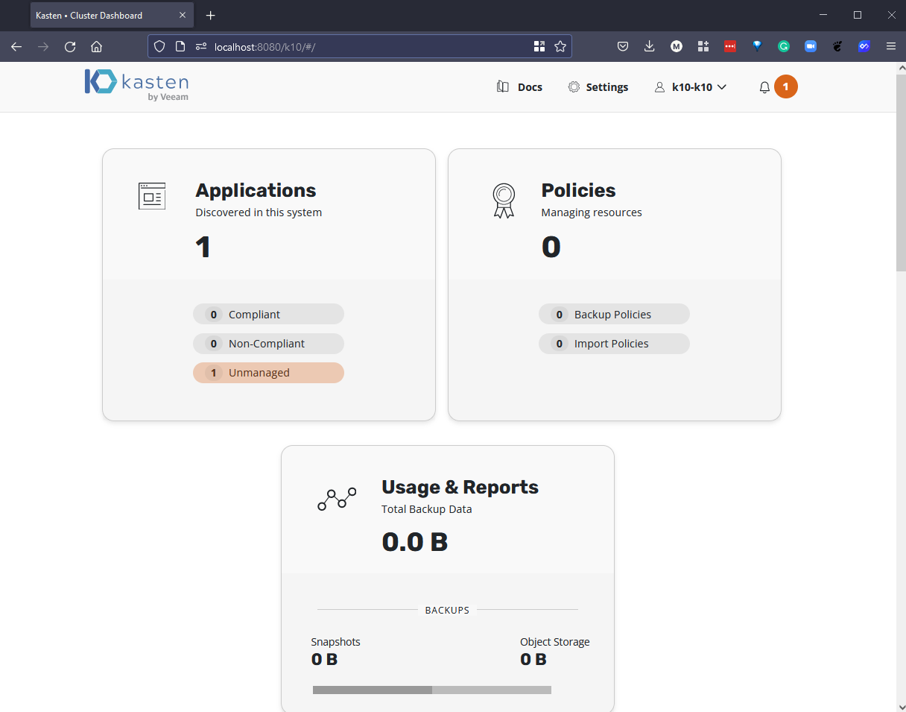
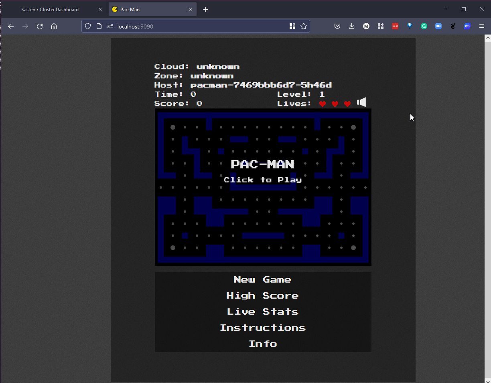
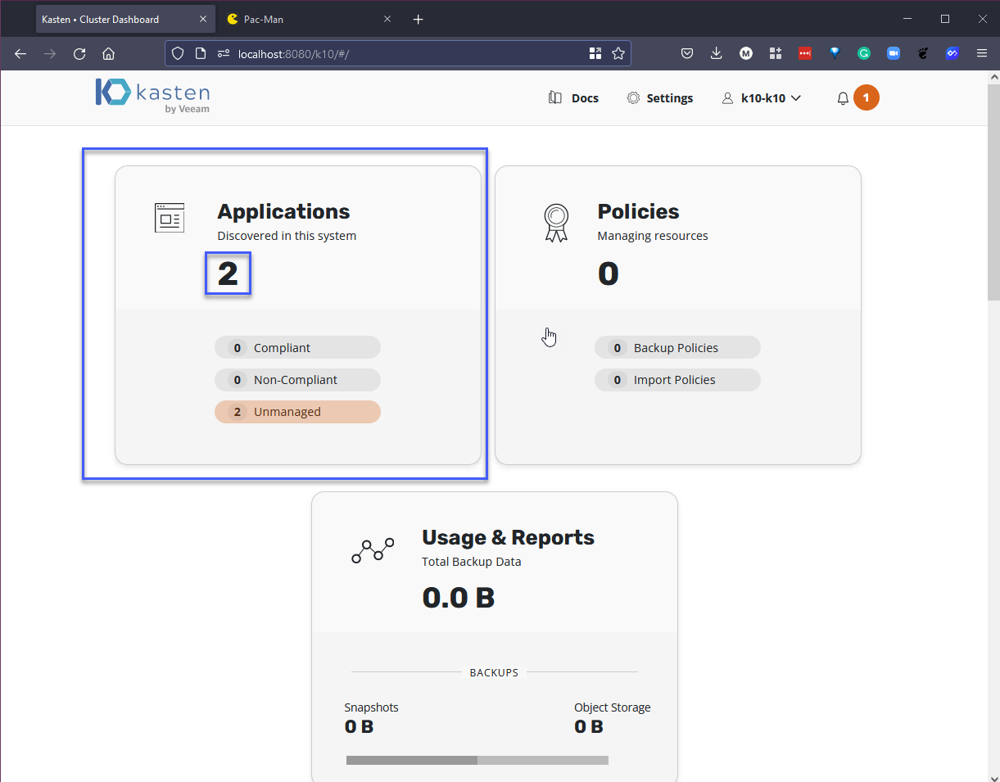
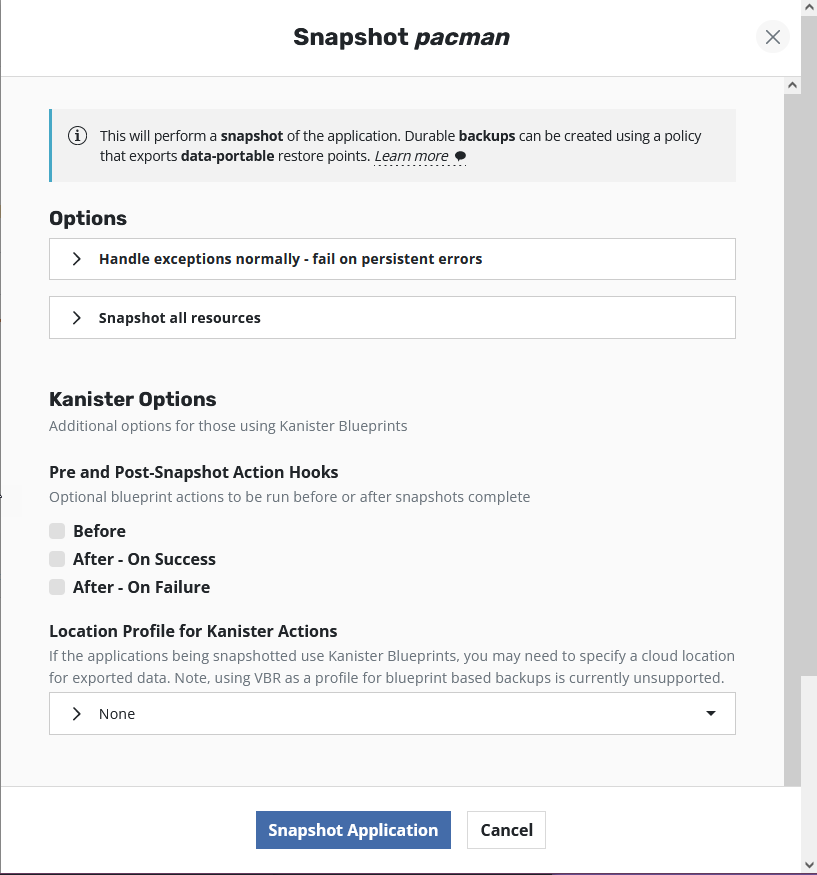
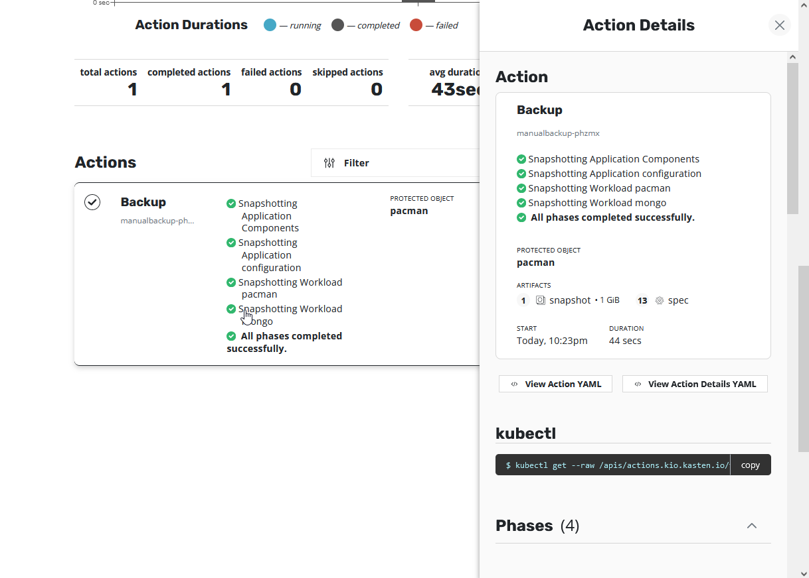
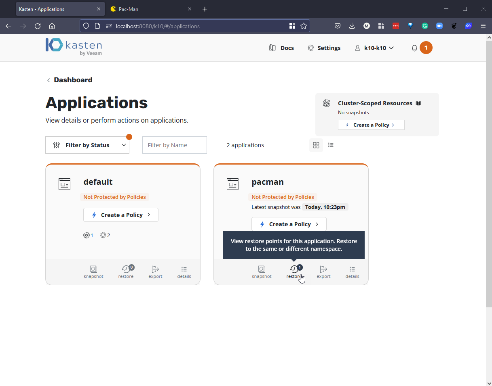
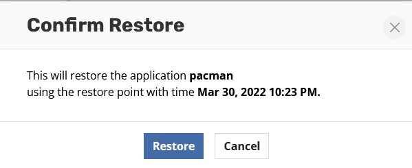

## Thực hành Sao lưu & Khôi phục

Trong bài viết trước, chúng ta đã nhắc đến [Kopia](https://kopia.io/), một công cụ sao lưu mã nguồn mở mà chúng ta đã sử dụng để sao lưu một số dữ liệu quan trọng vào một thiết bị NAS cục bộ và lưu trữ đối tượng dựa trên đám mây.

Trong phần này, tôi muốn đi sâu vào thế giới sao lưu Kubernetes. Đây là một nền tảng mà chúng ta đã đề cập đến trong [Bức tranh toàn cảnh: Kubernetes](day49.md) trước đó.

Chúng ta sẽ tiếp tục sử dụng minikube cluster của mình nhưng lần này chúng ta sẽ tận dụng một số addon có sẵn.

### Thiết lập Kubernetes clust

Để thiết lập minikube cluster, chúng ta sẽ thực hiện lệnh `minikube start --addons volumesnapshots,csi-hostpath-driver --apiserver-port=6443 --container-runtime=containerd -p 90daysofdevops --kubernetes-version=1.21.2`. Bạn sẽ nhận thấy rằng chúng ta đang sử dụng `volumesnapshots` và `csi-hostpath-driver` vì chúng ta sẽ tận dụng đầy đủ chúng khi chúng ta thực hiện sao lưu.

Tại thời điểm này, tôi biết rằng chúng ta chưa triển khai Kasten K10 nhưng chúng ta muốn thực hiện lệnh sau khi cụm của bạn đã sẵn sàng, chúng ta muốn chú thích volumesnapshotclass để Kasten K10 có thể sử dụng nó.

```Shell
kubectl annotate volumesnapshotclass csi-hostpath-snapclass \
    k10.kasten.io/is-snapshot-class=true
```

Chúng ta cũng sẽ thay đổi storageclass mặc định từ storageclass tiêu chuẩn mặc định sang storageclass csi-hostpath bằng cách sử dụng các lệnh sau.

```Shell
kubectl patch storageclass csi-hostpath-sc -p '{"metadata": {"annotations":{"storageclass.kubernetes.io/is-default-class":"true"}}}'

kubectl patch storageclass standard -p '{"metadata": {"annotations":{"storageclass.kubernetes.io/is-default-class":"false"}}}'
```


### Triển khai Kasten K10

Thêm repository Helm của Kasten

`helm repo add kasten https://charts.kasten.io/`

Chúng ta có thể sử dụng `arkade kasten install k10` ở đây nhưng cho demo này, chúng ta sẽ thực hiện các bước sau. [Chi tiết thêm]((https://blog.kasten.io/kasten-k10-goes-to-the-arkade))

Tạo namespace và triển khai K10, điều này sẽ mất khoảng 5 phút

`helm install k10 kasten/k10 --namespace=kasten-io --set auth.tokenAuth.enabled=true --set injectKanisterSidecar.enabled=true --set-string injectKanisterSidecar.namespaceSelector.matchLabels.k10/injectKanisterSidecar=true --create-namespace`


Bạn có thể xem các pod xuất hiện bằng cách chạy lệnh sau.

`kubectl get pods -n kasten-io -w`


Chuyển tiếp cổng để truy cập bảng điều khiển K10, mở một terminal mới để chạy lệnh dưới đây

`kubectl --namespace kasten-io port-forward service/gateway 8080:8000`

Bảng điều khiển Kasten sẽ khả dụng tại `http://127.0.0.1:8080/k10/#/`


Để xác thực với bảng điều khiển, chúng ta cần token mà chúng ta có thể lấy bằng các lệnh sau.

```Shell
TOKEN_NAME=$(kubectl get secret --namespace kasten-io|grep k10-k10-token | cut -d " " -f 1)
TOKEN=$(kubectl get secret --namespace kasten-io $TOKEN_NAME -o jsonpath="{.data.token}" | base64 --decode)

echo "Token value: "
echo $TOKEN
```


Bây giờ chúng ta lấy token này và nhập vào trình duyệt, sau đó bạn sẽ được yêu cầu nhập email và tên công ty.


Sau đó, chúng ta sẽ truy cập được vào bảng điều khiển Kasten K10.



### Triển khai ứng dụng stateful

Sử dụng ứng dụng stateful mà chúng ta đã sử dụng trong phần Kubernetes.


Bạn có thể tìm thấy tệp cấu hình YAML cho ứng dụng này tại đây -> [pacman-stateful-demo.yaml](../../Days/Kubernetes/pacman-stateful-demo.yaml)


Chúng ta có thể sử dụng kubectl get all -n pacman để kiểm tra các pod của chúng ta đang lên.


Trong một terminal mới, chúng ta có thể chuyển tiếp cổng cho giao diện Pacman. `kubectl port-forward svc/pacman 9090:80 -n pacman`

Mở một tab khác trên trình duyệt của bạn với http://localhost:9090/



Dành thời gian để ghi lại một số high score trong cơ sở dữ liệu MongoDB ở backend.


### Bảo vệ bảng điểm high score

Bây giờ chúng ta có một số dữ liệu quan trọng trong cơ sở dữ liệu của mình và chúng ta không muốn mất nó. Chúng ta có thể sử dụng Kasten K10 để bảo vệ toàn bộ ứng dụng này.

Nếu chúng ta quay lại tab bảng điều khiển Kasten K10, bạn sẽ thấy rằng số lượng ứng dụng của chúng ta đã tăng từ 1 lên 2 với việc thêm ứng dụng Pacman vào cụm Kubernetes của chúng ta.



Nếu bạn nhấp vào thẻ Applications, bạn sẽ thấy các ứng dụng được tự động phát hiện trong cụm của chúng ta.


Với Kasten K10, chúng ta có thể tận dụng các snapshot dựa trên lưu trữ cũng như xuất các bản sao của chúng ta ra các tùy chọn lưu trữ đối tượng.

Cho demo này, chúng ta sẽ tạo một snapshot lưu trữ thủ công trong cụm của chúng ta và sau đó chúng ta có thể thêm một số dữ liệu sai vào bảng high score để mô phỏng một lỗi ngẫu nhiên đã xảy ra hay không?

Trước tiên, chúng ta có thể sử dụng tùy chọn snapshot thủ công dưới đây.


Cho demo này, tôi sẽ để mọi thứ mặc định



Trở lại bảng điều khiển, bạn sẽ nhận được báo cáo trạng thái về công việc khi nó đang chạy và khi hoàn thành, nó sẽ trông giống như thành công như thế này.



### Kịch bản sự cố

Chúng ta bây giờ có thể thực hiện thay đổi nguy hiểm đó đối với dữ liệu quan trọng của chúng ta bằng cách đơn giản thêm vào một thay đổi xấu được dự kién vào ứng dụng của chúng ta.

Như bạn có thể thấy dưới đây, chúng ta có hai inputs mà có lẽ chúng ta không muốn trong cơ sở dữ liệu quan trọng của mình.


### Khôi phục dữ liệu

Đây là một demo đơn giản và theo một cách nào đó không thực tế mặc dù bạn đã thấy dễ dàng như thế nào để xóa cơ sở dữ liệu?

Bây giờ chúng ta muốn làm cho danh sách high score trông gọn hơn và quay về lúc trước khi những sai lầm xảy ra.

Quay lại thẻ Applications và trên tab Pacman, chúng ta hiện có 1 điểm khôi phục mà chúng ta có thể sử dụng để khôi phục.



Khi bạn chọn khôi phục, bạn có thể thấy tất cả các snapshot và xuất liên quan đến ứng dụng đó.


Chọn khôi phục và một cửa sổ bên sẽ xuất hiện, chúng ta sẽ giữ các cài đặt mặc định và nhấn khôi phục.


Xác nhận rằng bạn muốn thực hiện điều này.



Sau đó, bạn có thể quay lại bảng điều khiển và xem tiến trình của khôi phục. Bạn sẽ thấy điều gì đó như thế này.


Nhưng quan trọng hơn, danh sách high score của chúng ta trong ứng dụng quan trọng của chúng ta trông như thế nào. Bạn sẽ phải bắt đầu lại chuyển tiếp cổng đến Pacman như chúng ta đã đề cập trước đó.


Một demo siêu đơn giản và chỉ thực sự ở lớp bề mặt của những gì Kasten K10 có thể đạt được khi nói đến sao lưu. Tôi sẽ tạo một số nội dung video chi tiết hơn về một số lĩnh vực này trong tương lai. Chúng ta cũng sẽ sử dụng Kasten K10 để làm nổi bật một số lĩnh vực nổi bật khác về Quản lý Dữ liệu khi nói đến Khôi phục Thảm họa và khả năng di chuyển dữ liệu của bạn.

Tiếp theo, chúng ta sẽ xem xét sự nhất quán của Ứng dụng.

## Tài liệu tham khảo

- [Kubernetes Backup and Restore made easy!](https://www.youtube.com/watch?v=01qcYSck1c4&t=217s)
- [Kubernetes Backups, Upgrades, Migrations - with Velero](https://www.youtube.com/watch?v=zybLTQER0yY)
- [7 Database Paradigms](https://www.youtube.com/watch?v=W2Z7fbCLSTw&t=520s)
- [Disaster Recovery vs. Backup: What's the difference?](https://www.youtube.com/watch?v=07EHsPuKXc0)
- [Veeam Portability & Cloud Mobility](https://www.youtube.com/watch?v=hDBlTdzE6Us&t=3s)

Hẹn gặp lại vào [ngày 88](day88.md)
