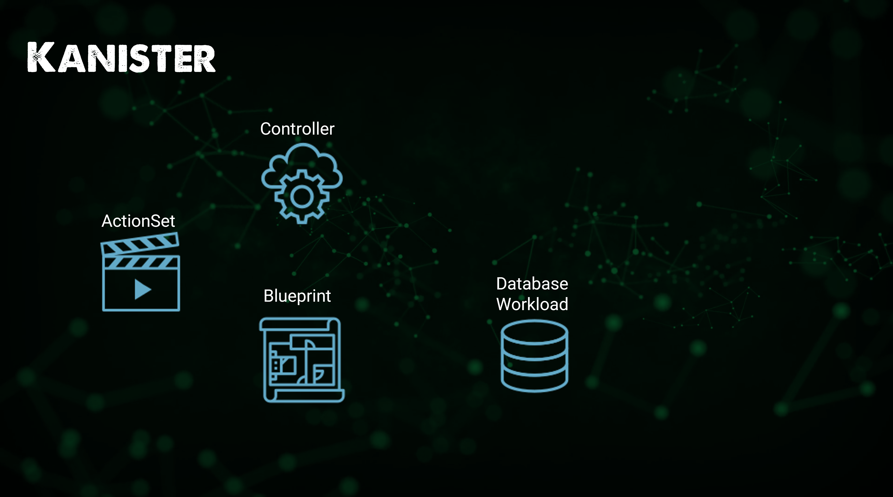
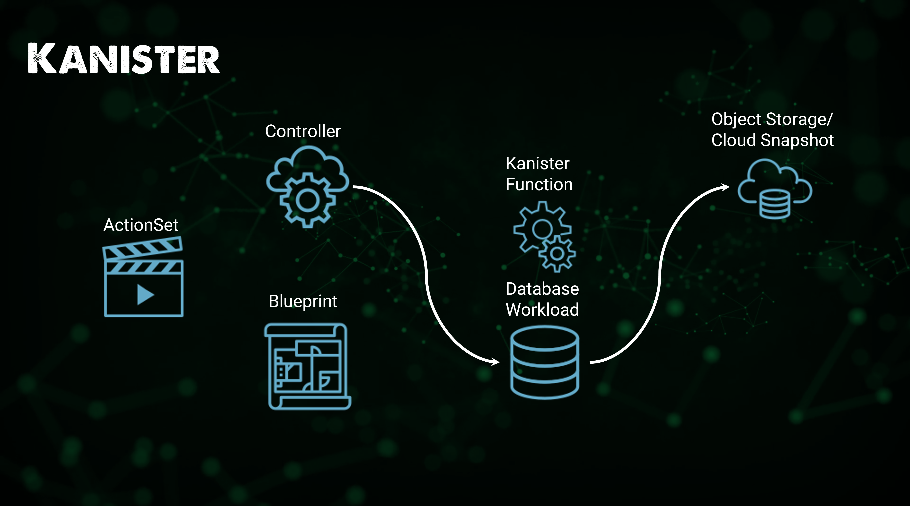
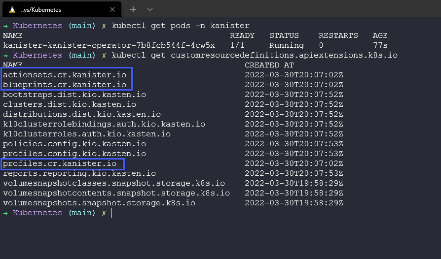
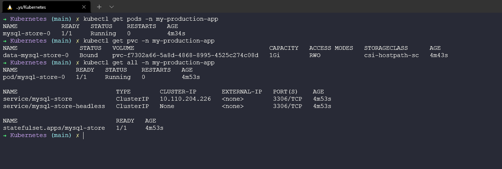
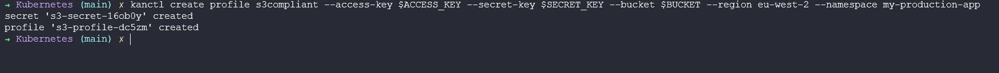
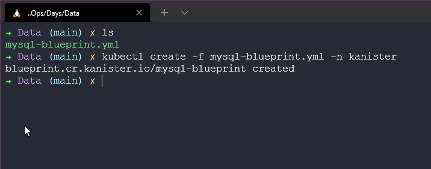

## Sao lưu theo hướng tập trung vào ứng dụng

Chúng ta đã dành thời gian nói về các dịch vụ dữ liệu hoặc các ứng dụng đòi hỏi nhiều dữ liệu như cơ sở dữ liệu vào [Ngày 85](day85.md). Đối với các dịch vụ dữ liệu này, chúng ta phải xem xét cách quản lý tính nhất quán, đặc biệt khi nói đến tính nhất quán của ứng dụng.

Trong bài viết này, chúng ta sẽ đi sâu vào yêu cầu bảo vệ dữ liệu ứng dụng một cách nhất quán.

Để làm điều này, công cụ chúng ta chọn sẽ là [Kanister](https://kanister.io/)


### Giới thiệu về Kanister

Kanister là một dự án mã nguồn mở của Kasten, cho phép chúng ta quản lý (sao lưu và khôi phục) dữ liệu ứng dụng trên Kubernetes. Bạn có thể triển khai Kanister như một ứng dụng helm vào cụm Kubernetes của mình.

Kanister sử dụng các tài nguyên tùy chỉnh của Kubernetes, các tài nguyên tùy chỉnh chính được cài đặt khi Kanister được triển khai là

- `Profile` - là một vị trí mục tiêu để lưu trữ các bản sao lưu và khôi phục từ đó. Thông thường nhất, đây sẽ là lưu trữ đối tượng.
- `Blueprint` - các bước cần thực hiện để sao lưu và khôi phục cơ sở dữ liệu nên được duy trì trong Blueprint.
- `ActionSet` - là hành động để chuyển bản sao lưu của chúng ta đến `Profile` của chúng ta cũng như các hành động khôi phục.

### Hướng dẫn Thực hiện

Trước khi thực hành, chúng ta nên xem qua quy trình mà Kanister thực hiện để bảo vệ dữ liệu ứng dụng. Đầu tiên, controller được triển khai bằng helm vào cụm Kubernetes, Kanister sống trong namespace của nó. Chúng ta lấy Blueprint của mình, có nhiều blueprint hỗ trợ cộng đồng có sẵn, chúng ta sẽ trình bày chi tiết hơn về điều này ngay sau đây. Sau đó, chúng ta có workload cơ sở dữ liệu của mình.


Chúng ta sau đó tạo ActionSet của mình.



ActionSet cho phép chúng ta chạy các hành động được định nghĩa trong blueprint với dịch vụ dữ liệu cụ thể.


ActionSet lần lượt sử dụng các chức năng của Kanister (KubeExec, KubeTask, Resource Lifecycle) và đẩy bản sao lưu của chúng ta đến kho lưu trữ mục tiêu của chúng ta (Profile).



Nếu hành động đó hoàn thành/thất bại, trạng thái tương ứng được cập nhật trong ActionSet.


### Triển khai Kanister

Một lần nữa, chúng ta sẽ sử dụng cụm minikube để thực hiện sao lưu ứng dụng này. Nếu bạn vẫn chạy nó từ phiên trước, chúng ta có thể tiếp tục sử dụng.

Tại thời điểm viết bài này, chúng ta đang ở image version `0.75.0`, với lệnh helm sau, chúng ta sẽ cài đặt kanister vào cụm Kubernetes của mình.

`helm install kanister --namespace kanister kanister/kanister-operator --set image.tag=0.75.0 --create-namespace`


Chúng ta có thể sử dụng `kubectl get pods -n kanister` để đảm bảo pod đang chạy và sau đó chúng ta cũng có thể kiểm tra các định nghĩa tài nguyên tùy chỉnh của chúng ta hiện có sẵn (Nếu bạn chỉ cài đặt Kanister thì bạn sẽ thấy 3 mục được đánh dấu)



### Triển khai một Cơ sở dữ liệu

Triển khai MySQL qua helm:

```Shell
APP_NAME=my-production-app
kubectl create ns ${APP_NAME}
helm repo add bitnami https://charts.bitnami.com/bitnami
helm install mysql-store bitnami/mysql --set primary.persistence.size=1Gi,volumePermissions.enabled=true --namespace=${APP_NAME}
kubectl get pods -n ${APP_NAME} -w
```



Nạp dữ liệu ban đầu vào cơ sở dữ liệu MySQL, chạy lệnh sau:

```Shell
MYSQL_ROOT_PASSWORD=$(kubectl get secret --namespace ${APP_NAME} mysql-store -o jsonpath="{.data.mysql-root-password}" | base64 --decode)
MYSQL_HOST=mysql-store.${APP_NAME}.svc.cluster.local
MYSQL_EXEC="mysql -h ${MYSQL_HOST} -u root --password=${MYSQL_ROOT_PASSWORD} -DmyImportantData -t"
echo MYSQL_ROOT_PASSWORD=${MYSQL_ROOT_PASSWORD}
```
### Tạo MySQL CLIENT

Chúng ta sẽ chạy một container image như một client
```Shell
APP_NAME=my-production-app
kubectl run mysql-client --rm --env APP_NS=${APP_NAME} --env MYSQL_EXEC="${MYSQL_EXEC}" --env MYSQL_ROOT_PASSWORD=${MYSQL_ROOT_PASSWORD} --env MYSQL_HOST=${MYSQL_HOST} --namespace ${APP_NAME} --tty -i --restart='Never' --image  docker.io/bitnami/mysql:latest --command -- bash
```

```Shell
Note: nếu bạn đã có một pod client MySQL đang chạy, hãy xóa với lệnh

kubectl delete pod -n ${APP_NAME} mysql-client
```

### Thêm Dữ liệu vào MySQL
```Shell
echo "create database myImportantData;" | mysql -h ${MYSQL_HOST} -u root --password=${MYSQL_ROOT_PASSWORD}
MYSQL_EXEC="mysql -h ${MYSQL_HOST} -u root --password=${MYSQL_ROOT_PASSWORD} -DmyImportantData -t"
echo "drop table Accounts" | ${MYSQL_EXEC}
echo "create table if not exists Accounts(name text, balance integer); insert into Accounts values('nick', 0);" |  ${MYSQL_EXEC}
echo "insert into Accounts values('albert', 112);" | ${MYSQL_EXEC}
echo "insert into Accounts values('alfred', 358);" | ${MYSQL_EXEC}
echo "insert into Accounts values('beatrice', 1321);" | ${MYSQL_EXEC}
echo "insert into Accounts values('bartholomew', 34);" | ${MYSQL_EXEC}
echo "insert into Accounts values('edward', 5589);" | ${MYSQL_EXEC}
echo "insert into Accounts values('edwin', 144);" | ${MYSQL_EXEC}
echo "insert into Accounts values('edwina', 233);" | ${MYSQL_EXEC}
echo "insert into Accounts values('rastapopoulos', 377);" | ${MYSQL_EXEC}
echo "select * from Accounts;" |  ${MYSQL_EXEC}
exit
```

Bạn sẽ có thể thấy một số dữ liệu như hình dưới đây.


### Tạo Kanister Profile

Kanister cung cấp một CLI, `kanctl` và một tiện ích khác `kando` được sử dụng để tương tác với nhà cung cấp lưu trữ đối tượng của bạn từ blueprint và cả hai tiện ích này.

[Tải xuống CLI](https://docs.kanister.io/tooling.html#tooling)

Tôi đã tạo một AWS S3 bucket mà chúng ta sẽ sử dụng làm profile target và restore location. Tôi sẽ sử dụng các biến môi trường để tôi có thể vẫn hiển thị cho bạn các lệnh tôi đang chạy với `kanctl` để tạo kanister profile.

`kanctl create profile s3compliant --access-key $ACCESS_KEY --secret-key $SECRET_KEY --bucket $BUCKET --region eu-west-2 --namespace my-production-app`




### Tạo Blueprint

Đừng lo lắng bạn không cần phải tạo blueprint của riêng mình từ đầu trừ khi dịch vụ dữ liệu của bạn không được liệt kê ở trong [Kanister Examples](https://github.com/kanisterio/kanister/tree/master/examples) nhưng bằng mọi cách, đóng góp cộng đồng là cách dự án này nâng cao nhận thức.

Blueprint mà chúng ta sẽ sử dụng là dưới đây.

```Shell
apiVersion: cr.kanister.io/v1alpha1
kind: Blueprint
metadata:
  name: mysql-blueprint
actions:
  backup:
    outputArtifacts:
      mysqlCloudDump:
        keyValue:
          s3path: "{{ .Phases.dumpToObjectStore.Output.s3path }}"
    phases:
    - func: KubeTask
      name: dumpToObjectStore
      objects:
        mysqlSecret:
          kind: Secret
          name: '{{ index .Object.metadata.labels "app.kubernetes.io/instance" }}'
          namespace: '{{ .StatefulSet.Namespace }}'
      args:
        image: ghcr.io/kanisterio/mysql-sidecar:0.75.0
        namespace: "{{ .StatefulSet.Namespace }}"
        command:
        - bash
        - -o
        - errexit
        - -o
        - pipefail
        - -c
        - |
          s3_path="/mysql-backups/{{ .StatefulSet.Namespace }}/{{ index .Object.metadata.labels "app.kubernetes.io/instance" }}/{{ toDate "2006-01-02T15:04:05.999999999Z07:00" .Time  | date "2006-01-02T15-04-05" }}/dump.sql.gz"
          root_password="{{ index .Phases.dumpToObjectStore.Secrets.mysqlSecret.Data "mysql-root-password" | toString }}"
          mysqldump --column-statistics=0 -u root --password=${root_password} -h {{ index .Object.metadata.labels "app.kubernetes.io/instance" }} --single-transaction --all-databases | gzip - | kando location push --profile '{{ toJson .Profile }}' --path ${s3_path} -
          kando output s3path ${s3_path}
  restore:
    inputArtifactNames:
    - mysqlCloudDump
    phases:
    - func: KubeTask
      name: restoreFromBlobStore
      objects:
        mysqlSecret:
          kind: Secret
          name: '{{ index .Object.metadata.labels "app.kubernetes.io/instance" }}'
          namespace: '{{ .StatefulSet.Namespace }}'
      args:
        image: ghcr.io/kanisterio/mysql-sidecar:0.75.0
        namespace: "{{ .StatefulSet.Namespace }}"
        command:
        - bash
        - -o
        - errexit
        - -o
        - pipefail
        - -c
        - |
          s3_path="{{ .ArtifactsIn.mysqlCloudDump.KeyValue.s3path }}"
          root_password="{{ index .Phases.restoreFromBlobStore.Secrets.mysqlSecret.Data "mysql-root-password" | toString }}"
          kando location pull --profile '{{ toJson .Profile }}' --path ${s3_path} - | gunzip | mysql -u root --password=${root_password} -h {{ index .Object.metadata.labels "app.kubernetes.io/instance" }}
  delete:
    inputArtifactNames:
    - mysqlCloudDump
    phases:
    - func: KubeTask
      name: deleteFromBlobStore
      args:
        image: ghcr.io/kanisterio/mysql-sidecar:0.75.0
        namespace: "{{ .Namespace.Name }}"
        command:
        - bash
        - -o
        - errexit
        - -o
        - pipefail
        - -c
        - |
          s3_path="{{ .ArtifactsIn.mysqlCloudDump.KeyValue.s3path }}"
          kando location delete --profile '{{ toJson .Profile }}' --path ${s3_path}
```

Để thêm điều này, chúng ta sẽ sử dụng lệnh `kubectl create -f mysql-blueprint.yml -n kanister`



### Tạo ActionSet và Bảo vệ ứng dụng

Chúng ta sẽ bây giờ thực hiện sao lưu dữ liệu MySQL bằng cách tạo một ActionSet định nghĩa sao lưu cho ứng dụng này. Tạo một ActionSet trong cùng namespace với controller. 

`kubectl get profiles.cr.kanister.io -n my-production-app` Lệnh này sẽ hiển thị profile mà chúng ta đã tạo trước đó, chúng ta có thể có nhiều profile được cấu hình ở đây vì vậy chúng ta có thể muốn sử dụng các profile cụ thể cho các ActionSet khác nhau

Chúng ta sau đó sẽ tạo ActionSet của mình với lệnh sau sử dụng `kanctl`

`kanctl create actionset --action backup --namespace kanister --blueprint mysql-blueprint --statefulset my-production-app/mysql-store --profile my-production-app/s3-profile-dc5zm --secrets mysql=my-production-app/mysql-store`

Bạn có thể thấy từ lệnh trên chúng ta đang định nghĩa blueprint mà chúng ta đã thêm vào namespace, statefulset trong namespace `my-production-app` của chúng ta và cả các secrét để truy cập vào ứng dụng MySQL.


Kiểm tra trạng thái của ActionSet bằng cách lấy tên ActionSet và sử dụng lệnh này `kubectl --namespace kanister describe actionset backup-qpnqv`

Cuối cùng, chúng ta có thể đi và xác nhận rằng hiện đang có dữ liệu trong bucket AWS S3 của mình.


### Khôi phục

Chúng ta cần gây ra một số thiệt hại trước khi có thể khôi phục bất cứ thứ gì, chúng ta có thể làm điều này bằng cách xóa bảng của mình, có thể đó là một tai nạn, có thể không phải.

Kết nối với pod MySQL của chúng ta.

```Shell
APP_NAME=my-production-app
kubectl run mysql-client --rm --env APP_NS=${APP_NAME} --env MYSQL_EXEC="${MYSQL_EXEC}" --env MYSQL_ROOT_PASSWORD=${MYSQL_ROOT_PASSWORD} --env MYSQL_HOST=${MYSQL_HOST} --namespace ${APP_NAME} --tty -i --restart='Never' --image  docker.io/bitnami/mysql:latest --command -- bash
```

Bạn có thể thấy rằng cơ sở dữ liệu importantdata của chúng ta ở đó với `echo "SHOW DATABASES;" | ${MYSQL_EXEC}`

Sau đó để xóa chúng ta chạy `echo "DROP DATABASE myImportantData;" | ${MYSQL_EXEC}`

Và xác nhận rằng nó đã biến mất với một vài lần thử để hiển thị cơ sở dữ liệu của chúng ta.


Chúng ta bây giờ có thể sử dụng Kanister để lấy lại dữ liệu quan trọng của chúng ta bằng cách sử dụng `kubectl get actionset -n kanister` để tìm tên ActionSet mà chúng ta đã lấy trước đó. Sau đó, chúng ta sẽ tạo một ActionSet khôi phục để khôi phục dữ liệu của mình bằng cách sử dụng `kanctl create actionset -n kanister --action restore --from "backup-qpnqv"`


Chúng ta có thể xác nhận dữ liệu của mình đã quay lại bằng cách sử dụng lệnh dưới đây để kết nối với cơ sở dữ liệu của mình.

```Shell
APP_NAME=my-production-app
kubectl run mysql-client --rm --env APP_NS=${APP_NAME} --env MYSQL_EXEC="${MYSQL_EXEC}" --env MYSQL_ROOT_PASSWORD=${MYSQL_ROOT_PASSWORD} --env MYSQL_HOST=${MYSQL_HOST} --namespace ${APP_NAME} --tty -i --restart='Never' --image  docker.io/bitnami/mysql:latest --command -- bash
```

Bây giờ chúng ta đang ở trong MySQL Client, chúng ta có thể thực hiện lệnh `echo "SHOW DATABASES;" | ${MYSQL_EXEC}` và chúng ta có thể thấy cơ sở dữ liệu đã quay lại. Chúng ta cũng có thể thực hiện lệnh `echo "select * from Accounts;" | ${MYSQL_EXEC}` để kiểm tra nội dung của cơ sở dữ liệu và dữ liệu quan trọng của chúng ta đã được khôi phục.


Trong bài viết tiếp theo, chúng ta sẽ xem xét Khôi phục Thảm họa trong Kubernetes.

## Tài liệu tham khảo

- [Kanister Overview - An extensible open-source framework for app-lvl data management on Kubernetes](https://www.youtube.com/watch?v=wFD42Zpbfts)
- [Application Level Data Operations on Kubernetes](https://community.cncf.io/events/details/cncf-cncf-online-programs-presents-cncf-live-webinar-kanister-application-level-data-operations-on-kubernetes/)
- [Kubernetes Backup and Restore made easy!](https://www.youtube.com/watch?v=01qcYSck1c4&t=217s)
- [Kubernetes Backups, Upgrades, Migrations - with Velero](https://www.youtube.com/watch?v=zybLTQER0yY)
- [7 Database Paradigms](https://www.youtube.com/watch?v=W2Z7fbCLSTw&t=520s)
- [Disaster Recovery vs. Backup: What's the difference?](https://www.youtube.com/watch?v=07EHsPuKXc0)
- [Veeam Portability & Cloud Mobility](https://www.youtube.com/watch?v=hDBlTdzE6Us&t=3s)

Hẹn gặp lại vào [ngày 89](day89.md)
