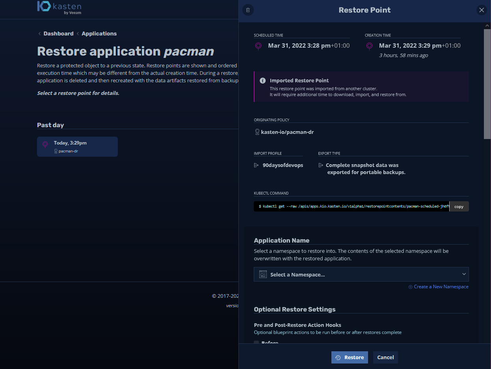
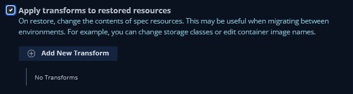
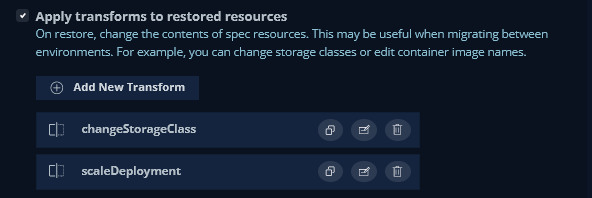
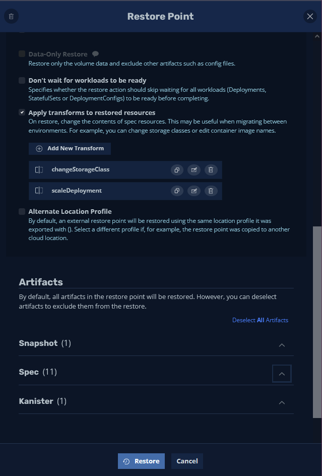
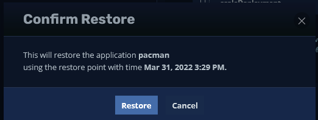
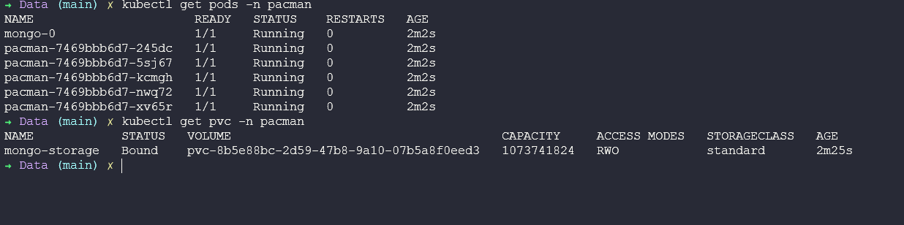

## Tính di động của Dữ liệu & Ứng dụng

Ngày 90 của Thử thách #90DaysOfDevOps! Trong bài viết cuối này, tôi sẽ trình bày về tính di động của dữ liệu và ứng dụng. Tôi sẽ tập trung cụ thể vào Kubernetes nhưng yêu cầu trên đa nền tảng ngày càng tăng và gặp nhiều trong thực tế.

Trường hợp là "Tôi muốn di chuyển khối lượng công việc, ứng dụng và dữ liệu của mình từ một vị trí đến vị trí khác" vì nhiều lý do khác nhau, có thể là chi phí, rủi ro hoặc để cung cấp dịch vụ tốt hơn cho doanh nghiệp.

Trong bài viết này, chúng ta sẽ di chuyển một workload trên Kubernetes từ một cụm đến một cụm khác, nhưng trong quá trình đó, chúng ta sẽ thay đổi cách ứng dụng hoạt động ở vị trí đích.

Nó sử dụng nhiều đặc điểm mà chúng ta đã thảo luận trong [Khôi phục Thảm họa](day89.md)

### **Yêu cầu**

Cụm Kubernetes hiện tại của chúng ta không thể xử lý nhu cầu và chi phí của chúng ta đang tăng vọt, dẫn đến quyết định kinh doanh rằng chúng ta muốn di chuyển cụm Kubernetes sản xuất của mình đến DR site của chúng ta, nằm trên một đám mây công cộng khác sẽ cung cấp khả năng mở rộng nhưng cũng với chi phí rẻ hơn. Chúng ta cũng có thể tận dụng một số dịch vụ cloud native có sẵn.

Ứng dụng quan trọng của chúng ta (Pac-Man) có một cơ sở dữ liệu (MongoDB) và đang chạy trên lưu trữ có tốc độ chậm, chúng ta muốn di chuyển đến một tier lưu trữ mới nhanh hơn.

Giao diện Pac-Man hiện tại (NodeJS) không có tính mở rộng tốt, và chúng ta muốn tăng số lượng pod có sẵn ở chỗ mới.

### Bắt đầu

Chúng ta đã có mô tả và thực tế là chúng ta đã có các bản import trên cụm Kubernetes Khôi phục Thảm họa (DR).

Công việc đầu tiên chúng ta cần làm là xóa thao tác khôi phục mà chúng ta đã thực hiện vào Ngày 89 để kiểm tra Khôi phục Thảm họa.

Chúng ta có thể làm điều này bằng cách sử dụng lệnh `kubectl delete ns pacman` trên cụm minikube "dự phòng".

Để bắt đầu, hãy vào Bảng điều khiển Kasten K10 và chọn thẻ Applications. Từ trình đơn thả xuống chọn "Removed"

Sau đó, chúng ta sẽ nhận được danh sách các điểm khôi phục có sẵn. Chúng ta sẽ chọn điểm có sẵn vì nó chứa dữ liệu quan trọng của chúng ta. (Trong ví dụ này, chúng ta chỉ có một điểm khôi phục.)

Khi chúng ta thực hiện quy trình Khôi phục Thảm họa, chúng ta để mọi thứ mặc định. Tuy nhiên, các tùy chọn khôi phục bổ sung này có sẵn nếu bạn có quy trình Khôi phục Thảm họa yêu cầu chuyển đổi ứng dụng của bạn. Trong trường hợp này, chúng ta có yêu cầu thay đổi lưu trữ và số lượng bản sao.

Chọn tùy chọn "Apply transforms to restored resources".

May mắn thay, hai ví dụ tích hợp sẵn cho việc chuyển đổi mà chúng ta muốn thực hiện là những gì chúng ta cần cho yêu cầu của mình.

Yêu cầu đầu tiên là trên cụm chính của chúng ta, chúng ta đang sử dụng một Storage Class gọi là `csi-hostpath-sc` và trong cụm mới của chúng ta, chúng ta muốn sử dụng `standard` vì vậy chúng ta có thể thực hiện thay đổi đó ở đây.

Trông ổn, nhấn nút tạo chuyển đổi ở dưới cùng.

Yêu cầu tiếp theo là chúng ta muốn mở rộng front-end deployment của Pac-Man lên "5"

Nếu bạn đang theo dõi, bạn sẽ thấy cả hai chuyển đổi của chúng ta như bên dưới.

Bây giờ bạn có thể thấy từ hình ảnh dưới rằng chúng ta sẽ khôi phục tất cả các hiện vật được liệt kê bên dưới, nếu chúng ta muốn, chúng ta cũng có thể chi tiết về những gì chúng ta muốn khôi phục. Nhấn nút "Restore"

Một lần nữa, chúng ta sẽ được yêu cầu xác nhận các hành động.

Điều cuối cùng cần hiển thị bây giờ là nếu chúng ta quay lại terminal và kiểm tra cụm của mình, bạn có thể thấy rằng chúng ta có 5 pod cho các pod Pacman và storageclass của chúng ta bây giờ được đặt thành standard thay vì csi-hostpath-sc

Nhiều tùy chọn khác nhau có thể đạt được thông qua chuyển đổi. Điều này không chỉ bao gồm di chuyển mà còn cả các kịch bản Khôi phục Thảm họa, thử nghiệm và phát triển và nhiều hơn nữa.

### API và Tự động hóa

Tôi chưa đề cập đến khả năng tận dụng API và tự động hóa một số tác vụ này, nhưng các tùy chọn này có sẵn và trong giao diện người dùng, có một số chỉ dẫn cung cấp các bộ lệnh để tận dụng các API cho các tác vụ tự động hóa.

Điều quan trọng cần lưu ý về Kasten K10 là khi triển khai, nó được triển khai bên trong cụm Kubernetes và sau đó có thể được gọi thông qua API Kubernetes.

Và vậy là chúng ta đãkết thúc phần về Lưu trữ và Bảo vệ dữ liệu của bạn.

## Tài liệu tham khảo

- [Kubernetes Backup and Restore made easy!](https://www.youtube.com/watch?v=01qcYSck1c4&t=217s)
- [Kubernetes Backups, Upgrades, Migrations - with Velero](https://www.youtube.com/watch?v=zybLTQER0yY)
- [7 Database Paradigms](https://www.youtube.com/watch?v=W2Z7fbCLSTw&t=520s)
- [Disaster Recovery vs. Backup: What's the difference?](https://www.youtube.com/watch?v=07EHsPuKXc0)
- [Veeam Portability & Cloud Mobility](https://www.youtube.com/watch?v=hDBlTdzE6Us&t=3s)

### **Kết thúc**

Khi tôi kết thúc loạt bài viết này, tôi muốn tiếp tục có phải hồi để đảm bảo rằng thông tin luôn được cập nhật.

Tôi cũng nhận ra rằng có rất nhiều chủ đề mà tôi chưa thể đề cập hoặc không thể đi sâu vào các chủ đề của DevOps.

Điều này có nghĩa là chúng ta luôn có thể thực hiện một nỗ lực khác vào năm sau và tìm thêm 90 ngày nội dung và hướng dẫn cùng tìm hiểu.

### Tiếp theo là gì?

Đầu tiên, tôi sẽ nghỉ ngơi một thời gian ngắn. Tôi bắt đầu thử thách này vào ngày 1 tháng 1 năm 2022 và tôi đã hoàn thành vào ngày 31 tháng 3 năm 2022 lúc 19:50 BST! Đó là một chặng đường dài. Nhưng như tôi đã nói và đã nói từ lâu, nếu nội dung này giúp được một người, thì công khai quá trình học luôn đánh làm!

Tôi có một số ý tưởng về việc đưa điều này ra ngoài và hy vọng, nó có một cuộc sống ngoài một GitHub repository và chúng ta có thể xem xét việc tạo một cuốn eBook và thậm chí có thể là một cuốn sách thực tế.

Tôi cũng biết rằng chúng ta cần xem xét lại từng bài viết và đảm bảo mọi thứ đều đúng ngữ pháp trước khi thực hiện bất kỳ điều gì như thế. Nếu ai biết cách chuyển đổi markdown sang bản in hoặc eBook, thì phản hồi của bạn sẽ rất đáng trân trọng.

Như mọi khi, hãy tiếp tục gửi các issues và PR.

Cảm ơn!
@MichaelCade1

- [GitHub](https://github.com/MichaelCade)
- [Twitter](https://twitter.com/MichaelCade1)
