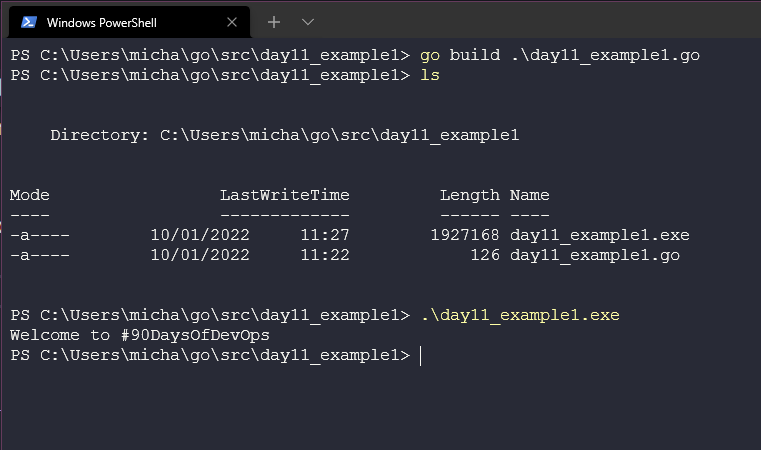
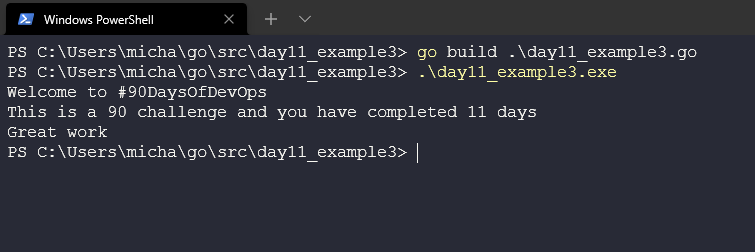

在我们开始今天的学习之前，我想向[Techworld with Nana](https://www.youtube.com/watch?v=yyUHQIec83I)和这段精彩简洁的Go基础之旅欢呼。

在[第8天](day08.md)我们设置了环境，[第9天]我们学习了Hello #90DaysOfDevOps 的代码，[第10天]我们查看了Go工作区并更深入了解了编译和运行代码。

今天我们要学习变量(Variables)，常量(Constants)和数据类型(Data Types)，并编写一个新的程序。

## Go中的变量和常量

让我们从规划这个应用程序开始，我觉得开发一个程序是告诉我们#90DaysOfDevOps挑战还有多少天的一个好办法。

这里首先要考虑的是，在构建应用程序时，我们欢迎参与者加入，并且我们会向用户反馈当前完成天数。我们将多次用到#90DaysOfDevOps。这是一个很好的例子，将#90DaysOfDevOps作为我们程序中的一个变量。

- 变量用于存储值
- 类似一个带有信息或数值的盒子
- 后续我们可以在整个程序中使用这个变量，这将在变量发生改变时提供便利，我们只需要在一处改变它的值。这意味着我们可以只改变一个变量值，将其用于社区中的其他挑战中。

为了在我们的Go程序中声明变量，我们使用一个**关键字**(keyword)来定义一个值。它将存在于我们稍后出现的`func main`代码块中。你可以在[keywords](https://go.dev/ref/spec#Keywords)中查看更多相关信息。

请记住并确保你的变量名是被定义的。如果你声明一个变量，你必须使用它，否则你会得到一个错误。这是为了避免可能出现的无效代码(那些从未被使用的代码)。对于未使用的包也是如此。

```
var challenge = "#90DaysOfDevOps"
```

通过上面的设置，我们会在后续代码片段中使用它，你可以通过下面的输出看到我们已使用这一变量。

```
package main

import "fmt"

func main() {
    var challenge = "#90DaysOfDevOps"
    fmt.Println("Welcome to", challenge "")
}
```

你可以在[这里](../../Days/Go/day11_example1.go)找到上述代码片段。

你会看到我们构建了上述示例代码，并得到下列输出。



我们知道我们的挑战期限是90天，但接下来也可能是100天，所以我们想去定义一个变量来帮助我们记录。但是在我们的程序中，我们想要把它定义为一个常量。常量和变量类似，除了它们的值不能被改变(我们会创建一个新的应用并改变这个常量，其中90的数值不会改变)。

添加`const`到我们的代码中，并添加一行来打印它。

```
package main

import "fmt"

func main() {
    var challenge = "#90DaysOfDevOps"
    const daystotal = 90

    fmt.Println("Welcome to", challenge)
    fmt.Println("This is a", daystotal, "challenge")
}
```

你可以在[这里](../../Days/Go/day11_example2.go)找到上述代码。

如果我们后续再次使用并运行`go build`，你会看到下列输出。


最后，我们将在[第十二天](day12.md)的时候添加其他的功能。现在，我们想加入另外的变量来表示我们已完成这个挑战的天数。

我在下边添加了叫`dayscomplete`的变量，代表完成天数。

```
package main

import "fmt"

func main() {
    var challenge = "#90DaysOfDevOps"
    const daystotal = 90
    var dayscomplete = 11

    fmt.Println("Welcome to", challenge, "")
    fmt.Println("This is a", daystotal, "challenge and you have completed", dayscomplete, "days")
    fmt.Println("Great work")
}
```

你可以在[这里](../../Days/Go/day11_example3.go)找到上述代码。

再次运行`go build`或者直接使用`go run`。



下面是更容易解读的代码示例。到目前为止，我们用到了`Println`，我们也可以将`Printf`配合`%v`(代表在代码后边的变量)来使用。另外使用`\n`来换行。

[这里](../../Days/Go/day11_example4.go)我用到了`%v`来使用默认格式，同时在[fmt package documentation](https://pkg.go.dev/fmt)中也谈到了其他的一些用法。

变量也可以用更简单的方式来定义。除了在定义的时候使用`var`和你可以使用的`type`，下面的代码也可以达到相同的目的，并且能做到更加简洁。这种方法只适用于变量，而不适用于常量(const)。

```
func main() {
    challenge := "#90DaysOfDevOps"
    const daystotal = 90
```

## 数据类型

在上述例子中，我们并没有定义变量的类型，这是因为Go会根据我们输入的值来得知它是什么类型，至少它对保存的值有效。然而，如果我们想让用户输入特定的数据类型，情况又会有所不同。

我们已经在代码中用到了字符串和整型。整型用来表示天数，字符串用来表示这个挑战的名称。

这里需要关注的，不同的数据类型可以做不一样的事情。例如，整型可以做乘积，而字符串不可以。

下面列举了四种类型

- **基础型(Basic type)**，数字(numbers)、字符串(strings)、布尔型(booleans)在这个类别下。
- **聚合型(Aggregate type)**，数组(array)和结构体(structs)在这个类别下。
- **引用型(Reference type)**，指针(pointer)、切片(slices)、集合(maps)、函数(functions)和通道(channels)在这个类别下。
- **接口型(Interface type)**

数据类型是编程中的一个重要概念。数据类型明确了不同变量的大小和类型。

Go是静态的，这意味着一旦变量的类型被定义了，它只能用于储存该类型的数据。

Go有三种基本的数据类型：

- **bool**: 指一个布尔值，true或false
- **Numeric**: 指整型、浮点型和复杂型
- **string**: 指一个字符值

[Golang by example](https://golangbyexample.com/all-data-types-in-golang-with-examples/)给出了很详细的数据类型的例子。

我也推荐[Techworld with Nana](https://www.youtube.com/watch?v=yyUHQIec83I&t=2023s)，里边有谈到许多Go中数据类型的详细内容。

如果我们想去定义一个变量的类型，我们可以做以下操作：

```
var TwitterHandle string 
var DaysCompleted uint
```

因为Go给定了变量一个值，我们可以直接打印出来：

```
fmt.Printf("challenge is %T, daystotal is %T, dayscomplete is %T\n", conference, daystotal, dayscomplete)
```

对于整型和浮点型还有许多不同的种类，你可以查看上面提到的链接，阅读更详细的内容。

- **int** = 整数
- **unint** = 正整数
- **floating point types** = 含有十进制分量的数

## 相关资料

- [StackOverflow 2021 Developer Survey](https://insights.stackoverflow.com/survey/2021)
- [Why we are choosing Golang to learn](https://www.youtube.com/watch?v=7pLqIIAqZD4&t=9s)
- [Jake Wright - Learn Go in 12 minutes](https://www.youtube.com/watch?v=C8LgvuEBraI&t=312s) 
- [Techworld with Nana - Golang full course - 3 hours 24 mins](https://www.youtube.com/watch?v=yyUHQIec83I) 
- [**NOT FREE** Nigel Poulton Pluralsight - Go Fundamentals - 3 hours 26 mins](https://www.pluralsight.com/courses/go-fundamentals) 
- [FreeCodeCamp -  Learn Go Programming - Golang Tutorial for Beginners](https://www.youtube.com/watch?v=YS4e4q9oBaU&t=1025s) 
- [Hitesh Choudhary - Complete playlist](https://www.youtube.com/playlist?list=PLRAV69dS1uWSR89FRQGZ6q9BR2b44Tr9N) 

接下来我们会开始添加一些用户输入的功能到程序中，我们可以查询已经完成了多少天的挑战。

[第十二天](day12.md)见。
