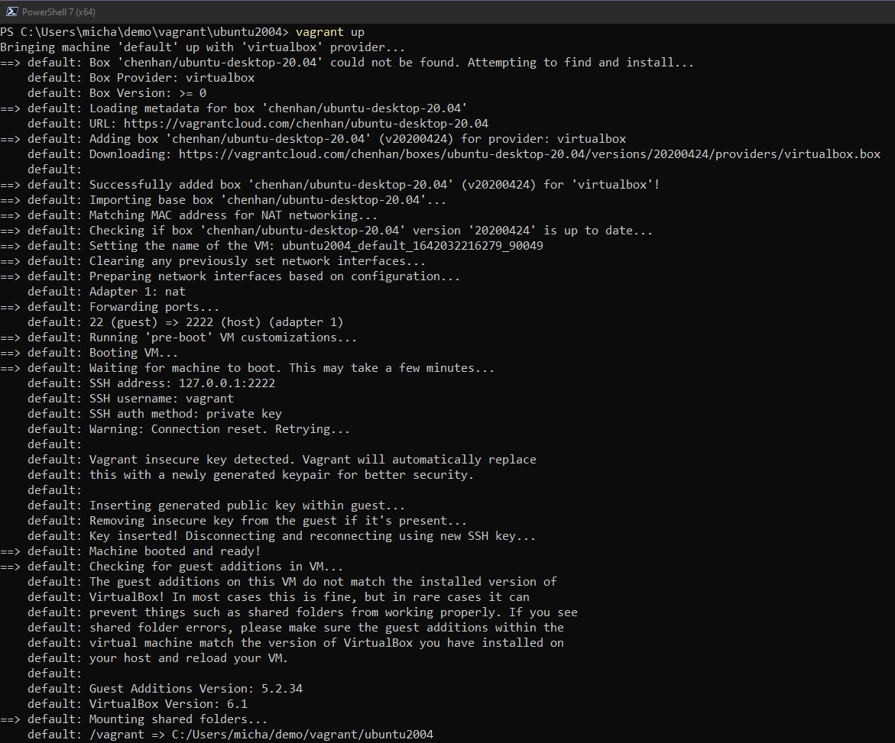

## 概览： DevOps 与 Linux
Linux和DevOps有着非常相似的文化和观点；两者都专注于定制化和可扩展性。Linux 的这两个方面对于 DevOps 来说都特别重要。

许多技术都是从Linux开始的，特别是当它们与软件开发或基础设施管理有关的时候。

此外，许多开源项目，尤其是DevOps工具，从一开始就被设计为在Linux上运行。

从DevOps或任何运营角色的角度来看，我会认为你将接触到Linux。WinOps是一种选择，但大多数时候你需要管理和部署Linux服务器。

几年来，我一直在使用Linux，但我的桌面电脑一直是macOS或Windows。当我转变成为云原生角色（Cloud Native role）时，我需要确保我的笔记本电脑完全基于Linux和我的日常驱动程序，我仍然需要Windows用于工作的应用程序，而且我的许多音频和视频设备无法在Linux上运行，我强迫自己只运行Linux桌面以更好地掌握很多东西。我们将在接下来的7天里进行讨论。

## 开始
我并不是要求你和我一样完全使用Linux，因为有更简单、破坏性更小的选择。但我会说，只使用Linux可以迫使你更快地学习如何在Linux上工作。

在这7天的大部分时间里，我将在Windows电脑上的Virtual Box中部署虚拟机。我打算部署Linux发行版的桌面版本，而实际工作中你将管理的许多Linux服务器可能是没有GUI的服务器，并且一切都是基于shell的。但是，正如我在开始时所说，我们在整个90天学习中介绍的许多工具都是从Linux开始的，我也强烈建议你潜心使用该Linux桌面以获得学习体验。

在这篇文章的其余部分，我们将专注于在我们的Virtual Box环境中启动并运行Ubuntu桌面虚拟机。现在我们可以下载[Virtual Box](https://www.virtualbox.org/)并从链接的站点获取最新的[Ubuntu ISO](https://ubuntu.com/download)，然后继续构建我们的桌面环境，但这一步对我们来说不是很DevOps，对吧？

Another good reason to use most Linux distributions is that they are free and open-source. We are also choosing Ubuntu as it is probably the most widely used distribution deployed not thinking about mobile devices and enterprise RedHat Enterprise servers. I might be wrong there but with CentOS and the history there I bet Ubuntu is high on the list and it's super simple. 
使用大多数Linux发行版的另一个理由是它们是免费和开源的。我们选择Ubuntu，因为它可能是使用最广泛的发行版，目前没有考虑移动设备和企业RedHat Enterprise服务器。我可能是错的，但对于 CentOS 和那里的历史，我敢打赌Ubuntu是比较热门的，而且它非常简单。


## 简介：HashiCorp Vagrant 
Vagrant 是一个CLI程序，用于管理虚拟机的生命周期。我们可以使用vagrant在许多不同的平台上启动虚拟机，包括vSphere，Hyper-v，Virtual Box和Docker。它也有其他提供商，我们将使用Virtual Box，所以我们可以用到它。

我们需要做的第一件事是在我们的机器上安装Vagrant，当您转到下载页面时，您将看到供你选择的所有操作系统。[HashiCorp Vagrant](https://www.vagrantup.com/downloads) 我正在使用Windows，所以我下载了二进制文件并继续在我的系统上安装它。

接下来，我们还需要安装[Virtual Box](https://www.virtualbox.org/wiki/Downloads)。同样的，它也可以被安装在许多不同的操作系统上。如果你运行的是Windows，macOS或Linux，那么可以选择它和vagrant，我们的安装环节就到此为止。

这两个安装过程都非常简单，并且周围都有很棒的社区，所以如果你有问题，请随时联系他们，我也可以尝试提供帮助。


## 我们的第一个VAGRANTFILE

VAGRANT文件描述了我们要部署的计算机类型，还定义了此计算机的配置和预配。

在保存这些和组织你的VAGRANT文件时，我倾向于将它们放在我工作区的文件夹中。您可以在下面看到这在我的系统上的外观。希望在此之后，你将与Vagrant一起玩，并体验启动不同系统的便利性，这可以帮助你不断探索Linux桌面。


让我们看一下VAGRANT文件，看看我们正在构建什么。


``` 

Vagrant.configure("2") do |config|

  config.vm.box = "chenhan/ubuntu-desktop-20.04"

  config.vm.provider :virtualbox do |v|

   v.memory  = 8096

   v.cpus    = 4

   v.customize ["modifyvm", :id, "--vram", "128mb"]

end

end

```

总的来说，这是一个非常简单的VAGRANTFILE。我们想要一个特定的“盒子”，一个盒子可能是您正在寻找的系统的公共映像或私有版本。您可以在[public catalog of Vagrant boxes](https://app.vagrantup.com/boxes/search) 中找到一系列公开的“盒子”。

下一行我们说我们想使用特定的程序，这次使用的是`VirtualBox`。我们还将机器的内存`8GB`和CPU的数量定义为`4`。根据我的经验，如果您遇到问题，您可能还需要添加以下行。这会将视频内存设置为您想要的，我会将其提升到128MB ，但这取决于您的系统。


```

v.customize ["modifyvm", :id, "--vram", ""]

```

我还在[Linux 文件夹](Linux/VAGRANTFILE) 中放置了这个特定vagrant文件的副本。


## 配置我们的 Linux 桌面

现在，我们已经准备好在工作站的终端中启动并运行我们的第一台机器。就我而言，我正在Windows机器上使用PowerShell。导航到您的项目文件夹，您将在其中找到您的VAGRANTFILE。到达那里后，您可以输入命令`vagrant up`，如果一切正常，您将看到类似以下内容。





此处要添加的另一样东西是，网络将设置为虚拟机上的网络`NAT`。在此阶段，我们不需要了解NAT，我计划在网络的章节中讨论它。这是在家庭网络上获取机器的简单按钮，它也是[Virtual Box documentation](https://www.virtualbox.org/manual/ch06.html#network_nat)上的默认网络模式。你可以在虚拟盒子文档中找到更多信息。


`vagrant up`完成后，我们现在可以使用`vagrant ssh`直接跳转到新 VM 的终端。


这是我们接下来的几天里将进行大部分探索的地方，但我还想深入了解我为您的开发人员工作站所做的一些自定义，当将其作为日常驱动程序运行时，使你的工作变得更加简单。当然，有一个很酷的非标准终端，才像是在做DevOps，对吧？


在Virtual Box中进行确认，您应该会在选择VM时看到登录提示。


如果你做到了这一步，你会问“用户名和密码是什么？”

- Username = vagrant 

- Password = vagrant 

明天我们将了解一些命令以及它们的作用，终端将成为实现一切的地方。

## 相关资料 

- [Learn the Linux Fundamentals - Part 1](https://www.youtube.com/watch?v=kPylihJRG70)
- [Linux for hackers (don't worry you don't need be a hacker!)](https://www.youtube.com/watch?v=VbEx7B_PTOE)

随着我们的学习，我会发现很多资源，就像Go资源一样，我通常会将它们保留为免费内容，以便我们都可以在这里参与和学习。

As I mentioned next up we will take a look at the commands we might be using on a daily whilst in our Linux environments. 
正如我接下来会提到的，我们将看看我们在Linux环境中可能每天使用的命令。

[第十五天](day15.md)见

