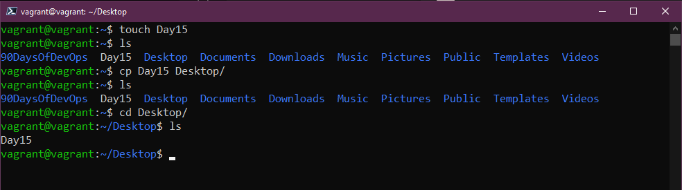
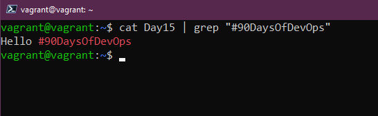
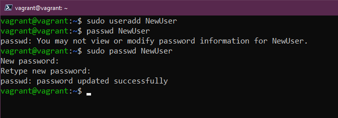

## DevOps 中的Linux命令 (通用)

我[昨天](day14.md)提到，我们将在终端上花费大量时间使用一些命令来完成工作。

我还提到，通过我们的vagran提供的VM，我们可以使用`vagrant ssh`访问我们的盒子。你需要位于我们预配它的同一目录中。

对于 SSH，你不需要用户名和密码，只有在您决定登录Virtual Box控制台时才需要用户名和密码。

这就是我们想要的地方，如图下所示：


## 命令 

我无法涵盖此处的所有命令，有一页又一页的文档涵盖了这些命令，但是如果你在终端中并且只需要了解特定命令的选项，我们有`man`将手册的页面缩短。我们可以使用它来浏览我们在这篇文章中提到的每个命令，以找出每个命令的更多选项。我们可以运行`man man`它将为你提供手册页的帮助。若要退出手册页，你应该按`q`退出。


`sudo`如果您熟悉Windows和右键单击`以管理员身份运行`，`sudo`意义与之类似。当你将此命令与你要运行的命令一起使用时，会在运行命令之前提示您输入密码，并以`root`的身份运行命令。


对于安装应用程序或服务等一次性工作，您可能需要用到`sudo command`，但是如果您有多项任务要处理并且想`sudo`一段时间怎么办？你可以再次使用`sudo su`与使用`sudo`输入`root`密码相同的方法。在像我们这样的测试虚拟机中，这没什么问题。但我发现我们很难四处走动，因为 root 长时间可能会发生不好的事情。要摆脱这个更高的位置，您只需输入`exit`。


我发现自己一直在使用`clear`，`clear`命令完全按照它所说的去做，它将清除所有先前命令的显示内容，将您的提示放在顶部并为您提供一个漂亮干净的工作区。我认为在Windows中的命令提示符（cmd prompt）是`cls`。


现在让我们看一些命令，我们可以在其中实际创建系统内容，然后在终端中可视化它们，首先，我们有`mkdir`这将允许我们在系统中创建一个文件夹。使用以下命令，我们可以在主目录中创建一个名为 Day15 `mkdir Day15`的文件夹。


有了`cd`，我们可以更改目录，因此对于我们移动到新创建的目录。我们可以使用tab用于自动完成可用的目录`cd Day15`。如果我们想回到我们开始的地方，我们可以使用`cd ..`。


`rmdir`允许我们删除目录，如果我们运行`rmdir Day15`，那么该文件夹将被删除（注意：这仅在文件夹中没有任何内容时才有效）


我敢肯定，我们都在导航到文件系统深处的目录并且不知道我们在哪里。`pwd`为我们提供了工作目录的打印输出，PWD就像密码的缩写，它代表打印工作目录。


我们知道了如何创建文件夹和目录，但如何创建文件？如果我们运行`touch Day15`，我们将使用`touch`命令创建文件。忽略`mkdir`，稍后将再次看到这个命令。


`ls`我很肯定，你会多次使用这个命令，这将列出当前目录中的所有文件和文件夹。让我们看看我们是否可以看到我们刚刚创建的文件。


我们如何在Linux系统上找到文件？`locate`将允许我们搜索我们的文件系统。如果我们使用它`locate Day15`，它将报告文件的位置。如果您知道该文件确实存在，但得到一个空白结果，则可以运行`sudo updatedb`将再次索引文件系统中的所有你的`locate`文件。如果您没有`locate`，可以使用此命令`sudo apt install mlocate`安装它


将文件从一个位置移动到另一个位置该怎么做？`mv`将允许你移动文件。示例：`mv Day15 90DaysOfDevOps`将文件移动到 90DaysOfDevOps 文件夹。


我们已经移动了文件，但是如果我们现在想将其重命名怎么办？我们可以再次使用该`mv`命令来执行此操作...是的，我们可以简单地用`mv Day15 day15`更改为大写，或者我们可以完全`mv day15 AnotherDay`更改它，现在用`ls`检查文件。


现在让我们摆脱（删除）我们的文件，甚至我们的目录（如果我们创建了一个）。`rm AnotherDay`会删除我们的文件。我们还将经常使用`rm -R`的递归方式处理文件夹或位置。我们还可能使用`rm -R -f`强制删除所有这些文件。如果你运行`rm -R -f /`添加sudo，你可以说和你的系统说再见....！


我们已经了解移动文件，但是如果我只想将文件从一个文件夹复制到另一个文件夹，与`mv`命令非常相似，但我们使用`cp`，因此我们现在可以用`cp Day15 Desktop`。



我们已经创建了文件夹和文件，但我们没有将任何内容放入我们的文件夹中，我们可以通过几种方式添加内容，但一个简单的方法是`echo`我们还可以用`echo`在我们的终端中打印出很多东西。我经常使用echo来打印出系统变量，以了解它们是否被设置。我们可以使用`echo "Hello #90DaysOfDevOps" > Day15`，这会将其添加到我们的文件中。我们还可以使用以下命令`echo "Commands are fun!" >> Day15`附加到我们的文件。


您将经常使用其中的另一个命令！`cat`是连接词（concatenate）的缩写。我们可以用它来`cat Day15`查看文件内的内容。非常适合快速读取配置文件。


如果你有一个很长的复杂配置文件，并且你希望或需要在该文件中找到快速内容而不是阅读每一行，那么`grep`就是你的朋友。我们能够使用`cat Day15 | grep "#90DaysOfDevOps"`。



如果您像我一样并且经常使用`clear`命令，那么您可能会丢失之前运行的一些命令，我们可以用来`history`找出我们之前运行过的所有`clear`命令。`history -c`将删除历史记录。

当您运行`history`并想要选择一个特定命令时，您可以使用该命令选择列表中的第三个命令`!3`。

您还可以使用`history | grep "Command"`来搜索特定内容。

在服务器上追溯已执行的命令，将日期和时间附加到历史记录文件的每个命令中可能很有用。

以下系统变量控制此行为：
```
HISTTIMEFORMAT="%d-%m-%Y %T "
```
您可以轻松地添加到bash_profile：
```
echo 'export HISTTIMEFORMAT="%d-%m-%Y %T "' >> ~/.bash_profile
```
为了将历史记录文件变大：

```
echo 'export HISTSIZE=100000' >> ~/.bash_profile
echo 'export HISTFILESIZE=10000000' >> ~/.bash_profile
```


需要更改密码？`passwd`允许我们更改密码。请注意，当你像这样添加隐藏密码时，它将不会显示在`history`。如果你的命令有`-p PASSWORD`，那么这将显示在你的`history`。


我们可能还想在系统添加新用户，我们可以用到`useradd`。我们必须使用我们的`sudo`命令添加用户，我们可以添加一个新用户`sudo useradd NewUser`。



再次创建一个组需要用到`sudo`，我们可以使用`sudo groupadd DevOps`。如果我们想将新用户添加到该组，我们可以通过运行`sudo usermod -a -G DevOps`来做到这一点。`-a`是添加，`-G`是组名。


我们如何将用户添加到`sudo`组中。这是非常罕见的情况，但要做到这一点可以使用`usermod -a -G sudo NewUser`。

### 权限 

读取、写入和执行是我们对Linux系统上所有文件和文件夹的权限。

完整列表：
- 0 = 无 `---`
- 1 = 仅执行 `--X`
- 2 = 仅写入 `-W-`
- 3 = 写入和执行 `-WX`
- 4 = 只可读 `R--`
- 5 = 可读和执行 `R-X`
- 6 = 可读和写入 `RW-`
- 7 = 可读、写入和执行 `RWX`

你还将看到`777`或`775`，这些数字表示上述列表相同的含义，但每个数字代表**用户 - 组 - 每个人**的权限。

让我们看一下我们的文件。`ls -al Day15`，你可以看到上面提到的3个组，用户和组有读写，但每个人都只有读。


我们可以通过`chmod`更改此设置。如果你在系统上创建大量二进制文件，并且你需要提供执行这些二进制文件的能力，你可能会发现自己需要这样做。`chmod 750 Day15`，现在运行`ls -al Day15`。如果你想运行整个文件夹，那么你可以使用`-R`递归地做到这一点。


如何更改文件的所有者？我们可以使用`chown`。如果我们想将Day15的所有权从用户`vagrant`更改为`NewUser`，我们可以再次用到`sudo chown NewUser Day15`，并根据实际情况使用`-R`。


当你有一个只需要特定的输出时，你会用到`awk`。比如运行`who`时，我们会得到包含信息的行，但也许我们只需要名称。我们可以运行`who | awk '{print $1}'`以获取第一列的列表。


如果你希望从标准输入中读取数据流，并生成和执行命令行。这意味着它可以接受命令的输出并将其作为另一个命令的输入，`xargs`是此一个有用的工具。例如，我想要系统上所有Linux用户帐户的列表。运行`cut -d: -f1 < /etc/passwd`并获取我们在下面看到的长列表。


如果我想压缩该列表，我可以通过`cut -d: -f1 < /etc/passwd | sort | xargs`，使用`xargs`来实现。


我也没有介绍`cut`，它允许我们从文件的每一行中删除部分内容。它可用于按字节位置、字符和字段剪切行的一部分。`cut -d " " -f 2 list.txt`命令允许我们删除我们拥有的第一个字母并仅显示我们的数字。这里有很多组合可以使用此命令，我确信我花了太多时间尝试使用此命令。而我可以手动提取数据，更快地完成这一操作。


Also to note if you type a command and you are no longer with happy with it and you want to start again just hit control + c and this will cancel that line and start you fresh. 
还要注意的是，如果你输入一个命令并且不再满意它，你想重新开始，只需按下`control + c`，这将取消该行并重新开始。

## 相关资料 

- [Learn the Linux Fundamentals - Part 1](https://www.youtube.com/watch?v=kPylihJRG70)
- [Linux for hackers (don't worry you don't need be a hacker!)](https://www.youtube.com/watch?v=VbEx7B_PTOE)

[第十六天](day16.md)见

这是一个相当长的列表，但我可以肯定地说，我在日常中使用了所有这些命令。无论是从管理Linux服务器还是在我的Linux桌面上。在Windows或macOS中，你有图像界面。但在Linux服务器中，一切都是通过终端完成的。
