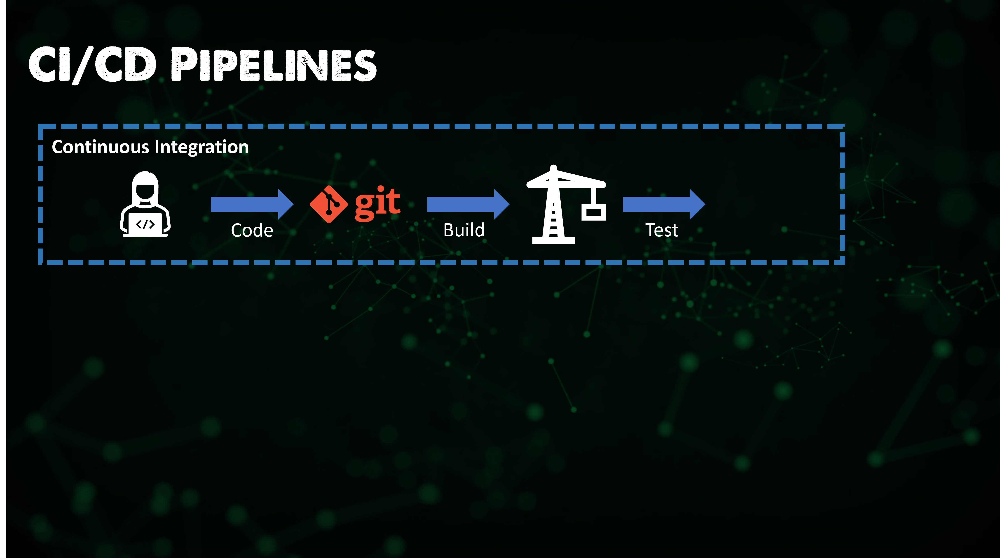
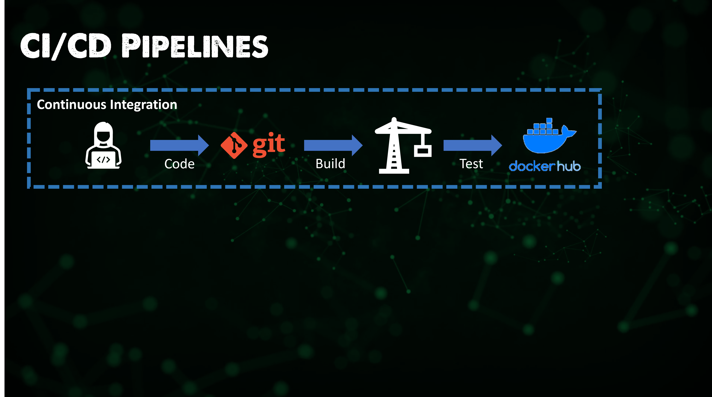

## 概览：CI/CD 管道

CI/CD（持续集成/持续部署）管道实现的是现代DevOps环境的支柱。

它通过自动化应用程序的构建、测试和部署，将开发和运营联系了起来。

我们在挑战的开头部分介绍了很多这种持续不断的“咒语”。但这里要重申：

持续集成（CI）是一种更现代的软件开发实践活动，其想法是使代码增加、更改得更频繁、更可靠。由持续集成触发的自动化构建和测试工作流步骤确保了合并到仓库中的代码变更是可靠的。

作为持续部署过程的一部分，这些代码/应用程序将快速无缝地交付。

### CI/CD的重要特点？

- 快速高效地推送软件
- 是帮助应用程序尽快推向市场的有效流程
- 持续不断地进行错误修复和新功能添加，且无需等待数月或数年进行版本发布。

开发人员能够定期进行有影响力的小变更，这意味着我们可以更快地进行修复和添加更多功能。

### 所以这意味着什么？

在[第五天](day05.md)，我们介绍了DevOps背后的许多理论。正如这里已经提到的，CI/CD管道是现代DevOps环境的支柱。

我想重申上图中的一些关键点，现在我们在学习DevOps基础知识的过程中又向前迈进了一步。

我们指的是软件开发生命周期（SDLC）。

这些步骤通常是在无限循环中的，因为这是一个一直重复的循环流程。

这个循环中的步骤是，开发人员编写**代码code**，然后将其**构建built**或全部编译在一起，对其中的bugs进行**测试tested**，接着是**部署deployed**到最终用户或客户（**操作/使用operated**）的产品中，然后我们**监控monitor**并收集反馈，最后我们围绕收集到的反馈进行**计划plan**并**重复rinse and repeat**。

### 更深入了解 CI/CD

### CI 持续集成

CI是一种开发实践活动，要求开发人员每天多次将代码集成到共享的仓库中。

当代码被编写并推送(pushed)到Github或GitLab这样的仓库时，魔法就开始了。

代码通过一个自动化构建活动进行验证，这个步骤可以使团队或项目所有者尽早发现问题。

提交的代码会被分析，并给出了一系列自动化测试，这里给出三个例子

- 单元测试，测试源代码的各个单元
- 验证测试，确保软件满足或适合预期用途
- 格式测试，检查语法和其他格式错误

这些测试是作为一个工作流被创建，每当你推送到主分支(master branch)时都会运行。所以几乎每个主要的开发团队都有某种CI/CD工作流。请记住，在开发团队中，新代码可能会在一天中的不同时间从世界各地的团队、从事各种不同项目的开发人员那里传入到测试的工作流程中。因此确保在接受代码之前每个人都在同一页面上。人们每次都要花更长的时间才能做到这一点。

一旦我们完成了测试并通过，我们就可以编译它们并将其发送到我们的仓库。例如，我正在使用Docker Hub，但这可能是任何可以用于管道的CD（持续部署）的地方。

因此，这个过程很大程度上取决于软件开发过程，我们会是正在创建我们的应用程序，添加功能，修复bugs等，然后更新我们的源代码控制和版本控制，同时进行测试。

进入下一阶段是CD，这更多的是我们通常在任何现成的软件中看到的。如果我们需要从Oracle或Microsoft等供应商那里获得软件，我们将看到一种趋势，从Docker Hub这类仓库中获取这些软件，然后使用我们的CD管道将其部署到我们的环境中。

### CD 持续部署

现在我们已经有了代码的测试版本，我们已经准备好进行广泛的部署，正如我上文所说，软件供应商将完成这一阶段，但我坚信这就是我们未来部署所需现成软件的方式。

是时候将我们的代码发布到环境中了。这将包括生产环境，但也可能包括其他环境，如暂存staging。

至少在软件部署v1的第一天，我们的下一步是需要确保将正确的代码库拉到(pull)正确的环境中。这可能是从软件仓库（DockerHub）中提取元素，也是可能从另一个代码仓库中提取额外的配置，例如应用程序的配置。在下图中，我们从DockerHub获取最新版本的软件，然后将其发布到我们的环境中，同时可能从Git仓库中获取配置。我们的CD工具正在执行此操作，并将所有内容推送到我们的环境中。

这些很可能不是同时进行的。例如，我们将使用我们的配置进入一个针对此运行的暂存环境，以确保事情是正确的，这可能是一个手动测试步骤，也可能之前实现自动化且可以将此代码部署到生产中。

然后，当应用程序的v2版本发布时，我们重复这些步骤，这一次我们确保我们的应用程序+配置被部署到暂存staging，确保一切正常，然后我们部署到生产中。

### 为什么使用CI/CD?

我觉得我们已经多次介绍了这些好处，但正是因为它将原来需要手动完成的事情进行自动化了，它可以在加入到主代码库之前发现了一些小问题。你可能可以想象，如果你把坏代码推送给你的客户，这会是多么糟糕！

这也有助于防止我们称之为技术债务（technical debt）的事情，即由于主要代码仓库是随着时间推移而不断构建的，那么有一天做的小修复在几年后会变得更加昂贵，因为现在修复的地方将彻底融入到所有的代码仓库和逻辑中。

### 工具

与其他章节一样，我们将实操一些CI/CD管道流程的工具。

我认为同样重要的是要注意，并不是所有的工具都必须有CI和CD的功能。我们将看看ArgoCD，你可能觉得它在部署软件到Kubernetes集群的CD功能方面非常出色。而像Jenkins这类工具则可以在许多不同的平台上工作。

我计划关注以下内容：
- Jenkins
- ArgoCD
- GitHub Actions

## 相关资料

- [Jenkins is the way to build, test, deploy](https://youtu.be/_MXtbjwsz3A)
- [Introduction to Jenkins](https://www.edx.org/course/introduction-to-jenkins)
- [Jenkins.io](https://www.jenkins.io/)
- [ArgoCD](https://argo-cd.readthedocs.io/en/stable/)
- [ArgoCD Tutorial for Beginners](https://www.youtube.com/watch?v=MeU5_k9ssrs)
- [What is Jenkins?](https://www.youtube.com/watch?v=LFDrDnKPOTg)
- [Complete Jenkins Tutorial](https://www.youtube.com/watch?v=nCKxl7Q_20I&t=3s)
- [GitHub Actions](https://www.youtube.com/watch?v=R8_veQiYBjI)
- [GitHub Actions CI/CD](https://www.youtube.com/watch?v=mFFXuXjVgkU)

[第七十一天](day71.md)见。
