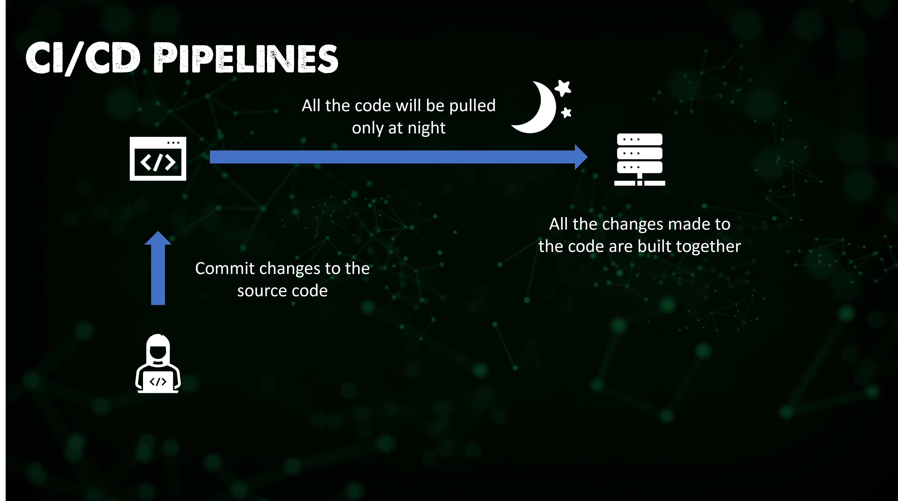
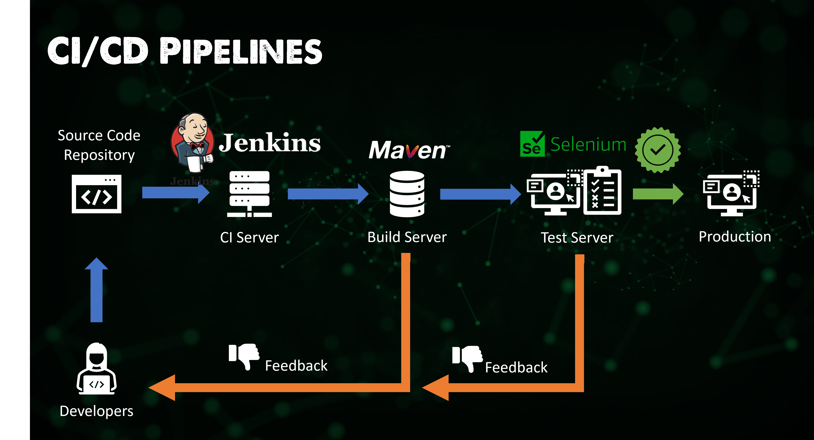

## 什么是 Jenkins？

Jenkins是一个持续集成工具，允许对新建的代码进行持续开发、测试和部署。

可以通过夜间构建或持续开发两种方法来实现这些。第一种选择是，我们的开发人员全天都在开发他们的任务，并在当天结束时将他们的更改推送（push）到源代码仓库。然后在晚上，我们运行单元测试并构建软件。这可以被认为是集成所有代码的旧方法。

另一种选择也是首选的方式是，我们的开发人员仍在提交他们对源代码的更改，然后当代码提交完成后，构建过程就会不断启动。

上述方法意味着，对于分布在世界各地的开发人员来说，我们每天都没有固定的时间来停止提交代码更改。这就是Jenkins作为CI服务器来控制这些测试和构建过程。

虽然我们在这里讨论的是Jenkins，但我也想补充一些内容（也许以后会深入研究），了解为什么我会认为Jenkins是最受欢迎的，为什么会得出这样的判断，以及其他人能在Jenkins上做些什么。

- TravisCI，一种托管的分布式持续集成服务，用于构建和测试托管在GitHub上的软件项目。
- Bamboo，可以并行运行多个构建以实现更快的编译，内置与仓库连接的功能，并具有Ant和Maven的构建任务功能。
- Buildbot，是一个用于自动化软件构建、测试和发布过程的开源框架。它是用Python编写的，支持跨多个平台分布式并行执行作业。
- ApacheGump，专门针对Java项目，旨在每晚构建和测试这些Java项目。确保所有项目在API和功能级别都兼容。

因为我们现在将重点关注Jenkins - Jenkins和上述所有工具一样，是开源的，是一个用Java编写的自动化服务器。它用于通过持续集成实现软件开发过程的自动化，并有助于持续交付。

### Jenkins的特性

正如你所料，Jenkins有很多功能，涵盖了很多领域。

**易于安装** - Jenkins是一个独立的基于java的程序，可以与Windows、macOS和Linux操作系统上的软件包一起运行。

**轻松配置** - 通过内置的web界面进行设置和配置，包括错误检查和内置帮助。

**插件** - 更新中心提供了许多插件，并与CI/CD工具链中的许多工具集成。

**可扩展** - 除了可用的插件外，Jenkins还可以通过该插件架构进行扩展，该架构为它的用途提供了几乎无限的选项。

**分布式** - Jenkins可以轻松地在多台机器上分配工作，有助于加快跨多个平台的构建、测试和部署。

### Jenkins的管道pipeline

你将会了解这个管道流程，但其还有更广的使用范围，而且我们还没有谈到具体的工具。

您会把代码提交给Jenkins，然后它将构建您的应用程序，并进行所有自动化测试。接着在每个步骤都完成后进行代码的发布和部署。Jenkins是实现这一过程自动化的工具。

### Jenkins的架构

首先，不要想着重新造轮子，[Jenkins Documentation](https://www.jenkins.io/doc/developer/architecture/)总是一个开始开始学习的地方，但我也会在这里记下我的笔记和学到的东西。

Jenkins可以被安装在许多不同的操作系统上，包括Windows、Linux和macOS，也可以作为Docker容器或在Kubernetes中进行部署。[安装Jenkins](https://www.jenkins.io/doc/book/installing/)

当我们开始使用它时，我们可能会考虑在一个minikube集群中安装Jenkins，模拟部署到Kubernetes的过程。但这将取决于我们在本节后续部分中所设置的场景。

现在让我们对下面的图像进行拆解。

步骤1 - 开发人员提交对源代码仓库的更改。

步骤2 - Jenkins定期检查仓库并提取（pull）任何新代码。

步骤3 - 构建服务器（build server）将代码构建为可执行文件，在本例中，我们使用maven作为构建服务器。

步骤4 - 如果构建失败，则将反馈发送至开发人员。

步骤5 - Jenkins将构建应用程序部署到测试服务器，在本例中，我们使用selenium作为测试服务器。

步骤6 - 如果测试失败，则将反馈发送至开发人员。

步骤7 - 如果测试成功，那么我们可以将它们发布到生产中。

这个周期是连续的，这使得应用程序可以在几分钟内更新，而不是几小时、几天、几个月和几年！

Jenkins的架构中还有很多东西，如果你需要的话，它们有主从功能，可以使主机能够将任务分配到从属Jenkins环境。

参考开源的Jenkins，将会有很多企业需要支持，CloudBees是Jenkins的企业版本，为付费企业客户提供支持，并可能提供其他功能。

An example of this in a customer is Bosch, you can find the Bosch case study [here](https://assets.ctfassets.net/vtn4rfaw6n2j/case-study-boschpdf/40a0b23c61992ed3ee414ae0a55b6777/case-study-bosch.pdf)

I am going to be looking for a step-by-step example of an application that we can use to walk through using Jenkins and then also use this with some other tools.

博世Bosch就是一个例子，您可以在这里找到博世案例研究(https://assets.ctfassets.net/vtn4rfaw6n2j/case-study-boschpdf/40a0b23c61992ed3ee414ae0a55b6777/case-study-bosch.pdf)

我将通过一个应用程序示例，我们可以一步步地使用Jenkins进行实操，然后也可以将它与其他一些工具一起使用。

## 相关资料

- [Jenkins is the way to build, test, deploy](https://youtu.be/_MXtbjwsz3A)
- [Jenkins.io](https://www.jenkins.io/)
- [ArgoCD](https://argo-cd.readthedocs.io/en/stable/)
- [ArgoCD Tutorial for Beginners](https://www.youtube.com/watch?v=MeU5_k9ssrs)
- [What is Jenkins?](https://www.youtube.com/watch?v=LFDrDnKPOTg)
- [Complete Jenkins Tutorial](https://www.youtube.com/watch?v=nCKxl7Q_20I&t=3s)
- [GitHub Actions](https://www.youtube.com/watch?v=R8_veQiYBjI)
- [GitHub Actions CI/CD](https://www.youtube.com/watch?v=mFFXuXjVgkU)

[第七十二天](day72.md)见。
