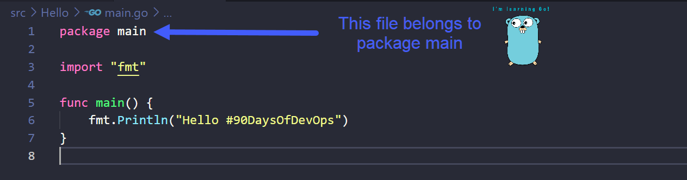

## 讓我們解釋一下 Hello World 編碼

### GO程式語言如何運作 

在第 8 天，我們瀏覽了您在工作站上安裝 Go 的過程，然後我們創建了我們第一個 Go的應用程序。 
 
在本章節中，我們將更深入地研究代碼並了解更多關於 Go 程式語言的內容。

### 什麼是編譯？ 
在我們進入第6行Hello World代碼之前[第6行Hello World編碼](Go/hello.go)，我們必需要對編譯有一點了解。 

像我們常用的Python、 Java、Go和C++編程語言都是高階的程試語言。
這意味著它們是人類可辨別的，但是當機器嘗試執行程序時，它需要採用機器可以理解的形式。我們必須將人類可辨別的代碼翻譯成為機器代碼這就稱為編譯。 

從上面你可以看到我們在第 8 天做了什麼 [第8天](day08.md)，我們創建了一個簡單的 Hello World main.go檔然後我們使用指令 `go build main.go` 來編譯我們可執行的檔案。 

### 什麼是套件？
套件是在同一目錄中收藏的源碼檔所形成的編譯。我們可以進一步簡化這一點，一個套件是在同一個目錄底下的一堆.go檔案。還記得第 8 天的 Hello 文件檔嗎？如果當您進入更複雜的 Go 程式語言時，您可能會發現你有文件1、文件2、文件3與許多套件所編輯而成的數個.go檔案。 

我們使用套件所以我們可以重複使用其他人的代碼，我們不必從頭開始編寫所有東西。或許我們想擁有一個從長遠來看可以為你節省大量時間與精力的計算器作為我們編程的一部分，在此你可能會找到現有的一個 Go 套件裡，包含你可以導入到代碼中的數學函數。

Go 程式語言鼓勵您將代碼統整在套件中，以便於重新使用和維護源代碼。

### Hello #90DaysOfDevOps 並行 
現在讓我們看一下我們的 Hello #90DaysOfDevOps main.go檔並逐行查看。

在第一行，你有'main套件'這意味著這個檔案附屬於一個稱作main的資料包。所有.go檔案都必須隸屬於這個套件，它們在初始行應該也有像套件的東西。

一個套件可以任意命名。我們必須在編程的一開頭就下'main'的指令，此動作將會在此套件運行，這就是規則。（還有需要再更加了解的嗎?）

每當我們想要編譯和執行我們的代碼時，我們都必須告訴機器需要從哪裡開始執行。我們通過編寫一個名為 main 的函數來做到這一點。 機器將尋找一個名為 main 的函數作為編碼的切入點。 

函數是一個可以執行某些特定任務的分組碼並且可以在整個程序使用。

可以運用'func'呼叫任何一組函數的名稱。 但在此情況下,我們必須將它稱作為'main'，因為這是編碼開始的地方。

接下來，我們將查看代碼的第 3 行，意即導入，基本上意味著您要在主編碼中引入另一個套件。fmt 是 Go 語言程式提供的一個標準套件，此套件包含'Println()'的函數,因為我們已經呼叫了它，所以我們可以在第 6 行使用。你可以在你的編程中列入數個標準套件並在代碼中利用或重新使用，從而省去了從頭開始編寫的麻煩。 [Go 語言程式標準庫](https://pkg.go.dev/std)

我們在這裡使用的Println()是一種將標準輸出寫入終端的方式，在該終端中，可執行文件已成功執行。請隨意更改()之間的訊息。

### TLDR

- **第 1 行** = 該文件將位於名為 main的套件中，並且需要將其稱為 main，因為其中包含程式的切入口。
- **第 3 行** = 為了讓我們使用 `Println()`，我們必須在第 6 行導入 fmt 套件包才能使用它。
- **第 5 行** = 實際的起點為'main'函數。
- **第 6 行** = 這將讓我們在系統上呈現“Hello #90DaysOfDevOps”。

## Resources

- [StackOverflow 2021 Developer Survey](https://insights.stackoverflow.com/survey/2021)
- [Why we are choosing Golang to learn](https://www.youtube.com/watch?v=7pLqIIAqZD4&t=9s)
- [Jake Wright - Learn Go in 12 minutes](https://www.youtube.com/watch?v=C8LgvuEBraI&t=312s) 
- [Techworld with Nana - Golang full course - 3 hours 24 mins](https://www.youtube.com/watch?v=yyUHQIec83I) 
- [**NOT FREE** Nigel Poulton Pluralsight - Go Fundamentals - 3 hours 26 mins](https://www.pluralsight.com/courses/go-fundamentals) 
- [FreeCodeCamp -  Learn Go Programming - Golang Tutorial for Beginners](https://www.youtube.com/watch?v=YS4e4q9oBaU&t=1025s) 
- [Hitesh Choudhary - Complete playlist](https://www.youtube.com/playlist?list=PLRAV69dS1uWSR89FRQGZ6q9BR2b44Tr9N) 

[第10天](day10.md)見.
