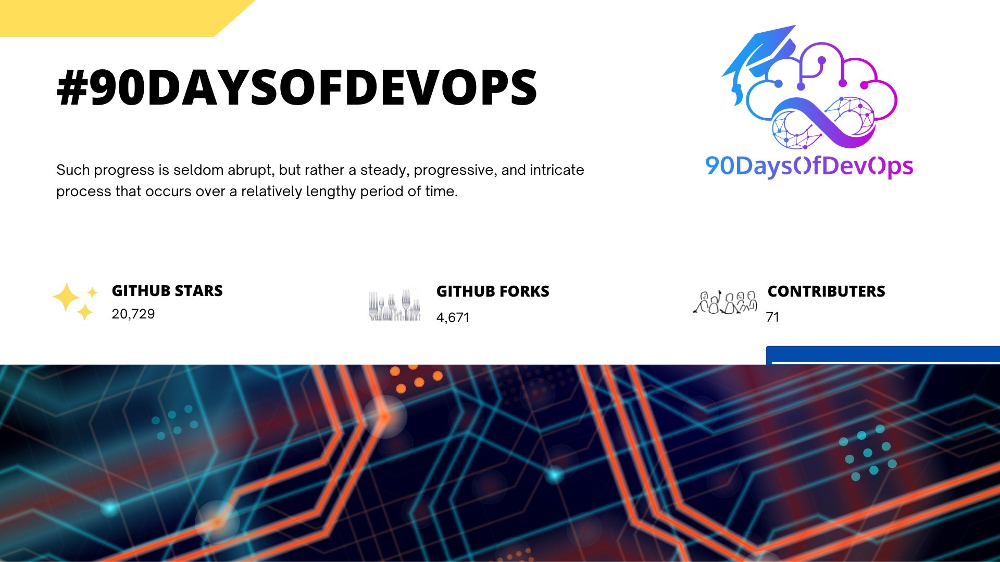
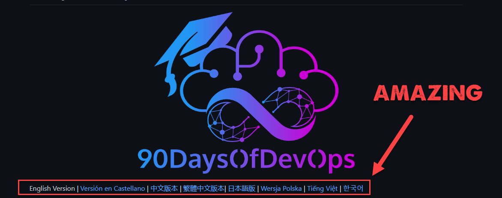

## 2022 Reflection & Welcome 2023

Hey everyone and welcome to the 2023 edition of #90DaysOfDevOps in this Day 1 post the plan is to reflect on the 2022 edition and some statistics, feedback, and ideas that we have had during the year. 

### 2022 Recap 

First, WOW! To think that the mission I thought up on New Year’s Eve 2021 was to spend the first 90 days of 2022 learning and documenting that learning, basically writing some notes after watching some much smarter people than me on YouTube. 

Fast forward a year, and we have some amazing numbers on the repository, I think I mentioned at least somewhere in the repository, but I know I have mentioned elsewhere many times any content is worth doing if it helps even just one person, to have the numbers that we have here from stars to forks is incredible. 

Also, nearly **500** watchers of the repository! 

First, I want to thank everyone for sharing the repository with the community. Hearing that Microsoft and other massive tech vendors have shared this with their teams is humbling. 

Secondly, I would like to thank the contributors. This started out as a place to take notes and learn in public, and it wasn't until a few days in that saw people correcting my poor spelling and grammar. (I am sure the same will happen this year) But the biggest and most amazing thing was the community that started to translate the repository into their native language! How amazing to think this was happening and helping non-native English speakers learn more about the powers of DevOps. 

If you would like to find the amazing contributors on the repository, then you can head to the [Contributors](https://github.com/MichaelCade/90DaysOfDevOps/blob/main/Contributors.md)

### Continuous Learning 

I mentioned and mentioned a lot that we are never done learning, if you think you are then you picked the wrong industry as things are changing all the time and at a rapid pace. 

It is for that reason we must keep learning, learning for some is a challenge and for those people, I urge you to find a medium that you enjoy. I have always enjoyed documenting something I learn to like this and then getting hands-on. The premise of this project is exactly that, it is about a foundational knowledge of some of the key areas of DevOps and the tooling that achieves this, you are not going to be a graduated DevOps engineer by following along but you are going to have a better understanding of terminology and getting hands-on with some technologies that maybe you do not see on a day-to-day basis. 

I also want to add that everyone is constantly evolving and learning, it doesn't matter if you are the CTO of a software company or a Systems Administrator wanting to learn more about automation, everyone is learning, and that little imposter syndrome feeling is normal. My advice is to run towards it vs running away from it and you will absolutely reap the rewards, also learn what you enjoy this makes learning more enjoyable. 

### Security focused 

For those that have been following along, you will have known that the biggest area we missed out on in the 2022 edition was security aptly named DevSecOps and how we integrate security into that infinite DevOps cycle to ensure we are always thinking about security. 

In this edition, we will be diving headfirst into the security processes and principles as it obtains to DevSecOps heavily in this version and getting to some more topics that we missed in the first round. 

### A little help from my friends 

The 2022 edition was the equivalent of writing a blog post each day. We were well over 100k words and if we were to spin this into an eBook which was an option and instructions can be found in the repository if you so wish but you would find over 700 pages of A4 paper in total. The book idea is not dead and buried and I am working on a smaller version behind the scenes that might be a nice giveaway at a conference near you along with our amazing stickers. 

Another gap for me and maybe this was the authenticity of the project as I was just starting to learn and documenting that learning journey in some of these areas. This time around I have asked some friends in the community to help. 

There are two reasons for this: 

1. I think it is important to get different perspectives across topics and also, we are all going to learn best if we hear from subject matter experts in those specific topic areas. 

2. Some of the friends that will be helping here will have the opportunity to grow their brand and potentially even speak at events about their topics and the over the project. 

You can find the 2023 authors on the opening 2023.md page with links to their bios and contact details. 

I think it is also time to be very clear about the project. Nobody is being paid to write, nobody is being paid to talk about the project. I was approached about sponsorship several times, but the premise of this project is for it to remain impartial, free and for the community. Yes, we have used some projects and products throughout but none of the companies have sponsored or had a say in what has been written. 

Finally, my employer Veeam Software, I am extremely lucky to have a company that enables me to be part of the community and document my learnings without interference. I don't work a traditional 9-5 and I am sure many people reading this do not either, but I am free to create content like this project. 

### Resources 

Throughout the project and the previous 2022 edition you will find the resources section, this is a list of content that I or my fellow authors have been through and if you want to learn more than you are reading here go and grab this content. 

You can find the 2022 edition [here](https://github.com/MichaelCade/90DaysOfDevOps/blob/main/2022.md)

But also some community members have been busy at work transforming and creating a new look and feel through [GitHub Pages](https://www.90daysofdevops.com/#/)

On the [2023 page](https://www.90daysofdevops.com/#/2023) you will also find ways to interact and join the community. 

With that said let's get into things with [Day 2](day02.md).