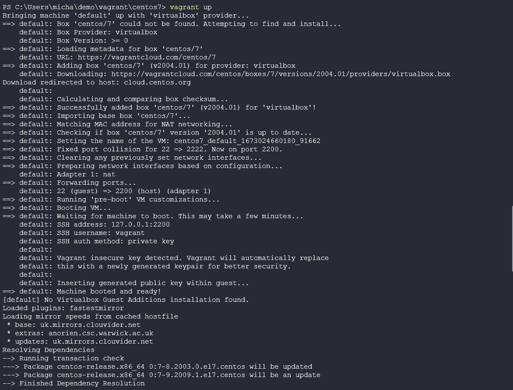
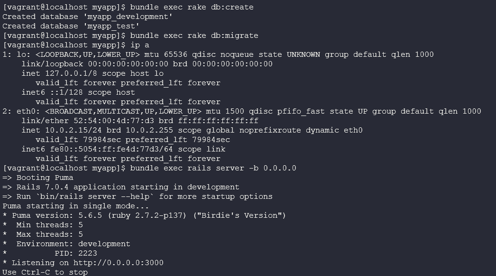
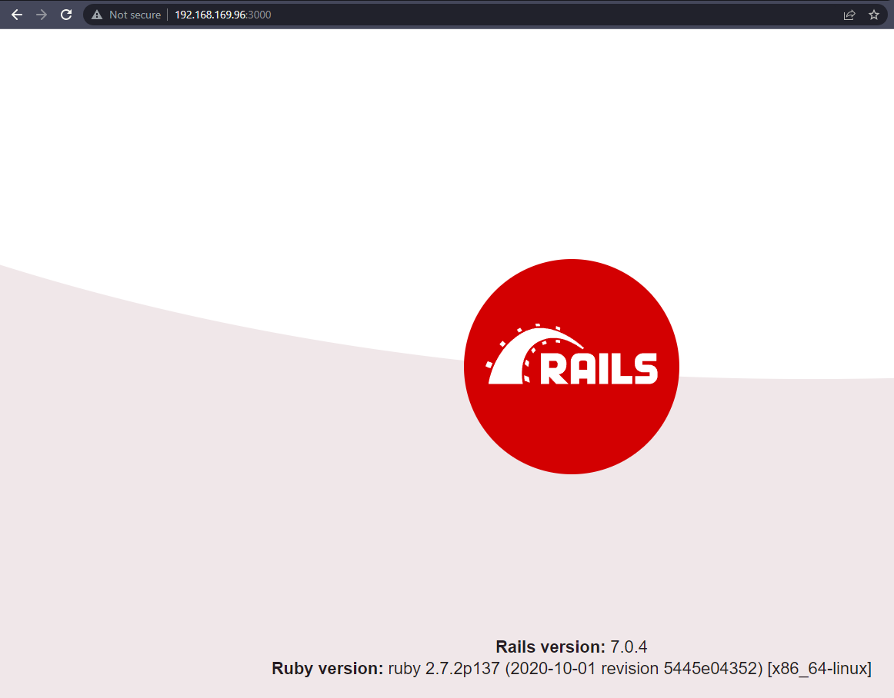
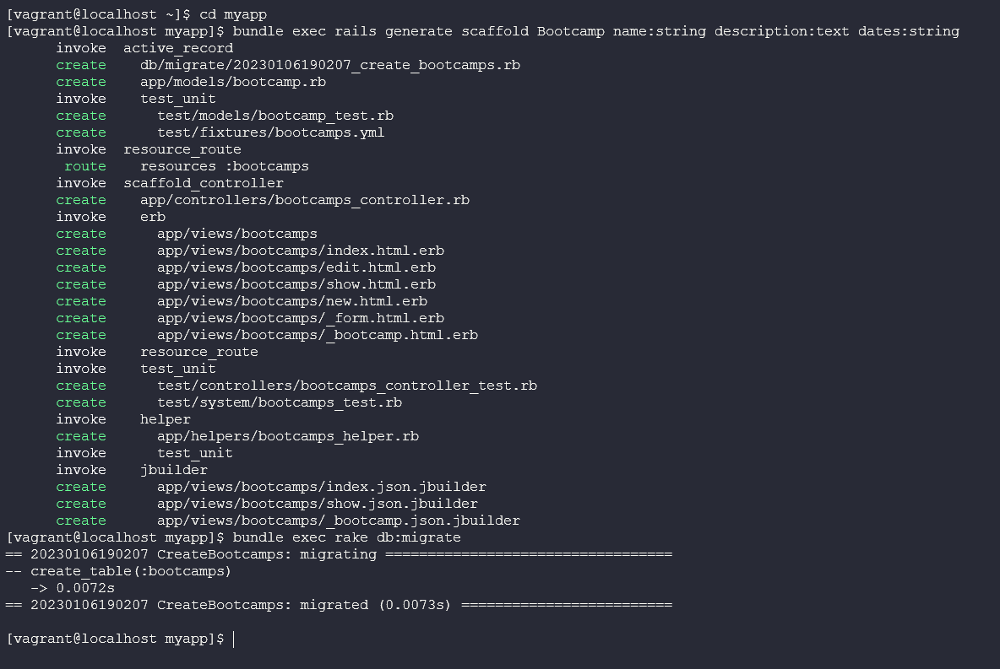
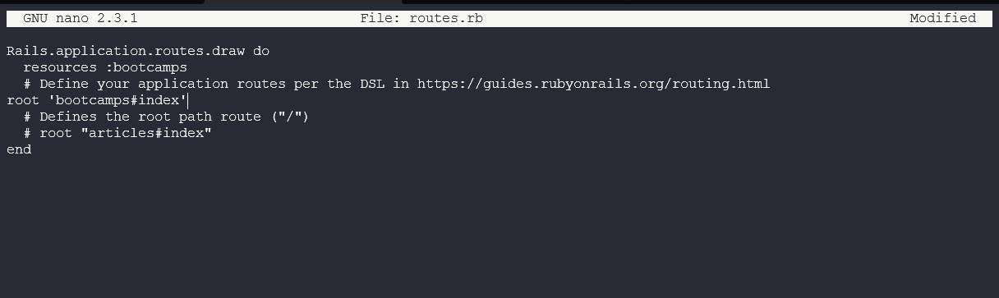

## Hands-On: Building a weak app

Nobody really sets out to build a weak or vulnerable app... do they? 

No is the correct answer, nobody should or does set out to build a weak application, and nobody intends on using packages or other open-source software that brings its own vulnerabilities. 

In this final introduction section into DevSecOps, I want to attempt to build and raise awareness of some of the misconfigurations and weaknesses that might fall by the wayside. Then later over the next 84 days or even sooner we are going to hear from some subject matter experts in the security space on how to prevent bad things and weak applications from being created. 

### Building our first weak application 

<span style="color:red">**Important Message: This exercise is to highlight bad and weaknesses in an application, Please do try this at home but beware this is bad practice**</span>

At this stage, I am not going to run through my software development environment in any detail. I would generally be using VScode on Windows with WSL2 enabled. We might then use Vagrant to provision dedicated compute instances to VirtualBox all of which I covered throughout the 2022 sections of #90DaysOfDevOps mostly in the Linux section. 

### Bad Coding Practices or Coding Bad Practices 

It is very easy to copy and paste into GitHub! 

How many people check end-to-end the package that they include in your code? 

We also must consider: 

- Do we trust the user/maintainer 
- Not validating input on our code 
- Hardcoding secrets vs env or secrets management 
- Trusting code without validation 
- Adding your secrets to public repositories (How many people have done this?)

 Now going back to the overall topic, DevSecOps, everything we are doing or striving towards is faster iterations of our application or software, but this means we can introduce defects and risks faster. 

 We will also likely be deploying our infrastructure with code, another risk is including bad code here that lets bad actors in via defects. 

 Deployments will also include application configuration management, another level of possible defects. 

 However! Faster iterations can and do mean faster fixes as well. 

 ### OWASP - Open Web Application Security Project 

*"[OWASP](https://owasp.org/) is a non-profit foundation that works to improve the security of software. Through community-led open-source software projects, hundreds of local chapters worldwide, tens of thousands of members, and leading educational and training conferences, the OWASP Foundation is the source for developers and technologists to secure the web."*

If we look at their most recent data set and their [top 10](https://owasp.org/www-project-top-ten/) we can see the following big ticket items for why things go bad and wrong. 

1. Broken Access Control 
2. Cryptographic Failures 
3. Injection (2020 #1)
4. Insecure Design (New for 2021)
5. Security Misconfiguration 
6. Vulnerable and Outdated Components (2020 #9)
7. Identification and authentication failures (2020 #2)
8. Software and Data integrity failures (New for 2021)
9. Security logging and monitoring failures (2020 #10)
10. Server-side request forgery (SSRF)

### Back to the App 

<span style="color:red">**The warning above still stands, I will deploy this to a local VirtualBox VM IF you do decide to deploy this to a cloud instance then please firstly be careful and secondly know how to lock down your cloud provider to only your own remote IP!**</span>

Ok I think that is enough warnings, I am sure we might see the red warnings over the next few weeks some more as we get deeper into discussing this topic.

The application that I am going to be using will be from [DevSecOps.org](https://github.com/devsecops/bootcamp/blob/master/Week-2/README.md) This was one of their bootcamps years ago but still allows us to show what a bad app looks like. 

Having the ability to see a bad or a weak application means we can start to understand how to secure it.

Once again, I will be using VirtualBox on my local machine and I will be using the following vagrantfile (link here to intro on vagrant)

The first alarm bell is that this vagrant box was created over 2 years ago! 

```
Vagrant.configure("2") do |config|
  config.vm.box = "centos/7"
  config.vm.provider :virtualbox do |v|
   v.memory  = 8096
   v.cpus    = 4
end
end
```
If navigate to this folder, you can use `vagrant up` to spin up your centos7 machine in your environment. 




Then we will need to access our machine, you can do this with `vagrant ssh` 

We are then going to install MariaDB as a local database to use in our application. 

`sudo yum -y install mariadb mariadb-server mariadb-devel`

start the service with

`sudo systemctl start mariadb.service`

We have to install some dependencies, this is also where I had to change what the Bootcamp suggested as NodeJS was not available in the current repositories. 

`sudo yum -y install links`
`sudo yum install --assumeyes epel-release`
`sudo yum install --assumeyes nodejs`

You can confirm you have node installed with `node -v` and `npm -v` (npm should be installed as a dependency)

For this app we will be using ruby a language we have not covered at all yet and we will not really get into much detail about it, I will try and find some good resources and add them below. 

Install with 

`curl -L https://get.rvm.io | bash -s stable`

You might with the above be asked to add keys follow those steps. 

For us to use rvm we need to do the following: 

`source /home/vagrant/.rvm/scripts/rvm`

and finally, install it with 

`rvm install ruby-2.7`

the reason for this long-winded process is basically because the centos7 box we are using is old and old ruby is shipped in the normal repository etc. 

Check installation and version with

`ruby --version`

We next need the Ruby on Rails framework which can be gathered using the following command. 

`gem install rails`

Next, we need git and we can get this with 

`sudo yum install git`

Just for the record and not sure if it is required, I also had Redis installed on my machine as I was doing something else but it actually still might be needed so these are the steps. 

```
sudo yum install epel-release
sudo yum install redis
```

The above could be related to turbo streams but I did not have time to learn more about ruby on rails. 

Now let’s finally create our application (for the record I went through a lot to make sure these steps worked on my system so I am sending you all the luck)

create the app with the following, calling it what you wish 

`rails new myapp --skip-turbolinks --skip-spring --skip-test-unit -d mysql `

next, we will create the database and schema: 

```
cd myapp
bundle exec rake db:create
bundle exec rake db:migrate
```

We can then run our app with `bundle exec rails server -b 0.0.0.0` 



Then open a browser to hit that box, I had to change my VirtualBox VM networking to bridged vs NAT so that I would be able to navigate to it vs using vagrant ssh. 



Now we need to **scaffold** a basic model 

A scaffold is a set of automatically generated files which forms the basic structure of a Rails project.

We do this with the following commands: 

```
bundle exec rails generate scaffold Bootcamp name:string description:text dates:string
bundle exec rake db:migrate
```



Add a default route to config/routes.rb

`root bootcamps#index`



Now edit app/views/bootcamps/show.html.erb and make the description field a raw field. Add the below. 

```
<p>
  <strong>Description:</strong>
  <%=raw @bootcamp.description %>
</p>
```
Now why this is all relevant is that using raw in the description field means that this field now becomes a potential XSS target. Or cross-site scripting. 

This can be explained better with a video [What is Cross-Site Scripting?](https://youtu.be/DxsmEXicXEE)

The rest of the Bootcamp goes on to add in search functionality which also increases the capabilities around an XSS attack and this is another great example of a demo attack you could try out on a [vulnerable app](https://www.softwaretestinghelp.com/cross-site-scripting-xss-attack-test/).

### Create search functionality 

In app/controllers/bootcamps_controller.rb, we'll add the following logic to the index method:

```
def index
  @bootcamps = Bootcamp.all
  if params[:search].to_s != ''
    @bootcamps = Bootcamp.where("name LIKE '%#{params[:search]}%'")
  else
    @bootcamps = Bootcamp.all
  end
end
```

In app/views/bootcamps/index.html.erb, we'll add the search field:

```
<h1>Search</h1>
<%= form_tag(bootcamps_path, method: "get", id: "search-form") do %>
  <%= text_field_tag :search, params[:search], placeholder: "Search Bootcamps" %>
  <%= submit_tag "Search Bootcamps"%>
<% end %>

<h1>Listing Bootcamps</h1>
```

Massive thanks for [DevSecOps.org](https://www.devsecops.org/) this is where I found the old but great walkthrough with a few tweaks above, there is also so much more information to be found there. 

With that much longer walkthrough than anticipated I am going to hand over to the next sections and authors to highlight how not to do this and how to make sure we are not releasing bad code or vulnerabilities out there into the wild. 

## Resources 

- [devsecops.org](https://www.devsecops.org/)

- [TechWorld with Nana - What is DevSecOps? DevSecOps explained in 8 Mins](https://www.youtube.com/watch?v=nrhxNNH5lt0&list=PLsKoqAvws1pvg7qL7u28_OWfXwqkI3dQ1&index=1&t=19s)

- [What is DevSecOps?](https://www.youtube.com/watch?v=J73MELGF6u0&list=PLsKoqAvws1pvg7qL7u28_OWfXwqkI3dQ1&index=2&t=1s)

- [freeCodeCamp.org - Web App Vulnerabilities - DevSecOps Course for Beginners](https://www.youtube.com/watch?v=F5KJVuii0Yw&list=PLsKoqAvws1pvg7qL7u28_OWfXwqkI3dQ1&index=3&t=67s)

- [The Importance of DevSecOps and 5 Steps to Doing it Properly (DevSecOps EXPLAINED)](https://www.youtube.com/watch?v=KaoPQLyWq_g&list=PLsKoqAvws1pvg7qL7u28_OWfXwqkI3dQ1&index=4&t=13s)

- [Continuous Delivery - What is DevSecOps?](https://www.youtube.com/watch?v=NdvMUcWNlFw&list=PLsKoqAvws1pvg7qL7u28_OWfXwqkI3dQ1&index=5&t=6s)

- [Cloud Advocate - What is DevSecOps?](https://www.youtube.com/watch?v=a2y4Oj5wrZg&list=PLsKoqAvws1pvg7qL7u28_OWfXwqkI3dQ1&index=6)

- [Cloud Advocate - DevSecOps Pipeline CI Process - Real world example!](https://www.youtube.com/watch?v=ipe08lFQZU8&list=PLsKoqAvws1pvg7qL7u28_OWfXwqkI3dQ1&index=7&t=204s)

See you on [Day 7](day07.md) Where we will start a new section on Secure Coding.  

