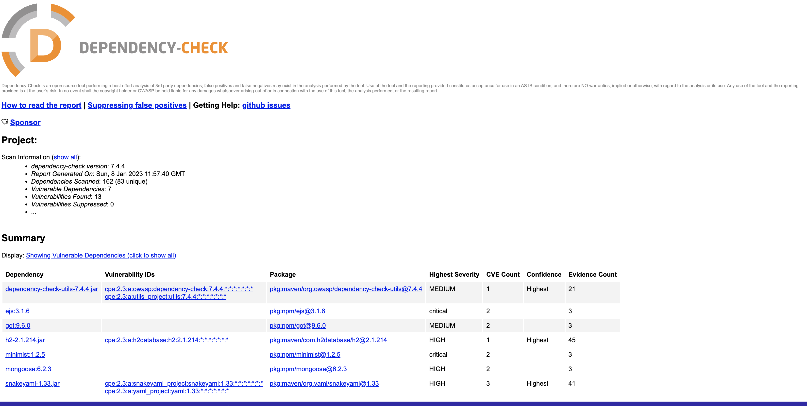

# Day 11: SCA Implementation with OWASP Dependency Check

### OWASP Dependency Check

OWASP Dependency Check is an open-source tool that checks project dependencies for known vulnerabilities. It can be used to identify dependencies with known vulnerabilities and determine if any of those vulnerabilities are exposed in the application.

The tool works by scanning the dependencies of a project and checking them against a database of known vulnerabilities. If a vulnerability is found, the tool will report the vulnerability along with the associated CVE (Common Vulnerabilities and Exposures) identifier, a standardized identifier for publicly known cybersecurity vulnerabilities.

To use OWASP Dependency Check, you will need to include it as a part of your build process. There are integrations available for a variety of build tools, including Maven, Gradle, and Ant. You can also use the command-line interface to scan your dependencies.

OWASP Dependency Check is particularly useful for identifying vulnerabilities in third-party libraries and frameworks that your application depends on. These types of dependencies can introduce vulnerabilities into your application if they are not properly managed. By regularly scanning your dependencies, you can ensure that you are aware of any vulnerabilities and take steps to address them.

It is important to note that OWASP Dependency Check is not a replacement for secure coding practices and should be used in conjunction with other security measures. It is also important to regularly update dependencies to ensure that you are using the most secure version available.

### Integrate Dependency Check with GitHub Actions

To use Dependency Check with GitHub Actions, you can create a workflow file in your repository's `.github/workflows` directory. Here is an example workflow that runs Dependency Check on every push to the `main` branch:

```yaml
name: Dependency-Check
on:
  push:
    branches:
      - main
  pull_request:
    types: [opened, synchronize, reopened]
jobs:
  dependency-check:
    name: Dependency-Check
    runs-on: ubuntu-latest
    steps: 
      - name: Download OWASP Dependency Check
        run: |
          VERSION=$(curl -s https://jeremylong.github.io/DependencyCheck/current.txt)
          curl -sL "https://github.com/jeremylong/DependencyCheck/releases/download/v$VERSION/dependency-check-$VERSION-release.zip" --output dependency-check.zip
          unzip dependency-check.zip
      - name: Run Dependency Check
        run: |
          ./dependency-check/bin/dependency-check.sh --out report.html --scan .
          rm -rf dependency-check*

      - name: Upload Artifacts
        uses: actions/upload-artifact@v2
        with:
          name: artifacts
          path: report.html
```

This workflow does the following:

1. Defines a workflow called `Dependency-Check` that runs on every push to the `main` branch.
2. Specifies that the workflow should run on the `ubuntu-latest` runner.
3. Downloads and installs Dependency Check.
4. Runs Dependency Check on the current directory (`.`) and generate a report in report.html file.
5. Removes the downloaded Dependency Check files.
6. Upload the report file as artifacts.

You can download the report from the Artifacts and open it in the Browser.



You can customize this workflow to fit your needs. For example, you can specify different branches to run the workflow on, or specify different dependencies to check. You can also configure Dependency Check to generate a report in a specific format (e.g., HTML, XML, JSON) and save it to the repository.

### Resources

- [Dependency Check Documentation](https://jeremylong.github.io/DependencyCheck/)
- [Source Code of the repo I used for SCA implementation](https://github.com/prateekjaindev/nodejs-todo-app-demo)

In the next part [Day 12](day12.md), we will discuss Secure Coding Review.