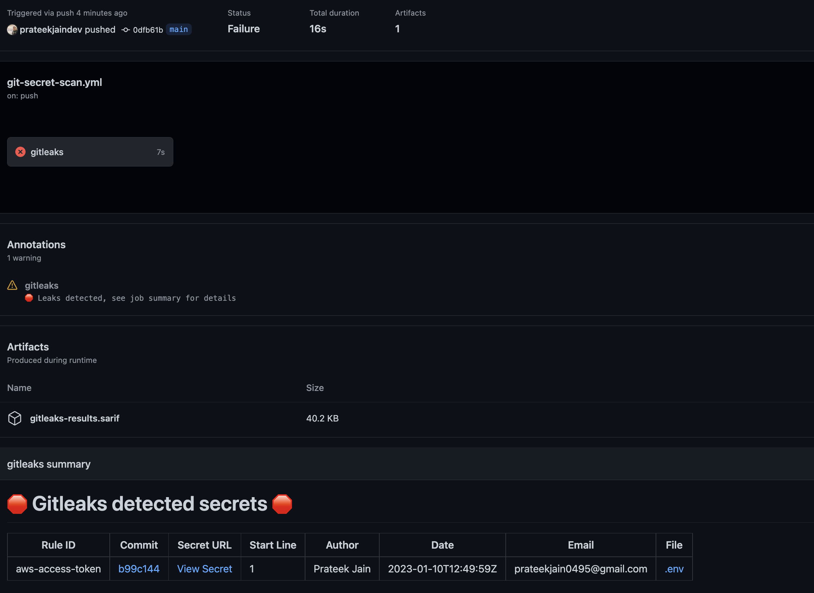

# Day 13: Additional Secure Coding Practices

## Git Secret Scan

Scanning repositories for secrets refers to the process of searching through a code repository, such as on GitHub or GitLab, for sensitive information that may have been inadvertently committed and pushed to the repository. This can include sensitive data such as passwords, API keys, and private encryption keys. 

The process is usually done using automated tools that scan the code for specific patterns or keywords that indicate the presence of sensitive information. The goal of this process is to identify and remove any secrets that may have been exposed in the repository, in order to protect against potential breaches or unauthorized access.

### Git Secret Scan with Gitleaks

Gitleaks is a tool that can be added to your GitHub repository as a GitHub Action, which scans your codebase for sensitive information such as credentials, tokens, and other secrets. The action runs the gitleaks tool on your codebase, which checks for any sensitive information that may have been accidentally committed to your repository.

To set up Gitleaks GitHub Action, you need to create a new workflow file in your repository's `.github/workflows/git-secret-scan.yml` directory. The workflow file should contain the following:

```yaml
name: gitleaks
on:
  pull_request:
  push:
jobs:
  scan:
    name: gitleaks
    runs-on: ubuntu-latest
    steps:
      - uses: actions/checkout@v3
        with:
          fetch-depth: 0
      - uses: gitleaks/gitleaks-action@v2
        env:
          GITHUB_TOKEN: ${{ secrets.GITHUB_TOKEN }}
```


This workflow does the following:

1. Defines a workflow called `Dependency-Check` that runs on every push to the `main` branch.
2. Specifies that the workflow should run on the `ubuntu-latest` runner.
3. Runs gitleaks scan for the entire repository
4. This action will fail if it detects any secret.

In my demo, I have added AWS Keys in .env file and because of that the pipeline faild.



Other Git Scanner tools

- [**AWS git-secrets**](https://github.com/awslabs/git-secrets)
- **[GitGuardian ggshield](https://github.com/GitGuardian/ggshield)**
- **[TruffleHog](https://github.com/trufflesecurity/trufflehog)**

### Resources
- [Gitleaks GitHub](https://github.com/zricethezav/gitleaks)
- [Gitleaks GitHub Action](https://github.com/gitleaks/gitleaks-action)
## Create better Dockerfile with Hadolint

Hadolint is a linter for Dockerfiles that checks for common mistakes and provides suggestions for improvement. It can be used directly from the command line, integrated into a CI/CD pipeline, or integrated into code editors and IDEs for real-time linting.

To set up linting with hadolint in Github Actions, you can use the following steps:

1. Create a new workflow file in your repository, for example `.github/workflows/dockerfile-lint.yml`
2. In this file, add the following code to set up the Github Actions workflow:

```yaml
name: Lint Dockerfile
on:
  push:
    branches:
      - main
jobs:
  lint:
    runs-on: ubuntu-latest
    steps:
      - uses: actions/checkout@v2 
      - uses: hadolint/hadolint-action@v2.1.0
        with:
          dockerfile: Dockerfile
```

1. This workflow will run on every push to the "main" branch, and will run the hadolint command on the "Dockerfile" file.
2. Commit the new workflow file and push it to your repository.
3. Next time you push changes to the "main" branch, Github Actions will run the linting job and provide feedback if any issues are found with your Dockerfile.

### Resources

- [Hadolint GitHub](https://github.com/hadolint/hadolint)
- [Hadolint Online](https://hadolint.github.io/hadolint/)
- [Top 20 Dockerfile best practices](https://sysdig.com/blog/dockerfile-best-practices/)

Next up we will be starting our **Continuous Build, Integration, Testing** with [Day 14](day14.md) covering Container Image Scanning from [Anton Sankov](https://twitter.com/a_sankov). 