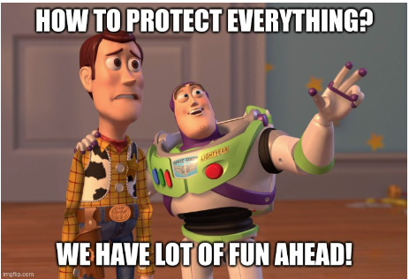
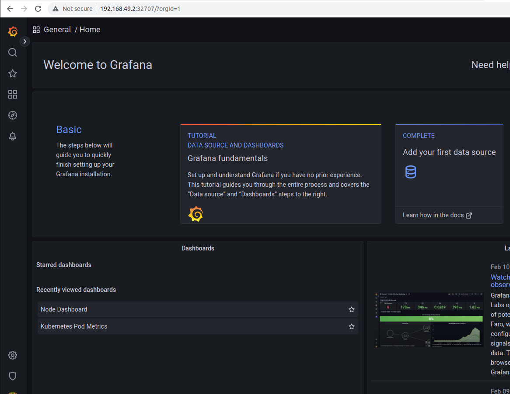
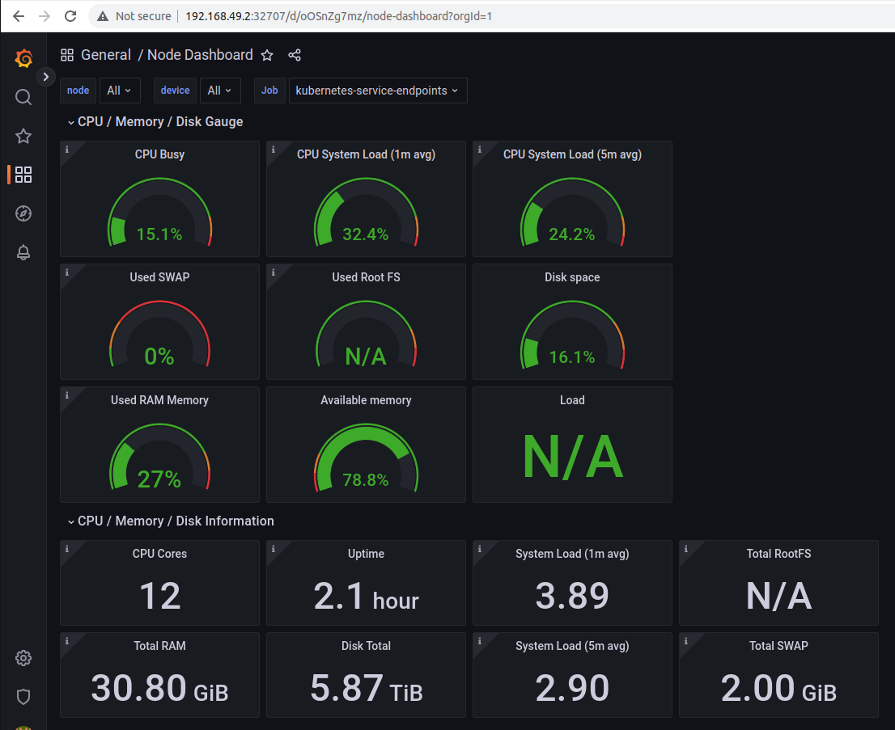

# Introduction to Runtime Defence & Monitoring

Welcome to all the DevOps and DevSecOps enthusiasts! 🙌

We are here to learn about "Runtime defence". This is a huge subject, but we are not deterred by it and will learn about it together in the next 7 days.



This subject was split into major parts:
* Monitoring (1st and 2nd day)
* Intrusion detection
* Network defense
* Access control
* Application defense subjects (6th and 7th days)

The goal is to get you up to a level in these subjects, where you can start to work on your own.

Let's start 😎

# System monitoring and auditing

## Why this is the first subject of the topic "Runtime defense and monitoring" subject?

Monitoring computer systems is a fundamental tool for security teams, providing visibility into what is happening within the system. Without monitoring, security teams would be unable to detect and respond to security incidents.

To illustrate this point, consider physical security. If you want to protect a building, you must have security personnel 24/7 at every entrance to control who is entering the building. In this same example, you are also tasked with controlling the security of everyone in the building therefore you must also have personnel all around. Of course, this is not scaling well therefore installing CCTV cameras at key places is a much better solution today.

While scaling such physical security measures is difficult, for computer systems, it is easier to achieve through the installation of monitoring tools. Monitoring provides a basic level of control over the system, allowing security teams to detect problems, understand attack patterns, and maintain overall security. Beyond monitoring, there are additional security measures such as detection systems, which we can discuss further.

Elaborating on this, here are the key reasons why monitoring is important for runtime security include:

* Identifying security incidents: Monitoring can help organizations detect potential security incidents such as malware infections, unauthorized access attempts, and data breaches.

* Mitigating risks: By monitoring for signs of security threats, organizations can take action to mitigate those risks before they lead to a breach or other security incident.

* Complying with regulations: Many industries are subject to regulatory requirements that mandate certain security controls, including monitoring and incident response.

* Improving incident response: Monitoring provides the necessary data to quickly identify and respond to security incidents, reducing the impact of a breach and allowing organizations to recover more quickly.

* Gaining visibility: Monitoring provides insight into system activity, which can be used to optimize performance, troubleshoot issues, and identify opportunities for improvement.

## What to monitor and record?

In theory, the ideal solution would be to log everything that is happening in the system and keep the data forever.

However, this is not practical. Let's take a look at what needs to be monitored and what events need to be recorded.

When monitoring cloud-based computer services, there are several key components that should be closely monitored to ensure the system is secure and operating correctly. These components include:

Control plane logging: all the orchestration of the infrastructure is going through this control plane, it is crucial to always know who did what at the infrastructure level. It does not just enable the identification of malicious activity but also enables troubleshooting of the system.

Operating level logs: log operating system level events to track system activity and detect any errors or security-related events, such as failed login attempts or system changes. Deeper logs contain information about which use does what on the machine level which is important for identifying malicious behavior.

Network activity: Monitor network traffic to identify any unusual or unauthorized activity that could indicate an attack or compromise of the network.

Application activity and performance: Monitor application activity to detect misbehavior in case the attack is coming from the application level. Performance monitoring is important to ensure that services are running smoothly and to respond to any performance issues that may arise.

Resource utilization: Monitor the use of system resources such as CPU, memory, and disk space to identify bottlenecks or other performance issues. Unusual activity can be a result of denial of service-like attacks or attackers using computation resources for their good.

Security configurations: Monitor security configurations, such as firewall rules and user access controls, to ensure that they are correctly configured and enforced.

Backup and disaster recovery systems: Monitor backup and disaster recovery systems to ensure that they are operating correctly and data can be recovered in the event of a failure or disaster.

## A practical implementation

In this part, we move from theory to practice.

There isn't a silver bullet here, every system has its tools. We will work on Kubernetes as infrastructure with [Microservices demo](https://github.com/GoogleCloudPlatform/microservices-demo) application.

### Control plane monitoring

Kubernetes has an event auditing infrastructure called [audit logs](https://kubernetes.io/docs/tasks/debug/debug-cluster/audit/).

Kubernetes API server has a configuration called `Audit Policy` which tells the API server what to log. The log can either be stored in a file or sent to a webhook.

We are using Minikube in our example, and for the sake of testing this, we will send the audit logs to the `stdout` of the API server (which is its log).

```bash
mkdir -p ~/.minikube/files/etc/ssl/certs
cat <<EOF > ~/.minikube/files/etc/ssl/certs/audit-policy.yaml
# Log all requests at the Metadata level.
apiVersion: audit.k8s.io/v1
kind: Policy
rules:
- level: RequestResponse
EOF
minikube start --extra-config=apiserver.audit-policy-file=/etc/ssl/certs/audit-policy.yaml --extra-config=apiserver.audit-log-path=-
```

You can follow the logs with this Kubectl command:
```bash
kubectl logs kube-apiserver-minikube -n kube-system | grep audit.k8s.io/v1
```

Every API operation is logged to the stream.

Here is an example of an event "getting all secrets in default namespace":
```json
{"kind":"Event","apiVersion":"audit.k8s.io/v1","level":"RequestResponse","auditID":"8e526e77-1fd9-43c3-9714-367fde233c99","stage":"RequestReceived","requestURI":"/api/v1/namespaces/default/secrets?limit=500","verb":"list","user":{"username":"minikube-user","groups":["system:masters","system:authenticated"]},"sourceIPs":["192.168.49.1"],"userAgent":"kubectl/v1.25.4 (linux/amd64) kubernetes/872a965","objectRef":{"resource":"secrets","namespace":"default","apiVersion":"v1"},"requestReceivedTimestamp":"2023-02-11T20:34:11.015389Z","stageTimestamp":"2023-02-11T20:34:11.015389Z"}
```

As you can see, all key aspects of the infrastructure request are logged here (who, what, when).

Storing this in a file is not practical. Audit logs are usually shipped to a logging system and database for later use. Managed Kubernetes services use their own "cloud logging" service to capture Kubernetes Audit logs. In native Kubernetes, you could use Promtail to ship logs to Prometheus as described [here](https://www.bionconsulting.com/blog/monitoring-and-gathering-metrics-from-kubernetes-auditlogs).

### Resource monitoring

Kubernetes ecosystem enables multiple ways to monitor resources and logging, however, the most common example is Prometheus (logging and event database) and Grafana (UI and dashboards). These two open-source tools are an easy one-stop shop for multiple tasks around monitoring.

Out of the box, we will get resource monitoring Kubernetes nodes.

Here is how we are installing it on the Minikube we started in the previous part. Make sure, you have `helm` installed before.

```bash
helm repo add prometheus-community https://prometheus-community.github.io/helm-charts
helm repo add grafana https://grafana.github.io/helm-charts
helm install prometheus prometheus-community/prometheus
helm install grafana grafana/grafana
kubectl expose service grafana --type=NodePort --target-port=3000 --name=grafana-np
```

Now, these services should be installed.

To access Grafana UI, first, get the first password

```bash
kubectl get secret --namespace default grafana -o jsonpath="{.data.admin-password}" | base64 --decode ; echo
```

Then login to the UI
```bash
minikube service grafana-np --url
```



After you have logged in, go to "Data sources/Prometheus" and add our Prometheus service as a source. The URL has to be set to `http://prometheus-server` and click "save & test". 

Now, to set up resource dashboards, go to the "Dashboards" side menu and choose "Import". Here you can import premade dashboard. For example node metrics can be imported by putting the number `6126` in the field `Import via grafana.com` and clicking the `Load` button.



Browse Grafana for more dashboards [here](https://grafana.com/grafana/dashboards/).

# Next...

Tomorrow we will continue to the application level. Application logs and behavior monitoring will be in focue. We will continue to use the same setup and go deeper into the rabbit hole 😄
See you on [Day 29](day29.md).
