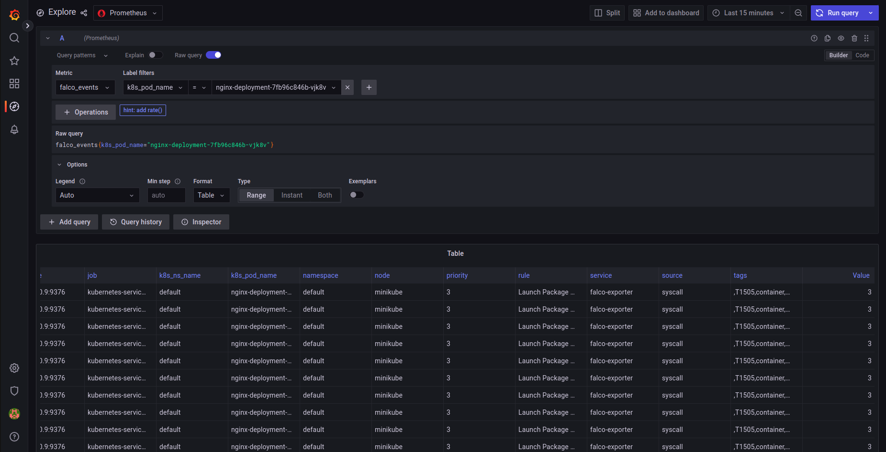
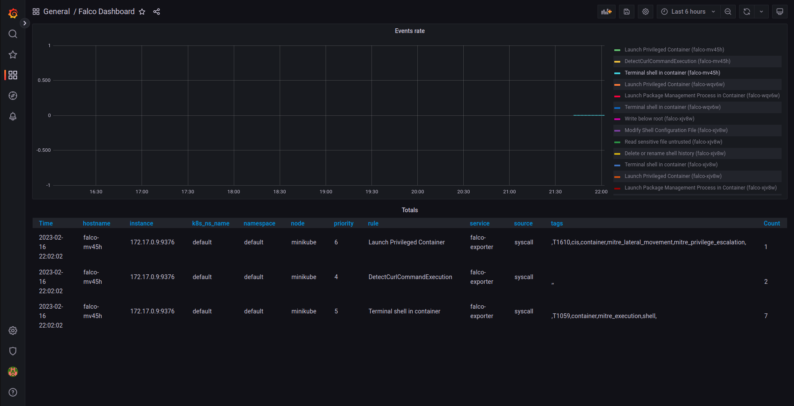

# Recap

We were deep yesterday in setting up Falco in our Minikube. It is a great tool for detecting application and container behavior during runtime. We took its output and exported it to our Prometheus instance in the cluster and viewed the results in a dedicated Grafana dashboard.

Today, we are going to set up some rules and alerts in Falco and see how detection and alerting work.

Is your coffee around? Have your hacker hoodie on you? Let's do it 😈

# Runtime detection with Falco

Falco is a powerful open-source tool that is designed for Kubernetes runtime security. Here are some reasons why Falco is a good choice for securing your Kubernetes environment. Falco provides real-time detection of security threats and potential vulnerabilities in your Kubernetes environment. It uses a rule-based engine to detect and alert suspicious activity, allowing you to quickly respond to security incidents. 

Falco allows you to create custom rules that are tailored to the specific needs of your environment. This allows you to detect and respond to security threats and potential vulnerabilities in a way that is tailored to your unique needs. Falco provides rich metadata about security events, including information about the container, pod, namespace, and other details. This makes it easy to investigate and respond to security incidents.

## Using built-in rules to detect malicious events

By this time you should have all the moving parts in place:
* Prometheus
* Grafana
* Falco

Let's do something that is somewhat unusual for a production system. We will open a shell on a workload and install a package during runtime of the container.

Let's install a minimalistic Nginx deployment:
```bash
kubectl create deployment nginx --image=nginx:1.19
```

Now open a shell inside the Pod of the Nginx deployment:
```bash
kubectl exec -it `kubectl get pod | grep nginx | awk '{print $1}'` -- bash
```

And install a "curl" on the Pod using APT:
```bash
apt update && apt install -y curl
```

Since we are using Falco to monitor application behavior it should see all these activities, and it does! Let's go to our Grafana back (see previous days to see how to reconnect).

In Grafana, go to the "explore" screen. Make sure that you use the Prometheus data source. 

In the query builder select metric "falco_events" and label filter "k8s_pod_name" and set the filter to your Nginx Pod name.

You will now see all the Falco events from this Pod



Note the rules that cause the events, among them you'll see "Launch Package Management Process in Container" rule that failed. This event was generated due to our `apt install` command above.


Take note here to appreciate the potential here. By installing this well proven open-source stack you can create a complete runtime monitoring system and know what is happening in real-time in the systems you want to monitor an protect! 


## Creating custom rules


Let's say you or your security team wants to know if a the CLI tool `curl`  has been invoked in one of Pods (which should rarely happen in a production cluster, but an attacker would use it to report back information to her/himself).

We need to write a "Falco rule" to detect it.

Here are the basic steps to add a custom Falco rule:

### Create the rule
First, create a new rule file that defines the behavior you want to detect. Falco rules are written in YAML format and typically include a description of the behavior, a set of conditions that trigger the rule, and an output message that is generated when the rule is triggered. 

To detect that the "apt" command is executed using a Falco rule, you could create a new rule file with the following content:

```yaml
customRules:
  rules-curl.yaml: |-
    - rule: DetectCurlCommandExecution
      desc: Detects the execution of the "curl" command
      condition: spawned_process and proc.name == curl
      output: "Curl command executed: %proc.cmdline"
      priority: WARNING
```

Let's dive a little bit into what we have here.

Falco instruments events in the Linux kernel and sends them to its rule engine. The rule engine goes over all the rules and tries to match them to the event. If a matching event is found, Falco itself fires a rule based event. These are the entries we see in Prometheus/Grafana. In our custom rule, the `condition` field if the "heart" of the rule and it is used to match the rule to the event. 

In this case, we have used a macro called `spawned_process` which evaluates to `true` if the event is system call from the user-space to the kernel for spawning a new process (`execve` and friends). The second condition is on the name of the new process, which matches `curl`.

To install this new rule, use the following Helm command to add it to our current deployment:
```bash
helm upgrade --install  falco falcosecurity/falco --set driver.kind=ebpf --set-file certs.server.key=$PWD/server.key,certs.server.crt=$PWD/server.crt,certs.ca.crt=$PWD/ca.crt --set falco.grpc.enabled=true,falco.grpcOutput.enabled=true,falco.grpc_output.enabled=true -f <PATH_TO_RULE_YAML>
```

Make sure that Falco Pod restarted and running correctly.

Let's return to our shell inside the Nginx pod.
```bash
kubectl exec -it `kubectl get pod | grep nginx | awk '{print $1}'` -- bash
```

We have installed here `curl` before, so we can invoke it now and simulate a malicious behavior.
```bash
curl https://google.com
```

Falco with our new rule should have picked up this event, so you should go back to Grafana and check the Falco dashboard:




Voila!

You have implemented and applied a custom rule in Falco!!!

I hope this part gave you an insight into how this system works.

# Next 

Tomorrow we will move away from the world of applications and go to the network layer, see you then!
Unto [Day 31](day31.md).
