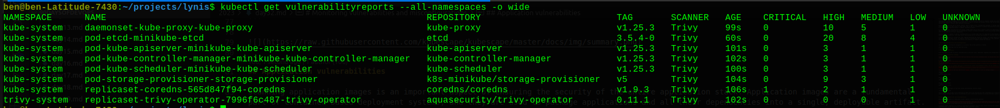

# Vulnerability and patch management

Vulnerability and patch management is a crucial process for ensuring the security of computer systems and networks. In simple terms, it involves identifying, prioritizing, and addressing weaknesses or flaws in software and hardware systems that can be exploited by attackers to gain unauthorized access or perform other malicious activities.

Vulnerabilities can arise due to various reasons, such as coding errors, configuration mistakes, or design flaws. Once a vulnerability is known, attackers may use it to gain access or steal data. This is why it is essential to identify and prioritize vulnerabilities and take necessary steps to mitigate them by applying patches or updates released by vendors.

To effectively manage vulnerabilities and patches, DevOps teams need to have a system in place for identifying and prioritizing vulnerabilities. This can be achieved through the use of vulnerability scanners or manual assessments. After prioritizing vulnerabilities, teams need to assess their level of risk and plan for their remediation.

Applying patches or updates to address vulnerabilities is a critical step, and it is important to test patches in a staging environment before deploying them in production. This helps ensure that patches do not introduce new problems or conflicts with other software components.

To maintain the security of systems over time, ongoing monitoring and review are crucial. This helps identify new vulnerabilities promptly and ensures that systems remain secure. In summary, effective vulnerability and patch management is a key component of a robust cybersecurity strategy for DevOps engineers to help ensure the security and integrity of computer systems and networks.


# Monitoring vulnerabilities and misconfigurations

The first step in vulnerability management is to monitor the current posture in runtime.

Let's assume the technology stack we have been using:
* Linux/Mac hosts
* Kubernetes (Minikube)
* Containerized applications

Given this stack, we need to monitor vulnerabilities at the host level, Kubernetes component and configuration and container level.

## Host-level vulnerability scanning

There are multiple solutions and projects that can help you find out host vulnerabilities. To decide which one to choose you need to know your constraints and needs.

A few examples include:
* [AWS Inspector](https://aws.amazon.com/inspector/) which is good if you are running your hosts in AWS EC2. You can turn this on in AWS console or API and get results
* [OpenVAS](https://www.openvas.org/) is an open-source vulnerability scanner, a fork of the "since become closed-source" project Nessus. It container 
* [Vuls](https://vuls.io/) another open-source vulnerability scanner and management system. You can install it in a centralized component and let it connect all your host via SSH and scan them.
* [lynis](https://cisofy.com/lynis/) is a simple but powerful scanner for single hosts

Here is an example, how to scan your machine with `lynis`. We will install it with our package manager:

Ubuntu/Debian:
```bash
sudo apt install lynis
```

RHEL/CentOs:
```bash
sudo yum install lynis
```

Now run the host audit:
```bash
sudo lynis audit system
```

It will return you a report of your host system with potential security issues:


This is great to see to get a first impression of what such a tool can give you, but I encourage you to think about a more complex system where you need to manage multiple hosts and it is preferable to use a centralized solution to overview the whole system (like mentioned in the above examples).


## Kubernetes vulnerabilities and misconfigurations

Managing vulnerabilities in a Kubernetes cluster requires a multi-faceted approach.

It is important to Kubernetes and its components up-to-date: Make sure that the Kubernetes version and its components (such as etcd, kube-apiserver, kubelet, and others) are up-to-date with the latest patches and security fixes. This can be achieved by following the Kubernetes release notes and upgrading the cluster to the latest version as soon as possible.

In general, these components are tracked in vulnerability databases like any other project and the host scanner will most likely find related vulnerabilities, so you should able to track them with a good host scanner.

Auditing Kubernetes configuration is simple and there are multiple tools you can use here:
* Kubescape - CNCF Project for Kubernetes security, its CLI can give you instant feedback about potential security and compliance issues
* Trivy - Aqua Security's open-source scanner used for both image, cloud and Kubernetes scanning
* Checkov - Bridgecrew's open-source tool scanning cloud infrastructure and Kubernetes 


We will see the simple way to scan our cluster with Kubescape:

```
kubescape installation in macOs M1 and M2 chip error fixed

[kubescape](https://github.com/kubescape/kubescape)

```


```bash
curl -s https://raw.githubusercontent.com/kubescape/kubescape/master/install.sh | /bin/bash
kubescape scan --enable-host-scan --verbose
```


## Application vulnerabilities

Scanning application images is an important aspect of ensuring the security of the entire application stack. Application images are a fundamental part of container-based deployment systems, and they are used to package applications and all their dependencies into a single, deployable artifact. These images are often pulled from public or private repositories and can contain vulnerabilities, misconfigurations, or other security issues that could be exploited by attackers.

Image scanning tools can analyze images for known vulnerabilities and misconfigurations, as well as other issues such as insecure software libraries, outdated packages, or default passwords. These tools compare the contents of an image with a database of known vulnerabilities and can provide information on the severity of the issue.

Trivy project has an operator which monitors application vulnerabilities in containers in the Kubernetes cluster.

It is very easy to install it:
```bash
helm repo add aqua https://aquasecurity.github.io/helm-charts/
helm repo update
helm install trivy-operator aqua/trivy-operator \
  --namespace trivy-system \
  --create-namespace \
  --set="trivy.ignoreUnfixed=true" \
  --version 0.11.1
```

After the installation you can access the vulnerabilities via CRD with kubectl:
```bash
kubectl get vulnerabilityreports --all-namespaces -o wide
```


[Day 33](day33.md).
