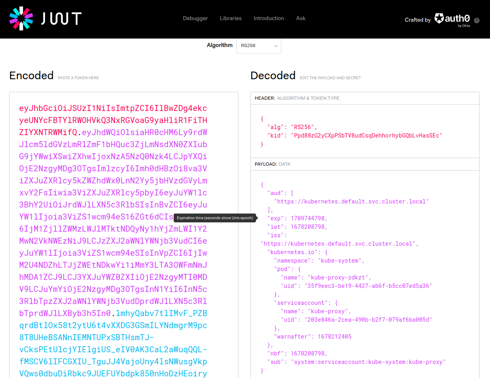

# Runtime access control

Runtime access control is crucial in a computer system because it helps ensure the security and integrity of a computer system cluster and the applications running on it. A computer system is a complex system with many moving parts, and it is essential to control access to these components to prevent unauthorized access or malicious activities.

Here are some reasons why runtime access control is important in a computer system:

Protects the Cluster from Unauthorized Access: Access control ensures that only authorized users or processes can interact with the computer system API server or cluster components. Unauthorized access could result in data breaches, theft of sensitive information, or compromise of the entire cluster.

Prevents Misuse of Resources: computer system manages and allocates resources such as CPU, memory, and network bandwidth. Access control helps ensure that these resources are used appropriately and that applications are not using more resources than they need.

Ensures Compliance: Access control helps ensure that the computer system and the applications running on it comply with organizational policies, industry standards, and regulatory requirements such as HIPAA, GDPR, or PCI-DSS.

Facilitates Auditing and Accountability: Access control provides an audit trail of who accessed what resources and when. This information is useful for tracking down security incidents, troubleshooting, and compliance reporting.

For example, Kubernetes provides several mechanisms for access control, including authnetication mechanisms, access control (RBAC), admission control, Network Policies, and more. It is important to properly configure and manage access control to ensure the security and reliability of a computer system cluster.

## Authentication

Authentication is the process of verifying the identity of a user or process attempting to access the Kubernetes API server or cluster resources. Kubernetes provides several authentication mechanisms, including X.509 client certificates, bearer tokens, and OpenID Connect (OIDC) tokens.

X.509 client certificates are the most secure and widely used authentication mechanism in Kubernetes. In this method, a client presents a valid X.509 client certificate to the API server, which verifies the certificate against a trusted Certificate Authority (CA).

Bearer tokens are another popular authentication mechanism in Kubernetes. A bearer token is a string of characters that represents the identity of a user or process. The API server validates the token against a configured TokenReview API server.

OIDC tokens are a newer authentication mechanism in Kubernetes. OIDC is an identity layer on top of the OAuth 2.0 protocol that enables authentication and authorization using third-party identity providers such as Google, Azure, or Okta.

Kubernetes also supports Webhook token authentication, in which the API server sends an authentication request to a configured webhook service. The webhook service validates the request and returns a response indicating whether the authentication succeeded or failed.

In addition to authentication, Kubernetes provides authorization mechanisms that control access to specific resources. Role-Based Access Control (RBAC) is the most widely used authorization mechanism in Kubernetes. RBAC allows administrators to define roles and permissions for users or groups of users based on their job functions or responsibilities.

Kubernetes also provides other authorization mechanisms such as Attribute-Based Access Control (ABAC) and Node Authorization.

Authentication and authorization are essential components of securing a Kubernetes cluster. They help ensure that only authorized users and processes can access cluster resources and protect against unauthorized access, data breaches, and other security threats.

Kubernetes administrators should carefully configure and manage authentication and authorization to ensure the security and reliability of their clusters. Best practices include using secure authentication mechanisms such as X.509 certificates, restricting access to the Kubernetes API server, and enabling RBAC to control access to resources.

Kubernetes authentication is a complex topic that requires a deep understanding of the underlying security mechanisms and protocols. Kubernetes administrators and security professionals should stay up-to-date with the latest authentication and authorization best practices and security updates to keep their clusters secure and compliant.

No question, that authentication tokens and credentials are cornerstones of the security of a Kubernetes cluster. This is true for any computer system for access control. 

Here is an example of how different credentials can be used in a way that was not planned by the design.

I assume that your Minikube is still up and running. You can obtain the Kubernetes Service Account token of the Kube-proxy component with the following command:
```bash
kubectl -n kube-system exec $(kubectl get pods -n kube-system | grep kube-proxy | head -n 1 | awk '{print $1}') -- cat /var/run/secrets/kubernetes.io/serviceaccount/token
```

Note: if you want to learn more about the content of this JWT go to [jwt.io](https://jwt.io/) and parse the token you got with the previous command!



We will see here how easy it is to masquerade as someone else if the above token is obtained. We will set up `kubectl` to use this instead the default credentials.

```bash
export KUBE_PROXY_POD_NAME=`kubectl get pods -n kube-system | grep kube-proxy | head -n 1 | awk '{print $1}'`
export TOKEN=`kubectl -n kube-system exec $KUBE_PROXY_POD_NAME -- cat /var/run/secrets/kubernetes.io/serviceaccount/token`
export API_SERVER_URL=`kubectl config view --minify --output jsonpath="{.clusters[*].cluster.server}"`
kubectl -n kube-system exec $KUBE_PROXY_POD_NAME -- cat /var/run/secrets/kubernetes.io/serviceaccount/ca.crt > /tmp/ca.crt
kubectl config set-cluster access-test --server=$API_SERVER_URL --certificate-authority=/tmp/ca.crt
kubectl config set-context access-test --cluster=access-test
kubectl config set-credentials user --token=$TOKEN
kubectl config set-context access-test --user=user
kubectl config use-context access-test
```

Now that we have set up our `kubectl` to use the above token we "stole" from the Kube-proxy, we can see it working in action:
```bash
kubectl get nodes
```

Voila! 😄

This was a simple example of how credentials can be used by malicious actors in case they're stolen.

(if you used Minikube, revert to your original context by `kubectl config use-context minikube`)

## Authorization

Let's continue the above journey with what is after authentication.

Kubernetes Role-Based Access Control (RBAC) is a security mechanism used to control access to resources within a Kubernetes cluster. RBAC is used to define policies that determine what actions users and service accounts are allowed to perform on Kubernetes resources.

In Kubernetes, RBAC works by defining two main types of objects: roles and role bindings. A role is a collection of permissions that can be applied to one or more resources in a Kubernetes cluster. Role binding is used to grant a role to a user, group of users or service accounts.

When a user or service account attempts to perform an action on a resource in Kubernetes, the Kubernetes API server checks the permissions defined in the relevant role binding. If the user or service account is authorized to perform the action, the API server grants access. If the user or service account is not authorized, the API server denies access.

RBAC can be used to control access to a wide range of Kubernetes resources, including pods, services, deployments, and more. RBAC policies can be defined at various levels of the Kubernetes cluster, including the cluster level, namespace level, and individual resource level.

RBAC can be configured using the Kubernetes API or using tools such as `kubectl`. With RBAC, administrators can enforce strict security policies and help to ensure that only authorized users and service accounts are able to access and modify Kubernetes resources, reducing the risk of unauthorized access and data breaches.

In the case above with Kube-proxy, this workload has a service account. How do we know it? Run the following command:
```bash
kubectl -n kube-system get daemonset kube-proxy -o=jsonpath='{.spec.template.spec.serviceAccount}'
```
It returns `kube-proxy` as the associated service account.

If you list all the `ClusterRoleBindings`, you will see that this service account is bound with `kubeadm:node-proxier` and `system:node-proxier` `ClusterRoles`.
```bash
kubectl get clusterrolebindings -o wide | grep kube-proxy
```

You can see what these `ClusterRoles` allow this service account to do by doing querying them with `kubectl`:
```bash
kubectl get clusterrole system:node-proxier -o yaml
```

You will see that this role enables:
* List and watch on `endpoint` and `service` objects
* Get, list and watch on `nodes`
* Create, patch, update on `events`

This is why we did `kubectl get nodes` in the previous section.

Another example is the ClusterRole called `system:controller:deployment-controller`, it is the role associated with the service account of the Deployment Controller component which is in charge of managing `ReplicaSets` for `Deployments` and they need to make sure that the downstream object (`ReplicaSet`) is always consolidated with the definitions of `Deployments`.

```bash
kubectl get clusterrole system:controller:deployment-controller -o yaml
```

Here you can see that this role for example authorizes the subject to create, delete, update and etc. on `ReplicaSets`, which makes sense given the functionality this component has.

Is Kubernetes RBAC a good authorization system? Yes, but...
* It can be a bit complex to manage sometimes
* Authorization can be given to combinations of verb and object (what can you do with what)

The latter is not an obvious limitation. You can allow someone to create Pods but you cannot limit the same subject to creating only un-privileged Pods since both are the same objects.

This brings us to the last part of today's content.

## Runtime admission controllers

In Kubernetes, an admission controller is a type of plug-in that intercepts requests to the Kubernetes API server before they are processed, allowing administrators to enforce custom policies and restrictions on the resources being created or modified.

Admission controllers are used to validate and modify resource specifications before they are persisted to the Kubernetes API server. They can be used to enforce a wide range of policies, such as ensuring that all pods have a specific label, preventing the creation of privileged containers, or restricting access to certain namespaces.

Admission controllers in Kubernetes can be either/or type of:
* MutatingAdmissionWebhook: This controller can modify or mutate requests to the Kubernetes API server before they are persisted.
* ValidatingAdmissionWebhook: This controller can validate or reject requests to the Kubernetes API server based on custom policies.

Admission controllers can be customized or extended to meet the specific needs of an organization or application. By using admission controllers, administrators can ensure that resources in the Kubernetes cluster conform to specific policies and security requirements, helping to reduce the risk of security breaches and ensuring a consistent and secure deployment environment.

There are two great examples of open-source admission controller projects: [OPA Gatekeeper](https://open-policy-agent.github.io/gatekeeper/website/docs/) and [Kyverno](https://kyverno.io/). We will use Kyverno today.


Kyverno allows users to define policies as code and apply them to Kubernetes resources such as pods, deployments, services, and more. Policies can be written in YAML or JSON and can be customized to enforce specific requirements for an organization or application. Kyverno policies can be applied to resources at the time of creation or updated later as needed.

Kyverno is a powerful tool that can help to ensure that Kubernetes resources are configured and managed according to organizational policies and best practices. It can help to improve the security, compliance, and consistency of Kubernetes deployments while also simplifying policy management for administrators and developers.

To install Kyverno on our Minikube, use the following commands:
```bash
helm repo add kyverno https://kyverno.github.io/kyverno/
helm repo update
helm install kyverno kyverno/kyverno -n kyverno --create-namespace --set replicaCount=1
helm install kyverno-policies kyverno/kyverno-policies -n kyverno
```

Let's create a policy that prevents privileged Pods.
```bash
kubectl apply -f - << EOF
apiVersion: kyverno.io/v1
kind: ClusterPolicy
metadata:
  name: no-privileged-containers
  annotations:
    policies.kyverno.io/title: No Privileged Containers
    policies.kyverno.io/subject: Pod
spec:
  validationFailureAction: Enforce
  rules:
    - name: no-privileged-containers
      match:
        any:
        - resources:
            kinds:
              - Pod
      validate:
        message: >-
          Privileged containers are not allowed!
        pattern:
          spec:
            containers:
              - =(securityContext):
                  =(privileged): "false"
EOF
```

You can see that this policy validates that the `privileged` flag is false under `securityContext` field in Pods.

Now if I try to spawn up a privileged Pod, it will fail. Try it:

```bash
kubectl apply -f - << EOF
apiVersion: v1
kind: Pod
metadata:
  name: privileged-container-demo
spec:
  containers:
  - name: privileged-container-demo
    image: nginx:latest
    securityContext:
      privileged: true
EOF
```

This should fail (without the Kyverno policy, this will succeed.

```
admission webhook "validate.kyverno.svc-fail" denied the request: 

policy Pod/default/privileged-container-demo for resource violation: 

no-privileged-containers:
  no-privileged-containers: 'validation error: Privileged containers are not allowed!.
    rule no-privileged-containers failed at path /spec/containers/0/securityContext/privileged/'
```

I hope this short intro gave a little taste of how admission controllers can help you to enforce runtime rules over a Kubernetes cluster!.
See you on [Day 35](day35.md).
