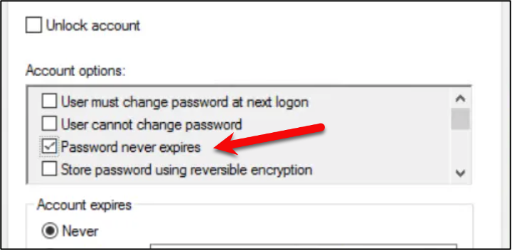
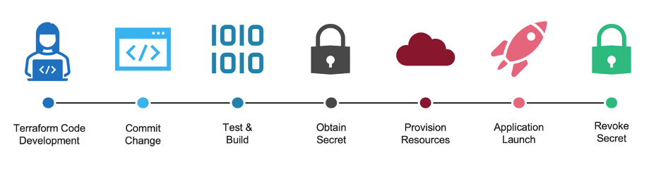

# Understanding the Importance of Secrets Management

## Introduction
Regardless of the type of environment you work in, there will be privileged credentials needed by applications, users, or other software platforms to manage your environment. Secrets can be anything your organization deems confidential and could cause harm to the company if shared or exposed. Examples could be database credentials to read customer data, a private key used to decrypt communications to your app server, or domain admin creds used by your vulnerability scanner during nightly runs. Managing these privileged credentials is an essential process that is critical to an organization's security posture. 

Secrets are used EVERYWHERE in organizations. Think about the credentials that were required for the last application or deployment you participated in, regardless of how basic or complex it was. As a human user, you likely need privileged credentials to provision resources in your production environment, like gaining access to VMware vCenter to deploy virtual machines, requesting a TLS certificate for your application, or logging into Terraform Cloud to provision Amazon EC2 instances. Moving over to the application side, they need access to additional services within your organization, like an internal API, a file share, or the ability to read/write to a database server to store data. The applications might need to register the service within your service catalog (service mesh) or execute a script that traverses a proxy and pulls down packages from Artifactory. These actions all require some privileged credential or secret that needs to be managed appropriately.

## Consolidation

So where should all these secrets live? Most organizations understand these secrets should be managed in some secret management solution. However, that doesn't always reflect what is actually in practice. I've worked with countless organizations that keep credentials in an Excel sheet, a OneNote document, or even a text file on their desktop. That strategy provides absolutely no security and exposes these companies to security breaches. Other organizations have taken a step further and used a consumer-based solution, like 1Password or LastPass, to store these long-lived credentials. It's better than nothing, but it doesn't provide the organization with complete visibility and management of credentials. Plus, we're talking about the practice of DevOps here, so it doesn't offer much in terms of automated retrieval or rotation either.

Ideally, organizations need to adopt a proper secret management tool that can be used to consolidate secrets and provide features such as role-based access control, rotation and revocation, expiration, and auditing capabilities.

## Long-Lived Secrets vs. Dynamic Secrets
Let's talk about the difference between long-lived secrets and dynamic secrets

### Long-Lived Credentials 
Not all secrets are created equal. Most organizations default to creating long-lived, static credentials that are often shared among teams and applications. Creating these credentials usually requires a long process, such as ticket creation, security approval, management approval, etc. Because obtaining credentials is often tedious, engineers and administrators will reuse or share these credentials among different applications rather than repeat this process. Be honest, how many times have you clicked this button in Active Directory? I know I have done it 100s of times in the past….

These reused and often shared credentials are hard to audit, can be impossible to rotate, and provide very little accountability. Additionally, these static credentials offer 24/7 access to the target system, even though access might only be needed for minutes per day.

### Dynamic Secrets

In contrast with static credentials, many organizations realize the benefits of migrating to dynamically generated secrets. Rather than create the credentials beforehand, applications can request credentials on-demand when needed. The application uses dynamic credentials to access a system or platform to perform work, and the credentials are then revoked/deleted afterward. If these dynamic credentials are accidentally written to a log file or committed to a code repository, it no longer becomes a security threat because they are already invalidated. And because dynamic credentials are accessible to applications (with proper authentication, of course), each instance of an application can generate its own credential to access the backend system.

For example, let's assume we're using Terraform to deploy our infrastructure to our favorite public cloud platform. If you were using static credentials, you would log into the cloud platform, create static credentials (probably highly privileged ones), and provide those credentials for Terraform to provision and manage your infrastructure. Those highly privileged credentials are valid 24/7, even though you only run Terraform a few times daily. On the other hand, if you were using a dynamic credential, Terraform could first obtain a credential, provision, or manage the infrastructure, and the credential would be invalidated after. When Terraform isn't running, there is no credential that can be exposed or misused. Even if the dynamic credential were written to logs or accidentally committed to a public GitHub repo, it wouldn't matter since it was revoked when the job was completed or after a minimal TTL.

## Access Control and Auditing

Access to secrets should be tightly controlled, and only authorized personnel should be able to access them. Ideally, two-factor authentication or a multi-step approval process should be in place for highly-privileged credentials, such as domain access, root credentials, or secrets used to obtain confidential data. Access should be limited to secrets based on an employee's role within the organization or an application's requirements to fulfill its duties. 

It is important that access to secrets should be closely monitored, and a log should be maintained of all actions taken of them. Logs should be ingested into a SIEM or log correlation systems, like Splunk, SumoLogic, or DataDog, to create dashboards and alert on specific actions. This can help quickly detect and respond to potential security threats within the organization. 

## Common Solutions

In a DevOps and automated world, secrets management solutions must be centered around a fully featured REST API. With such, access to the platform can be automated entirely by any orchestrator or pipeline tool the organization uses, simplifying company-wide adoption. Secrets Management tools such as HashiCorp Vault, AWS Secrets Manager, or Azure Key Vault can provide organizations with features such as encryption at rest, role-based access control, and auditing capabilities to help protect secrets. From my experience, the most popular tools used by organizations are:

* HashiCorp Vault
* CyberArk
* AWS Secrets Manager
* Azure Key Vault
* GCP Secret Manager
* Thycotic Secret Server

See you on [Day 36](day36.md).