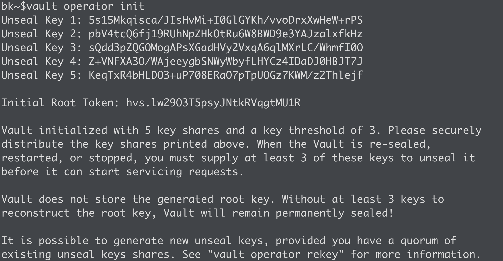
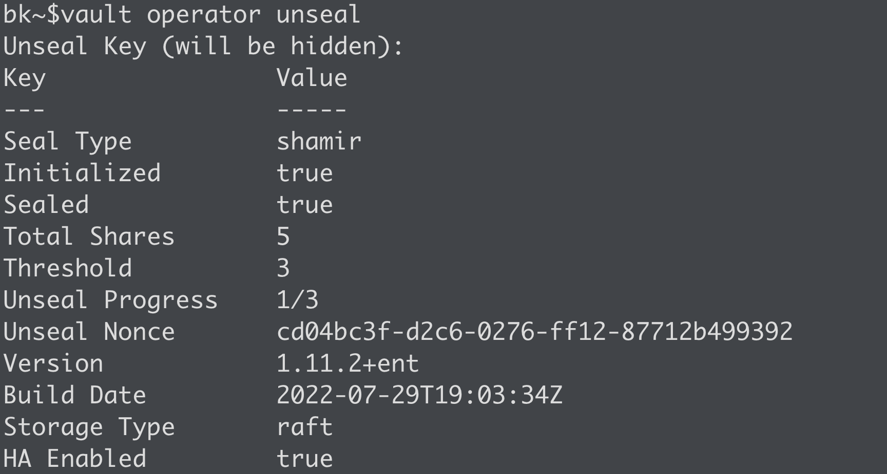

# Securing Secrets with HashiCorp Vault
 
In the world of secrets management, HashiCorp Vault tends to be the de facto standard, especially when it comes to DevOps environments. Tools such as Jenkins, Terraform, or even Kubernetes have tight integrations with Vault that allow you to securely store and retrieve secrets from your infrastructure as code pipelines. With a fully featured REST API, it's relatively simple to integrate into your existing workflows. As a result, secrets are consolidated and retrieved from a secure platform, all while improving your organization's security posture.
 
## Deploying a Simple Vault Environment
 
You have plenty of options when you need to get started with HashiCorp Vault. Depending on your skill set and available environment, Vault can be deployed on a physical server, a virtual machine (Amazon EC2, VMware vSphere, etc.), or in a containerized environment like Docker or Kubernetes. You can even launch Vault on a laptop/desktop if you just want to play around with a temporary instance using Vault "dev" mode. Regardless of your preference, integrating Vault with your applications and pipelines will be very similar.
 
## Deploy Vault on Kubernetes
 
When it comes to deploying Vault on Kubernetes, HashiCorp has made it incredibly simple by providing an official Helm chart. This [Helm chart](https://github.com/hashicorp/vault-helm) can be customized per your needs and can allow you to simply "install" an entire Vault environment right to your k8s cluster. Personally, I prefer [minikube](https://minikube.sigs.k8s.io/docs/start/) on my local machine to quickly launch a k8s cluster and, ultimately, quickly deploy a Vault environment to use for testing. If you want an example of a customized Helm chart, check out this [simple example](https://github.com/btkrausen/hashicorp/blob/master/vault/k8s/values.yml) on my GitHub, which was written for an OpenShift environment. More advanced configurations can be added, but this example should get you up and running quickly.
 
## Deploying on Virtual Machines
 
If Kubernetes isn't your thing, Vault also works flawlessly on traditional virtual machines. It's not as simple as a Helm chart, but having scripts and productional-level configuration files does simplify the process. From different Linux distros to Windows, you can choose almost any operating system you're comfortable with to run Vault in your environment. The Vault binary can be downloaded from the [HashiCorp releases page](https://releases.hashicorp.com/vault). This site makes it easy to download Vault manually or through automated means. Vault simply needs to be placed in your **$PATH** to start using it.
 
Beyond installing Vault, there are additional requirements that you'll want to consider. These requirements are similar to what you would need when running any service on a server, such as configuration files, service files, etc. The following are some of the requirements to consider:
* A [Vault configuration file](https://github.com/btkrausen/hashicorp/blob/master/vault/scripts/install_vault.sh) for each server
* A [system](https://github.com/btkrausen/hashicorp/blob/master/vault/config_files/vault.service) (or similar) file to manage the service (start, stop, etc.)
* Directory to store config files and logs
* A local, non-root user to run the Vault service
* Permissions/ownership of the directories for the user
 
As somebody who has worked on Vault for over six years and a dedicated member of the HashiCorp community, I have all of this on [my GitHub](https://github.com/btkrausen/hashicorp) for your consumption. These are files that I use for production-level deployments, so they are tried and tested in the real world. Feel free to use these as a starting point and customize them per your needs.
 
> If all this seems confusing, you can check out my [Getting Started with HashiCorp Vault Course](https://btk.me/v) to learn all about these configurations (and so much more!), along with getting access to hands-on labs.
 
## Vault is Up and Running. What's Next?
 
Once you have Vault up and running, there are a few steps to complete before integrating your workflows and applications. When any Vault cluster is first started, it needs to be initialized. In short, initialization is when Vault creates the encryption key, unseal or recovery keys, and prepares the storage backend for you. The simplest way to initialize a cluster is to use the 'vault operator init' command. If you're doing this in a production environment, consider encrypting the resulting unseal/recovery keys using PGP keys to ensure no one person has access to all the keys to the kingdom (pun intended!). Check out [my video here](https://youtu.be/QErHqzGH1mk) to see how to perform this step securely. Vault initialization will also return the initial root token, which, at this point, is the ONLY authentication mechanism to gain access to Vault.

Once Vault is initialized, you're only one step away from consuming all the goodness Vault has to offer. If you decided to use auto unseal, you're already there! Without auto unseal, Vault needs to be unsealed. Unsealing is the process of reconstructing the root key used to decrypt the encryption key, which is ultimately stored in memory and used to read/write data to the storage backend. If Vault is sealed, it's essentially useless, so this is an important step. You can use the 'vault operator unseal' command to unseal Vault. Vault will request an 'unseal key,' which was returned during the initialization process discussed above. Perform this step three times (assuming the defaults) to unseal Vault. By the way, you can [migrate to an auto unseal mechanism](https://youtu.be/HolUACQutpk) when you're ready. Once Vault is unsealed, we can start configuring the various components, such as auth methods, secrets engines, and audit devices. More on those on a later day!

 
Before wrapping up the day, there are a few additional topics I wanted to mention and discuss. Some aren't required for a lab environment but should be considered (or required!) for a production environment:
 
* Use TLS everywhere. Go ahead and mint a certificate from a trusted (internal) CA and practice good security from the start. If you like running vulnerable and insecure environments, or if you are running in a lab or for testing purposes, Vault supports disabling TLS by setting 'tls_disable = true' in the configuration file (listener 
stanza).
 
* Using a root token gives you complete, unrestricted access to anything in Vault. The root token is highly privileged and should NOT be shared. In fact, it is not evaluated against any Vault policies. Therefore, it is recommended to use the root token to perform the initial configuration, namely auth methods, and then the token should be revoked. [Another root token can be generated](https://youtu.be/rcQsNinVl0Y) in the future if needed.
 
* A single Vault node may be sufficient for lab environments if redundancy and high availability aren't a concern. If service uptime is essential, use a minimum of 3 nodes (assuming integrated storage). I recommend five nodes for production clusters to give you n + 2 redundancy, meaning you can lose up to two nodes, and the Vault service remains functional.

See you on [Day 37](day37.md).