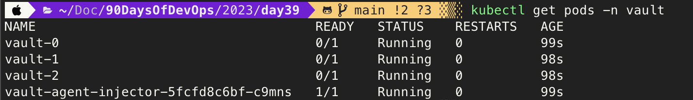
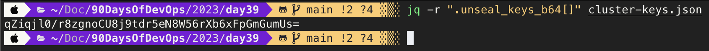
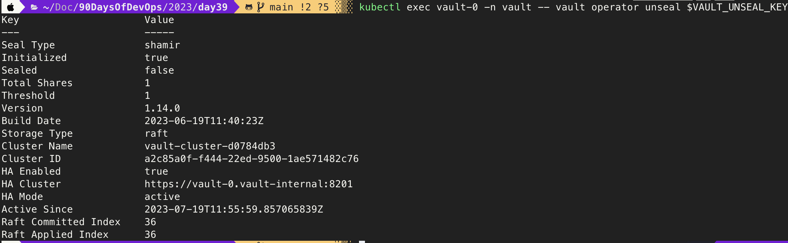
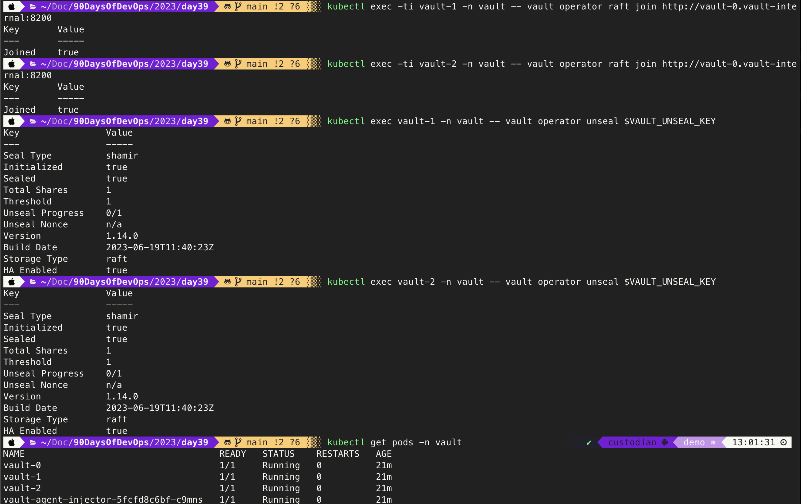
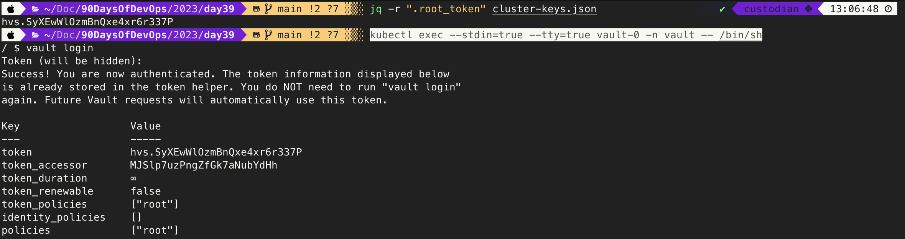
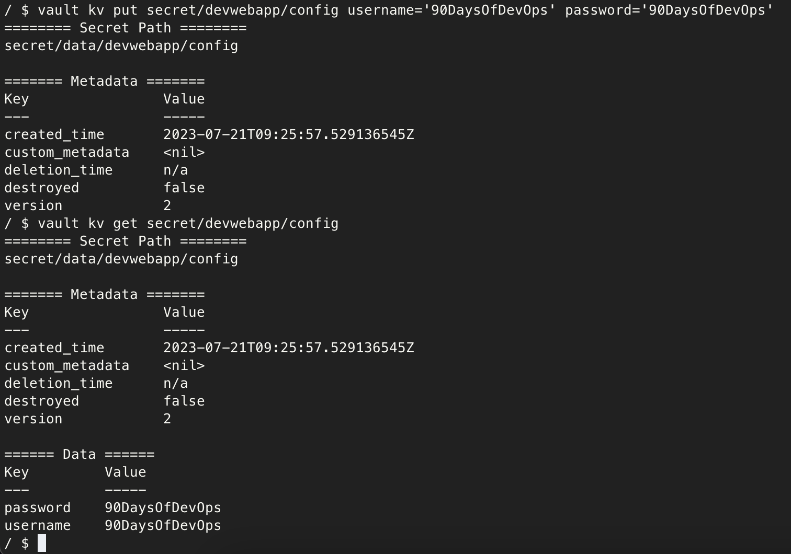
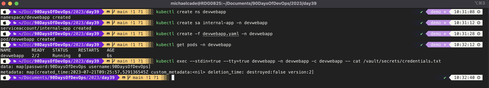

# Getting Hands-On with HashiCorp Vault 

A quick note to thank Bryan for the opening aspects of this Secrets Management section, @MichaelCade1 here to wrap things up and get some hands-on scenarios so that we can get some practical touch points and scenarios with HashiCorp Vault. 

A lot of what I will cover here can be found in existing [HashiCorp Tutorials](https://developer.hashicorp.com/vault) These resources from HashiCorp will go into a lot more different scenarios as well. 

## HashiCorp Vault CLI 

The first thing I want to walk through is getting the HashiCorp Vault CLI installed on our local machine. We have a great walkthrough from [HashiCorp on getting the CLI installed on your local machine.](https://developer.hashicorp.com/vault/tutorials/getting-started/getting-started-install) 

I am on my MacOS device but other instructions are also shown in the above link. 

`brew tap hashicorp/tap`

`brew install hashicorp/tap/vault`

Now when you run the `vault` command you should have access to the vault binary and sub commands. 


## Getting Vault up and running on Kubernetes

If you have been following along to any other sections in this project you will likely have seen that I am a big fan of Minikube when it comes to getting a local Kubernetes cluster up and running for learning or local development purposes. 

Vault is not exclusive in anyway to Kubernetes but I wanted to cover this scenario, HashiCorp also have a cloud SaaS option for Vault but it can be deployed many places. 

I use the below command to get my minikube up and running, you could just use `minikube start` but this is my go to for other demonstrations. 

`minikube start --addons volumesnapshots,csi-hostpath-driver --apiserver-port=6443 --container-runtime=containerd -p demo --kubernetes-version=1.26.0`

Now we have our cluster hopefully up and running, we will now use helm to deploy vault to our cluster. A quick google for helm installation steps will provide you with the how to make that happen. If you are on macos though then you can use homebrew to install 

`brew install helm`

Add the Hashicorp helm repo. 

`helm repo add hashicorp https://helm.releases.hashicorp.com`

There are several options and charts available to us within the repository, by running `helm search repo hashicorp` you will find the available hashicorp products and charts. 


For the rest of this walkthrough we will be taking this [tutorial](https://developer.hashicorp.com/vault/tutorials/kubernetes/kubernetes-minikube-raft) However we are going to be deploying vault to a dedicated namespace vs the default namespace. 

We will first create this file using the following command. 

```
cat > helm-vault-raft-values.yml <<EOF
server:
  affinity: ""
  ha:
    enabled: true
    raft: 
      enabled: true
EOF
```

I have added this file to a folder called day39 in the repository. 

We will use the following command now to deploy vault using helm. 

`helm install vault hashicorp/vault --namespace vault --values helm-vault-raft-values.yml --create-namespace`

By running `kubectl get pods -n vault` you should see the below output, it is expected to see the 3 pods in a 0/1 running state we are going to work through this next. 




Next we will initialise vault-0 with the following command, 

***"This command generates a root key that it disassembles into key shares -key-shares=1 and then sets the number of key shares required to unseal Vault -key-threshold=1. These key shares are written to the output as unseal keys in JSON format"***

```
kubectl exec vault-0 -n vault -- vault operator init \
    -key-shares=1 \
    -key-threshold=1 \
    -format=json > cluster-keys.json
```

We can then display the unseal key with jq again on macos if you want to get that installed you can do this with `brew install jq`

On your local machine you will now see a file called cluster-keys.json. The command to display the key is: 

`jq -r ".unseal_keys_b64[]" cluster-keys.json`

The output should look like this, 



We will then create a variable based on that key 

`VAULT_UNSEAL_KEY=$(jq -r ".unseal_keys_b64[]" cluster-keys.json)`

We can then go ahead and unseal our vault-0 pod with the following command: 

`kubectl exec vault-0 -n vault -- vault operator unseal $VAULT_UNSEAL_KEY`

This should display 



At this stage if you run `kubectl get pods -n vault` you should now see the vault-0 pod in a 1/1 running state. 

We will now join our other two pods vault-1 and vault-2 to our raft cluster using the following command. 

```
kubectl exec -ti vault-1 -n vault -- vault operator raft join http://vault-0.vault-internal:8200

kubectl exec -ti vault-2 -n vault -- vault operator raft join http://vault-0.vault-internal:8200
```

We can now unseal the two vault pods mentioned above with the following command. 

```
kubectl exec vault-1 -n vault -- vault operator unseal $VAULT_UNSEAL_KEY

kubectl exec vault-2 -n vault -- vault operator unseal $VAULT_UNSEAL_KEY
```

Take another look at the `kubectl get pods -n vault` command. Below is an output of all the recent commands. 



## Enable Key-Value secret engine 

In order for us to enable the secret engine we need to use the root token. This was also exported to the cluster-keys.json file we saw and used earlier for our unseal keys. If not following along you can see this JSON file in the day39 folder. 

`jq -r ".root_token" cluster-keys.json`

We must now exec into our vault-0 pod to enable the secret engine. 

`kubectl exec --stdin=true --tty=true vault-0 -n vault -- /bin/sh`




`vault secrets enable -path=secret kv-v2`

## Creating a new secret for our app 

As a simple test we want to create an application in its own namespace within our Kubernetes cluster to then communicate with vault in its own namespace. 

This is one thing that is not defined in the tutorial linked, and I wanted to provide a bit more real life use case because yes the default namespace can be used but that doesn't mean it should be. 

`vault kv put secret/devwebapp/config username='90DaysOfDevOps' password='90DaysOfDevOps'`

We can confirm what we have just created with the following command: 

`vault kv get secret/devwebapp/config`

You can see the above commands ran in my terminal below. 



Next we need to enable the Kubernetes authentication method.

`vault auth enable kubernetes`

Configure the Kubernetes authentication method to use the location of the Kubernetes API.

```
vault write auth/kubernetes/config \
    kubernetes_host="https://$KUBERNETES_PORT_443_TCP_ADDR:443"
```

We can now create our policy named devwebapp that enables the read capability for secrets at path secret/data/devwebapp/config

```
vault policy write devwebapp - <<EOF
path "secret/data/devwebapp/config" {
  capabilities = ["read"]
}
EOF
```

Create a Kubernetes authentication role named devweb-app, this has been taken from the tutorial from Hashicorp but notice that we define a namespace other than default. 

```
vault write auth/kubernetes/role/devweb-app \
        bound_service_account_names=internal-app \
        bound_service_account_namespaces=webdevapp \
        policies=devwebapp \
        ttl=24h
```
Now we can exit our vault-0 pod. 

`exit`

## Deploying our Application 

As mentioned now back into our Kubernetes cluster, it is time to create and deploy our application to complete this demo. 

Firstly, create the application namespace with

`kubectl create ns devwebapp`

We will now create our serviceaccount. 

`kubectl create sa internal-app -n devwebapp`

Now for our application, we will create the following yaml file and you will find this in the day39 folder. 

```
cat > devwebapp.yaml <<EOF
---
apiVersion: v1
kind: Pod
metadata:
  name: devwebapp
  labels:
    app: devwebapp
  annotations:
    vault.hashicorp.com/agent-inject: "true"
    vault.hashicorp.com/role: "devweb-app"
    vault.hashicorp.com/agent-inject-secret-credentials.txt: "secret/data/devwebapp/config"
spec:
  serviceAccountName: internal-app
  containers:
    - name: devwebapp
      image: jweissig/app:0.0.1
EOF
```
We will be deploying this to our newly created namespace with the following command. 

`kubectl create -f devwebapp.yaml -n devwebapp` 

Check the status of the pods. 

`kubectl get pods -n devwebapp`

Finally we can confirm that we have the correct credentials stored in our app. 

`kubectl exec --stdin=true --tty=true devwebapp -n devwebapp -c devwebapp -- cat /vault/secrets/credentials.txt`

Confirmation of this can be seen below, but hopefully you are seeing the same output as I have got below. 



I wanted to also add a resource from Nathanael Frappart, Nathanael covers everything in much more detail. 

[Vault kubernetes auth with AKS](https://nfrappart.github.io/2023/07/20/kubernetes-auth-aks.html)

See you on [Day 40](day40.md)