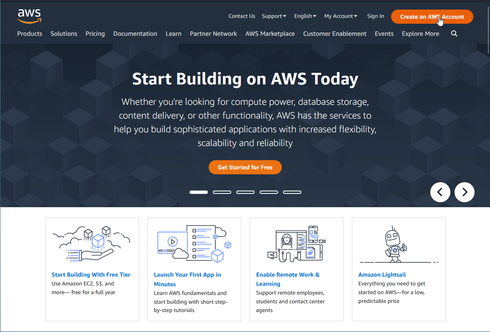
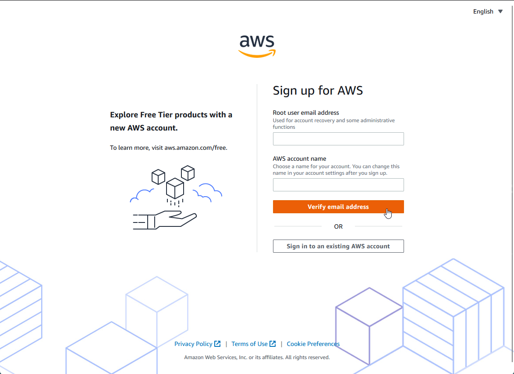
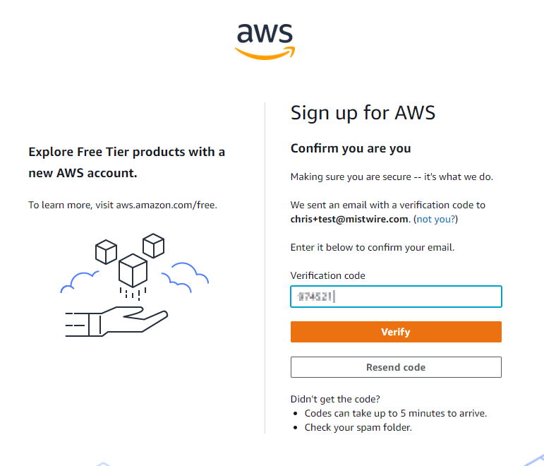
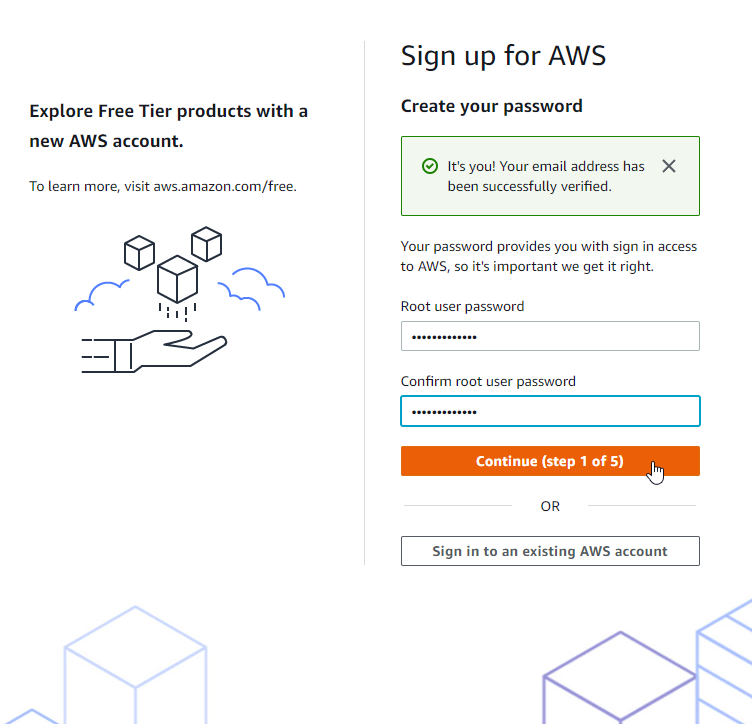
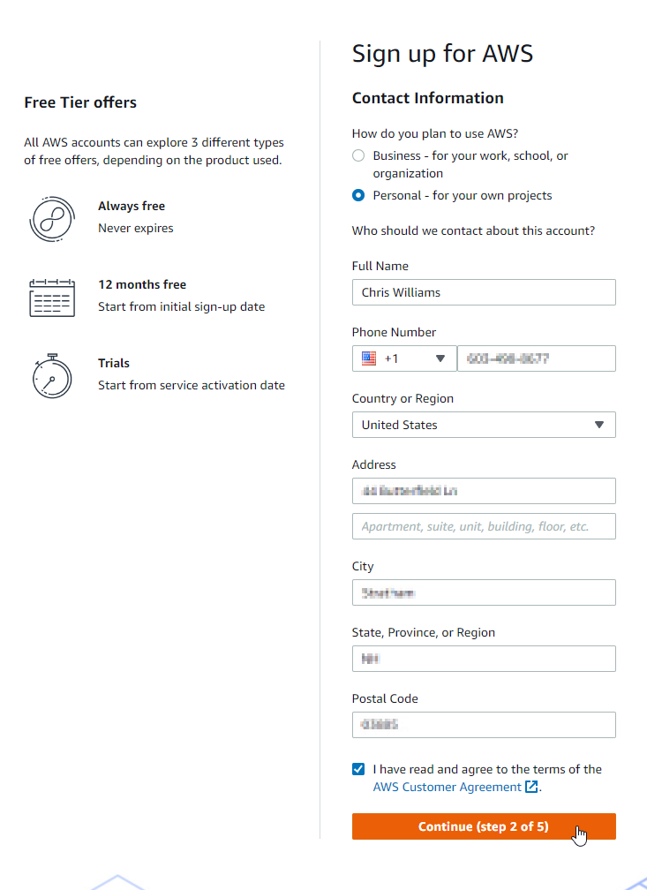
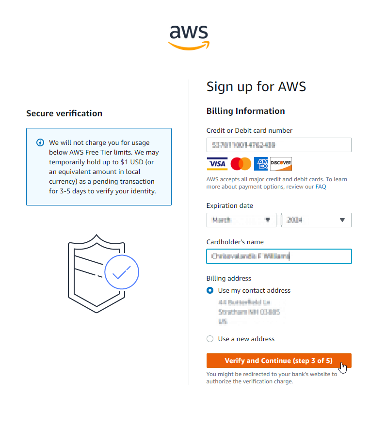
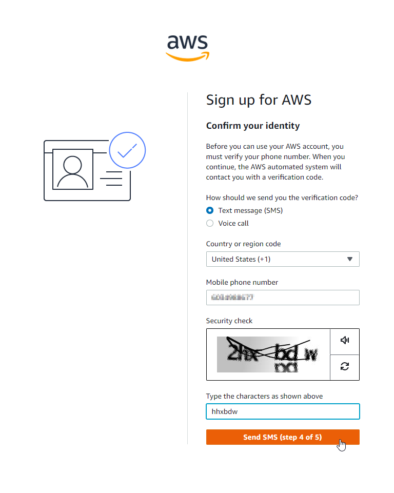
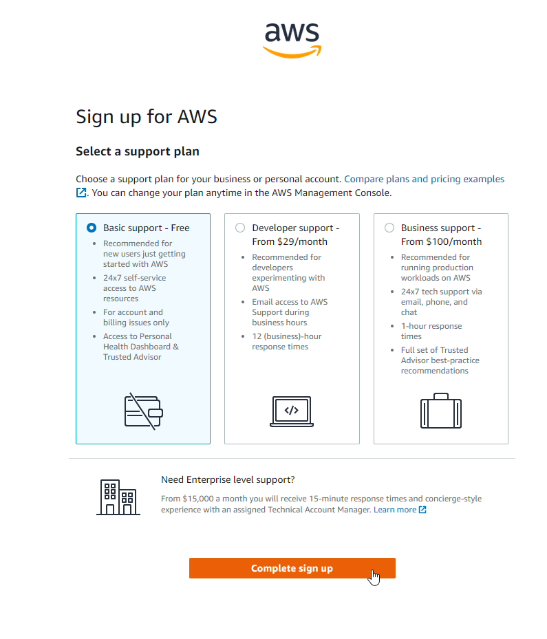

# Day 50: Get a Free Tier Account & Enable Billing Alarms

AWS offers a free tier account that allows users to access and experiment with various AWS services without incurring any charges for a limited period of time. In this article, we will guide you through the steps to sign up for a free tier AWS account.

## Step 1: Go to the AWS website

The first step to signing up for a free tier AWS account is to go to the AWS website. You can access the website at https://aws.amazon.com. On the website, click on the "Create an AWS Account" button on the top right corner of the page:

## Step 2: Create an AWS account

Once you click on the "Create an AWS Account" button, you will be directed to the AWS sign-in page. If you already have an AWS account, you can sign in using your email address and password. If you do not have an account, provide an email address, an AWS account name, & click the "Verify email address" button. You will then be sent an email with the a verification code to provide back. 

## Step 3: Provide your account information

On the next page, you will be asked to provide your account information. You will be required to provide your password, full name, company name, and a phone number. After entering your information, click on the "Continue" button.

## Step 4: Provide your payment information

To sign up for the free tier account, you will need to provide your payment information. AWS requires this information to verify your identity and prevent fraud. However, you will not be charged for the free tier services, as they are provided at no cost for 1 year. After providing your payment information, click on the "Verify and Continue" button. The next page will send an SMS or voice call to your phone to verify your identity.

## Step 5: Select a support plan

After providing your payment information, you will be directed to the support plan page. Here you can choose what level of support you want, for our needs we will use the *Basic support - Free* option. Once you have provided this information, click on the "Complete sign up" button.

## Next steps:

Once you have access to your free tier account, there are a few additional steps you'll want to perform. Of these steps, I'd argue that creating a billing alarm is THE most important... *so don't skip it!!* 
1. [Create a billing alarm](https://docs.aws.amazon.com/AmazonCloudWatch/latest/monitoring/monitor_estimated_charges_with_cloudwatch.html)
2. [Enable MFA on your root user](https://docs.aws.amazon.com/accounts/latest/reference/root-user-mfa.html) 
3. [Create an IAM user](https://docs.aws.amazon.com/IAM/latest/UserGuide/id_users_create.html) for regular tasks and *never* use the root user account except for tasks that can only be performed by it. 

## Resources
[Create your free AWS account](https://youtu.be/uZT8dA3G-S4)

[Generate credentials, budget, and billing alarms via CLI](https://youtu.be/OdUnNuKylHg)
See you in [Day 51](day51.md).
