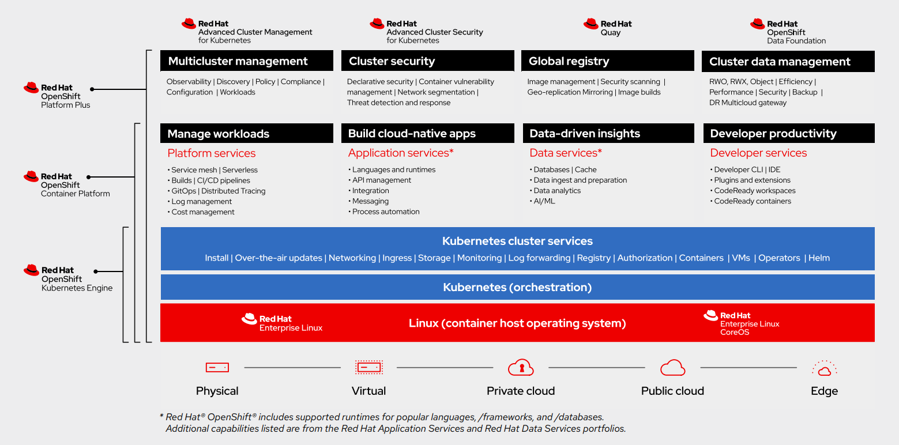

# Why choose an enterprise Kubernetes platform?

In the original #90DaysOfDevOps, [Michael covered Kubernetes](https://github.com/MichaelCade/90DaysOfDevOps/blob/main/2022.md#kubernetes) from what it is, to a basic installation, and looking around the various components that make up the ability to deploy and consume containers.

When you look at Kubernetes offerings, there is the open-source do-it-yourself offering, typically known as vanilla Kubernetes, or you have an enterprise offering. An enterprise Kubernetes platform provides a more comprehensive set of features and services than a vanilla Kubernetes. These features and services may include advanced security, auditing, and logging capabilities, as well as simplified deployment, configuration, and management capabilities. In addition, enterprise Kubernetes platforms provide support for a variety of cloud providers, and often come with additional features such as multi-cluster management, cloud-native storage and networking, and automated compliance checks. These features and services make it easier for organizations to manage their Kubernetes clusters and ensure that they are secure, compliant, and optimized for performance.

Some of the leading vendors offering Enterprise Kubernetes include Red Hat OpenShift, Google Anthos, Amazon EKS, Microsoft Azure Kubernetes Service, and VMware Tanzu. There are of course a lot more to add to this list!

Of course for this section, we are dedicating ourselves to Red Hat OpenShift.

I decided to cheat a bit for this opening, and consult ChatGPT, the AI Service of the moment, to provide an opinion on why Red Hat OpenShift.

>Why choose an enterprise Kubernetes platform such as Red Hat OpenShift?
>
>
>1. Automation and Enterprise-grade Security: Red Hat OpenShift provides an automated platform to help you deploy, manage, and scale your applications quickly and easily while ensuring that the underlying infrastructure is secure.
>
>2. Open Source: Red Hat OpenShift is built on top of open source technologies such as Kubernetes, Docker, and Red Hat Enterprise Linux. This ensures that your applications are always up-to-date with the latest technologies.
>
>3. Continuous Integration and Delivery: Red Hat OpenShift provides an integrated set of tools for continuous integration and delivery that make it easy to deploy and manage your applications in a secure and reliable manner.
>
>4. Scalability and High Availability: Red Hat OpenShift provides a highly available and scalable platform that can handle large amounts of traffic and data without any downtime.
>
>5. Cost Savings: Red Hat OpenShift provides a cost-effective solution for running your applications in the cloud. You can save money on infrastructure and operations costs by leveraging OpenShift's automated platform.


# What does Red Hat OpenShift bring to the party?

Red Hat has developed OpenShift based on a Open Souce platform (Kubernetes) and even distributes the OpenShift platform enhancements as Open Source as well under the guise of [OpenShift Kubernetes Distribution (OKD)](https://www.okd.io).

This distribution of Kubernetes is designed around providing the user continous application developlment and multi-tenant capabilities, with embedded security tooling, lifecycle management, and operational management.

## Out-of-the-Box Features

Again, this is not an exhausive list:

- Pre-built container images and a container runtime environment.
- Integrated, open source platform and container runtime environment.
- Access to a wide range of services such as databases, messaging, and storage.
  - These services are provided by [Red Hat Ecosystem Catalog](https://catalog.redhat.com/), which allows third parties to ensure their software is certified for the platform, and provides users an easy way to consume the software within the platform.
- Platform for deploying custom applications.
- Web-based user interface, command line tools, and an API.
- Monitoring and logging capabilities.
- Security and resource isolation.
- Automated build and deployment pipelines.
- Continuous integration and continuous delivery (CI/CD) capabilities.

You can read a more indepth coverage of the benefits and features of Red Hat OpenShift in [this datasheet](https://www.redhat.com/en/resources/openshift-container-platform-datasheet), or a full breakdown on the [Red Hat Developers page](https://developers.redhat.com/products/openshift/overview)



## Where can I deploy OpenShift?

As mentioned early, OpenShift can be deployed across the majority of platforms you can think of, within your own datacenter, either bare metal or to a hypervisor, stretching out into the Cloud offerings, either self-managed or managed by Red Hat. Below are the current platforms listed as covered, at the time of writing this article.

- Cloud Services Editions - Managed by Red Hat
  - [AWS (ROSA)](https://www.redhat.com/en/technologies/cloud-computing/openshift/aws)
    - Billed by AWS
  - [Azure](https://www.redhat.com/en/technologies/cloud-computing/openshift/azure)
    - Billed by Microsoft
  - [IBM Cloud](https://www.redhat.com/en/technologies/cloud-computing/openshift/ibm)
    - Billed by IBM
  - [Red Hat Dedicated](https://www.redhat.com/en/resources/openshift-dedicated-datasheet) - Hosted in the cloud, dedicated to a single customer.
    - Deployed to either AWS or GCP
    - Billed by Red Hat for the OpenShift Software, billed by AWS/GCP for the cloud infrastructure used

How is Red Hat OpenShift Service on AWS/Azure different to Red Hat OpenShift Dedicated?

```

Red Hat OpenShift Service on AWS is a fully managed implementation of OpenShift Container Platform deployed and operated on AWS, jointly managed and supported by both Red Hat and AWS.

Red Hat OpenShift Dedicated is a service hosted and fully-managed by Red Hat that offers clusters in a virtual private cloud on AWS or Google Cloud Platform.
```

- Self-Managed Editions - Managed by you
  - Amazon Web Services (AWS)
  - Google Cloud Platform (GCP)
  - Microsoft Azure
  - Microsoft Azure Stack Hub
  - Red Hat OpenStack Platform (RHOSP) versions 16.1 and 16.2
  - IBM Cloud VPC
  - Nutanix
  - Red Hat Virtualization (RHV)
  - VMware vSphere
  - VMware Cloud (VMC) on AWS
  - Alibaba Cloud
  - Bare metal
  - IBM Z or LinuxONE
  - IBM Power

## Getting access to a trial

Getting started with OpenShift is simple. They give you the ability trial three options:
- Developer Sandbox - A hosted instance of OpenShift for you to consume straight away for 30 days
- Managed Service - A fully managed Red Hat OpenShift dedicated instance for you to consume, you will need to provide the AWS or GCP cloud account to deploy this into. 60 day trial. 
- Self-Managed - Deploy OpenShift yourself to any of the platforms named above. 60 day trial. 

You'll need to sign up for a Red Hat account to access the trial and get the software details to deploy. 
- [Try Red Hat OpenShift](https://www.redhat.com/en/technologies/cloud-computing/openshift/try-it)

# Next Steps - Understanding the OpenShift Architecture + Spinning up an instance!

In [day 57](/day57.md) we will dive into the Architecture and components of OpenShift, moving onto spinning up our own OpenShift Environment in [day 58](/day58.md).

# Resources

- [OKD](https://www.okd.io/)
- [Official Red Hat OpenShift product page](https://www.redhat.com/en/technologies/cloud-computing/openshift)
- [Red Hat Hybrid Cloud Learning Hub](https://cloud.redhat.com/learn)

