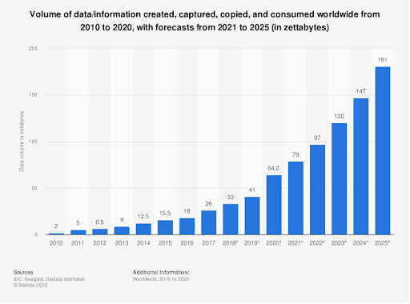
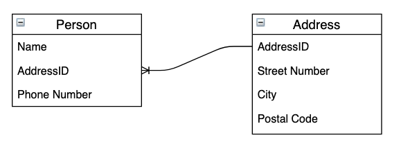

# An introduction to databases

Welcome to the 90DaysOfDevOps database series. Over the next seven days we’ll be talking about all things database related!

The aim of this series of blog posts is to provide an introduction to databases and their various concepts so that you will be able to make an informed choice when deciding how to store data in your future projects.

Here’s what we’ll be covering: -

- [An introduction to databases](./day63.md)
- [Querying data in databases](./day64.md)
- [Backing up databases](./day65.md)
- [High availability and disaster recovery](./day66.md)
- [Performance tuning](./day67.md)
- [Database security](./day68.md)
- [Monitoring and troubleshooting database issues](./day69.md)

We’ll also be providing examples to accompany the concepts discussed. In order to do so you will need Docker Desktop installed. Docker can be downloaded here (https://www.docker.com/products/docker-desktop/) and is completely free.

Alternatives to Docker Desktop can be used (such as Rancher Desktop or Finch) but the examples will focus on Docker.

We'll be using a custom PostgreSQL image in the examples and connecting with pgAdmin: -
https://www.pgadmin.org/ 

 

# About Us

<b>Andrew Pruski</b> 
Andrew is a Field Solutions Architect working for Pure Storage. He is a Microsoft Data Platform MVP, Certified Kubernetes Administrator, and Raspberry Pi tinkerer. You can find him on twitter [@dbafromthecold](https://twitter.com/dbafromthecold), [LinkedIn](https://www.linkedin.com/in/andrewpruski/), and blogging at [dbafromthecold.com](https://dbafromthecold.com/)

<b>Taylor Riggan</b> 
Taylor is a Sr. Graph Architect on the Amazon Neptune development team at Amazon Web Services. He works with customers of all sizes to help them learn and use purpose-built NoSQL databases via the creation of reference architectures, sample solutions, and delivering hands-on workshops.  You can find him on twitter [@triggan](https://twitter.com/triggan) and [LinkedIn](https://www.linkedin.com/in/triggan/).

 

# Why databases?

The total amount of data created worldwide is predicted to reach 181 zetabytes by 2025.

That’s 181 billion terabytes!

source - https://www.statista.com/statistics/871513/worldwide-data-created/ 

Imagine if all that data was stored in flat files, for example excel sheets! OK, storing that data might not be such an issue, just save the file on a networked drive and all good! But what about when it comes to retrieving that data? What about updating a single record amongst hundreds, thousands, millions of files?

This is where database technologies come into play. Databases give us the ability to not only store data but to easily retrieve, update, and delete individual records.

 

# Relational databases

## History & Background

When it comes to databases, there are two main types...relational and non-relational (or NoSQL) databases.

SQL Server, Oracle, MySQL, and PostgreSQL are all types of relational databases.

Relational databases were first described by Edgar Codd in 1970 whilst he was working at IBM in a research paper , [“A Relation Model of Data for Large Shared Data Banks"](https://dl.acm.org/doi/pdf/10.1145/362384.362685).

This paper led the way for the rise of the various different relational databases that we have today.

## Data Model

In a relational database, data is organised into tables (containing rows and columns).  Relationships are generated by creating cross-references between rows in different tables. 

For example, a Person table may have an addressID column which points to a row within an Address table, this allows for an end user or application to easily retrieve a record from the Person table and the related record from the Address table. 

The AddressID column is a unique “key” in the Address table but is present in the Person table as a “foreign key”.  We display this relationship in the diagram above.  This is a simple example of an [Entity-Relationship](https://en.wikipedia.org/wiki/Entity%E2%80%93relationship_model) diagram that shows the structure of our database.

The design of the tables and the relations between them in a relational database is said to be the database schema. The process of building this schema is called [database normalisation](https://en.wikipedia.org/wiki/Database_normalization).

Data is selected, updated, or deleted from a relational database via a programming language called SQL (Structured Query Language).  We'll cover some of the basic concepts of SQL in [Day 64](./day64.md).

## Indexes

In order to support retrieving data from tables in a relational database, there is the concept of “indexes”. In order to locate one row or a subset of rows from a table, indexes provide a way for queries to quickly identify the rows they are looking for, without having to scan all the rows in the table. 

The analogy often used when describing indexes is an index of a book. The user (or query) uses the index to go directly to the page (or row) they are looking for, without having to “scan” all the way through the book from the start.

Queries accessing databases can also be referred to as transactions…a logical unit of work that accesses and/or modifies the data. In order to maintain consistency in the database, transactions must have certain properties. These properties are referred to as [ACID](https://en.wikipedia.org/wiki/ACID) properties: -

A - Atomic - all of the transaction completes or none of it does 
C - Consistency - the data modified must not violate the integrity of the database 
I - Isolation - multiple transactions take place independently of one another 
D - Durability - Once a transaction has completed, it will remain in the system, even in the event of a system failure.

We will go through querying relational databases in the [next blog post](./day64.md).

 

# Non-Relational databases

The downside of relational databases is that the data ingested has to "fit" to the structure of the database schema. But what if we're dealing with large amounts of data that doesn't match that structure?

This is where non-relational databases come into play. These types of databases are referred to as NoSQL (non-SQL or Not Only SQL or NewSQL) databases and are either schema-free or have a schema that allows for changes in the structure.

Apache Cassandra, MongoDB, and Redis are all types of NoSQL databases.

Non-relational databases have existed since the 1960s but the term “NoSQL” was used in 1998 by Carlo Strozzi when naming his Strozzi NoSQL database, however that was still a relational database. It wasn’t until 2009 when Johan Oskarsson reintroduced the term when he organised an event to discuss “open-source distributed, non-relational databases”.
There are various different types of NoSQL databases, all of which store and retrieve data differently.

## Types of Non-Relational Databases

### Wide-Coluumn or Key-Value Stores

[Apache Cassandra](https://cassandra.apache.org/_/index.html) is a wide-column store database. It uses tables, rows, and columns like a relational database but the names and formats of the columns can vary from row to row in the same table. It uses Cassandra Query Language (CSQL) to access the data stored.  Wide-column databases, or key-value stores, are optimized for storing very large datasets and servicing millions of queries to perform simple look-ups by a "key", or a single value.  These are used in place of a Relational Database when there is a requirement to scale-out the underlying infrastructure to multiple machines in order to process so many requests.

### Document Stores

[MongoDB](https://www.mongodb.com/) is a document store database. Data is stored as objects (documents) within the database that do not adhere to a defined schema. MongoDB supports a variety of methods to access data, such as range queries and regular expression searches.  Document stores extend the thinking of key-value stores by servicing lots of requests (millions, at-scale) but also allowing a user to write queries on nested attributes.  Documents are typically formated as JSON (not Microsoft Office documents ;) ), and the nested structure of JSON provides an easy means to define query filters on JSON document attributes.

### In-Memory Databases

[Redis](https://redis.io/) is a distributed in-memory key-value database. Redis supports many [different data structures](https://redis.com/redis-enterprise/data-structures/) - sets, hashes, lists, etc. The records can be identified using a unique key. Redis supports various different programming languages in order to access the data stored.  In-memory stores are used when fast (sub-millisecond) access times are required.  They trade-off a higher cost and lack of immediate persistency for fast access.  Developers will often use in-memory stores as a cache in front of other databases, or to optimize aggregations. Redis supports a data structure called a sorted-set, which pre-sorts data and will perform better than an `ORDER BY` query in other databases.  You might want to use this sort of pattern if you're building a product website and showing your users what are the best-selling products on your site (sorted by number of purchases).

### Graph Databases

[Neo4j](https://neo4j.com) is an open-source graph database.  Graph databases are designed to store and query highly connected datasets with many relationships.  Data is stored as vertices (or nodes) and edges (or relationships) and a number of attributes (called properties) that can describe a vertex or an edge.  Graph databases are optimized for querying across the many connections in the dataset, patterns that may require complex `JOIN` patterns in a relational database.  The query languages supported by Graph databases allow a user to easily express these types of "traversal" patterns.  Allowing for concepts like recursion that are not easily expressed in languages such as SQL.

 

NoSQL databases typically trade-off the concept of ACID compliant transactions for their ability to scale or service specific types of data access patterns.  If you want to understand these concepts better, we suggest you look into [CAP Theorem](https://en.wikipedia.org/wiki/CAP_theorem). 

CAP Theorem is a concept from Computer Science that discusses the tradeoffs between data Consistency, Availability, and Partitioning.  Each has pros and cons when it comes to storing data, which ones to use would be decided on the type of data that is being ingested. 

 

# When to use relational vs non-relational databases

This is an interesting question and the answer, unfortunately, is it depends.

It all depends on the type of data being stored, where it is to be stored, and how it is to be accessed.

If you have data that is highly structured, stored in a central location, and will be accessed by complex queries (such as reports), then a relational database would be the right choice.

If however, the data is loosely-structured, needs to be available in multiple regions, and will be retrieved with a specific type of query (e.g.- a quick lookup in a key/value store), then a non-relational database would be the right choice.

There is a massive caveat with the statements above however…there are types of non-relational databases that can handle large, complex queries likewise relational databases have features that allow for data to be available in multiple regions.

It also comes down to the skillset of the people involved, for example, Andrew is a former SQL Server DBA…so we know what his default choice would be when choosing a type of database! 

While, in contrast, Taylor works on the development team for one of the more popular, cloud-hosted, graph databases, so he is more likely to start with a NoSQL data store.  

The great thing about databases is that there are so many choices to choose from within the realm of commercial offerings, cloud services, and the open-source ecosystem. The amount of choice, however, can be daunting for someone new to this space

Join us tommorrow when we'll be talking about querying databases.

Thanks for reading!

See you in [Day 64](day64.md).
