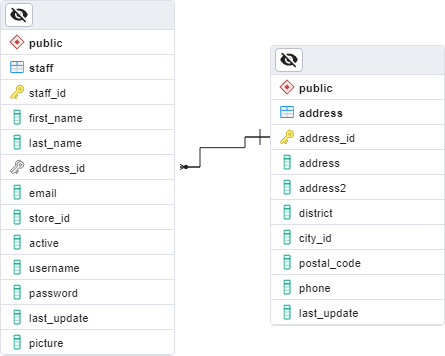

# Querying data in databases

Hello and welcome to the second post in the database part of the 90 Days of DevOps blog series!

In this post we will be going through spinning up an instance of PostgreSQL in a docker container, retrieving data, and then updating that data.

So let’s get started!

 

# Software needed

To follow along with the scripts in this blog post, you will need docker installed and pgAdmin.

Both are completely free and can be downloaded here: -

Docker - https://www.docker.com/products/docker-desktop/  
pgAdmin - https://www.pgadmin.org/ 

 

# Running PostgreSQL

We have created a custom PostgreSQL docker image which has a demo database ready to go.

In order to run the container, open a terminal and execute: -

    docker run -d \
    --publish 5432:5432 \
    --env POSTGRES_PASSWORD=Testing1122 \
    --name demo-container \
    ghcr.io/dbafromthecold/demo-postgres:latest

This will pull the image down from our github repository and spin up an instance of PostgreSQL with a database, dvdrental, ready to go.

Note - the image size is 437MB which may or may not be an issue depending on your internet connection

Confirm the container is up and running with: -

    docker container ls

Then open pgAdmin and connect with the server name as *localhost* and the password as *Testing1122*

 

# Selecting data

Once you’ve connected to the instance of PostgreSQL running in the container, let’s look at the staff table in the dvdrental database. Right click on the dvdrental database in the left-hand menu and select Query Tool.

To retrieve data from a table we use a SELECT statement. The structure of a SELECT statement is this: -

    SELECT data_we_want_to_retrieve
    FROM table
    WHERE some_condition

So to retrieve all the data from the staff table, we would run: -

    SELECT *
    FROM staff

The * indicates we want to retrieve all the columns from the table.

If we wanted to only retrieve staff members called “Mike” we would run: -

    SELECT *
    FROM  staff
    WHERE first_name = ‘Mike’

OK, now let’s look at joining two tables together in the SELECT statement.

Here is the relationship between the staff and address tables: -

From the Entity Relational Diagram (ERD), which is a method of displaying tables in a relational database, we can see that the tables are joined on the address_id column.

The address_id column is a primary key in the address table and a foreign key in the staff table.

We can also see (by looking at the join) that this is a many-to-one relationship…aka rows in the address table can be linked to more than one row in the staff table.

Makes sense as more than one member of staff could have the same address.

Ok, in order to retrieve data from both the staff and address tables we join them in our SELECT statement: -

    SELECT *
    FROM staff s
    INNER JOIN address a ON s.address_id = a.address_id

That will retrieve all the rows from the staff table and also all the corresponding rows from the address table…aka we have retrieved all staff members and their addresses.

Let’s limit the query a little. Let’s just retrieve some data from the staff table and some from the address table for one staff member

    SELECT s.first_name, s.last_name, a.address, a.district, a.phone
    FROM staff s
    INNER JOIN address a ON s.address_id = a.address_id
    WHERE first_name = ‘Mike’

Here we have only retrieved the name of any staff member called Mike and their address.

You may have noticed that when joining the address table to the staff table we used an <b>INNER JOIN</b>.

This is a type of join that specifies only to retrieve rows in the staff table that has a corresponding row in the address table.

The other types of joins are: -

<b>LEFT OUTER JOIN</b> - this would retrieve data in the staff table even if there was no row in the  address table

<b>RIGHT OUTER JOIN</b> - this would retrieve data in the address table even if there was no row in the staff table

<b>FULL OUTER JOIN</b> - this would retrieve all data from the tables even if there was no corresponding matching row in the other table

If we run: -

    SELECT *
    FROM staff s
    RIGHT OUTER JOIN address a ON s.address_id = a.address_id

We will get all the rows in the address table that do not have a corresponding row in the staff table.

But, if we run: -

    SELECT *
    FROM staff s
    LEFT OUTER JOIN address a ON s.address_id = a.address_id

We will still only get records in the staff table that have a record in the address table.

 

# Inserting data

This is due to the FOREIGN KEY constraint linking the two tables, if we tried to insert a row into the staff table and the address_id we specified did not exist in the address table we would get an error: -

    ERROR:  insert or update on table "staff" violates foreign key constraint "staff_address_id_fkey"

This is because the foreign key is saying that a record in the staff table must reference a valid row in the address table.

Enforcing this relationship is enforcing the referential integrity of the database…i.e. - maintaining consistent and valid relationships between the data in the tables.

So we have to add a row to the staff table that references an existing row in the address table.

So an example of this would be: -

    INSERT INTO staff(
    staff_id, first_name, last_name, address_id, 
    email, store_id, active, username, password, last_update, picture)
    VALUES
    (999, 'Andrew', 'Pruski', 1, 'andrew.pruski@90daysofdevops.com', 
    '2', 'T', 'apruski', 'Testing1122', CURRENT_DATE, '');

Notice that we specify all the columns in the table and then the corresponding values.

To verify that the row has been inserted: -

    SELECT s.first_name, s.last_name, a.address, a.district, a.phone
    FROM staff s
    INNER JOIN address a ON s.address_id = a.address_id
    WHERE first_name = 'Andrew'

And there is our inserted row!

 

# Updating data

To update a row in a table we use a statement in the format: -

    UPDATE table
    SET column = new_value
    WHERE some_condition

OK, now let’s update the row that we inserted previously. Say the staff member’s email address has changed. To view the current email address: -

    SELECT s.first_name, s.last_name, s.email
    FROM staff s
    WHERE first_name = 'Andrew'

And we want to change that email value to ‘andrewxpruski@outlook.com’. To update that value: -

    UPDATE staff
    SET email = 'apruski@90daysofdevops.com'
    WHERE first_name = 'Andrew'

You should see that one row has been updated in the output. To confirm run the SELECT statement again: -

    SELECT s.first_name, s.last_name, s.email
    FROM staff s
    WHERE first_name = 'Andrew'

 

# Deleting data

To delete a row from a table we use a statement in the format: -

    DELETE FROM table
    WHERE some_condition

So to delete the row we inserted and updated previously, we can run: -

    DELETE FROM staff
    WHERE first_name = ‘Andrew’

You should see that one row was deleted in the output. To confirm: -

    SELECT s.first_name, s.last_name, s.email
    FROM staff s
    WHERE first_name = 'Andrew'

No rows should be returned.

 

# Creating tables

Let’s have a look at the definition of the staff table. This can be scripted out by right-clicking on the table, then Scripts > CREATE Script

This will open a new query window and show the statement to create the table.

Each column will be listed with the following properties: -

    Name - Data type - Constraints

If we look at the address_id column we can see: -

    address_id smallint NOT NULL

So we have the column name, that it is a smallint data type (https://www.postgresql.org/docs/9.1/datatype-numeric.html), and that it cannot be null. It cannot be null as a FOREIGN KEY constraint is going to be created to link to the address table.

The columns that are a character datatype also have a COLLATE property. Collations specify case, sorting rules, and accent sensitivity properties. Each character datatype here is using the default setting, more information on collations can be found here: -
https://www.postgresql.org/docs/current/collation.html

Other columns also have default values specified…such as the <b>last_update</b> column: -

    last_update timestamp without time zone NOT NULL DEFAULT 'now()'

This says that if no value is set for the column when a row is inserted, the current time will be used.

Then we have a couple of constraints defined on the table. Firstly a primary key: -

    CONSTRAINT staff_pkey PRIMARY KEY (staff_id)

A primary key is a unique identifier in a table, aka this row can be used to identify individual rows in the table. The primary key on the address table, address_id, is used as a foreign key in the staff table to link a staff member to an address.

The foreign key is also defined in the CREATE TABLE statement: -

    CONSTRAINT staff_address_id_fkey FOREIGN KEY (address_id)
        	REFERENCES public.address (address_id) MATCH SIMPLE
        	ON UPDATE CASCADE
        	ON DELETE RESTRICT

We can see here that the address_id column in the staff table references the address_id column in the address table.

The ON UPDATE CASCADE means that if the address_id in the address table is updated, any rows in the staff table referencing it will also be updated. (Note - it’s very rare that you would update a primary key value in a table, I’m including this here as it’s in the CREATE TABLE statement).

The ON DELETE RESTRICT prevents the deletion of any rows in the address table that are referenced in the staff table. This prevents rows in the staff table having references to the rows in the address table that are no longer there…protecting the integrity of the data.

OK so let’s create our own table and import some data into it: -

    CREATE TABLE test_table (
      id smallint,
      first_name VARCHAR(50),
      last_name VARCHAR(50),
      dob DATE,
      email VARCHAR(255),
      CONSTRAINT test_table_pkey PRIMARY KEY (id)
    )

NOTE - VARCHAR is an alias for CHARACTER VARYING which we saw when we scripted out the staff table

Ok, so we have a test_table with 6 columns and a primary key (the id column).

Let’s go and import some data into it. The docker image that we are using has a test_data.csv file in the /dvdrental directory and we can import that data with: -

    COPY test_table(id,first_name, last_name, dob, email)
    FROM '/dvdrental/test_data.csv'
    DELIMITER ','
    CSV HEADER;

To verify: -

    SELECT * FROM test_table

So that’s how to retrieve, update, and delete data from a database. We also looked at creating tables and importing data. 

Join us tommorrow where we will be looking at backing up and restoring databases.

Thank you for reading!

See you in [Day 65](day65.md).
