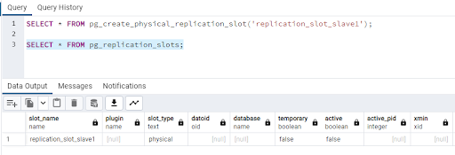
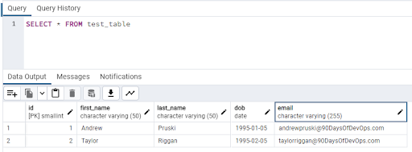

# High availability and disaster recovery

Hello and welcome to the fourth post in the database part of the 90 Days of DevOps blog series! Today we’ll be talking about high availability and disaster recovery.

One of the main jobs of a database administrator is to configure and maintain disaster recovery and high availability strategies for the databases that they look after. In a nutshell they boil down to: -

<b>Disaster recovery (DR)</b> - recovering databases in the event of a site outage. 
<b>High availability (HA)</b> - ensuring databases stay online in the event of a server outage.

Let’s go through both in more detail.

 

# Disaster recovery

Database administrators are a paranoid bunch (Andrew nodding his head). It’s their job to think about how the database servers will fail and how best to recover from that failure.

Two main factors come into play when thinking about disaster recovery…

<b>RTO - Recovery Time Objective</b>  - How long can the databases be offline after a failure? 
<b>RPO - Recovery Point Objective</b>  - How much data can be lost in the event of a failure?

Basically, RTO is how quickly do we need to get the databases online after a failure and RPO is can we lose any data in the event of a failure?

In the last post we talked about backing up and restoring databases…and backups could be good enough for a disaster recovery strategy. Now, there’s a load of caveats with that statement!

In the event of a site outage…can we easily and quickly restore all of the databases with the RTO and to the RPO? More often than not, for anyone looking after anything more than a couple of small databases, the answer is no.

So an alternate strategy would need to be put into place.

A common strategy is to have what is known as a “warm standby”. Another server is spun up in a different site to the primary server (could potentially be another private data centre or the cloud) and a method of pushing data changes to that server is put into place.

There’s a couple of methods of doing this…one is referred to as “log shipping”. A full backup of the database is restored to the disaster recovery server and then the logs of the database are “shipped” from the primary server and restored to the secondary.
In the event of an outage on the primary site, the secondary databases are brought online and the applications pointed to that server.

This means that the databases can be brought online in a relatively short period of time but caution needs to be taken as there can be data loss with this method. It depends on how often the logs are being restored to the secondary…which is where the RPO comes into play. 

The Database Administrator needs to ensure that the logs are shipped frequently enough to the secondary so that in the event of a primary site outage, the amount of data loss falls within the RPO.

Another method of keeping a warm standby is asynchronous replication or mirroring. In this method, the full backup of the database is restored as before but then transactions are sent to the secondary when they are executed against the primary server.

Again, data loss can occur with this method as there is no guarantee that the secondary is “up-to-date” with the primary server. The transactions are sent to the secondary and committed on the primary…with no waiting from the secondary to acknowledge that the transaction has been committed there. This means that the secondary can lag behind the primary…the amount of lag would be determined by the network connectivity between the primary and secondary sites, the amount of transactions hitting the primary, and the amount of data being altered.

 

# High availability

Disaster recovery strategies really do mean recovering from a “disaster”, typically the entire primary site going down. 

But what if just one server goes down? We wouldn’t want to enact our DR strategy just for that one server…this is where high availability comes in.

High availability means that if a primary server goes down, a secondary server will take over (pretty much) instantly…with no data loss.

In this setup, a primary server and one or more secondary servers are set up in a group (or cluster). If the primary server has an issue…one of the secondaries will automatically take over.

There are various different methods of setting this up…PostgreSQL and MySQL have synchronous replication and this is the method we will focus on here.

Synchronous replication means that when a transaction is executed against the primary server, it is also sent to the secondaries, and the primary waits for acknowledgement from the secondaries that they have committed the transaction before committing it itself.

Now, this means that the network between the primary and secondaries has to be able to handle the amount of transactions and data that is being sent between all the servers in the cluster because if the secondaries take a long time to receive, commit, and acknowledge transactions the transactions on the primary will take longer as well.

Let’s have a look at setting up replication between two instances of PostgreSQL.

 

# Setting up replication for PostgreSQL

What we’re going to do here is spin up two containers running PostgreSQL and then get replication set up from the “primary” to the “secondary”.

One thing we’re not going to do here is configure the servers for automatic failover, i.e. - the secondary server taking over if there is an issue with the primary.

As noted in the PostgreSQL documentation (https://www.postgresql.org/docs/current/warm-standby-failover.html), PostgreSQL does not natively implement a system to provide automatic failover, external tools such as PAF (http://clusterlabs.github.io/PAF/) have to be used…so we’ll skip that here and just get replication working.

First thing to do is create a docker custom bridge network: -

    docker network create postgres

This will allow our two containers to communicate using their names (instead of IP addresses)

Now we can run our first container on the custom network which is going to be our “primary” instance: -

    docker run -d 
    --publish 5432:5432 
    --network=postgres 
    --volume C:\temp\base:/postgres/archive/base 
    --env POSTGRES_PASSWORD=Testing1122 
    --name demo-container 
    ghcr.io/dbafromthecold/demo-postgres

This container run statement is a little different than the ones used in the previous blog posts.

We’ve included: -

<b>--network=postgres</b> - this is the custom docker network that we’ve created 
<b>-v C:\temp\base:/postgres/archive/base</b> - mounting a directory on our local machine to /postgres/archive/base in the container. This is where we will store the base backup for setting up the secondary. Change the location based on your local machine, I’m using C:\temp\base in this example.

Now exec into the container: -

    docker exec -it -u postgres demo-container bash

We need to update the pg_hba.conf file to allow connections to our secondary instance: -

    vim $PGDATA/pg_hba.conf

Add in the following lines to the top of the file: -

    # TYPE  DATABASE        USER            ADDRESS                 METHOD
    host    replication     replicator      172.18.0.1/24           trust

<b>172.18.0.1/24</b> is the address range of containers on the custom network. If you have other custom docker networks this will change (confirm the address of the primary container with docker container inspect demo-container)

OK, connect to the primary container in pgAdmin (server is *localhost* and password is *Testing1122*) and create a user for replication: -

    CREATE USER replicator WITH REPLICATION ENCRYPTED PASSWORD 'Testing1122';

Then create a slot for replication: -

    SELECT * FROM pg_create_physical_replication_slot('replication_slot_slave1');

N.B. - Replication slots provide an automated way to ensure that a primary server does not remove WAL files until they have been received by the secondaries. Aka they ensure that the secondaries remain up-to-date.

Confirm that the slot has been created: -

    SELECT * FROM pg_replication_slots;

Now back in the container, we take a base backup: -

    pg_basebackup -D /postgres/archive/base -S replication_slot_slave1 -X stream -U replicator -Fp -R

Alright, what’s happening here?

<b>-D /postgres/archive/base</b> - specify the location for the backup 
<b>-S replication_slot_slave1</b> - specify the replication slot we created (N.B. - this uses out-of-date terminology which will hopefully be changed in the future) 
<b>-X stream</b> - Include WAL files in backup (stream whilst the backup is being taken) 
<b>-U replicator</b> - specify user 
<b>-Fp</b> - specify format of the output (plain) 
<b>-R</b> - creates the standby.signal file in the location of the directory (for setting up the standby server using the results of the backup) 

More information about these parameters can be found here: -
https://www.postgresql.org/docs/current/app-pgbasebackup.html 

Now we are ready to create our secondary container. 

    docker run -d 
    --publish 5433:5432 
    --network=postgres 
    --volume C:\temp\base:/var/lib/postgresql/data 
    --env POSTGRES_PASSWORD=Testing1122 
    --name demo-container2 
    ghcr.io/dbafromthecold/demo-postgres

Again this container run statement is a little different than before. We’re on the custom network (as with the first container) but we also have: -

<b>-p 5433:5432</b> - changing the port that we connect to the instance on as we already have our primary container on port 5432. 
<b>-v C:\temp\base:/var/lib/postgresql/data</b> - this is saying to use the directory that we stored our base backup as the data location for the postgres instance in the secondary. We’re doing this so we don’t have to copy the base backup into the secondary container and change the default data directory.

Once the secondary is running, jump into it: -

    docker exec -it -u postgres demo-container2 bash

And open the postgresql.auto.conf file: -

    vim $PGDATA/postgresql.auto.conf

Here we are going to add in information about the primary container. Replace the *primary_conninfo* line with: -

    primary_conninfo = 'host=demo-container port=5432 user=replicator password=Testing1122'

Exit out of the container and restart both the primary and secondary: -

    docker container restart demo-container demo-container2

We’re now ready to test replication from the primary container to the secondary! Connect to the *dvdrental* database in the primary container in pgAdmin (server is *localhost* and password is *Testing1122*).

Create a test table and import some data: -

    CREATE TABLE test_table (
      id smallint,
      first_name VARCHAR(50),
      last_name VARCHAR(50),
      dob DATE,
      email VARCHAR(255),
      CONSTRAINT test_table_pkey PRIMARY KEY (id)
    )
    
    COPY test_table(id,first_name, last_name, dob, email)
    FROM '/dvdrental/test_data.csv'
    DELIMITER ','
    CSV HEADER;

Then connect to the dvdrental database in pgAdmin in the secondary container (server name and password are the same as the primary container but change the port to *5433*).

Run the following to check the data: -

    SELECT * FROM test_table

And there’s the data. We have successfully configured replication between two instances of PostgreSQL!

You can further test this by deleting the data on the primary and querying the data on the secondary.

Join us tomorrow where we'll be talking about performance tuning.

Thanks for reading!

See you in [Day 67](day67.md).
