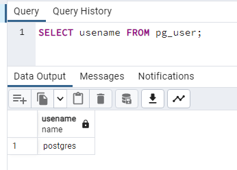
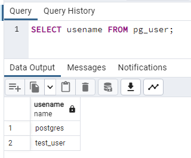
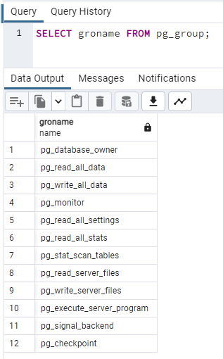
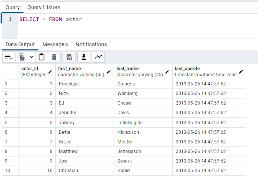
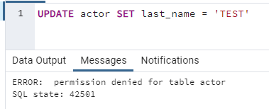
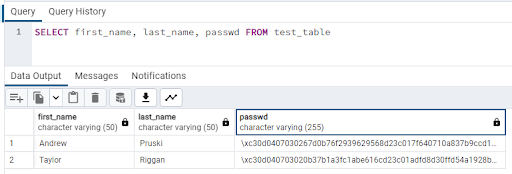
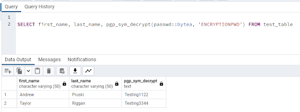

# Database security

Hello and welcome to the sixth post in the database part of the 90 Days of DevOps blog series! Today we’ll be talking about database security.

Controlling access to data is an incredibly important part of being a Database Administrator. DBAs need to prevent unauthorised access to the data that they are responsible for. In order to do this all the different levels of access to a database, starting with the server, then the database engine, and then the data itself need to be controlled.

Let’s go through each layer of security.

 

# Server security

The first area to look at when it comes to database security is who has access to the server that the database instance is running on.

Typically the System Administrators will have admin access to the server along with the Database Administrators. Now, DBAs won’t like this…but do they really need admin access to the servers? It’s a toss up between who will support any server issues…if that’s solely down to the sysadmins, then the DBAs do not need admin access to the servers (Andrew’s eye is twitching :-) ).

Next thing to consider is the account that the database service is running under. Andrew has seen multiple installs of SQL Server where the account the database engine runs under is a local admin on the server and worse…the same account is used on multiple servers…all with admin access!

DBAs do this so that they don’t run into any security issues when the database engine tries to access resources on the server, but it’s not secure.

Database services should not run under an admin account. The account they run under should only have access to the resources that it needs. Permissions should be explicitly granted to that account and monitored.

The reason for this is that if the account becomes compromised, it does not have full access to the server. Imagine if an admin account that was used for multiple servers was compromised, that would mean all the servers that used that account would be vulnerable!

Individual accounts for each database service should be used with only the permissions required granted.

That way if one is compromised, only that server is affected and we can be (fairly) confident that the other servers in our environment are not at risk.

 

# Database security

The next level of security is who can access the databases on the server? Each database engine will have another level of security on top of who can access the server itself.

Certain database engines will allow local administrators of the server to have full access to the databases, this needs to be disabled. The reason for this is that if the server becomes compromised then access to the databases isn’t automatically granted.

Database Administrators need to work out who needs access to the databases on the server and what level of access they should be given. For instance, the System Administrators have full access to the server but do they need full access to the databases? More often than not, no they don’t.

Not only do DBAs need to work out who needs access but also what needs access. There will be application accounts that need to retrieve data from the databases. There could also be reporting and monitoring tools that need access.

Application accounts should only have access to the databases they require and reporting/monitoring tools may need access to all the databases on the server but only require read-only access. Furthermore, applications and tools may only need access to certain tables within each database so DBAs would need to restrict access even further.

Again the reason for this is that if an account becomes compromised, the damage is limited.

Let’s have a look at creating a custom user in PostgreSQL and assigning access rights.

 

# Creating a custom user in PostgreSQL

PostgreSQL uses the concept of roles to manage database access. A role can be either a user or a group of users and have permissions assigned to it. Then roles can be granted membership to other roles.

The concept of roles replaces users and groups in PostgreSQL but for simplicity here what we’re going to do is create a new user and grant it membership to a pre-defined role.

Spin up a container running PostgreSQL: -

    docker run -d \
    --publish 5432:5432 \
    --env POSTGRES_PASSWORD=Testing1122 \
    --name demo-container \
    ghcr.io/dbafromthecold/demo-postgres

Connect to PostgreSQL in pgAdmin (server is *localhost* and password is *Testing1122*). Open a query window and run the following to view the existing users: -

    SELECT usename FROM pg_user;

As we can see, there is only one user at the moment. This is the default postgres user that has admin rights. We don’t want anyone else using this account so let’s set up a new one.

To create a new custom user: -

    CREATE USER test_user WITH PASSWORD 'Testing1122'

OK, confirm that the new user is there: -

    SELECT usename FROM pg_user;

Great! Our user is there, now we need to assign some permissions to that user. There are default roles within PostgreSQL that can be used to assign permissions. To view those roles: -
    
    SELECT groname FROM pg_group;

 
For more information on these roles: -
https://www.postgresql.org/docs/current/predefined-roles.html

Now, these are default roles. They may be OK for our user but they also might grant more permissions than needed. For a production instance of PostgreSQL, custom roles can (should) be created that only grant the exact permissions needed for an account. But for this demo, we’ll use one of the defaults.

Grant read to the custom user: -

    GRANT pg_read_all_data TO test_user;

Log into the container in pgAdmin with the custom users credentials, connect to the dvdrental database and open the query tool. 

Try running a SELECT statement against the actor table in the database: -

    SELECT * FROM actor

The data is returned as the user has access to read from any table in the database. Now try to update the data: -

    UPDATE actor SET last_name = 'TEST'

An error is returned as the user does not have write access to any table in the database. 

Database Administrators must always ensure that users/applications only have the access that they need to the databases and within PostgreSQL, roles are how that is achieved.

 

# Data encryption

The next level of security that needs to be considered is data encryption. There are different levels of encryption that can be applied to data. First option is to encrypt the entire database.

If someone managed to gain access to the server, they could copy the database files off-site, and then try to gain access to the data itself.

By encrypting part or all of the database, without the relevant encryption keys, an attacker would not be able (or be very unlikely to) gain access to the data.

If not all the data in a database is sensitive, then only certain columns within a database can be encrypted. For example, when storing login details for users in a database, the password for those users should (at a minimum) be encrypted.

Then we also need to consider how the data is being accessed. Any application accessing sensitive data should be using a secure connection. There’s no point in having the data encrypted in the database and then having it being sent across the network decrypted!

Another area to consider encryption is backups. An attacker would not have to target the database server to gain access to the data, they could attempt to gain access to where the database backups are stored. If they gain that access, all they have to do is copy off-site and restore the backups.

Andrew would always, 100%, advise that database backups are encrypted. When it comes to encryption of the online databases…there can be a performance penalty to pay…so it really comes down to how sensitive the data is.

Let’s have a look at encrypting data within PostgreSQL.

 

# Encrypting a column in PostgreSQL

What we’re going to do here is create a table that has a column that will contain sensitive data. We’ll import some data as we have done in the previous posts and then encrypt the sensitive column.

Run a container from the custom image: -

    docker run -d 
    --publish 5432:5432 
    --env POSTGRES_PASSWORD=Testing1122 
    --name demo-container 
    ghcr.io/dbafromthecold/demo-postgres:latest

Connect to the dvdrental database in pgAdmin (server is *localhost* and password is *Testing1122*)

Install the pgcrypto extension: -

    CREATE EXTENSION pgcrypto;

For more information on the pgcrypto extension: -
https://www.postgresql.org/docs/current/pgcrypto.html 

Now create a test table: -

    CREATE TABLE test_table (
      id smallint,
      first_name VARCHAR(50),
      last_name VARCHAR(50),
      dob DATE,
      email VARCHAR(255),
      passwd VARCHAR(255),
      CONSTRAINT test_table_pkey PRIMARY KEY (id)
    )

And import the sample data (included in the container image): -

    COPY test_table(id,first_name, last_name, dob, email)
    FROM '/dvdrental/test_data.csv'
    DELIMITER ','
    CSV HEADER;

Now we’re going to use pgp_sym_encrypt to add an encrypted password to the table for both entries: - 

    UPDATE test_table
    SET passwd = (pgp_sym_encrypt('Testing1122', ‘ENCRYPTIONPWD’))
    WHERE first_name = 'Andrew';
    
    UPDATE test_table
    SET passwd = (pgp_sym_encrypt('Testing3344', ‘ENCRYPTIONPWD’))
    WHERE first_name = 'Taylor';

Note - here we are using a password to encrypt the data. There are many more options to encrypt data within PostgreSQL..see here for more information: -
https://www.postgresql.org/docs/current/encryption-options.html 

Now if we try to SELECT as usual from the table: -

    SELECT first_name, last_name, passwd FROM test_table

We can only see the encrypted values: -

In order to view the encrypted data, we have to use pgp_sym_decrypt and the key that we set earlier: -

    SELECT first_name, last_name, pgp_sym_decrypt(passwd::bytea, 'ENCRYPTIONPWD') FROM test_table

So if we have sensitive data within our database, this is one method of encrypting it so that it can only be accessed with the correct password.

Join us tomorrow for the final post in the database series of 90DaysOfDevOps where we'll be talking about monitoring and troubleshooting.

Thanks for reading!
See you in [Day 69](day69.md).
