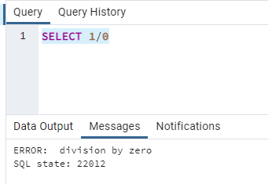
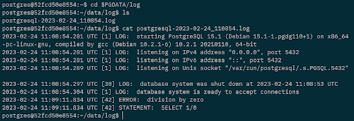

# Monitoring and troubleshooting database issues

Hello and welcome to the seventh and final post in the database part of the 90 Days of DevOps blog series! Today we’ll be talking about monitoring and troubleshooting database issues.

Things can, and do, go wrong when looking after database servers and when they do it’s the job of the Database Administrator to firstly, get the databases back online, and THEN investigate the cause of the issue.

The number one priority is to get the databases back online and in a healthy state. 

Once that has been achieved then the root cause of the issue can be investigated and once uncovered, fixes can be recommended.

There are many reasons that a server can run into issues…too many to list here! But they mainly fall into the following categories…issues with the hardware, the underlying OS, the database engine, and transactions (queries) hitting the databases.

It may not just be one factor causing issues on the server there may be many! The “death by 1000 cuts” scenario could be the cause, multiple small issues (typically frequently run queries that are experiencing a performance degradation) which overall result in the server going down or becoming so overloaded that everything grinds to a halt.

 

# Monitoring

The first step in troubleshooting database issues comes not when an actual issue has happened but when the database servers are operating normally.

We don’t want to be constantly reacting to (aka firefighting) issues…we want to be proactive and anticipate issues before they happen.

DBAs are trained to think about how servers will fail and how the systems that they look after will react when they encounter failures. Thinking about how the systems will fail plays a huge role when designing high availability and disaster recovery strategies.

However once in place, HA strategies are not infallible. There could be a misconfiguration that prevents the solution in place not reacting in the expected way. This means that HA (and DR!) strategies need to be regularly tested to ensure that they work as expected when they are needed!

We don’t want to be troubleshooting a failed HA solution at the same time as having to deal with the issue that caused the HA solution to kick in in the first place! (Andrew - we really don’t as these things never happen at 4pm on a Tuesday..for some reason it always seems to be 2am on a weekend! 🙂 )

In order to effectively anticipate issues before they happen we need to be monitoring the servers that we look after and have some alerting in place.

There are 100s (if not 1000s) of tools out there that we can use to monitor the servers we manage. There are paid options that come with support and require little configuration to set up and there are others that are free but will require more configuration and have no support.

It’s up to us to decide which monitoring tool we go for based on budget, availability (do we have time to spend on configuration?), and skillset (do we have the skills to config and maintain the tool?).

Once we have the tool(s) in place we then point at our serves and make sure that we are monitoring (as an example): -

- CPU Usage
- Memory Usage
- Disk Usage
- Network throughput
- Transactions per second
- Database size

Note - This is not a definitive list of things to monitor, there are a tonne of other metrics to collect based on what system(s) are running on the server.

Having monitoring in place means that we can see what the “normal” state of the servers is and if anything changes, we can pin down the exact time that took place which is invaluable when investigating.

Certain tools can be hooked into other systems for example, in a previous role, Andrew’s monitoring tool was hooked into the deployment system. So when something was deployed to the database servers, there was a notification on the servers’ monitoring page.

So, if say the CPU on a particular server skyrocketed up to 100% usage, the DBAs could not only see when this occurred but what was deployed to that server around that time. Incredibly helpful when troubleshooting.

One thing to consider when setting up monitoring, is when do we want to be alerted? Do we want to be alerted after an issue has occurred or do we want to be alerted before?

For example, something is consuming more disk space than normal on a server and the disk is close to becoming completely full. Do we want to be alerted when the disk is full or when the disk is close to becoming full?

Now that seems like an obvious question but it’s slightly more tricky to get right than you would think. If set up incorrectly the monitoring tool will start outputting alerts like crazy and lead to what is known as “alert fatigue”. 

Alert fatigue is when the DBAs are sent so many alerts that they start to ignore them. The monitoring tool is incorrectly configured and is sending out alerts that do not require immediate action so the DBAs take no steps to clear them.

This can lead to actual alerts requiring immediate action to be ignored and then lead to servers going down.

To prevent this alerts should only be sent to the DBAs that require immediate action. Now different alert levels can be set in most tools but again we need to be careful, no-one wants to look at a system with 1000s of “warnings”.

So a good monitoring tool is 100% necessary to prevent DBAs from spending their lives firefighting issues on the servers that they maintain.

 

# Log collection

Of course with all the best monitoring tools in the world, and proactive DBAs working to prevent issues, things can still go wrong and when they do the root cause needs to be investigated.

This generally means trawling through various logs to uncover the root cause.

Every database system will have an error log that can be used to investigate issues…this along with the logs of the underlying operating system are the first places to look when troubleshooting an issue (that’s been resolved! :-) ).

However, having to go onto a server to retrieve the logs is not the best way to investigate issues. Sure, if only one server has issues then it’s not so bad but what if more than one server was affected?

Do we really want to be remoting to each individual server to look at their logs?

What we need is a central location where logs can be collected from all the servers so that they can be aggregated and analysed.

This could be the same tool as our monitoring tool but it could be separate. What’s important is that we have somewhere that we collect the logs from our servers and they are then presented in an easily searchable format.

We can also place alerts on the logs so that if a known error occurs we can immediately investigate.

Let’s have a look at the PostgreSQL logs. Spin up a container: -

    docker run -d \
    --publish 5432:5432 \
    --env POSTGRES_PASSWORD=Testing1122 \
    --name demo-container \
    ghcr.io/dbafromthecold/demo-postgres

We need to update the postgresql.conf file to write out to a log, so jump into the container: -

	docker exec -it -u postgres demo-container bash

Open the file: -

    vim $PGDATA/postgresql.conf

And add the following lines: -

    logging_collector = on
    log_directory = log
    log_filename = ‘postgresql-%Y-%m-%d_%H%M%S.log’

Exit the container and restart: -

    docker restart container demo-container

Connect in pgAdmin (server is *localhost* and password is *Testing1122*). Open a new query window and run the following: -

    SELECT 1/0

This will generate an error: -

OK so we have a query hitting our database that is failing. We’re asked to investigate so the first place to start would be the logs.

Jump back into the container: -

    docker exec -it -u postgres demo-container bash

And navigate to the log file: -

    cd $PGDATA/log

Then view the file: -

	cat postgresql-2023-02-24_110854.log

And there’s our error! We’ve configured our instance of PostgreSQL to log errors to a file which could then be collected and stored in a central location so if we had this issue in a production environment, we would not need to go onto the server to investigate.

So we’ve looked at monitoring our servers and collecting logs of errors, but what about query performance?

 

# Query performance

The far most common issue that DBAs are asked to investigate is poorly performing queries.

Now as mentioned in part 5 of this series, query performance tuning is a massive part of working with databases. People have made (and do make) whole careers out of this area! We’re not going to cover everything in one blog post so we will just briefly highlight the main areas to look at.

A proactive approach is needed here in order to prevent query performance degrading. The main areas to look in order to maintain query performance are query structure, indexes and statistics.

Is the query structure in a way to optimally retrieve data from the tables in the database? If not, how can it be rewritten to improve performance? (this is a massive area btw, one that takes considerable knowledge and skill).

When it comes to indexing, do the queries hitting the database have indexes to support them? If indexes are there, are they the most optimal? Have they become bloated (for example, containing empty pages due to data being deleted)?

In order to prevent issues with indexes, a maintenance schedule should be implemented (rebuilding on a regular basis for example).

It’s the same with statistics. Statistics in databases can be automatically updated but sometimes (say after a large data insert) they can become out of date resulting in bad plans being generated for queries. In this case DBAs could implement a maintenance schedule for the statistics as well.

And again the same with monitoring and log collection, there are a whole host of tools out there that can be used to track queries. These are incredibly useful as it gives the ability to see how a query’s performance has changed over a period of time.

Caution does need to be taken with some of these tools as they can have a negative effect on performance. Tracking every single query and collecting information on them can be a rather intensive operation!

So having the correct monitoring, log collection, and query tracking tools are vital when it comes to not only preventing issues from arising but allowing for quick resolution when they do occur.

And that’s it for the database part of the 90DaysOfDevOps blog series. We hope this has been useful…thanks for reading!

See you in [Day 70](day70.md).
