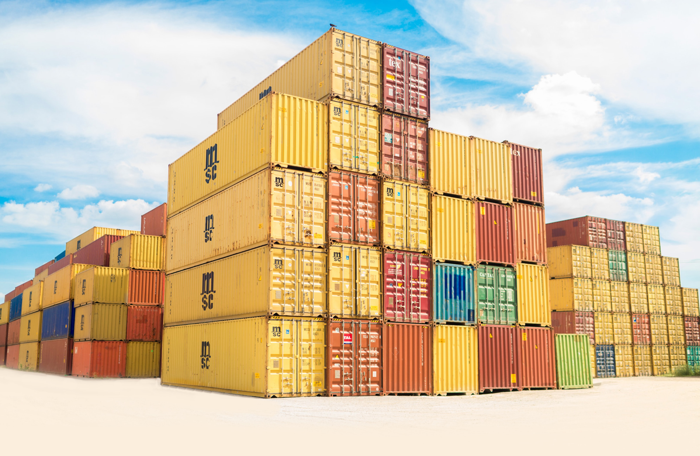

# Serverless Compute

Compute is one of the basic building blocks of building any application. What is your application aiming to accomplish? Where are you keeping your business logic? What are you _running_ and **how**?

The key compute resource everyone immediately associates serverless with is [AWS Lambda](https://aws.amazon.com/lambda/). I want to be clear here - AWS Lambda is a large part of the serverless ecosystem, BUT Lambda ≠ serverless. Just because you include a lambda function in your application does not automatically make you serverless. Likewise, just because you build a service completely out of lambda functions also does not mean you have a serverless application. Serverless is a mindset, a new way of thinking; there are tons of tools and services out there that will help you build serverless applications, but implementing them does not mean you have a serverless application. We need to be intentional with our design, and where & how we use these resources.

**AWS Lambda**
If you're in Azure, your equivalent service is [Azure Functions](https://learn.microsoft.com/en-us/azure/azure-functions/). For Google, this is [Google Functions](https://cloud.google.com/functions) (yes, AWS just HAD to be different). Regardless of its name, all of these services fulfill the same purpose - a small compute building block to house your business logic code. An AWS Lambda function is simply the code you want to run, written in your language of choice (I preference Python, but Typescript and Java are popular options). In your [infrastructure code](https://learn.microsoft.com/en-us/devops/deliver/what-is-infrastructure-as-code#:~:text=Infrastructure%20as%20code%20(IaC)%20uses,load%20balancers%2C%20and%20connection%20topologies.), you specify some [lambda function basics](https://awscli.amazonaws.com/v2/documentation/api/latest/reference/lambda/create-function.html?highlight=create%20lambda%20function), like name, path to the business logic code, security role, and what runtime you're using, and optionally have the ability to control more parameters like timeout, concurrency, aliases, and more. Lambda even has built in integrations to other AWS services, such as [S3](https://aws.amazon.com/s3/) and [SQS](https://aws.amazon.com/sqs/) (we'll get to these) to make application development even easier. Additionally, [lambda functions are priced](https://aws.amazon.com/lambda/pricing/) based on the number of times they're invoked and the duration of time they run, making them exceptionally affordable.

Of course, there are cases where lambda functions may not be the best option for compute, if you have long-running, highly complex computational processes, lambda functions may not be the best fit for your application. If you're migrating an application to serverless, it's also very likely that this is not a 1:1 changeover. Throwing all of your code into one lambda function is not optimizing for serverless, meaning that your monolith architecture may need to be written into [microservices](https://aws.amazon.com/microservices/) to take full advantage of everything lambda and serverless has to offer. Whether you're migrating or building something brand new however, lambda functions are (dare I say) the choice for serverless compute as they're lightweight, easy to provision, and cost effective.

**AWS Fargate**
AWS defines [Fargate](https://docs.aws.amazon.com/AmazonECS/latest/userguide/what-is-fargate.html) as a 'serverless compute engine', but I prefer to define it as a serverless container. [Containers](https://aws.amazon.com/containers/services/) are an entirely different topic of discussion so I won't dive into them too much, but they do fall under the same "[modern applications](https://aws.amazon.com/modern-apps/)" umbrella that serverless does, making them a sort of sibling option. Containerizing an application is a fancy way of saying you are bundling all aspects of your application into a more portable service (ie, basically sticking your app into a box for ease of movement and use). This makes containers very popular for migrating applications, batch processing, AI/ML, and more.

Fargate stands sort of in the middle as a container service that offers many of the same serverless benefits that lambda has - no need to manage your infrastructure, built-in integrations to other AWS services, and pay-as-you-go pricing. What makes you choose one compute option over the other then? In my experience, this really comes down to what you want your end product to be, what time you have, and what experience you have. Personally, Fargate is more of a 'lift-and-shift' solution for applications that you don't want to change much of, but need to move quickly and easily while wanting to take advantage of serverless benefits. It definitely has its place as part of other applications as well, but it also comes down to the level of comfort you or your teams have with serverless or containerization. Containers may be quicker to adopt, whereas serverless requires more of a mindset shift, and typically comes with some rearchitecting. I believe this does pay off tenfold in the long run, but given your particular use cases and time constraints, Fargate may be a better option.

These two options pretty much sum up serverless compute, believe it or not. When it comes to your business logic code in AWS or other cloud provider, these two services cover most, if not all, serverless application needs. As we continue on in this series, you'll realize there are a ton of other 'supporting' serverless services for storage, APIs, orchestration, and more to dive into. I hope this has given you a good preview on serverless compute and what's to come, tune in tomorrow where we'll discuss the various serverless storage solutions available to us. See you then!

*This is part of a series that will be covered here, but I also encourage you to follow along with the rest of the series on [Medium](https://kristiperreault.medium.com/serverless-compute-b19df2ea0935) or [Dev.to](https://dev.to/aws-heroes/serverless-compute-3bgo).

See you in [Day 72](day72.md).
