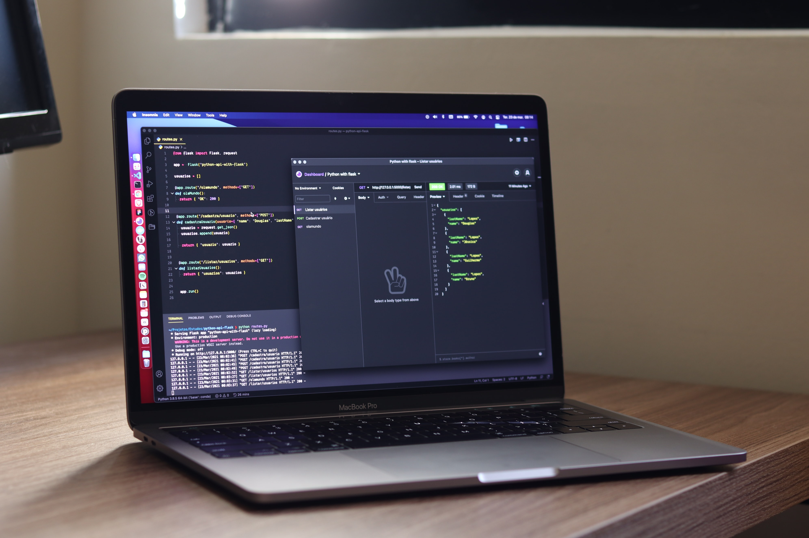

# Serverless APIs

If you're new to the application development world, [API stands for Application Programming Interface](https://aws.amazon.com/what-is/api/), an interface that offers a 'service' of sorts for applications to consume. [Google Maps](https://www.google.com/maps), for instance, has a [public API](https://developers.google.com/maps) that you or I could use if we're building an application to locate all of the restaurants in our town. They surface this, and many, many other data points via documented endpoints, and we can use things like [API keys](https://cloud.google.com/endpoints/docs/openapi/when-why-api-key) to access this data. If you're a developer, chances are you will build an API at some point in your career, if not several, and you will definitely work with them. As a key building block in application development, [AWS provides a few API solutions](https://aws.amazon.com/serverless/).

**Amazon API Gateway**
Let's say you have a travel website - you have your frontend application, and you have your backend application that has some [lambda functions](https://docs.aws.amazon.com/lambda/latest/dg/welcome.html) to handle users creating, updating, and deleting their vacation reservations, which interacts with a [DynamoDB table](https://aws.amazon.com/dynamodb/) that is saving all this information for you. Your frontend application, however, needs to be able to communicate and pass information back and forth with these lambda functions. This is where an [API Gateway](https://aws.amazon.com/api-gateway/) comes in. An API Gateway is typically a [REST API](https://aws.amazon.com/what-is/restful-api/) ([Websocket](https://docs.aws.amazon.com/apigateway/latest/developerguide/apigateway-websocket-api-overview.html) is also an option) that manages different endpoints for your application. For instance, when a user creates a reservation, the frontend application may hit a POST endpoint on your API called 'createReservation', and you can configure your API to directly integrate with your 'createReservation' lambda function, where you might do something like create a new reservation ID and save it to a DynamoDB table.

This is just one fairly straightforward example; you might already be able to see how this can get very complex very quickly. It helps that API Gateway has tons of [configuration options](https://docs.aws.amazon.com/apigateway/latest/developerguide/rest-api-develop.html), allowing you to set up your level of application monitoring and logging, set concurrency and throttling on your API calls, directly integrate with multiple services, and, of course, your authorization and access levels. With API Gateway, [you pay for the calls you receive and the data you send out](https://aws.amazon.com/api-gateway/pricing/). When you define a REST API, the API Gateway is actually made up of three different resources - the API itself, a [Stage resource](https://docs.aws.amazon.com/apigateway/latest/developerguide/set-up-stages.html) for each environment which can aid in version control and other configuration options per environment, and a [Deployment resource](https://docs.aws.amazon.com/apigateway/latest/developerguide/how-to-deploy-api-with-console.html), which is essentially a 'snapshot' of your API for the Stage to use. In addition to these resources, you also need to define each of your endpoints as a new route on the API Gateway individually. API Gateway is a very powerful and useful tool at your disposal, but it can grow quickly and easily get fairly complex, so make sure you are designing your application to account for your specific needs.

**AWS AppSync**
I'm keeping this section a bit shorter for you all, since [AppSync](https://aws.amazon.com/appsync/) is not something I have actually used personally, but have heard great things about. AppSync is another API option AWS has made available specifically for applications that want to take advantage of [GraphQL](https://graphql.org/) or a [Publish/Subscribe](https://aws.amazon.com/pub-sub-messaging/) model. The GraphQL model may be of interest to front end developers that need to query multiple sources of data from one API endpoint, like databases or [microservices](https://aws.amazon.com/microservices/). The Pub/Sub model I am more familiar with in the [IoT](https://aws.amazon.com/what-is/iot/) hardware-communicates-with-software aspect, however this is also powerful for frontend developers looking to take advantage of real-time updates with serverless WebSocket connections. With AppSync, you also have caching, offline data synchronization, and real-time updates. You can learn more and [check out the developer docs](https://docs.aws.amazon.com/appsync/latest/APIReference/Welcome.html) on the AWS Website.

As with all of these short, daily articles, there is so much more that I could dive into here, but my purpose this week is to provide you with a little taste of what the serverless space has to offer, and get you started as a newbie to serverless. I'd highly encourage you to read up even more on [effective API Design](https://thenewstack.io/werner-vogels-6-rules-for-good-api-design/), and even get started with a tutorial, workshop, or even your own project (feel free to try out the travel website and let me know how it goes!) Believe it or not, there is still more to explore in the serverless space, so in my next post we will continue on with some really helpful integration & orchestration services.*

*This is part of a series that will be covered here, but I also encourage you to follow along with the rest of the series on [Medium](https://kristiperreault.medium.com/serverless-apis-4c852f0955ef) or [Dev.to](https://dev.to/aws-heroes/serverless-apis-5bdp).

See you in [Day 74](day74.md).
