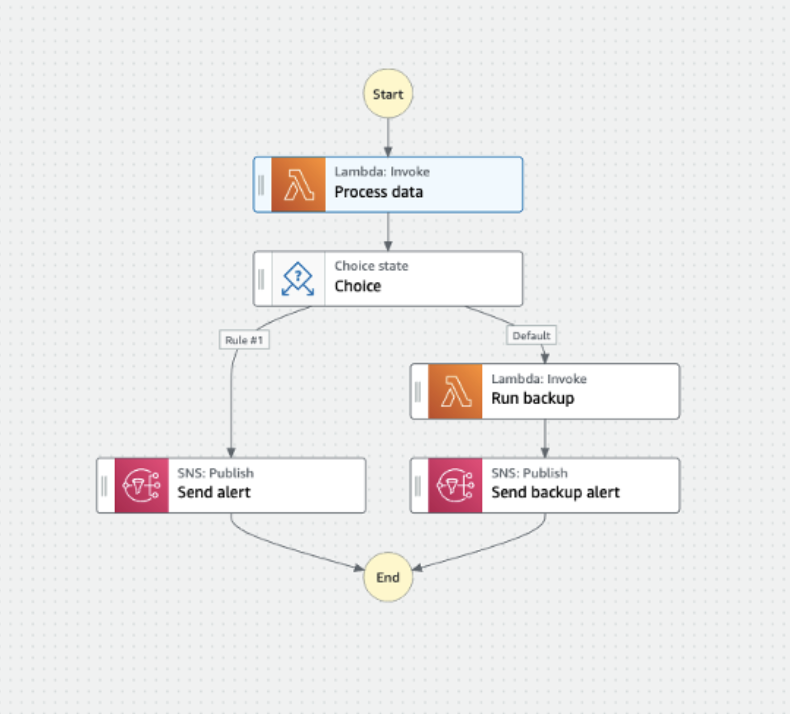
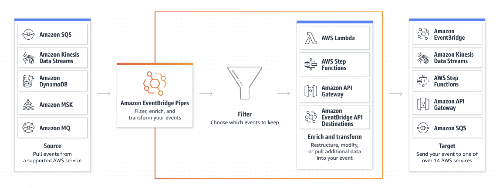

# Serverless Orchestration

Are you still with me? I hope so, because I'm excited to discuss some of the really cool services in serverless that go beyond the basics of APIs, storage, and compute. This is the space where you can really see the benefits of serverless shine, and, compared to on-premises or other cloud development spaces, where there has been a lot of innovation that may not compare 1:1 to what you're used to in application development. I've included these services under the broad umbrella of 'orchestration', because they really exist in-between the core services and help with your event-driven flow. You may not have a need for all, or even any, of these services in all of your applications, but they can be useful technologies to take advantage of, especially if your application is truly configured for [event driven architecture](https://aws.amazon.com/event-driven-architecture/).

**AWS Step Functions**

Is it weird to have a favorite serverless service? Because this one might be mine. [AWS Step Functions](https://aws.amazon.com/step-functions/) is a workflow orchestration tool that helps you manage your distributed application by breaking it down into multiple steps (the name should make sense now). Step Functions integrated with over 220 AWS services, but personally I have found it most useful with my [lambda functions](https://docs.aws.amazon.com/lambda/latest/dg/welcome.html), as it helps keep them small, concise, logical units of business code that are called systematically. It's easier to control and monitor your event as it flows through your application, so you can track which step your application is or identify where you may be running into issues. Step Functions also gives you more flexibility, as you can add in different '[states](https://docs.aws.amazon.com/step-functions/latest/dg/concepts-states.html)' like PASS or WAIT, and you can even run processes in parallel, or give your application Choices to execute on different steps depending on what the input or parameters are.

As with most of the AWS resources, you can provision and configure your step function however you choose. For me, this is typically using an [Infrastructure as Code](https://docs.aws.amazon.com/whitepapers/latest/introduction-devops-aws/infrastructure-as-code.html) tool like [CDK](https://aws.amazon.com/cdk/) to provision in python or typescript, and then defining the actual steps - otherwise known as the '[state machine](https://docs.aws.amazon.com/step-functions/latest/dg/amazon-states-language-state-machine-structure.html)' - in a JSON file. Since its release in 2016, Step Functions have had a visual component in the AWS Console that allows you to see the steps of your application and the flow of your event through it, but in 2021 AWS released [Workflow Studio](https://docs.aws.amazon.com/step-functions/latest/dg/workflow-studio.html), which actually allows you to drag and drop the components you want to use into a visual editor, and it will auto-generate the code for you. Unfortunately working in a large enterprise this isn't something I can really take advantage of, but as a visual learner I think this is an awesome tool, and can definitely streamline your development.

**Amazon EventBridge**

[EventBridge](https://aws.amazon.com/eventbridge/) has seemed to be a hot topic as of late, and I'm seeing more and more content depicting EventBridge resources. Somewhat similarly to Step Functions, Amazon EventBridge is a serverless orchestration service for your application events. Its three key components are an Event Bus, to handle interactions with your events, like sending/receiving and transforming, a [Scheduler](https://aws.amazon.com/eventbridge/scheduler/), to help you schedule tasks associated with your events, and finally [Pipes](https://aws.amazon.com/eventbridge/pipes/), which integrate directly with your serverless services "end-to-end" and optionally filter or transform your event as needed. EventBridge Pipes were only recently released at the end of 2022, but the seamless integration with your event producers and consumers have been a huge selling point for developers (which explains the recent uptick in EventBridge usage).

Similar to other services, you can define and configure your EventBridge instance to your application needs, with the security constraints, service integrations, and appropriate event transforms you need. I won't say never, but it is particularly likely that you will not have EventBridge and Step Functions in the same application, or at least microservices, since their service offerings are quite similar. When might you use one over the other? As always, neither option is 'better' and this comes down to some personal preference and your application needs. If you have processes that need to run in parallel and maybe have more states dependent on each other, where you may want to wait or skips steps or have different workflows, Step Functions is probably a better choice. If you are looking to integrate directly between multiple different AWS services, and need to do quite a bit of transformation or filtering on your event, EventBridge may be a better starting place.

**Amazon SQS**

[Amazon SQS](https://aws.amazon.com/sqs/) is also known as the Simple Queue Service. Much like people waiting in line for a busy ride at a theme park, sometimes you have places in your application where events may get backed up, creating a bit of a bottleneck and harming your application's performance (and potentially your wallet, too). A queue service such as SQS will help you process and maintain your events and messages as they come in. SQS specifically is what is known as a [First-In First-Out or FIFO queue](https://docs.aws.amazon.com/AWSSimpleQueueService/latest/SQSDeveloperGuide/FIFO-queues.html), meaning the first item in is the first item to be processed, just like the first person in line for our ride is the first person to get on. Sometimes with high volumes of messages waiting to be processed, there is risk that they get lost or skipped over in processing (disgruntled individuals leaving the long wait at the theme park ride) - having SQS in place prevents this problem from happening. It also means you do not have to worry about your other services being up and ready to handle incoming events, as SQS manages and stores the messages for you (the fun, roped off queue handles the people waiting and the order in which they arrived at our theme park ride). Just like our other services you can configure SQS, however this is a fairly 'Simple' service, so you'll find creating and maintaining an SQS queue to be uncomplicated.

**Amazon SNS**

[Amazon SNS](https://aws.amazon.com/sns/) or Simple Notification Service, is less of an orchestration service and more of a communication service. I am going to deem this a utility service, since it is a small service you can utilize for sending and receiving messages. One of the most common use cases for the SNS service is to send email alerts - maybe to developers to monitor application status, or maybe to users, to communicate new features or send email confirmations based on something like a booking reservation. You can also send as SMS text messages or mobile pushes, and you can [customize your queue type and add encryption](https://docs.aws.amazon.com/sns/latest/dg/sns-create-topic.html). Like SQS, this service is definitely 'Simple' and can be configured in just a few short lines of code, or button clicks in the AWS Console.

Although not what I would consider 'core' cloud services, the orchestration and communication services are key to event driven development and robust application design. If you are structuring your application to take advantage of event flow, these are tools you are going to want to be familiar with, and will be instrumental in your success by saving you time, money, complexity, and management overhead. This about wraps up what I want to cover with [serverless cloud services](https://aws.amazon.com/serverless/), though there is so much out there to explore. Tune in tomorrow as we start to put all of this together with best practices.*

*This is part of a series that will be covered here, but I also encourage you to follow along with the rest of the series on [Medium](https://kristiperreault.medium.com/serverless-orchestration-d012aa7cae38) or [Dev.to](https://dev.to/aws-heroes/serverless-orchestration-3879).

See you in [Day 75](day75.md).