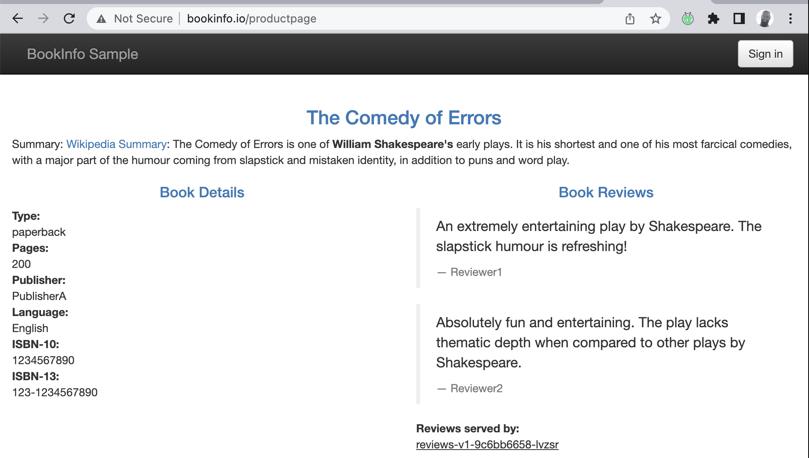
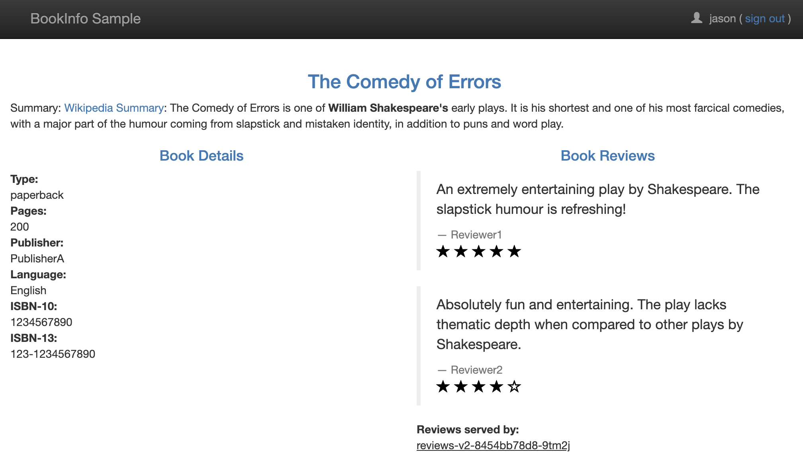

## Day 80 - Traffic Engineering Basics
> **Tutorial**
> *Let's test out traffic routing, and shifting*

### Reviewing Key Traffic Management Concepts
HEY YOU MADE IT THIS FAR! Let's keep going :smile:!!!

I'm going to review some of these concepts very briefly and if you'd like the expanded approach, check out #70DaysofServiceMesh 

Traffic management is an important topic in the world of microservices communication because, you have not one or two, you have thousands of services making requests to each other. In the world of physical networking, network devices can be used for flow control and packet routing, but because the size of our networks have grown to accomodate microservices communications, manually creating the path way for each to connect does not scale well. 

Kubernetes has done quite a lot to simplify networking for microservices through technologies like CNI, Ingress (and more recently), Gateway API. There are other challenges around traffic routing that can be solved with custom-tailored solutions.

Some of the key areas to address with traffic management are:
- Request Routing
- Traffic Splitting
- Traffic Shifting
- Releasing (new versions of your app)
- Traffic mirroring
- Load-balancing

Traffic, or requests, will always enter the Service Mesh through some Ingress, such as the Istio-Ingress-Gateway. Once in the mesh, the request might need to make its way through multiple services before a final response is formed. Each of the microservices, will have a sidecar to process the request and return some response. But, we also need to know how each of these services gets to other services, and what to do when these inbound requests come in.

Client ---> Bookinfo ----> | ProductPage ---> Reviews ---> Ratings |

In the flow above, the client makes a request to Bookinfo (via a DNS name) which is then translated into request towards the first service in the path, ProductPage, which then needs to illicit a respect from Reviews, and Reviews from Ratings. 

Let's explore the components that make this happen, briefly, and revisit these in the future.

#### Istio Ingress Gateway
As mentioned previously, the Istio Ingress Gateway is the entrypoint for requests getting into the mesh. The Istio Ingress Gateway is a resource deployed with both a Deployment and Service defined with a Load Balancer. This is advantageous, because you can create an Istio Ingress resource that listens on certain ports (HTTP) for request to hostnames like istio.io. And you can do this for multiple hosts. This is important because you can virtually overload the resource by creating multiple Ingress resources for the same gateway. This saves you on procuring multiple load-balancers per service.

Interestingly enough, any service you expose with the Istio Ingress Gateway, means that its service type will be set to ClusterIP. We don't connect to the service directly, we do so via the Ingress Gateway. This is also a layer of security with TLS.

You configure an Istio Ingress Gateway resource, and then an associated Virtual Service to route to your services

Istio's Ingress Gateway uses the Proxyv2 image which is purpose-built Envoy proxy, for Istio.

The Gateway configuration we used previously...
```
cat istio-1.16.1/samples/bookinfo/networking/bookinfo-gateway.yaml
```
```
marinow@mwm1mbp networking % cat bookinfo-gateway.yaml 
apiVersion: networking.istio.io/v1alpha3
kind: Gateway
metadata:
  name: bookinfo-gateway
spec:
  selector:
    istio: ingressgateway # use istio default controller
  servers:
  - port:
      number: 80
      name: http
      protocol: HTTP
    hosts:
    - "*"
```
The output shows us a few key pieces of information:
- The name of the Gateway resources
- The specific Istio Ingress gateway we use, using the label-selector mechanism
- The wildcard denoted by an asterisk specifies the host we are listening on, basically any host
- The port number, port 80
- The protocol which is HTTP

*Istio Ingress Gateway:  I will listen for requests coming into any DNS hostname directed to port 80 using the HTTP protocol.*

#### Sidecars
Sidecars are an important traffic management tool as they live right alongside each microservice and will proxy requests on behalf of them. 
The sidecars behave in the same manner as the Istio Ingress Gateway, and will receive and process requests, and provide responses appropriately (as they are configured to). The sidecars also play a huge role with observability and security, which I'll explore later.

Istio's sidecar uses the Proxyv2 image which is purpose-built Envoy proxy, for Istio.

#### Virtual Services
Virtual Services are the "how do we get there" set of rules for Istio. I view this as routing rules for request. If a request is received destined towards a particular service, route it here.

Here is an example of a Virtual Service definition we'll be using for each of the microservices in our environment:

```
apiVersion: networking.istio.io/v1alpha3
kind: VirtualService
metadata:
  name: productpage
spec:
  hosts:
  - productpage
  http:
  - route:
    - destination:
        host: productpage
        subset: v1
---
apiVersion: networking.istio.io/v1alpha3
kind: VirtualService
metadata:
  name: reviews
spec:
  hosts:
  - reviews
  http:
  - route:
    - destination:
        host: reviews
        subset: v1
---
apiVersion: networking.istio.io/v1alpha3
kind: VirtualService
metadata:
  name: ratings
spec:
  hosts:
  - ratings
  http:
  - route:
    - destination:
        host: ratings
        subset: v1
---
apiVersion: networking.istio.io/v1alpha3
kind: VirtualService
metadata:
  name: details
spec:
  hosts:
  - details
  http:
  - route:
    - destination:
        host: details
        subset: v1
---
```

There are 4 virtual service configurations present, each one's "host" field corresponds to the microservice and it's Kubernetes Service resource. 
The protocol being HTTP is specified, with the destination and a *subset* which is translated to a particular microservice with a label affixed to it. This is important to distinguish multiple versions of the same resource. We also need another resource to help with distinguishing, the Destination Rule resource.

#### Destination Rules
While Virtual Services point us to the service and host entries of where our services live, Destination Rules provide a granular action list. What happens when a request arrives at this destination? 
Destination Rules allow us to specify multiple versions of a service based on the back-end pods using Subsets. This is referenced by the Virtual Service resource to establish which available services can be routed to. 
This might be useful for dark launches and canary releasing so you can split traffic to different versions.

Looking at the Destination Rule Resource for the Reviews services we can see the 3 different subsets for the 3 different versions. Notice that the labels actually correspond with the deployment resources for each version of reviews.
This is how we know how to route to each version. VS tells us *where*, DR tells us *how* and *what to do*.

```
apiVersion: networking.istio.io/v1alpha3
kind: DestinationRule
metadata:
  name: reviews
spec:
  host: reviews
  subsets:
  - name: v1
    labels:
      version: v1
  - name: v2
    labels:
      version: v2
  - name: v3
    labels:
      version: v3
```

#### Service Entries
I'll dive into this later, but Service Entries provide a mechanism for internal services to know how to route to external services, like a Database, or Git repo, or Object storage, for example. This can all be controlled using Service Entries. 

This can be used to control outbound requests as well, but requires a bit of control plane rework. More on this on later.


### Setting up Request Routing
We are using the same environment for Day 2. Go back and review it if you have not set up Istio.

To set up request routing to Reviews-v1, we need to have a destination rule and virtual service configuration in place.
Let's apply them:

#### Destination Rule (make sure you are in the right directory)
```
cd istio-1.16.1
kubectl apply -f samples/bookinfo/networking/destination-rule-all.yaml
```

#### Virtual Service
```
kubectl apply -f samples/bookinfo/networking/virtual-service-all-v1.yaml
```

Let's verify that the resources were created:
```
kubectl get vs && kubectl get dr
```

AND THE RESULT
```
marinow@mwm1mbp istio-1.16.1 % kubectl get vs && kubectl get dr
NAME          GATEWAYS               HOSTS             AGE
bookinfo      ["bookinfo-gateway"]   ["*"]             4d15h
productpage                          ["productpage"]   14h
reviews                              ["reviews"]       14h
ratings                              ["ratings"]       14h
details                              ["details"]       14h
NAME          HOST          AGE
productpage   productpage   96s
reviews       reviews       96s
ratings       ratings       96s
details       details       96s
```
Now, if I head over to my browser (I have a localhost DNS entry), I can get to bookinfo.io/productpage. If I hit refresh a few times, only the **Reviews-v1** service is hit.



This is because I configured my virtual service resource to only route to **v1** of Reviews as seen in the configuration below.

```
apiVersion: networking.istio.io/v1alpha3
kind: VirtualService
metadata:
  name: reviews
spec:
  hosts:
  - reviews
  http:
  - route:
    - destination:
        host: reviews
        subset: v1
---
```

Now I'll update the configuration to route to **v2** IF and ONLY IF, I pass along a request header with the string "jason" as the end-user. Otherwise, my requests will continue to go to **v1**.

Before I update it, let's look at it
```
cat samples/bookinfo/networking/virtual-service-reviews-test-v2.yaml

apiVersion: networking.istio.io/v1alpha3
kind: VirtualService
metadata:
  name: reviews
spec:
  hosts:
    - reviews
  http:
  - match:
    - headers:
        end-user:
          exact: jason
    route:
    - destination:
        host: reviews
        subset: v2
  - route:
    - destination:
        host: reviews
        subset: v1
```
Notice the match field and what follows below. The route field has been indented because it's under a *match* condition.

Now I'll apply it:
```
kubectl apply -f samples/bookinfo/networking/virtual-service-reviews-test-v2.yaml
```

And we can test by logging in via the website and entering jason as the user.



So now we know our Destination Rule works with our Virtual Service Configuration.

Let's shift some traffic!


### Setting up Traffic Shifting

To begin, we need to remove our previous virtual service configuration that routes using the *jason* header.
```
kubectl delete -f samples/bookinfo/networking/virtual-service-reviews-test-v2.yaml
```

Next, I'll quickly review the traffic-shifting we'll do. 
```
cat samples/bookinfo/networking/virtual-service-reviews-50-v3.yaml

apiVersion: networking.istio.io/v1alpha3
kind: VirtualService
metadata:
  name: reviews
spec:
  hosts:
    - reviews
  http:
  - route:
    - destination:
        host: reviews
        subset: v1
      weight: 70
    - destination:
        host: reviews
        subset: v3
      weight: 30
```
Within each destination, it points to a subset. v1 points to Reviews-v1, while v3 points to Reviews-v3. We can apply this reviews VS resource, and it will then split the traffic with 70% of requests going to v1, while v3 receives 30% of the requests.

Let's apply the config and test:
```
kubectl apply -f samples/bookinfo/networking/virtual-service-reviews-50-v3.yaml
```
Now we can test this using a curl command in a for-loop. The for-loop runs 10 times, to make requests to the Product page, I've used grep to narrow down output to either v1 or v3, to witness the split of 70/30 Reviews-v1 getting 70% of the requests:
```
for i in {1..10}; do curl -s http://bookinfo.io/productpage | grep "reviews-v"; done
```
AND THE RESULT:
```
    <u>reviews-v3-6dc9897554-8pgtx</u>
    <u>reviews-v1-9c6bb6658-lvzsr</u>
    <u>reviews-v1-9c6bb6658-lvzsr</u>
    <u>reviews-v1-9c6bb6658-lvzsr</u>
    <u>reviews-v3-6dc9897554-8pgtx</u>
    <u>reviews-v3-6dc9897554-8pgtx</u>
    <u>reviews-v1-9c6bb6658-lvzsr</u>
    <u>reviews-v1-9c6bb6658-lvzsr</u>
    <u>reviews-v1-9c6bb6658-lvzsr</u>
    <u>reviews-v1-9c6bb6658-lvzsr</u>
```

### Conclusion
Day 4 of #70DaysOfServiceMesh scratches the surface of Traffic management capabilities. We'll explore more in future modules.
I briefly covered several traffic management components that allow requests to flow within a Service Mesh:
- Istio Ingress Gateway
- Sidecar
- Virtual Services
- Destination Rules
- Service Entries

And I got to show you all of this in action!

Want to get deeper into Service Mesh Traffic Engineering? Head over to [#70DaysofServiceMesh](https://github.com/distributethe6ix/70DaysOfServiceMesh)!

See you on [Day 81](day81.md) and beyond! :smile:!
