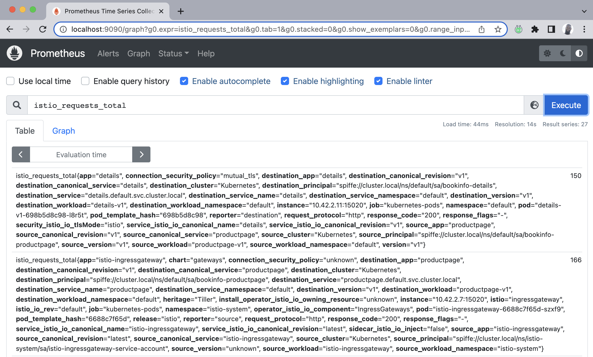
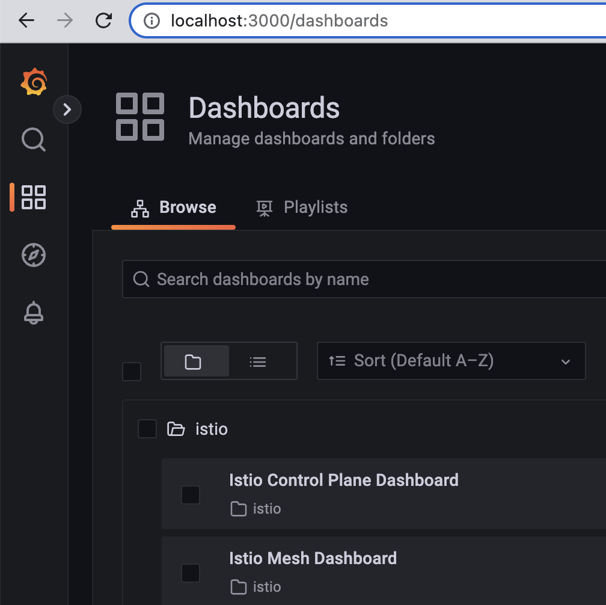
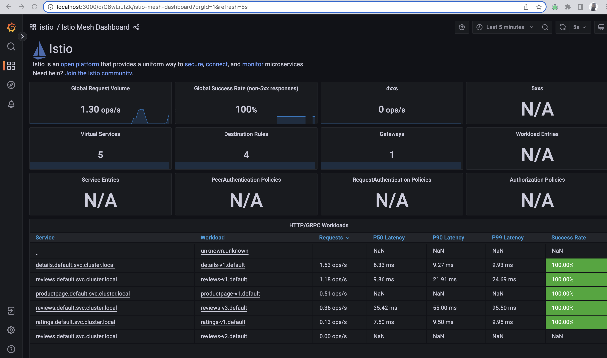
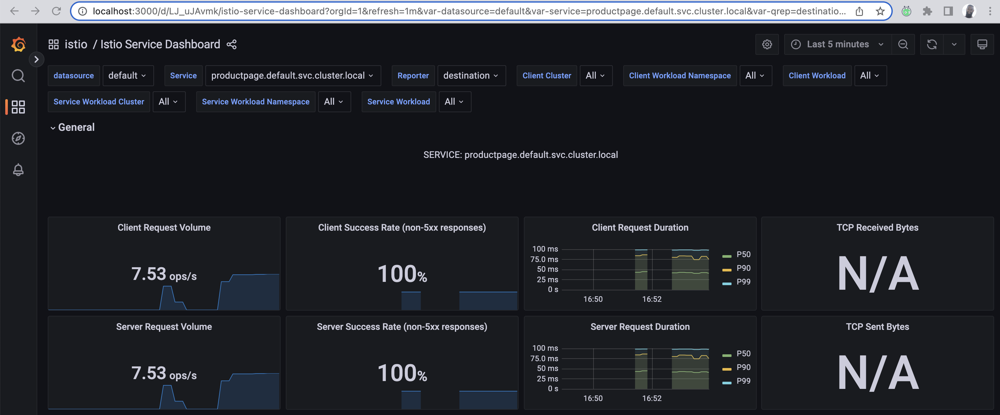
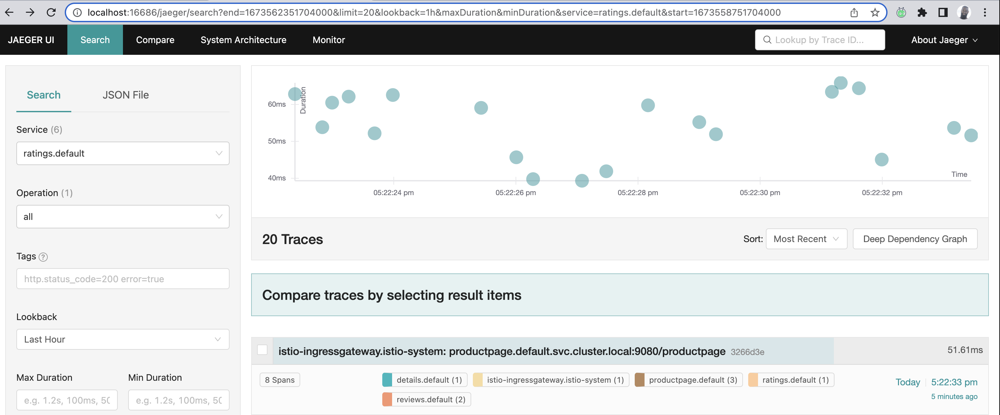
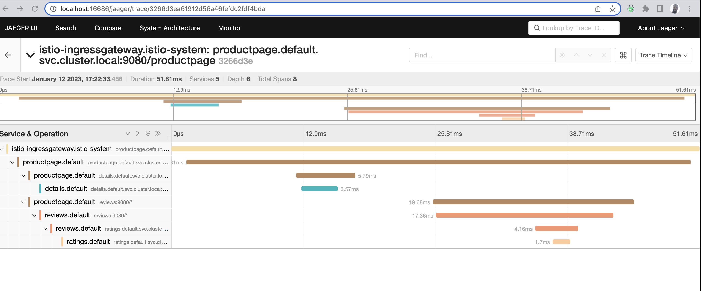
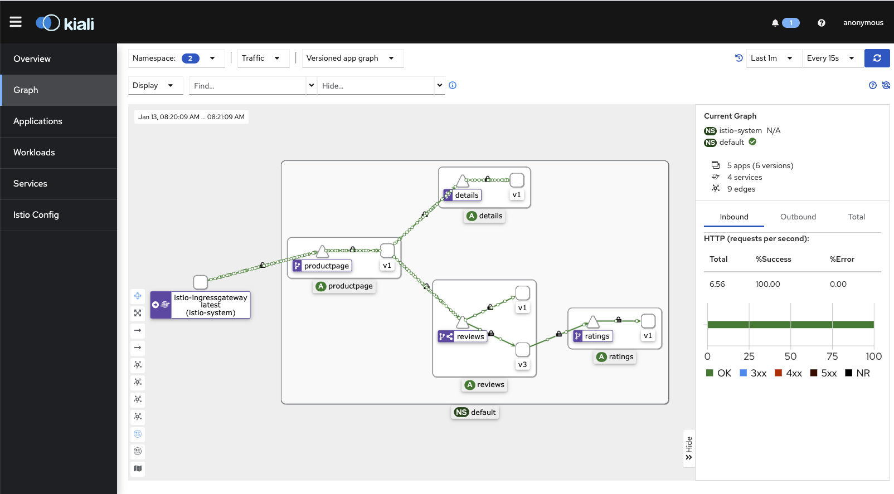

## Day 81 - Observability in your Mesh
> **Tutorial**
> *LETS see what's going on in our mesh*

What do you do when an application responds too slowly? Sometimes, there are network conditions well outside of our control, especially in Cloud and Data Center environments where QoS can be challenging to tune. But before we can tune up, we need to see what's up.

A Service Mesh provides the right key pieces to capture this data.
The Istio Service Mesh generates a few types of telemetry and metrics to give a sense of what's happening with:
- The control plane
- The data plane
- Services inside of the mesh

Istio provides details around:
- Metrics for latency, errors, traffic and saturation (LETS)
- Distributed tracing for spans to understand request flows
- Access logs, to determine source/destination metadata of requests.

I have set up specific days to cover deeper observability but, let's get it going and use some tools like:
- Prometheus
- Grafana
- Jaegar
- Kiali 

One consideration is that there are more production and enterprise-ready offerings that absolutely should be explored.

### Installing the sample observability addons
I'm using the same Civo Kubernetes cluster I've been using since I started this, but I plan to create some automation to turn up and down new clusters.

I'm going to change back to the Istio-1.16.1 directory
```
cd istio-1.16.1
```
And then I'll deploy the sample add-ons provided in the original zip file. 
```
kubectl apply -f samples/addons
```
Give it a couple of minutes and then double check.
```
kubectl get pods -n istio-system
```
```
NAME                                    READY   STATUS    RESTARTS   AGE
istio-egressgateway-7475c75b68-mpxf7    1/1     Running   0          5d15h
istiod-885df7bc9-f9k7c                  1/1     Running   0          5d15h
istio-ingressgateway-6688c7f65d-szxf9   1/1     Running   0          5d15h
jaeger-54b7b57547-vsnhl                 1/1     Running   0          34s
prometheus-7b8b9dd44c-kd77d             2/2     Running   0          32s
grafana-b854c6c8-fhjlh                  1/1     Running   0          35s
kiali-5ff88f8595-fnk8t                  1/1     Running   0          33s
```
Perfect, let's proceed with Prometheus.

### Prometheus 
Since Prometheus is already installed we want to verify that it's currently running.

Let's check the service and verify it's online.
```
kubectl get svc prometheus -n istio-system
```
```
NAME         TYPE        CLUSTER-IP      EXTERNAL-IP   PORT(S)    AGE
prometheus   ClusterIP   10.43.234.212   <none>        9090/TCP   25h
```

I'm going to generate traffic from my host to the Bookinfo app and I'll go review this in Prometheus, which we'll expose using istoctl.
```
curl "http://bookinfo.io/productpage"
```

Let's turn up the dashboard  the *istioctl dashboard [name_of_k8s_service]*:
```
istioctl dashboard prometheus
```
At this point, a web-browser (your default) should open up with Prometheus. I want to feed it a query and I will do so in the *Expression* address bar, and proceed to hit execute.
When your browser launches with Promtheus, simply enter the following to execute a query on the total requests Istio will process. 

Paste the below into the query bar. This query simply outputs all the requests Istio sees.
```
istio_requests_total
```


There's much more to what we can see in Prometheus. If you have this up in your environment, play around. I'll revisit this in later days as I intend to dig into some of the key metrcis around SLAs, SLOs, SLIs, nth-percentile and latency, requests per second and others.

Hit *ctrl+c* to exist the dashboard process.

### Grafana
Grafana is an open-source and multi-platform analystics and visualization system that can be deployed alongside Prometheus to help us visually chart our apps and infra performance.

I've already installed the sample addons which contained Grafana. Let's check the services and see that it's there.

```
kubectl get svc -n istio-system
```
And we can verify it's there.
```
NAME                   TYPE           CLUSTER-IP      EXTERNAL-IP    PORT(S)                                                                      AGE
istiod                 ClusterIP      10.43.249.242   <none>         15010/TCP,15012/TCP,443/TCP,15014/TCP                                        7d
istio-egressgateway    ClusterIP      10.43.75.47     <none>         80/TCP,443/TCP                                                               7d
istio-ingressgateway   LoadBalancer   10.43.51.40     [HAHA.NO.NICE.TRY]   15021:31000/TCP,80:32697/TCP,443:30834/TCP,31400:30953/TCP,15443:30733/TCP   7d
grafana                ClusterIP      10.43.115.239   <none>         3000/TCP                                                                     32h
tracing                ClusterIP      10.43.237.214   <none>         80/TCP,16685/TCP                                                             32h
zipkin                 ClusterIP      10.43.241.104   <none>         9411/TCP                                                                     32h
jaeger-collector       ClusterIP      10.43.43.212    <none>         14268/TCP,14250/TCP,9411/TCP                                                 32h
kiali                  ClusterIP      10.43.51.161    <none>         20001/TCP,9090/TCP                                                           32h
prometheus             ClusterIP      10.43.234.212   <none>         9090/TCP                                                                     32h
```

Let's use the *istioctl dashboard* command again
```
istioctl dashboard grafana
```
A web browser with the Grafana tab should have opened up. On the far left, click the 4 boxes that make up a square, and then select the Istio folder.



Select the Istio Mesh Dashboard.

In another terminal, let's  generate some load
```
for i in $(seq 1 100); do curl -s -o /dev/null "http://bookinfo.io/productpage"; done
```
The metrics for each of the services (except reviews v2) receive requests and ultimately will produce valuable metrics indicative of success, latency and other key details. We can see this below:



In the second terminal, let's  generate some more load
```
for i in $(seq 1 300); do curl -s -o /dev/null "http://bookinfo.io/productpage"; done
```

Go back to where the Istio dashboards are located, and click the Service dashboard. This will give you an idea of how the services in the mesh are performing and the client-success rate.



I'll dive more into these details in future days. Kill the dashboard by hitting *ctrl+c*

### Jaegar
Jaegar is all ready to go. It's an excellent tracing tool to help piece together a trace, which is comprised of multiple spans for a given request flow.

Let's enable the dashboard:
```
istioctl dashboard jaegar
```
A new window should pop up with a curious-looking gopher. That gopher is inspecting stuff.

In our second terminal, let's issue that curl command to reach bookinfo.io.
```
for i in $(seq 1 300); do curl -s -o /dev/null "http://bookinfo.io/productpage"; done
```
In the new window with Jaeger, the left pane allows us to select a service, pick any. 

By picking a service, you are looking from it's POV, how it's apart of the request flow. While you'll see it's span, it'll be a part of a larger trace comprised of multiple spans. 

I picked the ratings service which shows me all the spans it's associated with in a single trace. We'll expand upon this later on.

All the different traces:



All the different spans within the *ratings* trace:



Ever used wireshark before?

Kill the jaeger dashboard with *ctrl+c*

### Kiali
Kiali is another great tool to visualize how traffic and request flow inside of mesh.

But the visual component is captivating! It's because it shows us how one service communicates with another, using a visual map!

Let's enable the Kiali dashboard:
```
istioctl dashboard kiali
```
A web-browser will open with Kiali and on the left-hand pane, click on "Graph".

There are a few dropdowns, one says *Namespace*. Click on it and make sure the default namespace is selected. Under the *Display* dropdown, click on *Traffic Animation* and *Security*. There are other options but I'll revisit these later.

I'm going to open up another terminal and run this curl command:
```
for i in $(seq 1 300); do curl -s -o /dev/null "http://bookinfo.io/productpage"; done
```

In about a few minutes you'll start to see a visual map show up in Kiali as mentioned before.

The screenshot below shows the directional flow of traffic, but, also notice that lock icon! It means mTLS is available. We'll explore this in the Security sections.



Finally, check out this video and see the visualization.


Or visit the video here: https://www.youtube.com/watch?v=vhV8nHgytNM

Go ahead and end the Kiali dashboard process with *ctrl+c*.

### Conclusion
I've explored a few of the tools to be able to understand how we can observe services in our mesh and better understand how our applications are performing, or, if there are any issues.

Want to get deeper into Service Mesh Observability? Head over to [#70DaysofServiceMesh](https://github.com/distributethe6ix/70DaysOfServiceMesh)!

See you on [Day 82](day82.md)
