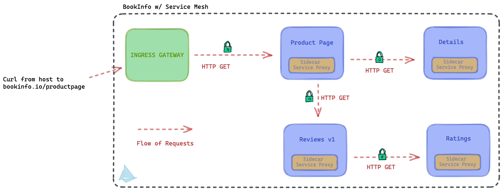
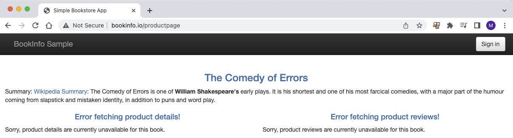

## Day 82 - Securing your microservices
> **Tutorial**
>> *Let's secure our microservices*

Security is an extensive area when in comes to microservices. I could basically spend an entire 70days on just security alone but, I want to get to the specifics of testing this out in a lab environment with a Service Mesh.

Before I do, what security concerns am I addressing with a Service Mesh?
- Identity
- Policy
- Authorization
- Authentication
- Encrpytion
- Data Loss Prevention.

There's plenty to dig into with these but what specifically of Service Mesh helps us acheive these?

The sidecar, an ingress gateway, a node-level proxy, and the service mesh control plane interacting with the Kubernetes layer.

As a security operator, I may issue policy configurations, or authentication configurations to the Istio control plane which in turn provides this to the Kubernetes API to turn these into runtime configurations for pods and other resources. 

In Kubernetes, the CNI layer may be able to provide a limited amount of network policy and encryption. Looking at a service mesh, encryption can be provided through mutual-TLS, or mTLS for service-to-service communication, and this same layer can provide a mechanism for Authentication using strong identities in SPIFFE ID format. Layer 7 Authorization is another capability of a service mesh. We can authorize certain services to perform actions (HTTP operations) against other services. 

mTLS is used to authenticate peers in both directions; more on mTLS and TLS in later days.

To simplify this, Authentication is about having keys to unlock and enter through the door, and Authorization is about what you are allowed to do/touch, once you're in. Defence in Depth.

Let's review what Istio offers and proceed to configure some of this. We will explore some of these in greater detail in future days.

### Istio Peer Authentication and mTLS
One of the key aspects of the Istio service mesh is its ability to issue and manage identity for workloads that are deployed into the mesh. To put it into perspective, if all services have a sidecar, and are issued an identity (it's own identity) from the Istiod control plane, a new ability to trust and verify services now exists. This is how Peer Authentication is achieved using mTLS. I plan to go into lots more details in future modules.

In Istio, Peer Authentication must be configured for services and can be scoped to workloads, namespaces, or the entire mesh.

There are three modes, I'll explain them briefly and we'll get to configuring!
* PERMISSIVE: for when you have plaintext AND encrypted traffic. Migration-oriented
* STRICT: Only mTLS enabled workloads
* DISABLE: No mTLS at all.

We can also take care of End-user Auth using JWT (JSON Web Tokens) but I'll explore this later.

### Configuring Istio Peer AuthN and Strict mTLS
Let's get to configuring our environment with Peer Authentication and verify.

We already have our environment ready to go so we just need to deploy another sample app that won't have the sidecar, and we also need to turn up an Authentication policy.

Let's deploy a new namespace called sleep and deploy a sleeper pod to it.
```
kubectl create ns sleep
```
```
kubectl get ns
```
```
cd istio-1.16.1
kubectl apply -f samples/sleep/sleep.yaml -n sleep
```

Let's test to make sure the sleeper pod can communicate with the bookinfo app!
This command simply execs into the name of the sleep pod with the "app=sleep" label in the sleep namespace and proceeds to curl productpage in the default namespace. 
The status code should be 200!
```
kubectl exec "$(kubectl get pod -l app=sleep -n sleep -o jsonpath={.items..metadata.name})" -c sleep -n sleep -- curl productpage.default.svc.cluster.local:9080 -s -o /dev/null -w "%{http_code}\n"
```
```
200
```

Let's apply our PeerAuthentication
```
kubectl apply -f - <<EOF
apiVersion: security.istio.io/v1beta1
kind: PeerAuthentication
metadata:
  name: "default"
  namespace: "istio-system"
spec:
  mtls:
    mode: STRICT
EOF
```

Now, if we re-run the curl command as I did previously (I just up-arrowed but you can copy and paste from above), it will fail with exit code 56. This strongly implies that peer-authentication in STRICT mode disallows non-mTLS workloads from communicating with mTLS workloads.

As I mentioned previously, I'll expand further in future days.

### Istio Layer 7 Authorization 
Authorization is a very interesting area of security, mainly because we can granularly control who can perform whatever action against another resource. More specifically, what HTTP operations can one service perform against another. Can a service *GET* data from another service using HTTP operations? 

I'll briefly explore a simple Authorization policy that allows GET requests but disallows DELETE requests against a resource. This is a highly granular approach to Zero-trust. 

A consideration when moving towards production is to use a tool like Kiali (or others) to create a service mapping and understand the various HTTP calls made between services. This will allow you to establish incremental policies. 

The one key element here is that Envoy (or Proxyv2 for Istio) as a sidecar, is the policy enforcement point for all Authorization Policies. Policies are evaluated by the authorization engine that authorizes requests at runtime. The destination sidecar, or Envoy, is responsible for evaluating this.

Let's get to configuring!


### Configuring L7 Authorization Policies

In order to get a policy up and running, we first need to deny all HTTP-based based operations.

Also, the flow of the request looks like this:



The lock-icon is indicative of the fact that mTLS is enabled and ready to go.

Let's DENY ALL
```
kubectl apply -f - <<EOF
apiVersion: security.istio.io/v1beta1
kind: AuthorizationPolicy
metadata:
  name: allow-nothing
  namespace: default
spec:
  {}
EOF
```
Now if you curl bookinfo's product page from our sleep pod, it will fail!
```
kubectl exec "$(kubectl get pod -l app=sleep -o jsonpath={.items..metadata.name})" -c sleep  -- curl productpage.default.svc.cluster.local:9080 -s -o /dev/null -w "%{http_code}\n"
``` 
You'll see a 403, HTTP 403 = Forbidden...or Not Authorized

Here's my output:
```
marinow@marinos-air ~ % kubectl exec "$(kubectl get pod -l app=sleep -o jsonpath={.items..metadata.name})" -c sleep  -- curl productpage.default.svc.cluster.local:9080 -s -o /dev/null -w "%{http_code}\n"
200
```
```
marinow@marinos-air ~ % kubectl apply -f - <<EOF
apiVersion: security.istio.io/v1beta1
kind: AuthorizationPolicy
metadata:
  name: allow-nothing
  namespace: default
spec:
  {}
EOF
authorizationpolicy.security.istio.io/allow-nothing created
```
```
marinow@marinos-air ~ % kubectl exec "$(kubectl get pod -l app=sleep -o jsonpath={.items..metadata.name})" -c sleep  -- curl productpage.default.svc.cluster.local:9080 -s -o /dev/null -w "%{http_code}\n"
403
marinow@marinos-air ~ % 
```

To fix this, we can apply a policy for each service in the request path to allow for service-to-service communication. 

We need four authorization policies
1. User client to product page.
2. From Product Page to Details
3. From product-page to reviews
4. From reviews to ratings

If we look at the configuration below, the AuthZ Policy has a few key important elements:
1. The apiVersion specifies that this is an Istio resource/CRD
2. The spec, which states which resource will receive the HTTP Request inbound, and the method, which is GET.
3. The action or method that can take place against the above resource, which is *ALLOW*

This allows an external client to run an HTTP GET operation against product-page. All other types of requests will be denied.
Let's apply it.

```
kubectl apply -f - <<EOF
apiVersion: security.istio.io/v1beta1
kind: AuthorizationPolicy
metadata:
  name: "get-productpage"
  namespace: default
spec:
  selector:
    matchLabels:
      app: productpage
  action: ALLOW
  rules:
  - to:
    - operation:
        methods: ["GET"]
EOF
```
The curl command run previously should return a 200 success code. 
```
kubectl exec "$(kubectl get pod -l app=sleep -o jsonpath={.items..metadata.name})" -c sleep  -- curl productpage.default.svc.cluster.local:9080 -s -o /dev/null -w "%{http_code}\n"
```

But if we change the resource from productpage.default.svc.cluster.local:9080 to ratings.default.svc.cluster.local:9080, and curl to it, it should return a 403.
```
kubectl exec "$(kubectl get pod -l app=sleep -o jsonpath={.items..metadata.name})" -c sleep  -- curl ratings.default.svc.cluster.local:9080 -s -o /dev/null -w "%{http_code}\n"
```

We can even see the result of applying just one AuthZ policy:




I am incrementally allowing services to trust only the services that they need to communicate with.

Let's apply the rest of the policies:

This one will allow product-page to HTTP GET details from the *reviews* service.

```
kubectl apply -f - <<EOF
apiVersion: security.istio.io/v1beta1
kind: AuthorizationPolicy
metadata:
  name: "get-reviews"
  namespace: default
spec:
  selector:
    matchLabels:
      app: reviews
  action: ALLOW
  rules:
  - from:
    - source:
        principals: ["cluster.local/ns/default/sa/bookinfo-productpage"]
    to:
    - operation:
        methods: ["GET"]
EOF
```

There is a *rules* section which specifies the source of the request through the *principals* key. Here we specify the service account of the bookinfo-productpage, it's identity.


This policy allows the *reviews* services to get data from the *ratings* service
```
kubectl apply -f - <<EOF
apiVersion: security.istio.io/v1beta1
kind: AuthorizationPolicy
metadata:
  name: "get-ratings"
  namespace: default
spec:
  selector:
    matchLabels:
      app: ratings
  action: ALLOW
  rules:
  - from:
    - source:
        principals: ["cluster.local/ns/default/sa/bookinfo-reviews"]
    to:
    - operation:
        methods: ["GET"]
EOF
```

This policy will allow *productpage* to get details from the *details* service.
```
kubectl apply -f - <<EOF
apiVersion: security.istio.io/v1beta1
kind: AuthorizationPolicy
metadata:
  name: "get-details"
  namespace: default
spec:
  selector:
    matchLabels:
      app: details
  action: ALLOW
  rules:
  - from:
    - source:
        principals: ["cluster.local/ns/default/sa/bookinfo-productpage"]
    to:
    - operation:
        methods: ["GET"]
EOF
```

If all has been deployed correctly accessing bookinfo should provide a successful result.

*If you've set up a local host dns record, you should be able to go to bookinfo.io/productpage to see this working*

Seeing this in action:


Now we know our AuthZ policies are working.

On Day 82 (plus several days), I dug into Authentication with mMTLS and Authorization with Authorization Policies. This just scratches the surface and we absolutely need to dig deeper. Want to get deeper into Service Mesh Security? Head over to [#70DaysofServiceMesh](https://github.com/distributethe6ix/70DaysOfServiceMesh)!

See you on [Day 83](day83.md)