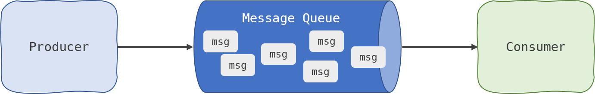

# Queues, Queue workers and Tasks (Asynchronous architecture)
Yesterday we looked at how we can use HTTP based APIs for communication between services. This works well until you need
to scale, release a new version or one of your services goes down. Then we start to see the calling service fail because
it’s dependency is not working as expected. We have tightly coupled our two services, one can’t work without the other.

There are many ways to solve this problem, a light touch approach for existing applications is to use something called a
circuit breaker to buffer failures and retry until we get a successful response. This is explained well in this blog
by [Martin Fowler](https://martinfowler.com/bliki/CircuitBreaker.html). However, this is synchronous, if we were to wrap
our calls in a circuit breaker we would start to block processes and our user could see a slowdown in response times.

Additionally, we can’t scale our applications using this approach, the way that the code is currently written every
instance of our `generator` api would be asking
the `requestor for confirmation of receiving the string. This won’t scale well when we move to having 2, 5, 10, or 100 instances running. We would quickly see the `
requestor` being overwhelmed with requests from the 100 generator applications.

There is a way to solve these problems which is to use Queues. This is a shift in thinking to using an asynchronous
approach to solving our problem. This can work well when the responses don’t need to be immediate between applications.
In this case it doesn't matter if we add some delay in the requests between the applications. As long as the data
eventually flows between them we are happy.

(https://dashbird.io/knowledge-base/well-architected/queue-and-asynchronous-processing/)

In the drawing above we can see how we can add a Queue in between our applications and the Queue stores the intent of
the message across the bridge. If the Consumer was to fail and stop reacting messages then, providing our Queue software
has sufficient storage, the messages to the consumer would still “succeed” as far as the producer is concerned.

This is a powerful pattern that isolates components of a system from each other and limits the blast radius of failure.
It does however add complexity. The Consumer and Producer must share a common understanding of the shape of a message
otherwise the Consumer will be unable to act on the message.

We are going to implement a Queue in between our two applications in our data flows.

By the end of the section we will have the following data flows

Requestor (asks for a random string) → Queue → Generator (gets the message, generates a string and passes it back to the
Requestor on another Queue) → Requestor (gets the string back on a queue and stores it, then sends a message to the
queue saying it has received it) → Queue → Generator (marks that the message was received)

The last section here, where the Generator needs to know if the Requestor got the message is a simplification of a real
process where an application may pass back an enriched data record or some further information but it allows us to have
a simple two way communication.

Can you see how by the end of this section we will be able to stop, scale, deploy or modify each of the two components
without the other needing to know?

## Modifying our application

We are now going to modify our app to fit the model described above. Where we previously made a HTTP api call to our
partner app we are now going to place a message on a named queue and then subscribe to the corresponding response
queues.

Finally we are going to stop using HTTP endpoints to listen for requests, we are now subscribing to queues and waiting
for messages before we perform any work.

I have picked [NATSio](https://nats.io/) as the queue technology as I have worked with it previously and it’s very easy
to set up and use.

Head over to the 2023/day2-ops-code/README.md to see how to deploy day 2's application.

It sends messages to a queue and then waits for a response. The response is a message on a different queue. The message
contains the data that we are interested in.