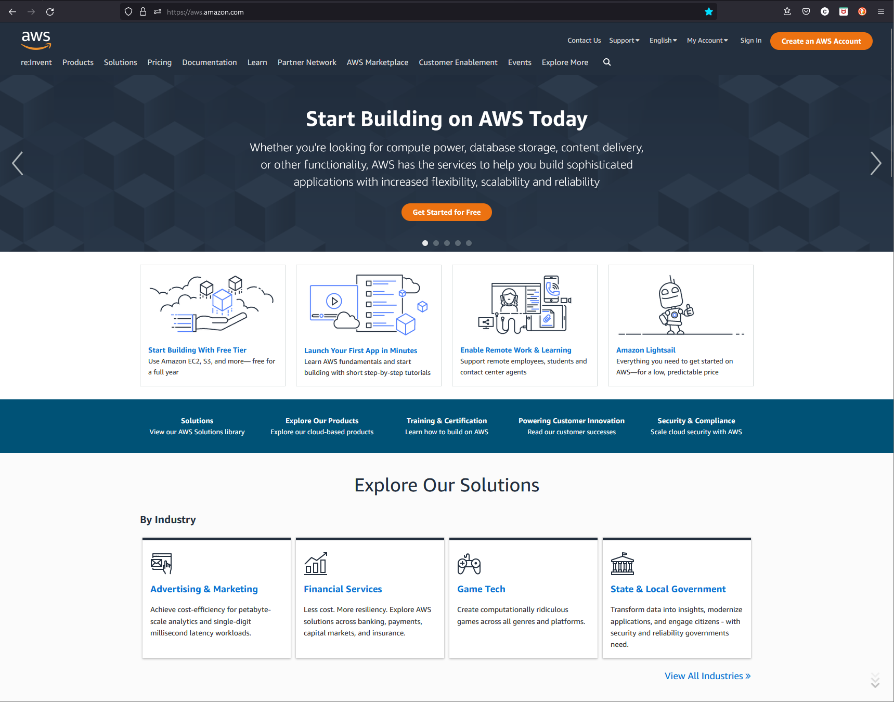
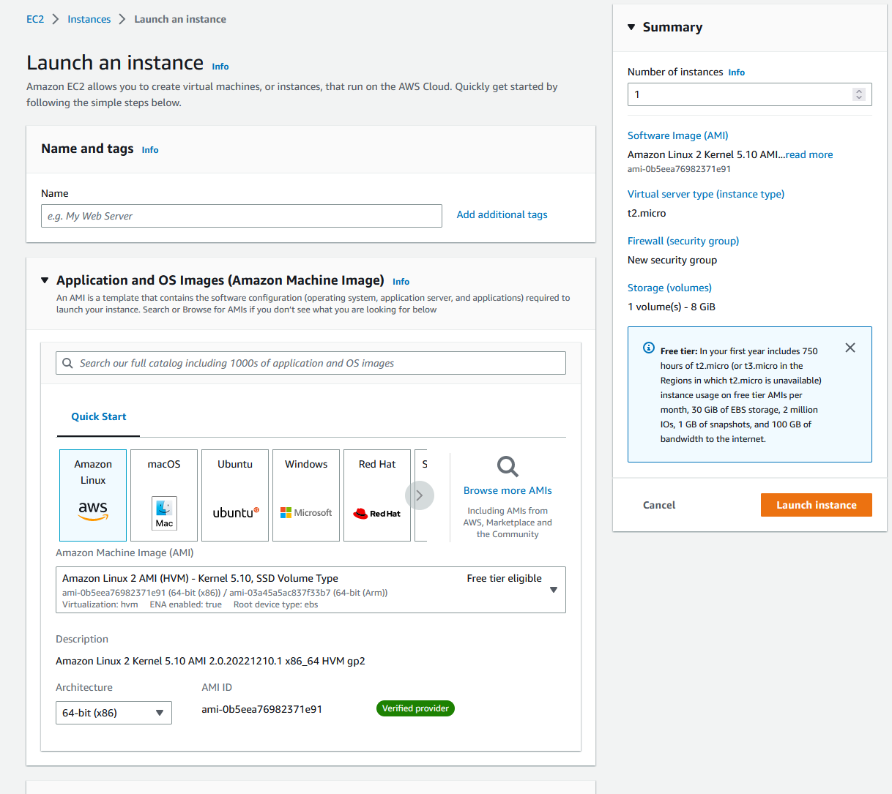
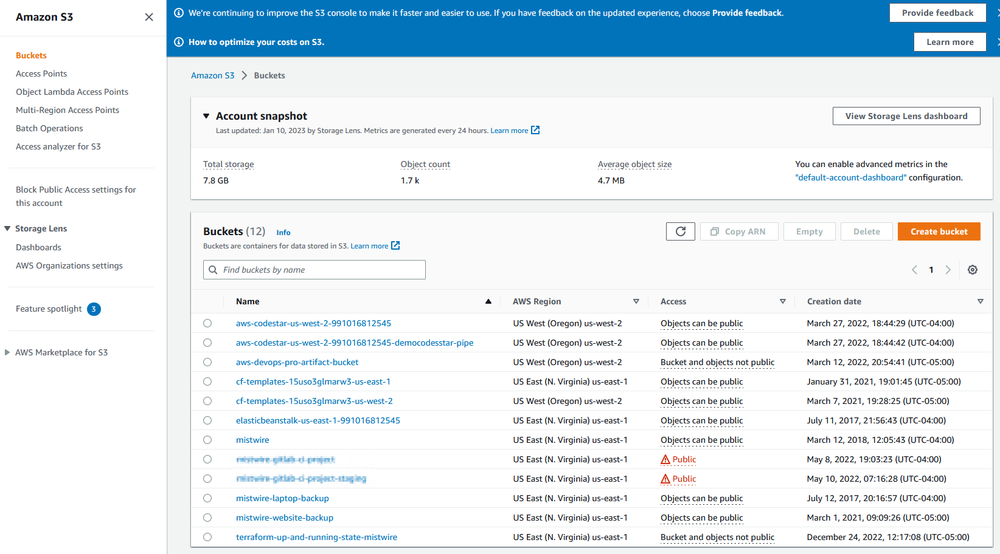
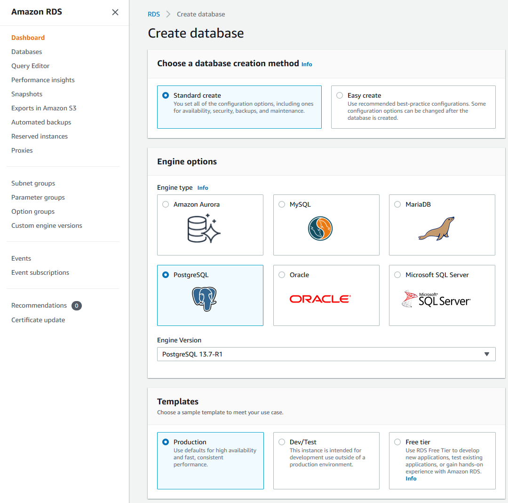

# Day 49: AWS 클라우드 개요

데브옵스의 90일의 AWS 섹션에 오신 것을 환영합니다! 배울 7가지 항목을 선택하는 것은 여러 가지 이유로 어렵습니다:

1. 마지막으로 집계했을 때 250개 이상의 AWS 서비스가 있었습니다
2. 각각의 서비스는 며칠동안 깊게 파고들 수 있습니다 😅

그러한 이유로 우리는 쉽게 시작하여 DevOps에 매우 중요한 서비스를 소개하고 AWS DevOps 서비스에 대해 많이 노출할 수 있는 섹션 캡스톤 프로젝트로 마무리할 것입니다.

다음 7일 동안 제가 만든 것처럼 즐거운 시간을 보내시기 바랍니다. 궁금한 점이 있으면 언제든지 물어보세요!

AWS Cloud는 Amazon Web Services (AWS)가 제공하는 클라우드 컴퓨팅 플랫폼입니다. 컴퓨팅, 스토리지, 네트워킹, 데이터베이스, 분석, 기계 학습, 보안 등 다양한 서비스를 제공합니다. AWS Cloud는 사용한 만큼 비용을 지불하는 방식으로 비즈니스 및 조직이 이러한 서비스에 액세스할 수 있도록 하여 사용한 리소스에 대해서만 지불하고 필요에 따라 리소스를 확장 또는 축소할 수 있습니다.

## Flexibility

AWS Cloud의 주요 이점 중 하나는 유연성입니다. 귀하의 요구에 가장 적합한 서비스를 선택하고 사용한 만큼만 지불할 수 있습니다. 이는 소규모 기업, 스타트업 및 대기업에 이상적인 솔루션으로, 인프라에 대한 큰 초기 투자를 하지 않고 필요한 리소스에 액세스할 수 있도록 합니다.

## Security

AWS Cloud의 또 다른 이점은 보안입니다. AWS는 암호화, 자격 증명 및 액세스 관리, 네트워크 보안을 포함하여 데이터와 리소스를 보호하기 위해 여러 가지 보안 조치를 적용하고 있습니다. 또한 HIPAA, PCI DSS, GDPR을 포함하여 다양한 규정 준수 프로그램을 갖추고 있어 데이터가 안전하고 관련 규정을 준수하는지 확인합니다.

AWS Cloud는 리소스와 인프라를 관리하는 데 도움이 되는 다양한 도구와 서비스도 제공합니다. 예를 들어, AWS 관리 콘솔을 사용하면 단일 및 중앙 집중식 대시보드에서 리소스를 모니터링하고 제어할 수 있습니다. AWS Command Line Interface (CLI)를 사용하면 명령줄에서 리소스를 관리하여 작업을 자동화하고 다른 도구와 통합하기 쉽습니다.

## EC2

AWS Cloud가 제공하는 가장 인기 있는 서비스 중 하나는 Amazon Elastic Compute Cloud (EC2)입니다. EC2를 사용하면 클라우드에서 가상 서버를 쉽게 시작하고 관리할 수 있으며, 필요에 따라 리소스를 확장 또는 축소하기 쉽습니다. 여러 가지 인스턴스 유형과 크기 중에서 선택할 수 있으며, 사용한 리소스만큼만 비용을 지불하면 됩니다.

## S3

AWS Cloud가 제공하는 또 다른 인기 있는 서비스는 Amazon Simple Storage Service (S3)입니다. S3는 인터넷 어디에서나 대량의 데이터를 저장하고 찾을 수 있는 객체 저장 서비스입니다. 확장성이 높고 내구성이 있으며 안전하므로 클라우드에서 데이터를 저장하고 관리하는 데 이상적인 솔루션입니다.

## Databases

AWS Cloud는 데이터베이스 관리를 위한 Amazon Relational Database Service (RDS), 데이터 웨어하우징 및 분석을 위한 Amazon Redshift, 검색 및 분석을 위한 Amazon Elasticsearch Service와 같은 다양한 서비스도 제공합니다. 이러한 서비스를 사용하면 인프라나 확장에 대해 걱정할 필요 없이 클라우드에서 복잡한 애플리케이션을 구축하고 관리할 수 있습니다.

전반적으로 AWS Cloud는 다양한 규모의 기업과 조직을 위한 강력하고 유연한 클라우드 컴퓨팅 플랫폼으로, 다양한 서비스와 도구를 제공합니다. 소규모 기업, 스타트업 또는 대기업이든 상관없이 AWS Cloud는 여러분에게 무언가를 제공할 수 있습니다. 사용한 만큼 비용을 지불하는 방식, 보안 및 관리 도구를 갖추고 있어 클라우드 컴퓨팅의 이점을 활용하려는 누구에게나 이상적인 솔루션입니다.

## Resources

[Day 50](day50.md)에서 다시 만나요.
