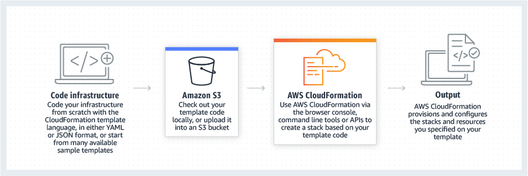

# Day 51: 코드로서의 인프라(IaC) 및 CloudFormation

IaC(Infrastructure as code)는 개발자와 운영팀이 수동 프로세스가 아닌 코드를 통해 인프라를 관리하고 프로비저닝할 수 있는 프로세스입니다. IaC를 사용하면 구성 파일과 자동화 도구를 사용하여 인프라 리소스를 관리할 수 있어 더 빠르고 일관되며 신뢰성 있는 인프라 배포가 가능합니다.

가장 인기 있는 IaC 툴 중 하나는 AWS CloudFormation으로 운영, 데브옵스 및 개발자가 YAML 또는 JSON 형식의 템플릿을 사용하여 인프라 리소스를 정의할 수 있습니다. 이러한 템플릿은 버전 제어 및 팀 간 공유가 가능하여 손쉽게 협업할 수 있고 구성 드리프트 가능성을 줄일 수 있습니다.

  

CloudFormation은 IaC를 구현하려는 사람들에게 여러 가지 이점을 제공합니다. 인프라 배포 및 관리를 자동화할 수 있다는 점이 주요 이점 중 하나로, 시간을 절약하고 인적 오류의 위험을 줄일 수 있습니다. 개발자와 운영 팀은 CloudFormation을 사용하여 가상 머신, 데이터베이스, 네트워킹 구성과 같은 인프라 리소스를 정의한 후 반복 가능하고 일관된 방식으로 배포할 수 있습니다.

CloudFormation을 사용하는 또 다른 장점은 인프라 리소스의 변경 사항을 추적할 수 있다는 점입니다. CloudFormation 템플릿이 변경되면 서비스는 새로운 구성을 반영하도록 리소스를 자동으로 업데이트할 수 있습니다. 이렇게 하면 모든 리소스가 동기화 상태로 유지되고 구성 오류가 발생할 가능성이 줄어듭니다.

CloudFormation은 리소스 간의 종속성을 관리할 수 있는 기능도 제공합니다. 이는 리소스를 올바른 순서와 올바른 구성으로 프로비저닝하여 오류 가능성을 줄이고 배포 프로세스를 더욱 효율적으로 만들 수 있음을 의미합니다.

이러한 이점 외에도 CloudFormation은 변경 사항을 롤백하는 기능, 전체 애플리케이션을 배포하는 데 사용할 수 있는 템플릿을 생성하는 기능과 같은 다양한 다른 기능도 제공합니다. 이러한 기능을 사용하면 인프라 리소스를 더 쉽게 관리하고 배포의 일관성과 신뢰성을 보장할 수 있습니다.

## Resources:

[AWS CloudFormation이 무엇인가? Pros & Cons?](https://youtu.be/0Sh9OySCyb4)

[CloudFormation 튜토리얼](https://www.youtube.com/live/gJjHK28b0cM)

[AWS CloudFormation 유저 가이드](https://docs.aws.amazon.com/AWSCloudFormation/latest/UserGuide/Welcome.html)

[AWS CloudFormation 시작 단계별 가이드](https://aws.amazon.com/cloudformation/getting-started/) 

[Day 52](day52.md)에서 다시 만나요.