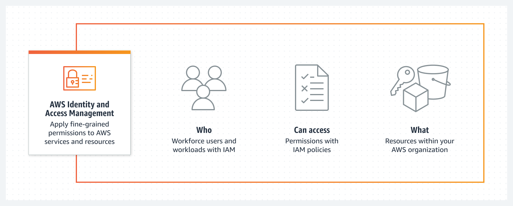
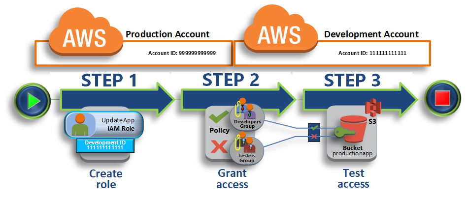

# Day 52: Identity and Access Management (IAM)

클라우드 컴퓨팅이 계속해서 인기를 얻으면서, 점점 더 많은 조직들이 그들의 인프라를 관리하기 위해 클라우드 플랫폼으로 관심을 돌리고 있습니다. 그러나, 이와 함께 데이터와 자원을 보호하기 위해 적절한 보안 조치가 시행되도록 보장해야 할 필요성이 뒤따릅니다. AWS에서 보안을 관리하기 위한 가장 중요한 도구 중 하나는 IAM(Identity and Access Management)입니다.

## AWS IAM이란?
|| 
|:-:|
| <i>IAM is (1) WHO (2) CAN ACCESS (3) WHAT</i>|

AWS IAM은 AWS 리소스에 대한 사용자 및 사용자의 액세스를 관리할 수 있는 웹 서비스입니다. IAM을 사용하면 AWS 사용자 및 그룹을 생성 및 관리할 수 있고, AWS 리소스에 대한 액세스를 제어할 수 있으며, 사용자가 해당 리소스에 대해 수행할 수 있는 작업을 결정하는 권한을 설정할 수 있습니다. IAM은 세분화된 액세스 제어를 제공하므로 세분화된 수준에서 특정 리소스에 대한 권한을 부여하거나 거부할 수 있습니다.

IAM은 AWS 리소스를 보호하기 위한 필수 도구입니다. IAM이 없다면 AWS 계정에 액세스할 수 있는 모든 사람은 모든 리소스에 제한 없이 액세스할 수 있습니다. IAM을 사용하면 리소스에 액세스할 수 있는 사용자, 수행할 수 있는 작업, 액세스할 수 있는 리소스를 제어할 수 있습니다. 또한 IAM은 여러 AWS 계정을 생성하고 관리할 수 있도록 지원하는데, 이는 대규모 조직에는 항상 서로 어느 정도 수준의 상호 작용이 필요한 계정이 많이 있기 때문에 필수적입니다:

||
|:-:|
| <i>Multi-Account IAM access is essential knowledge</i>|

## AWS IAM을 시작하는 방법

AWS IAM을 시작하는 것은 간단합니다. 여러분이 따라야 할 단계는 다음과 같습니다:

### Step 1: AWS 계정 만들기

첫번째 단계는 AWS 계정이 없는 경우 AWS 계정을 생성하는 것입니다. 50일차에 이렇게 했으니 가보는 것도 좋을 것 같아요 😉

### Step 2: IAM 설정

AWS 계정이 있으면 IAM 콘솔로 이동하여 IAM을 설정할 수 있습니다. 콘솔에서는 IAM 사용자, 그룹, 역할 및 정책을 관리할 수 있습니다.

### Step 3: IAM 사용자 생성

다음 단계는 IAM 사용자를 생성하는 것입니다. IAM 사용자는 AWS 리소스에 액세스해야 하는 개인 또는 서비스를 나타내는 IAM에서 생성하는 엔티티입니다. IAM 사용자를 생성할 때 사용자가 가져야 할 권한을 지정할 수 있습니다. 50일으로부터 숙제 중 하나는 [IAM 사용자 생성하기](https://docs.aws.amazon.com/IAM/latest/UserGuide/id_users_create.html)이고, 완료하지 않은 경우 다시 돌아가서 지금 만들어 주십시오.

### Step 4: IAM 그룹 생성

IAM 사용자를 만든 후 다음 단계는 IAM 그룹을 만드는 것입니다. IAM 그룹은 IAM 사용자의 모음입니다. IAM 그룹을 만들 때 그룹이 가져야 할 권한을 지정할 수 있습니다. 이를 수행하려면 "IAM Basics"를 보고 리소스 섹션의 "IAM User Guide: Getting Started"를 읽으십시오.

### Step 5: IAM Group에 권한 할당

IAM 그룹을 만든 후에는 그룹에 권한을 할당할 수 있습니다. 여기에는 그룹이 가져야 할 권한을 정의하는 IAM 정책을 만드는 것이 포함됩니다. 그런 다음 해당 정책을 그룹에 연결할 수 있습니다. "IAM 튜토리얼 & 딥 다이브"를 보고 이를 달성하기 위해선 리소스 섹션의 IAM 튜토리얼을 살펴보십시오.

### Step 6: IAM 사용자 테스트

IAM 그룹에 권한을 할당한 후 IAM 사용자에게 올바른 권한이 있는지 테스트할 수 있습니다. 이를 수행하려면 IAM 사용자의 자격 증명을 사용하여 AWS Management Console에 로그인하고 사용자가 수행할 수 있어야 하는 작업을 수행할 수 있습니다.

## Resources:
[IAM 기본](https://youtu.be/iF9fs8Rw4Uo)

[IAM 사용 설명서: 시작하기](https://docs.aws.amazon.com/IAM/latest/UserGuide/getting-started.html)

[IAM 비디오 튜토리얼 & 딥 다이브](https://youtu.be/ExjW3HCFG1U)

[IAM 튜토리얼: AM 역할을 사용하여 AWS 계정 전체에 액세스 위임](https://docs.aws.amazon.com/IAM/latest/UserGuide/tutorial_cross-account-with-roles.html)

[Day 53](day53.md)에서 다시 만나요.
