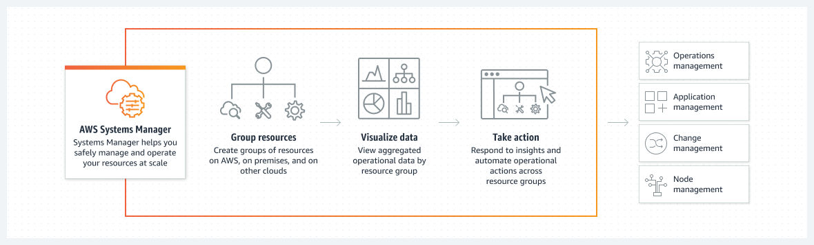
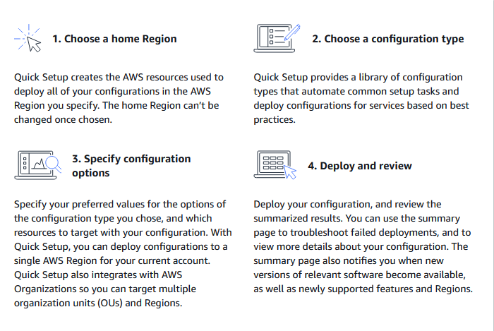
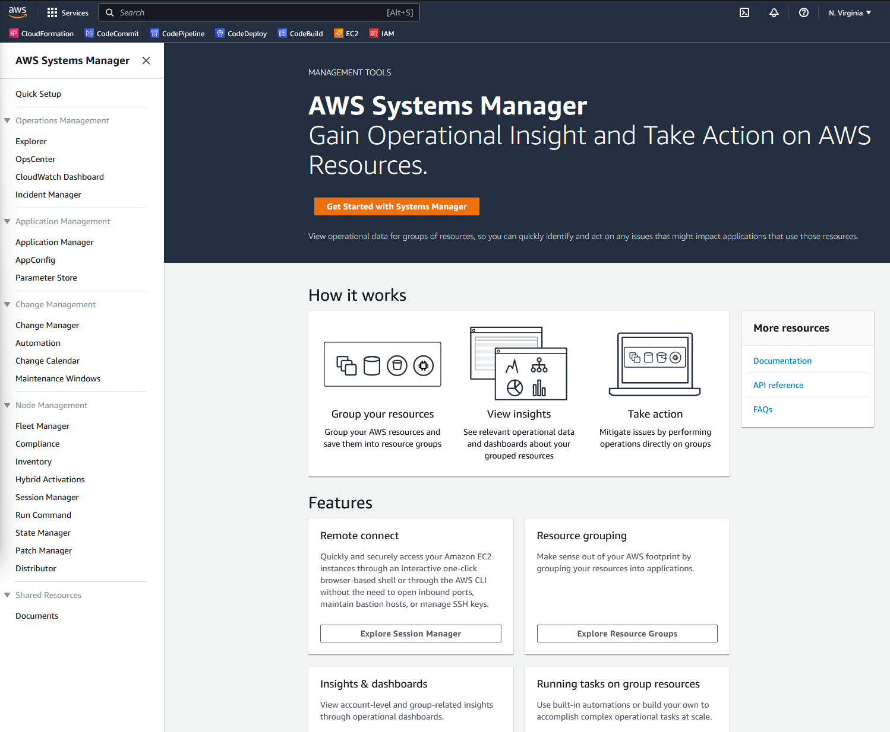
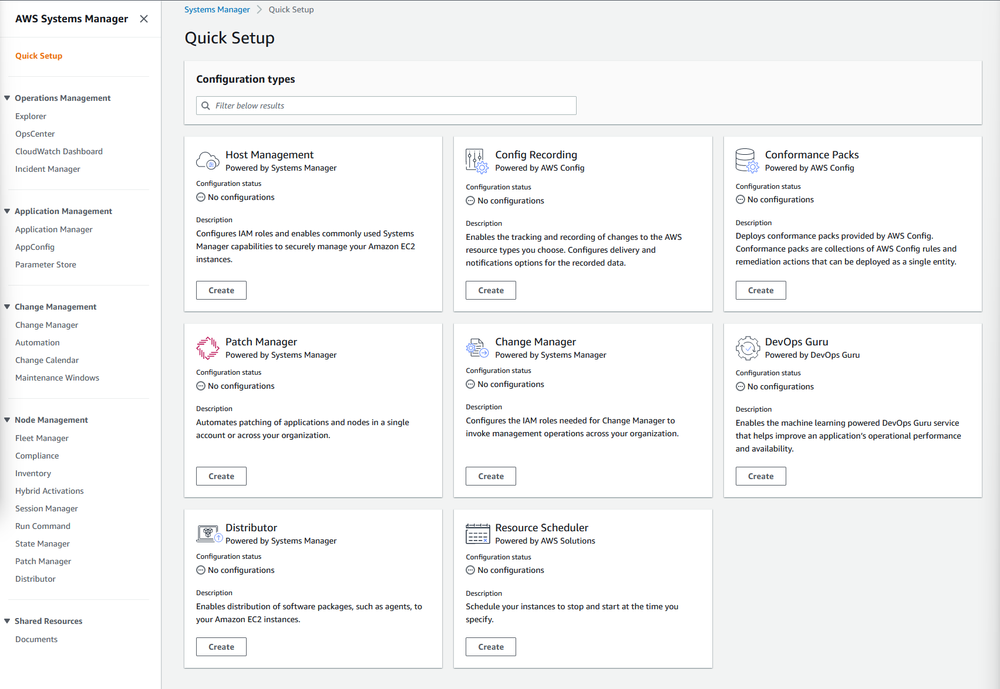
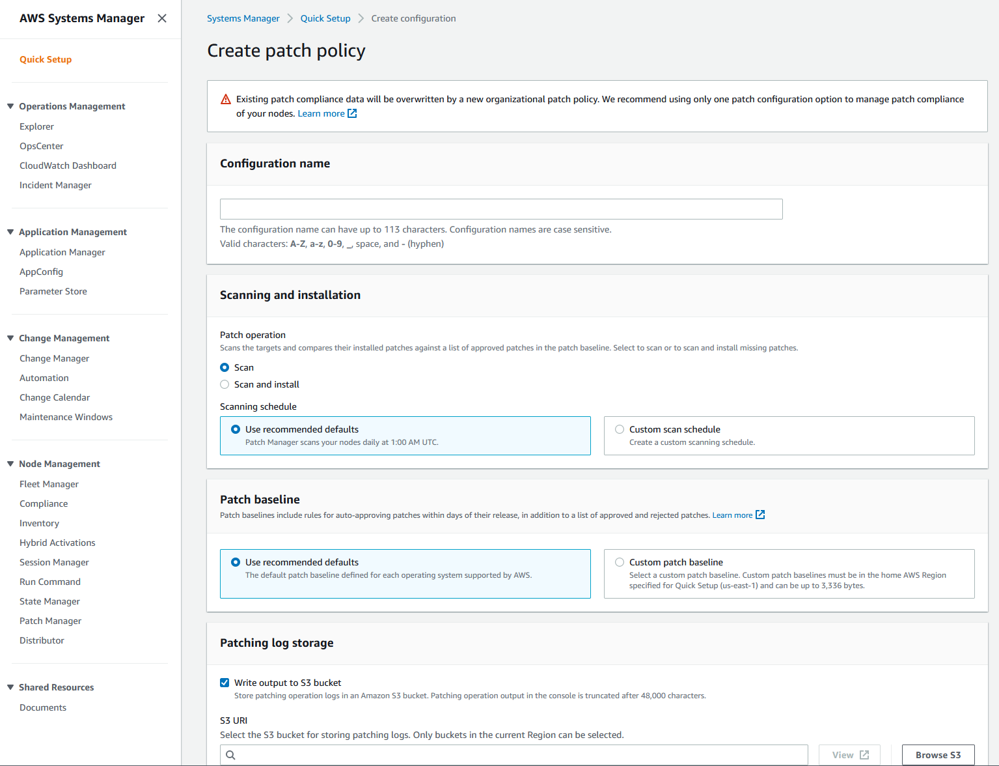

# Day 53: AWS Systems Manager

AWS Systems Manager는 사용자가 자신의 AWS 및 사내 리소스 모두에서 운영 태스크를 관리하고 자동화할 수 있는 완전 관리형 서비스입니다. AWS 리소스, 가상 머신 및 애플리케이션을 관리할 수 있는 중앙 집중화된 플랫폼을 제공합니다. DevOps 전문가가 운영 업무를 자동화하고 규정 준수를 유지하며 운영 비용을 절감할 수 있습니다.

AWS Systems Manager를 통해 사용자는 패치 관리 자동화, OS 및 애플리케이션 배포 자동화, Amazon Machine Images(AMI) 생성 및 관리, 리소스 활용도 모니터링 등의 작업을 수행할 수 있습니다. 또한 실행 명령, 상태 관리자, 인벤토리 및 유지 관리 창을 포함하는 인스턴스 구성 및 관리를 위한 일련의 도구를 제공합니다.

또한 AWS Systems Manager는 운영 데이터의 통합 뷰를 제공하여 사용자가 EC2 인스턴스, 사내 서버 및 AWS 서비스를 포함한 AWS 인프라 전반에 걸쳐 운영 데이터를 시각화하고 모니터링할 수 있습니다. 이를 통해 사용자는 문제를 보다 빠르게 파악하고 해결할 수 있어 운영 효율성이 향상되고 다운타임이 줄어듭니다.

## AWS System Manager을 시작하는 방법은 무엇일까요?

AWS System Manager를 시작하는 것은 1, 2, 3, 4만큼 쉽습니다 😄:

### Step 1: AWS System Manager 콘솔로 이동

AWS 계정이 있으면 2개의 윈도우 서버와 2개의 리눅스 서버(free tier 과정😉)를 생성하고 AWS System Manager 콘솔로 이동합니다. 이 콘솔은 EC2 인스턴스, 사내 서버 및 기타 리소스를 포함한 AWS 리소스를 관리하기 위한 통합 인터페이스를 제공합니다:

시작하기 버튼을 클릭하고 원하는 지역을 선택합니다(저는 us-east-1을 선택했습니다)

### Step 2: 구성 유형 선택

다음 단계는 리소스를 관리하도록 AWS Systems Manager를 구성하는 것입니다. 빠른 설정 공통 작업 중 하나를 선택하여(또는 직접 선택한 사용자 지정 설정 유형을 생성) 이 작업을 수행할 수 있습니다:

필요에 따라 "Patch Manager(패치 매니저)"를 선택할 것입니다. 아래 리소스에는 테스트할 수 있는 추가 시나리오가 있습니다. "AWS Systems Manager를 사용하여 몇 분 안에 AWS 인스턴스를 패치 및 관리"를 참조하여 이 단계를 확인하십시오.

### Step 3: 구성 옵션 구체화

각 구성 유형에는 이 단계에 적용할 고유한 매개 변수 집합이 있습니다...
||
|:-:|
| <i>선택한 빠른 시작 구성에 따라 다른 점이 나타납니다.</i>|

따라서 각 리소스에 필요한 인수에 대해서는 설명하지 않겠습니다. 일반적으로 다음 단계는 리소스 그룹을 만들어 리소스를 구성하는 것입니다. 리소스 그룹은 공통 속성을 공유하는 리소스 모음입니다. 리소스를 그룹화하면 리소스를 전체적으로 볼 수 있고 정책과 작업을 함께 적용할 수 있습니다. 이 단계를 실행하려면 "AWS Systems Manager를 사용하여 몇 분 안에 AWS 인스턴스를 패치 및 관리"를 참조하십시오.

### Step 4: 리소스 배포, 검토 및 관리

리소스 그룹을 생성한 후에는 AWS System Manager 콘솔에서 리소스를 보고 관리할 수 있습니다. 또한 자동화 워크플로우를 생성하고 패치 관리를 실행하며 리소스에 대한 다른 작업을 수행할 수 있습니다.

## Resources:
[AWS Systems Manager 소개](https://youtu.be/pSVK-ingvfc)

[AWS Systems Manager를 사용하여 몇 분 안에 AWS 인스턴스를 패치 및 관리](https://youtu.be/DEQFJba3h4M)

[AWS System Manager 시작하기](https://docs.aws.amazon.com/systems-manager/latest/userguide/getting-started-launch-managed-instance.html)

[Day 54](day54.md)에서 다시 만나요.
